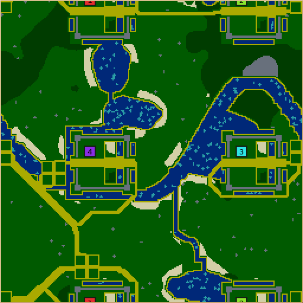

# Forts: design and playtesting evidence

Forts is an imagined medieval Central European countryside: stone forts, a Rhine-like river, irregular lakes, wooded uplands and market-town sites connected by roads. These files accompany the new optional `forts` generator (ID 34, revision 6).



## Result and limits

Tuning improved the weakest mean populations on the original four seeds, but **position-dependent outcomes remain**. This is an asymmetric casual landscape, not a certified competitive map. All reported Nicowar games use a 60,000-tick cap; cap leaders are ranked by prestige, then units, then completed buildings, and are not wins. Human playtesting is still needed.

## What changed

- Broadened the main river and added irregular lakes and tributaries. Seed 1 pure-water coverage rose from 1.16% in the first prototype to 12.54% in the final layout. Across the eight tournament seeds, final coverage is 11.77–13.31%, excluding shoreline tiles.
- Enlarged irrigating ponds, added shallow moat sections and a small fruit orchard to every fort. Wheat and wood retain a 32-tile minimum even at 0% abundance; household fruit follows its slider.
- Reserved nearby developable towns before routing water, instead of pushing them toward shared borders. Each has four grass building plots and a sand crossroads, with fruit attempted outside.
- Chose both gate destinations together to shorten their combined travel distance. Roads connect all forts through the landscape and ford water.
- Explicitly sequenced random lattice-offset draws across compilers. Revision 6 produces exactly the same 32 native map files as the revision-5 tournament fixtures; see [byte comparisons](validation/r6-equivalence.json).

Stone ramparts are permanent resource deposits, not owned walls or free towers. Players build the defenses. Swimming opens additional water routes but does not remove the stone enclosure. The intended opening is to establish the fort economy, then claim outlying town sites, fields and crossings.

## Paired tuning tournament

Four 256×256, four-player maps: seeds 17, 29, 43 and 61. Each runs all four cyclic team-label rotations, with game seed `101 + rotation`. Four identical Nicowars per game. Baseline revision 3 and final layouts use the same immutable Linux runtime bundle on `therig.local`; only the initial maps change. Raw accepted records include commands, hashes and engine identity.

| Measure (16 games / 64 colony observations each) | Revision 3 | Final layout |
|---|---:|---:|
| Mean terminal unit count | 78.0 | 99.2 |
| Eliminated colonies | 14 | 12 |
| Colonies below 10 units | 21 | 20 |
| Mean starvation deaths per colony | 17.33 | 17.23 |

The baseline ended in 16 capped games; the final paired set has 15 caps and one outright
win (seed 61, rotation 0, fort 2, tick 53,474). Unit counts come from native terminal results; death counts come from the latest
telemetry sample at termination. That winning game ends earlier. The table below counts cap
leaders separately from that win.

Thus the higher mean population does **not** establish a substantial starvation or elimination improvement. Some starts still collapse. Combat and conversion losses also contribute; starvation alone does not explain the position differences.

### Per-position means and cap leaders

Fort numbers match the unrotated previews for each seed. Positions differ between seeds. Four observations per physical fort.

| Seed | Revision | Mean units, forts 1 / 2 / 3 / 4 | Cap leaders, forts 1 / 2 / 3 / 4 |
|---|---|---|---|
| 17 | 3 | 4.0 / 7.5 / 107.2 / 184.5 | 0 / 0 / 2 / 2 |
| 17 | Final | 37.0 / 78.0 / 89.8 / 204.2 | 0 / 1 / 1 / 2 |
| 29 | 3 | 192.5 / 57.5 / 5.5 / 75.5 | 3 / 0 / 0 / 1 |
| 29 | Final | 194.5 / 80.5 / 23.8 / 124.0 | 2 / 1 / 0 / 1 |
| 43 | 3 | 21.0 / 97.5 / 154.8 / 127.8 | 0 / 1 / 2 / 1 |
| 43 | Final | 22.8 / 122.8 / 172.5 / 64.0 | 0 / 1 / 3 / 0 |
| 61 | 3 | 10.5 / 126.5 / 47.2 / 28.0 | 0 / 2 / 1 / 1 |
| 61 | Final | 27.8 / 237.2 / 47.0 / 60.8 | 1 / 1 / 0 / 1 |

The intermediate revision-4 run is retained as summary/CSV evidence. It improved some openings but left severe weak starts, prompting the town-and-road revision. The final paired population means improve markedly on seeds 17 and 29, while seed 43 fort 1 remains weak and seed 61 fort 2 remains dominant.

## Fresh-seed validation

Seeds **101, 211, 307 and 419** were selected before inspecting their outcomes and were not used for subsequent terrain tuning. Same size, AI, rotations, engine seeds and tick cap as above.

All 16 games completed: 14 capped and 2 outright wins. Mean terminal unit count: **95.3**; eliminated colonies: **17/64**; below ten units: **20/64**; mean starvation deaths: **14.58**. These are a separate seed set, not paired before/after observations.

| Seed | Mean units, forts 1 / 2 / 3 / 4 | Cap leaders | Outright wins |
|---|---|---|---|
| 101 | 44.5 / 92.8 / 240.5 / 99.2 | 0 / 1 / 3 / 0 | 0 / 0 / 0 / 0 |
| 211 | 127.8 / 119.2 / 57.0 / 42.5 | 1 / 1 / 1 / 1 | 0 / 0 / 0 / 0 |
| 307 | 47.0 / 70.0 / 27.8 / 226.8 | 2 / 0 / 0 / 1 | 0 / 0 / 0 / 1 |
| 419 | 28.2 / 73.8 / 55.5 / 172.0 | 1 / 0 / 1 / 1 | 0 / 0 / 0 / 1 |

The fresh maps retain favored positions: seed 101 fort 3 leads three capped games; seed 307 fort 4 has much higher mean population; seed 419 fort 1 remains weak. Seed 211 has a different cap leader in each rotation. This mixed result supports the layout as an exploratory landscape, but does **not** establish fair competitive starts.

Alternate-AI smoke test: four Numbis on each of seeds 101 and 211, rotation 0, game seed 101, 60,000 ticks. Both games capped; all eight colonies survived, with 25–38 units and three total starvation deaths. This checks a second AI’s economy, not human fun or positional balance.

## Verification

- macOS arm64 and Linux x86_64 builds and defaults contracts, including deliberate wall/orchard damage and 20,000 unharvested resource-growth steps.
- 256 golden cases per platform; actual platform-generated rows are included. Existing generator rows remain unchanged.
- 60 terrain/parameter cases: rectangle orientations, small/large maps, up to 12 players, lake and dimension extremes, 0% and 300% resources.
- 46 dedicated Forts sweep rolls, zero failing combinations.
- 96 telemetry equivalence cases across generators, zero semantic failures; total generation time 6.950s off / 6.897s on in that run. Timings are observational, not a speedup claim.
- Separate revision-3 cross-platform execution probe: 4,096 detailed per-tick checksums match. Initial save/replay containers differed, so this is not a byte-identical save, full-match, or save/load-continuity claim. The checksum files and comparison hashes are attached.

The 60-case matrix, 46-roll sweep and telemetry run used revision 5 on macOS. The final change only sequences RNG draws; 32 tournament map files and the eight macOS golden fingerprints remain unchanged. Defaults and golden runs were repeated for revision 6.

## Reproduction and artifact guide

The `baseline-r3`, `r5`, and `r5-holdout` directories contain experiment manifests, accepted result records, initial maps, raw telemetry and selected final saves. `r5-numbi` is a separate alternate-AI smoke check. `r4` contains the intermediate run’s summary data. CSV `start` indices and JSON `leader` indices are zero-based; this report uses fort numbers 1–4. Compressed files use ordinary gzip. `SHA256SUMS` covers the evidence files.

`runtime-bundle.json` identifies the unchanged game runtime: source base `3bb33a627` plus the revision-3 generator. The final implementation commit is `08f2fe3ce`, based on `22105910e`; intervening upstream Maxima work does not enter these Nicowar/Numbi comparisons. Prototype generators are retained in `source-snapshots`. The final source is revision 6. Historical map directory names may contain `g33`; final fixtures and public registration use ID 34, avoiding the independently proposed Emoji generator.

To generate one equivalent final fixture from the code PR:

```sh
scons release=1 server=0 -j4 build/src/glob2
build/src/glob2 --generate-map --generator 34 --map-seed 17 \
  --param width=8 --param height=8 --param teams=4 \
  --write-map true --rotations 4 --output-dir artifacts/forts-example
build/src/glob2 --run-game --map-file artifacts/forts-example/map-r0.map \
  --game-seed 101 --ticks 60000 --player nicowar --player nicowar \
  --player nicowar --player nicowar --telemetry team-timeline \
  --output-dir artifacts/forts-example-game
```

Use the shared `tools.tournaments` coordinator for distributed repetitions; archived experiment manifests record every input and job. The working-study scripts in `scripts/` expect the original repository `artifacts/forts-tuning` layout, rather than the review package layout. Accepted JSON and readable per-game files allow independent reanalysis without that layout.

The rig supplied all Linux game results. The dev laptop could not execute the rig bundle because of an older glibc; its prelaunch failures are excluded from gameplay statistics. No human match, network compatibility boundary, or save/load continuation test was performed. Forts changes no existing AI, simulation rule, shared primitive or save/replay/network format.
