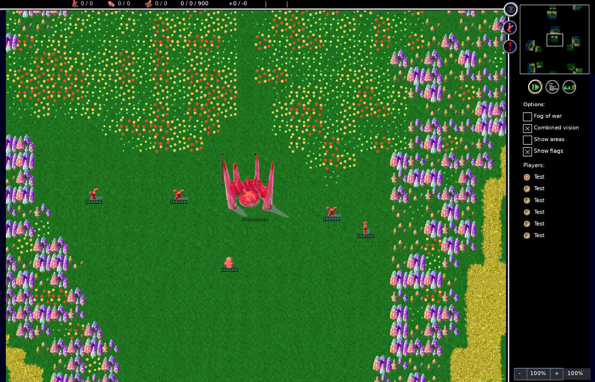
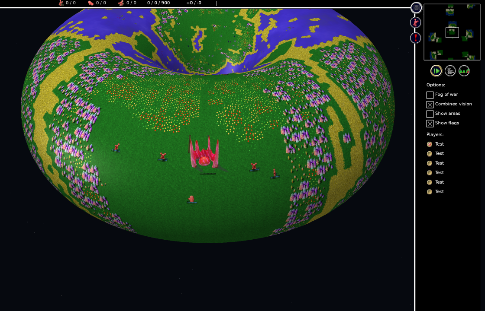

# PR #290 validation evidence

Production change: `a9f284e07` (one allowed spectator camera action).
Baseline: `b28b4333f5cd359ce187460e0f53016232236222`.
Platform: macOS arm64, Apple clang 21, SDL2 compatibility 2.32.70.

The evidence branch is separate from the implementation PR: it retains review artifacts without adding diagnostic programs or screenshots to the game source branch.

## Results

- Optimized client and existing `torus-render-test` built successfully with `scons -j2 release=1 server=0 opengl=1 build/src/glob2 torus-render-test`.
- Existing OpenGL and software rendering checks passed: `gpu.log`, `software.log`.
- A temporary copy of the existing render harness calls the real `GameGUI::handleKey` in live spectator mode. `g` enables torus view, repeat events leave it enabled, and the next non-repeated press disables it. Software rendering remains inactive. Outputs: `key-gpu.log`, `key-software.log`.
- Linking that same probe against the baseline keyboard-handler object fails on the first activation assertion: `key-before.log` (expected assertion failure).
- Screenshots below are actual rendered frames from the probe, with fog disabled for visibility. The probe advances the visual transition to its endpoint to capture a stable overview; it does not run a simulation or measure animation smoothness. It uses the repository's Island_of_the_Renfur map and toggles the real spectator input gate.
- No simulation, save, replay, network, AI, or game-order code changed. Cross-platform simulation comparisons are not claimed. CI covers the normal Linux/Windows builds separately.

## Reproduction

After building the client as above, run `python3 run-smoke.py /path/to/glob2` from this evidence checkout. It links the retained smoke source with the freshly built production objects, and repeats both positive modes and the baseline negative control. Requires the same SDL/OpenGL development dependencies as the normal build.
