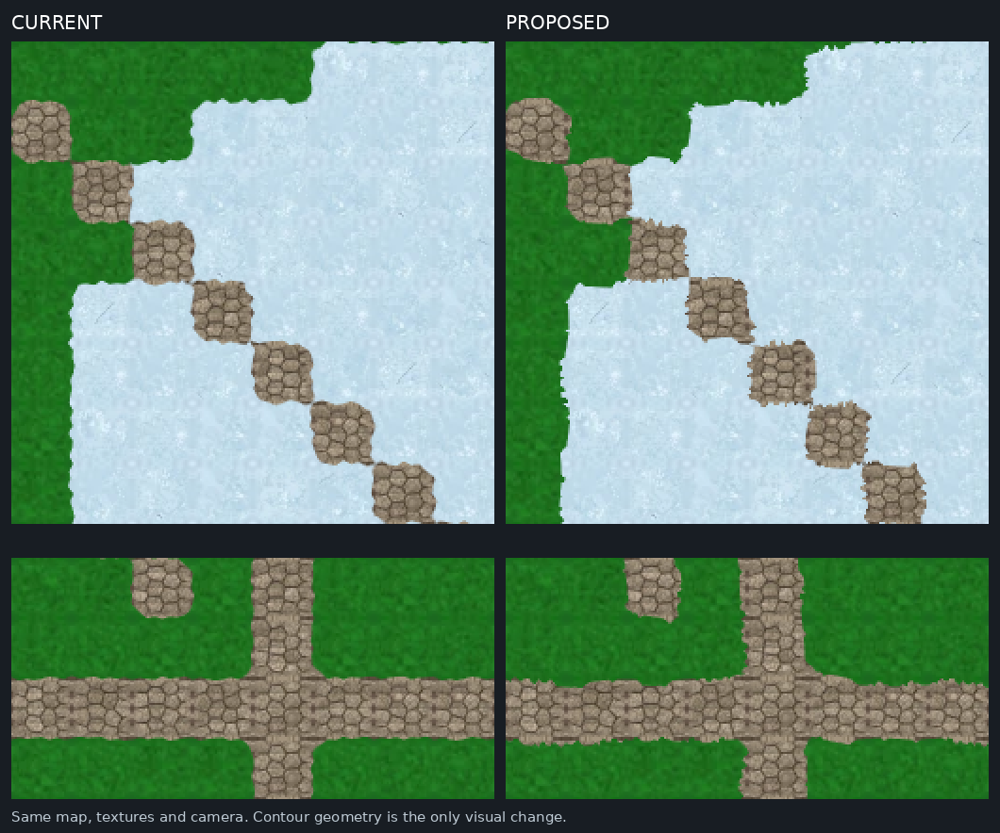

# Rougher terrain contours: PR #809 evidence

Tested source: `39ecd4ad903a2eae7d6962f39596136c9b57ec25`.
Integrated master: `72f8c9373fbdd9bf6206cfdf4903d12595e91de1`.

The approved visual change replaces repeated short waves with asymmetric sand-inspired notches, ice fractures, and broader cobblestone chips. A wrapped coarse displacement field carries bends across cells. Shared-edge anchors retain a single crossing and preserve the material partition. Terrain identities, saved sprite values, interior textures and simulation random calls are unchanged.



[Normal-scale comparison](comparison-normal.png) · [Original sand references](legacy-sand-tiles.png)

The final integrated screenshots match the user-approved preview pixel-for-pixel. Six runs (three per catalog) produce identical 256-tick checksum traces. The frozen v1 geometry digest remains `18185691832014944171`; v2 is `7043546505774538929`. The baseline `before.json` matches the integrated master's catalog.

The archive preserves reproducible evidence at its original `artifacts/terrain/organic/` paths, including source fixtures, build logs, JUnit reports, checksum traces, native/HD screenshots, and memory accounting. Extract it at the tested checkout root. No binaries or packaged runtime assets are included.

## Scope and limits

Linux x86_64, Ubuntu 26.04.1, GCC 15.2.0, SDL 3.4.16 and Mesa 26.0.8 llvmpipe under Xvfb. [Environment](environment.txt), [commands](commands.md), and [complete evidence archive](evidence.tar.gz).

The unit harness cannot compile at the integrated master: `FertilityFieldTest.cpp` and `GradientTest.cpp` access the newly private `Map::tiles`. [Compiler evidence and matching master/HEAD blob IDs](upstream-unit-build-failure.txt) establish that these files are unchanged by this PR. The engine-only build and affected engine suites run independently.

Physical GPU, browser, Windows, macOS, Android and cross-architecture checks were not run. Full unrelated simulation/save/replay/network suites were not rerun because this follow-up changes only presentation geometry and asset validation; the deterministic fixture traces cover ice/road and both catalogs. Preview approval does not establish hands-on gameplay or hardware GPU acceptance. Performance measurements cover native software terrain-cache work, not complete frame time, cold asset loading, HD throughput or GPU/browser speed. Existing cache budgets and upload behavior are unchanged; native/HD accounting is retained in the archive.

The initial system-Python asset test invocation used the wrong interpreter and is not counted. All reported packaging results use the repository's pinned encoder runtime.

## Results

- 38 engine cases passed, zero failures/skips: material resolver/compositor, legacy geometry, partition/connectivity, wrapped shared edges, weights, 64-material growth, cache/fallback, animation, source overrides, HD/fractional pixels, imports/exports, torus rendering and UI scaling.
- 44 Python cases passed: eight terrain compiler, 29 packaging, seven artwork packaging.
- ASan/UBSan: zero errors, zero shared-edge mismatches; approved geometry digest reproduced.
- One additional benchmark case passed: 147,456 timed warm frames across both catalogs and all three patterns, with no warm cache rebuilds.

Largest median paired warm wall-time increase was 5.07% (mixed moving view), below the 10% investigation threshold. Cold mixed cache fill rose from a median 32.03 to 36.56 ms (about 4.5 ms); dense fill rose from 81.99 to 86.49 ms. These are fresh terrain-cache fills after texture preparation, not startup/asset-loading costs. Both catalogs use 4,771,232 cache bytes and 262,144 prepared native source bytes in the controlled benchmark. Timing variation remains on this shared host; no claim of a speedup is made.

```text
12 alternating paired blocks per warm mode, 1024 frames/block; 8 cold samples per catalog.
pattern mode | wall ms before -> after (% median paired change) | CPU ms before -> after (% median paired change)
uniform | cold | 13.0334 -> 13.2586 (+1.30%) | 12.9254 -> 13.0899 (+1.02%)
uniform | warm | 0.4551 -> 0.4486 (+4.30%) | 0.4472 -> 0.4408 (+4.20%)
uniform | moving | 0.6671 -> 0.6380 (-3.61%) | 0.6544 -> 0.6260 (-3.60%)
mixed | cold | 32.0320 -> 36.5572 (+13.99%) | 31.6416 -> 36.1368 (+13.98%)
mixed | warm | 0.7218 -> 0.6971 (-1.11%) | 0.7086 -> 0.6841 (-1.15%)
mixed | moving | 0.7921 -> 0.7970 (+5.07%) | 0.7772 -> 0.7815 (+5.03%)
dense | cold | 81.9908 -> 86.4871 (+3.51%) | 81.2809 -> 85.6182 (+3.44%)
dense | warm | 0.3143 -> 0.2829 (-8.19%) | 0.3095 -> 0.2786 (-8.16%)
dense | moving | 0.3527 -> 0.3555 (+0.84%) | 0.3469 -> 0.3497 (+0.88%)
Warm cache rebuild counts: ['0']
Cache bytes: ['4771232']
Prepared source bytes: ['262144']
```

[Engine results](engine-tests.log) · [JUnit inventory](engine-junit.xml) · [Raw benchmark samples](benchmark-samples.csv) · [Compiler tests](pinned-compiler-tests.log) · [Packaging tests](pinned-package-tests.log) · [Artwork tests](artwork-package-tests.log) · [Sanitizer result](sanitizer-check.txt)
