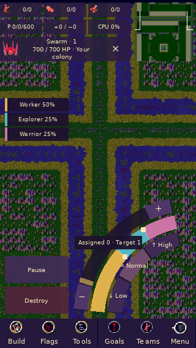
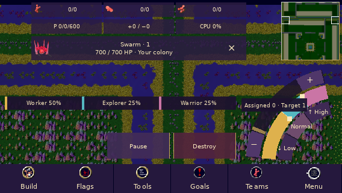
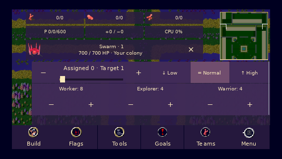
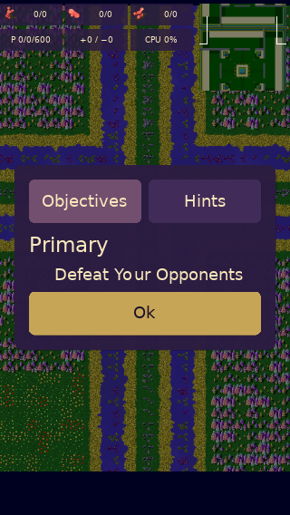
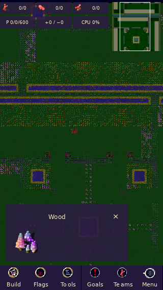
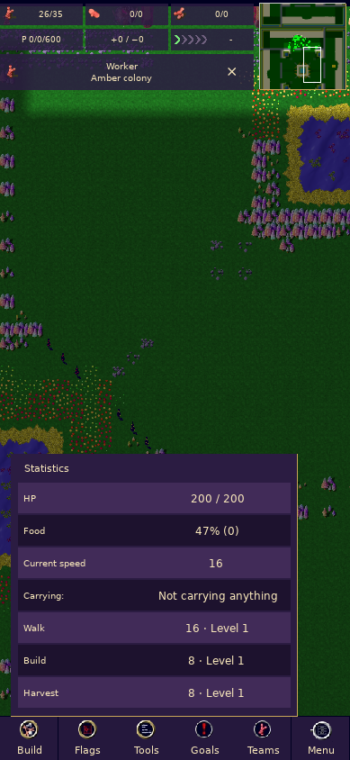

# Mobile UX merge integration evidence

Final combined source: `ce5fc32d4d0e2538b33ee40eda5fe4a5f5482d42`. Master fetched before final validation: `b07321678625d3293279ab3b04dea6a85bcaaa5d`.

All 36 selected native checks pass on this final source, with no skips. This validates the combined stack; it is not a claim that every intermediate PR head received the full suite separately. The user approved merging all eleven PRs. Merge order is listed below; each PR is retargeted to master after its predecessor merges.

## Reviewed changes

Three reviewers covered gestures/timing, inspection/navigation, and layouts/allocation, followed by cross-review and integrated validation. Review fixes include semantic double-tap events with separate gameplay/editor policy, removal of the unused simulation timestamp parameter, shared ratio commits, shared read-only inspector lifecycle/close geometry, explicit toolbox/replay navigation precedence, direct resource priority over unit halos, fixed-footer classic Teams scrolling, and shared HUD/dial measurement with complete action-fit checking. Compact row fallback preserves the requested title placement and reachable confirmation actions. Integration with the latest master also aligns unit picking with the presented Scene and smooth-motion factor, validates generation before selecting live entities, and retains telemetry absorption alongside SDL-clock GUI timing, including the pending-save teardown path. Comments explain coordinate, timing, lifecycle and cancellation contracts; maintained mobile and preview guides describe the final behavior.

| PR | Change | Validated head | Dependency before merging |
| --- | --- | --- | --- |
| [#583](https://github.com/Globulation2/glob2/pull/583) | Fix landscape picker scrolling over map previews | `98a79a749670b827824e86188aa05d00d6128b48` | `master` |
| [#584](https://github.com/Globulation2/glob2/pull/584) | Zoom in at the tapped spot on gameplay double tap | `f778f89723932c4cfccf869fa4fa6dc28ffa46a9` | `codex/landscape-picker-scroll` |
| [#592](https://github.com/Globulation2/glob2/pull/592) | Improve thumb dial reach and unify swarm production proportions | `161b69d77f8e8850134acf9e3722828c172f6ff8` | `codex/double-tap-zoom-in` |
| [#593](https://github.com/Globulation2/glob2/pull/593) | Fix touch momentum after returning from another app | `d5b3fa31fc538cb696b86b712247e2e623a5b6be` | `codex/radial-allocation-usability` |
| [#594](https://github.com/Globulation2/glob2/pull/594) | Add a dead zone before gameplay touch momentum can start | `7e1c76a1827f736986c746ebe9a5a3cc746c9f66` | `codex/android-resume-momentum` |
| [#595](https://github.com/Globulation2/glob2/pull/595) | Move compact gameplay toolboxes opposite the selected thumb | `6d990e935e01de81e571c724bca3a1d8c22ae661` | `codex/touch-momentum-dead-zone` |
| [#596](https://github.com/Globulation2/glob2/pull/596) | Inset Objectives and Teams dialogs and size short pages to content | `d45394344e9700e3056c13f272317a1f8be22a1d` | `codex/opposite-side-toolboxes` |
| [#597](https://github.com/Globulation2/glob2/pull/597) | Show resource information instead of the alternate Tools panel on touch | `8549ec93f4d4b41e724d333fdf23527794ca1d4b` | `codex/inset-gameplay-dialogs` |
| [#598](https://github.com/Globulation2/glob2/pull/598) | Consistently dismiss transient panels on blank-map taps | `f25271efd3854429bd02d3729c45faeafb67b79f` | `codex/touch-resource-info` |
| [#600](https://github.com/Globulation2/glob2/pull/600) | Add forgiving touch unit selection and a unit stats panel | `6ece42164c7a93bdbe6b1bf480534aa1b4ff6f53` | `codex/blank-map-dismissal` |
| [#602](https://github.com/Globulation2/glob2/pull/602) | Place the mobile building title below stats beside the minimap | `ce5fc32d4d0e2538b33ee40eda5fe4a5f5482d42` | `codex/touch-unit-inspector` |

## Verification

Native Linux release engine and unit harnesses, GCC 15.2 / SDL 3.4.16, portable GPU. Build: `GLOB2_SDL3_PREFIX=<native SDL SDK> CCACHE=1 scons -j16 release=1 server=0 engine-tests unit-tests`; see [build log](build.log). Working tree was clean; `git diff --check origin/master` passed.

Display checks use a separate Xvfb display per test group, with `SDL_VIDEO_DRIVER=x11` and `WAYLAND_DISPLAY` unset. Headless checks leave both SDL video-driver variables unset so the runner supplies its dummy driver. This avoids the host's Wayland auto-selection and prevents the X11 override leaking into headless viewport checks. Exact commands are attached. The OpenGL resize case also uses the repository Xvfb/Openbox wrapper, with local Ubuntu package files supplying a window manager; [environment and package versions](render-display-environment.json) record that setup. Fullscreen coverage is enabled for presentation sweeps.

| Group | Cases passed | Evidence |
| --- | ---: | --- |
| gameplay | 10 | [JUnit](gameplay.xml), [log](gameplay.log), [command](gameplay-command.txt) |
| headless | 19 | [JUnit](headless.xml), [log](headless.log), [command](headless-command.txt) |
| render-display | 1 | [JUnit](render-display.xml), [log](render-display.log), [command](render-display-command.txt) |
| small-portrait | 1 | [JUnit](small-portrait.xml), [log](small-portrait.log), [command](small-portrait-command.txt) |
| small-landscape | 1 | [JUnit](small-landscape.xml), [log](small-landscape.log), [command](small-landscape-command.txt) |
| tablet-portrait | 1 | [JUnit](tablet-portrait.xml), [log](tablet-portrait.log), [command](tablet-portrait-command.txt) |
| tablet-landscape | 1 | [JUnit](tablet-landscape.xml), [log](tablet-landscape.log), [command](tablet-landscape-command.txt) |
| laptop | 1 | [JUnit](laptop.xml), [log](laptop.log), [command](laptop-command.txt) |
| fullhd | 1 | [JUnit](fullhd.xml), [log](fullhd.log), [command](fullhd-command.txt) |

The gameplay group covers five GameGUITouch cases, resume momentum, native map preview interaction, landscape list scrolling/performance, and custom game screens. The headless group covers touch recognition/editor layout, serial/incremental sessions, preview geometry/database/codec behavior, Scene extraction and smooth unit motion, telemetry collection and software renderer resizing, and save safety/background finalization. The render-display group covers OpenGL resize behavior. Six presentation sweeps cover phone portrait/landscape, tablet portrait/landscape, laptop and full HD, across presentations and safe insets.

Real SDL input regressions cover stationary touches, deliberate flings, anchored double taps, unchanged editor reset, unit/resource selection and scrolling, fog and target precedence, blank-map dismissal, stale selection invalidation, read-only→building→close, explicit toolbar/replay stats navigation, mirrored toolbox placement, production-divider commit/cancel, dialog gutters/scrolling, title bounds and detached close targets, and short landscape confirmation reachability. They also check that read-only navigation emits no game orders.

[Capture provenance](capture-sources.json) maps every PNG to its final-source test run; matching test output logs include source/compiler provenance. Screenshots are current renders, not mockups. Original isolated before/after evidence remains linked from each PR.

Two additional Python Scene-boundary checks passed; see `scene-boundary.log`.

A pre-existing hosted Maxima policy assertion failed on the old guard spelling. [Prerequisite repair #609](https://github.com/Globulation2/glob2/pull/609), source `95b945fb6`, changes only that Python test and is now included in the validated source above. Its isolated checkout initially passed 61 tests with two compiled-artifact skips; the integrated checkout builds the strategy helper and runs the full policy suite. See [repair validation](worker-limit-policy-tests.log) for the final counts. No native implementation changes were needed for the repair.

## Screenshots

| Production proportions | Title beside minimap |
| --- | --- |
|  |  |

| Constrained viewport fallback | Inset objectives |
| --- | --- |
|  |  |

| Resource information | Unit information |
| --- | --- |
|  |  |

## Limits and intended feel

Hosted CI status is separate and must be checked on each PR. Physical Android/iOS touch feel and actual app-switch/resume have not been exercised on a device; native SDL regressions validate the clock/input paths. No new simulation, save, replay or network format changes are intended. Cross-platform simulation checksums were not rerun for these presentation/input changes.

The changes intentionally alter double-tap behavior, fling activation, target forgiveness, toolbox reach and production allocation. A maintainer playing the result on a phone remains part of review; automated passes do not establish subjective usability or absence of every defect.
