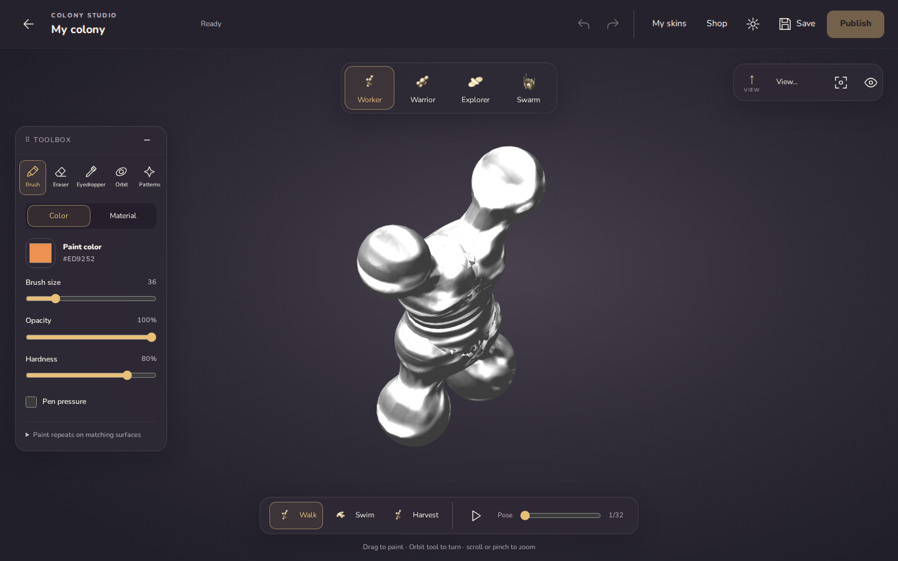
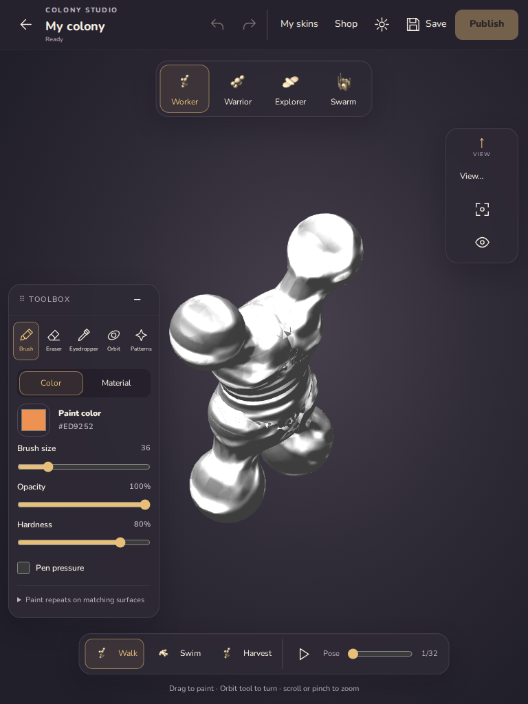
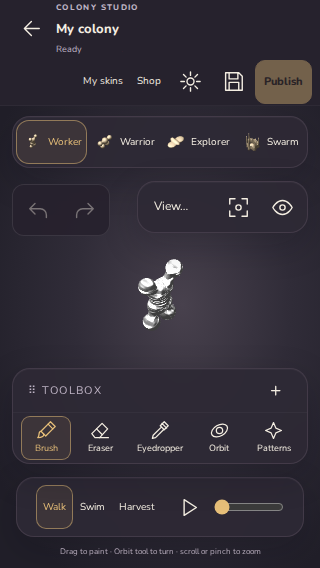

# Colony Skin Studio review evidence

Source revision: `561dd28271d367915b8fbe99721b45573b7558ef`; integrated base: `d5bad36f784d115ffbe5461240953e26def53c06`.

- [Validation, exact commands, environment and limitations](validation.json)
- [Two review rounds and improvements](review-rounds.json)
- [Desktop paint-to-publish demonstration](demo/paint-to-publish-desktop.webm)
- [Phone paint-to-publish demonstration](demo/paint-to-publish-phone.webm)
- [Responsive screenshots and modal previews](studio/)
- [Native material/ring comparisons](native/)
- [Curated fill contact sheets](fills/)
- [Serial game rendering](game-serial/), [threaded game rendering](game-threaded/), [signed replay](game-replay/)
- [Performance measurements](performance/)
- [Test logs](logs/), [compressed browser build log](final-browser-build.log.gz)
- [WebCrypto browser authorization results](wasm-authorization/results.json)

Physical pen/tablet and non-Linux native platforms were not tested. Headless software rendering does not establish hardware 60fps or pixel equivalence. This branch contains review artifacts only; these files are not added to the product branch.
