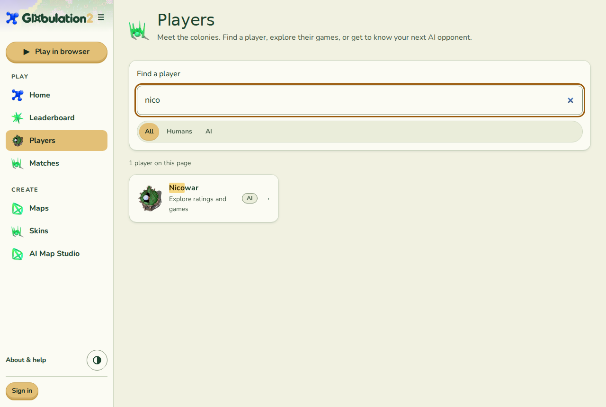
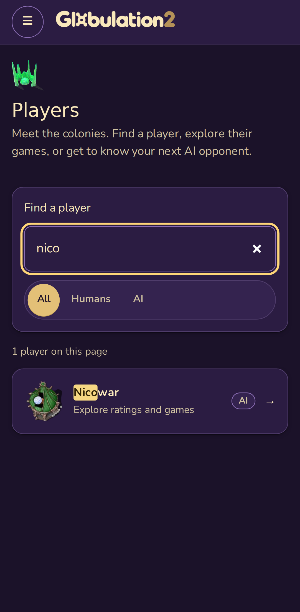
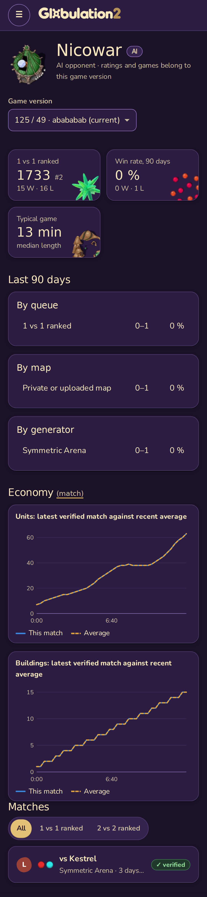
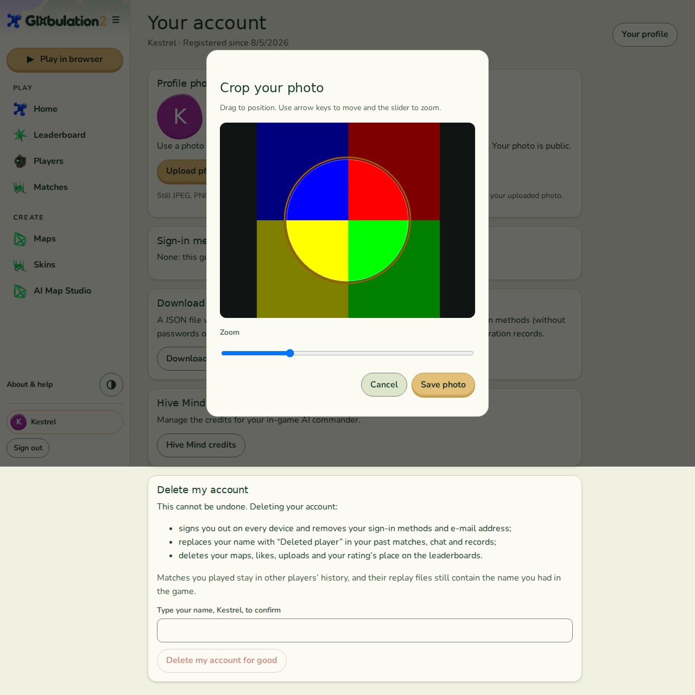
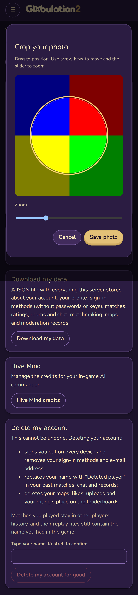

# Player directory, AI profiles, and profile photos — verification

PR: https://github.com/Globulation2/glob2/pull/741

Tested source: `847e82c20245057464435f9d289c19b43bb8d0ab` against fetched base `6d064df681c3bbf8ce0ce9ff46892ed839fdee61`.

Final checks: 314 platform tests, 36 browser checks, five native OnlineResources cases, lint, typechecking, generated fixtures and production build passed. Four browser skips are intentional device scope or the unavailable WebAssembly game build.

- [Environment, exact commands, results and limitations](environment.txt)
- [Two-round code review](code-review.md)
- [Two-round UI/UX review](ux-review.md)
- [Platform test log](platform-tests-final.log)
- [Browser and production-build log](browser-final.log)
- [Native compatibility results](native-online-resources.log)
- [Native build log](native-build.log)
- [Lint](lint-final.log), [typechecking](typecheck-final.log), [fixtures](fixtures-final.log)

## Visual evidence

Crop screenshots use a four-quadrant test image so orientation and crop coordinates can be verified in pixel assertions. Full-page dialog screenshots show the browser backdrop only within the captured viewport; the rest is offscreen page content.

Screenshots for both themes on desktop and phone are in `screenshots/`. Evidence is deliberately isolated from the application branch.
