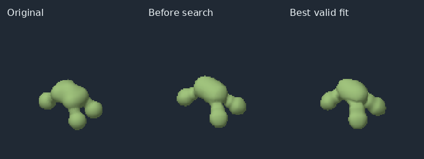

# Unit rig pipeline: local review evidence

Tested PR head: `d396f7e092da764fd13d4d4db3468bf8ab4bd0a9`. Integrated master: `f27e6df8b1c66d9c01f2e710725f851db657cca3`. This is evidence for draft PR #821, not a production rollout or merge approval.

## Result and appearance

The opt-in GSR1 pipeline shares fixed geometry and compact bone tracks across native rendering and Studio. Candidates cover worker walk, warrior walk/swim/fight, and explorer fly. Baked assets remain the default and fallback; all candidate acceptance flags remain false.

The worker uses a tall smooth torso, forward curl, symmetric rest geometry, straight cylindrical connectors, and rigid terminal caps. The warrior uses the same firm-limb constraints, including deep swimming retraction. These intentionally change the old metaball appearance; watching the animations is part of review.



[Animated worker comparison](worker/comparison.gif) · [Editable Blender worker](worker/worker-walk.blend)

The worker search measured 224 fully authored candidates across 22 parameters against all 256 original mapped frames. Best valid mean silhouette IoU: **77.83% → 82.52%**; worst frame: **66.61% → 77.07%**. All eight heading means improve, and 226/256 individual frames improve. Higher scores with collisions or insufficient torso height were rejected. This is a bounded search within the current rig family, not proof of a global optimum; silhouette agreement does not measure shading quality.

[All trials](worker/results.csv) · [Search ranges/method](worker/search-space.json) · [Frame measurements](worker/silhouette-agreement.json) · [Dense geometry checks](worker/quarter-validation.json)

## Verification

Environment: Linux x86-64, GCC 15.2, NVIDIA RTX 2070 SUPER, pinned Blender 3.6.23. [Revision metadata](revision.json). SDL dependencies and original build configuration are recorded in [the environment record](performance/build-environment.json); final commands and logs below take precedence over historical measurements.

Master's material/fur renderer was integrated with the GPU rig path. Native shader tests explicitly compare CPU and GPU fur displacement for hairy/cloud materials, as well as ordinary deformation, mixed batches and context resource restoration. The browser suite checks every mapped frame of all five installed candidates and the analytic/translated-camera fixtures.

- Worker authoring: **10 passed** ([log](validation/worker-authoring.log)).
- Warrior/explorer authoring: **11 passed** ([log](validation/unit-authoring.log)).
- Asset provenance/native-web identity: **3 passed** ([log](validation/asset-tests.log)).
- Material generation: **6 passed** ([log](validation/material-tests.log)); paint surface contracts: **4 passed** ([log](validation/surface-tests.log)).
- Web rig/projection/publication: **70 passed** ([log](validation/web-tests.log)).
- Chromium/Firefox/WebKit deformation conformance: **21 passed** ([log](validation/browser-tests.log)).
- TypeScript and focused ESLint: passed ([typecheck](validation/typecheck.log), [lint](validation/lint.log)).
- Native build and renderer suites: **47 cases passed**, zero failures/skips; see [final build log](validation/build.log) and [native test log](validation/native-tests.log).

An initial ad-hoc Vitest invocation used its five-second default and timed out on five full-clip asset checks; the documented repository configuration uses thirty seconds and all tests pass. [Initial timeout log](validation/web-rig-tests.log).

Commands from the repository root (each final validation command exits 0):

```sh
CCACHE=1 GLOB2_SDL3_PREFIX=/home/bradley/glob2-verify/integrator/sdl3/prefix scons -j12 release=1 server=0 skin-preview skin-game-preview skin-rig-benchmark tests
DISPLAY=:0 python3 test/run_tests.py --filter 'Skin*/*' --filter 'ColonySkinPreview/*' --filter 'RenderBatch/*' --jobs 4 --display-jobs 1 --artifacts artifacts/pr821-final/native --junit artifacts/pr821-final/native-junit.xml
npm exec --prefix platform -- vitest run --root platform apps/web/test/skin-rig.test.ts apps/web/test/skin-projection.test.ts apps/web/test/skin-geometry.test.ts apps/api/test/skinPublishing.test.ts
npm exec --prefix platform -- playwright test -c platform/apps/web/e2e/rig.config.ts
npm run --prefix platform typecheck
npm exec --prefix platform -- eslint platform/apps/web/e2e/rig-conformance.ts platform/apps/web/src/skins/geometry.ts platform/apps/web/test/skin-rig.test.ts
python3 test/build_system/test_skin_assets.py
python3 test/build_system/test_skin_materials.py
python3 test/build_system/test_skin_surface_contract.py
blender-3.6.23 --background --factory-startup -t 1 --python-exit-code 1 --python tools/skins/test_worker_rig.py
blender-3.6.23 --background --factory-startup -t 1 --python-exit-code 1 --python tools/skins/test_unit_rigs.py
```

## Integrated renderer captures

[Current-master material comparison](current-renderer/comparison.png) · [GPU/CPU pixel agreement](current-renderer/agreement.json)

All six worker styles have identical GPU/CPU alpha coverage. The integrated renderer reproduces the measured 82.52% mean silhouette overlap. Forced-miss and warm-cache benchmark smoke checks pass for both baked and GPU-rig paths, including nine-pass fur rasterization. These short, concurrent-load smoke runs test the diagnostic, not performance improvement.

## Earlier performance evaluation

[Measurements and scope](performance/evaluation.json) · [Frame-time chart](performance/frame-times.png) · [Raw paired runs, commands, hashes and source snapshots](performance/raw-runs.tar.gz) · [Scene save](performance/preview.game)

The benchmark paint/material fixtures and original measured worker rig are in [performance/assets](performance/assets). Other baked assets and view transforms are the repository files at `43a28506b14692cb91799c07345b8a0c79aaecaf`. The worker search reference is preserved byte-for-byte as [compressed BMP](worker/reference-matte.bmp.gz).

The earlier evaluation contains 120 paired-run entries and 57,600 measured frames on Linux/RTX 2070 SUPER. It predates the final geometry and current-master material integration. It supports the earlier pipeline evaluation, **not a fresh performance claim for this final revision**. Raw runs retain binary/asset hashes, commands, warm/miss cases and Scene state-checksum comparisons. M3 was explicitly deferred by the user.

## Scope and limitations

Focused local coverage addresses rendering, authored mesh integrity, assets, evaluator conformance and publication boundaries. No simulation code was changed by the feature; simulation/save/replay/network behavior inherited from master was not requalified as part of this visual change. Full engine regression, Windows/macOS/mobile, complete Emscripten gameplay, browser context loss, and final-revision performance benchmarks were not run. The draft remains opt-in and requires visual acceptance; worker swim/harvest and production rollout remain separate work. Evidence availability is not maintainer merge acceptance.
