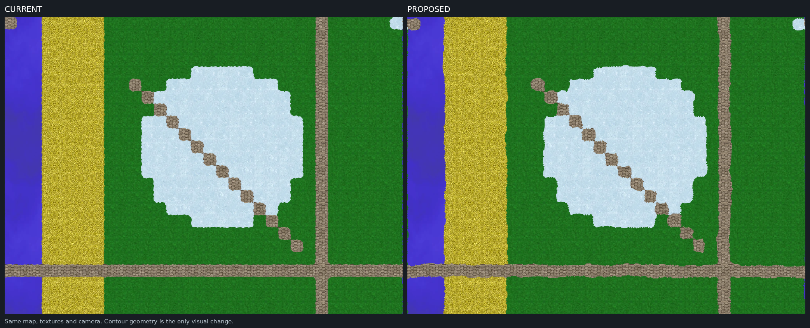

# Terrain materials — reviewed implementation and verification

Tested implementation: [`22143b3446a94f20400a7b5ca4d68e3e52d10e0d`](https://github.com/Globulation2/glob2/commit/22143b3446a94f20400a7b5ca4d68e3e52d10e0d).
Integrated master base: `9bfee5aeedac41e12f771f7aa3f05f419fb9a2a1`.
Original renderer: `e1634ecda9a2a2d31f47dfe766ddbcb40e364791`.

The branch also incorporates the concurrent scene-boundary contract update
`bab71abf7`. Current master `86df5ea49ef7fdf7914a57bf72bb527043876373` merges cleanly as tree
`7ea04e0bda87fa9349d0c1fd1ad0ff9e5fc52e16`. Its additional gradient/audio changes are outside this
renderer. The newer browser CI artifact changes were checked with all **18 browser
package tests** against materialized files from that exact merged tree:
[log](checks/merged-browser.log), [inputs and command](checks/merge-contract.json).
The newer merged native runtime was not built; native claims below apply to the
tested implementation and integrated base above.

## Review findings addressed

Two sub-agents reviewed rendering/cache behavior and the asset/compiler/documentation
pipeline. The resulting fixes include:

- Compiled packs attest to decoded runtime source pixels, so artwork overridden
  before compositor startup cannot be silently replaced by stale prepared textures.
  Original source hashes remain provenance; lossy/sheet export fingerprints are separate.
- Variant border preparation blends premultiplied RGBA, including opacity. Compiler
  and runtime reject malformed schema fields and noncanonical paths consistently.
- Boundary topology and shared contour choices are prepared once per tile. An
  independent old/new coverage comparison verified **4,456,448 identical native/HD
  samples**, including all 256 four-corner label configurations. [Result](review/coverage-comparison.txt),
  [driver](review/compare-coverage.cpp), [reference](review/reference-coverage.cpp),
  [command](review/coverage-command.txt).
- Per-material revisions avoid rebuilding pages for unrelated animation or source
  edits. Palette resolution preserves separate legacy shore colors and independent
  minimap/overview colors. Weighted variant selection has one implementation.
- Uncached rendering streams one canonical page at a time. Fractional pixel parity
  now exercises that path directly, across both torus axes and small maps. Emergency
  tiles have separate deterministic coverage tests; their resampling need not match pages.
- Portable rendering now loads standalone HD frames. Legacy packed-HD GL operations
  remain GL-only. A strict backend wrapper checks composed texture submissions at
  limits of 1024, 512, 128, 32 and 16 pixels. This test initially exposed the missing
  portable HD loader gate; [original failure](review/review-limit.log) is retained.
- Fully transparent software tiles no longer submit draws. A real-backend counter
  test checks zero draws for water, resumed drawing after an ice edit and zero after
  restoring water.
- SDL pixel ownership survives drawable allocation failure. Authoring documentation
  now includes a complete material example, precise field constraints, reload behavior,
  backend distinctions, budgets and honest fallback guarantees.

## Visual and simulation evidence

[Normal scale](comparison-normal.png) · [Enlarged detail](comparison-detail.png) ·
[before](before-terrain-gallery.png) · [after](after-terrain-gallery.png).



The engine gallery uses the same 32×32 map, seed 7331, and 1024×768 viewport.
It covers ice, thin cobblestone roads, isolated diagonal contacts, sand/water
crossings and wrapped corner cells. The reviewed native gallery is **exactly equal
in RGBA pixels** to the pre-review material renderer at `6ed2e2f153`:
[comparison record](review/visual-comparison.json). The labeled comparison sheets
are reused only after that pixel check. They crop/label engine output, not generated art.

All **256 per-tick checksums match** the original renderer, including every process
in all three benchmark batches. [Before trace](before-checksums.txt),
[after trace](after-checksums.txt). SHA-256:
`10c411e808f59702902962f972d9219026baae8c832392af17760c72bdfeaafc`.
The fixture has two workers on ice/road and an empty order stream. This establishes
that Linux fixture, not all-map or cross-platform equivalence. Simulation revision,
serialized terrain values and synchronized random calls remain unchanged.

The original comparison build used an archived source tree with only the identical
validation fixture appended. [Production source audit](baseline-source-audit.json),
[fixture patch](baseline-fixture.patch). Baseline production objects were not taken
from the new renderer.

The [semantic map](new-terrain.map.gz), [export](new-terrain-export.png) and
[CLI invocations](commands.json) are a separate import/export fixture. Human in-game
review remains outstanding; screenshots do not constitute maintainer acceptance.

## Verification

- **92 engine cases passed**, 0 failures/skips: [JUnit](checks/final.xml), [log](checks/final.log).
- **84 unit cases passed**, 0 failures/skips: [JUnit](checks/unit.xml), [log](checks/unit.log).
  Grouped headless jobs explain why the runner's job count is smaller than its case count.
- Compiler: **6 passed**. Asset packaging: **28 passed** with pinned encoder Python.
  Web asset planning: **19 tests, one existing skip**. Browser package contracts:
  **17 passed** at the tested head, plus the **18-test merged-master check** above.
  CI selector: **20 passed**. Scene-boundary contracts: **2 passed**. [Logs](checks/).
- Map-image CLI checks and upstream Trail artwork provenance passed.
- Independent coverage comparison and per-tick simulation traces passed as described above.

Coverage includes legacy shoreline decoding against the frozen engine lookup,
all binary corner shapes and multi-material junctions, diagonal separation, wrapped
edges, a 64-material catalog and extra fixture material, weighted selection,
malformed/stale/missing packs, startup artwork overrides, source revisions,
selective animation invalidation, native/partial HD rendering, software/OpenGL
pixel parity, portable HD sources, composed texture limits, cache eviction and
admission refusal, streamed and emergency fallback, resize, torus views, previews,
fog/discovery, legacy saves 84/88, current-save continuation and replay/network contracts.
The small-limit wrapper is installed after source loading: it checks composed
page/tile submission, not arbitrary tiny-device admission of all source artwork.
Actual driver GPU-memory exhaustion is not injected.

## Performance investigation

Six balanced before/after pairs at the final revision pin processes to CPU 31 and
alternate which revision runs first. Warm uniform/dense values are medians of five
60-frame batches per process, then medians across six processes. Mixed warm measures
30 frames per process. Timing covers terrain preparation/drawing, excluding
simulation and the scrolling ocean.

| Scenario | Before ms | After ms | Change |
| --- | ---: | ---: | ---: |
| Mixed cold | 4.481 | 25.353 | +465.7% |
| Uniform cold | 3.703 | 12.914 | +248.8% |
| Dense boundaries cold | 5.770 | 60.051 | +940.8% |
| Mixed warm | 0.414 | 0.508 | +22.8% |
| Uniform warm | 0.380 | 0.359 | -5.4% |
| Uniform moving camera | 0.439 | 0.479 | +9.3% |
| Dense boundaries warm | 0.396 | 0.416 | +4.8% |
| Dense boundaries moving camera | 0.492 | 0.395 | -19.7% |

[Final runs and host load](benchmarks/final/runs.json) ·
[medians](benchmarks/final/medians.json) · [runner](benchmarks/final/run.py).

**Mixed warm remains 22.8% slower** in this batch; no other final warm median exceeds
10% regression. Cold dense composition remains about **60 ms**, versus **5.8 ms**
for legacy sprite copying, and is a first-view/editing hitch risk. These costs remain
open acceptance concerns; this is not a performance sign-off.

The investigation retained the initial three-pair batch (mixed +19.7%, dense moving
+11.8%) and a balanced six-pair follow-up before the empty-tile fix (mixed +24.6%,
dense moving +6.3%): [initial](benchmarks/initial/medians.json),
[pre-fix balanced](benchmarks/balanced/medians.json). Every batch and exact runner is
published. The last batch follows an actual code change, not just another timing retry.
Shared-host variation remains substantial, so absolute timings across batches cannot
isolate the optimization's effect and are not a release FPS claim.

[Geometry/source analysis](review/mixed-opacity-summary.json) explains why mixed
terrain does more alpha work: 50 formerly opaque visible cells now require blending
(23 sand, 22 grass, four road, one ice). It also found 20 wholly transparent water
tiles submitted redundantly. The final fix skips those, reducing derived software
submissions from 126 to 106; genuine partial shoreline draws are unchanged. This
supports a cause for the mixed-only cost, not a complete timing attribution.
Uniform/dense cache preparation is much faster than the legacy per-frame layer scan.

Prepared sources, CPU composed-page accounting and uploaded GPU bytes are separate:

| Scope | Native software | Native OpenGL | Partial HD OpenGL |
| --- | ---: | ---: | ---: |
| Composed CPU accounting | 4,771,232 B | 4,771,232 B | 17,354,144 B |
| Additional uploaded texture storage | 0 B | 4,194,304 B | 5,592,384 B |
| Prepared source storage | 4,456,448 B | 4,456,448 B | 5,439,488 B |

Reports are alongside this file. The HD fixture now supplies all 16 grass variants,
with other materials falling back to native art. Conservative page accounting
includes recipe/revision metadata; GPU bytes include uploaded mip levels. These
are terrain allocations, not whole-process RSS or physical VRAM. Uniform/dense runs
have four cold rebuilds and 3,350 hits; separate eviction tests traverse 40 pages.
[Unpinned final-run timings](after-timing.txt) include asset preparation/loading.

## Reproduction and limitations

Ubuntu 26.04.1 x86_64, GCC 15.2.0, release `-O3`, C++20 client. SDL 3.4.16,
SDL_image 3.4.6, SDL_ttf 3.2.2, SDL_net 3.2.0, WebP 1.6.0 with repository SDL patches.
[Environment](environment.txt). OpenGL uses Mesa 26.0.8 **llvmpipe**, not a physical GPU.

Final build, exit 0: [log](checks/final-skip-build.log).

```sh
GLOB2_SDL3_PREFIX=/tmp/glob2-terrain-sdl-patched/prefix scons -j8 release=1 server=0 tests build/linux/client/release/src/glob2
```

Both test binaries embed the clean tested revision: [engine identity](checks/engine-identity/build-provenance.json), [unit identity](checks/review-unit-provenance.json).

Exact native validation and benchmark commands are in [validate.sh](checks/validate.sh),
with runtime `LD_LIBRARY_PATH=/tmp/glob2-terrain-sdl-patched/prefix/lib`. Python commands:

```sh
python3 -m unittest discover -s tools -p test_terrain_tileset.py
/home/bradley/.local/share/glob2/development/caches/asset-encoder-runtime-assets-v1-py3.14/venv/bin/python -m unittest discover -s test/build_system -p test_package_assets.py
python3 -m unittest discover -s test/build_system -p test_web_assets.py
python3 -m unittest discover -s test/build_system -p test_browser_package.py
python3 -m unittest discover -s test/build_system -p test_ci_policy.py
python3 -m unittest discover -s test/build_system -p test_scene_boundary.py
python3 tools/artwork/validate_trail.py
python3 artifacts/terrain/benchmark-review-final.py
```

Hosted [cheap PR contracts](https://github.com/Globulation2/glob2/actions/runs/37345740912) passed; expensive platform jobs were skipped. This is separate from the local runtime evidence above.

Not run: Windows, macOS, Android, browser/WASM execution, physical GPU drivers,
cross-platform checksum comparisons, full engine suite or manual gameplay acceptance.
Browser packaging contracts do not establish browser rendering correctness. The PR
remains draft for those acceptance gaps and the measured cold/mixed performance costs.
