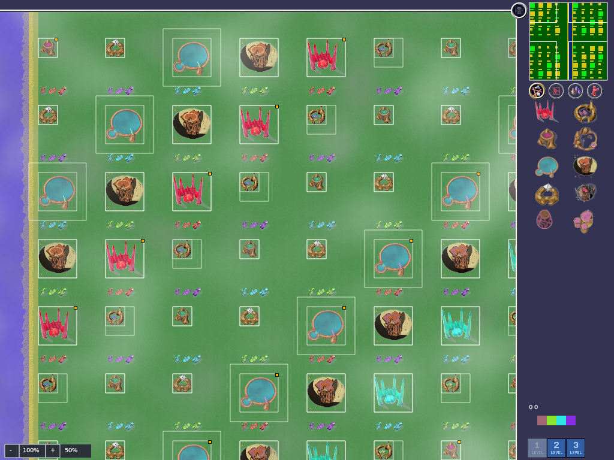

# PR 665 local verification

Tested source: 890fad7bad9f03f1846542fe1a9571b22c3e3b4a
Base: f204c7b613793b2e16536127a2b24eccc64a0dcd

39 cases passed, with no failures or skips, on Linux x86_64 / GCC 15.2.0.
The archive contains build/test logs, JUnit, exact commands, environment/dependency versions, binary hashes, generated screenshots and save/replay fixtures.
`seam-before.log` is historical evidence that the new pixel regression fails on the original unpadded atlas; it is not final-revision evidence.

The focused run covers fractional zoom/camera offsets, ordinary and cached geometry, native/HD/portable sprite batching, software rendering, wrapping, full-game screenshots, skin caches and triple UI scale. Full-game rendering checks preserve simulation checksums and RNG state.

Non-Linux platforms, physical GPU drivers and interactive manual play were not tested. No simulation rules or serialization code changed in this PR. Hosted cheap contracts are separate from local engine validation.

Download [validation archive](pr-665-validation.zip).

