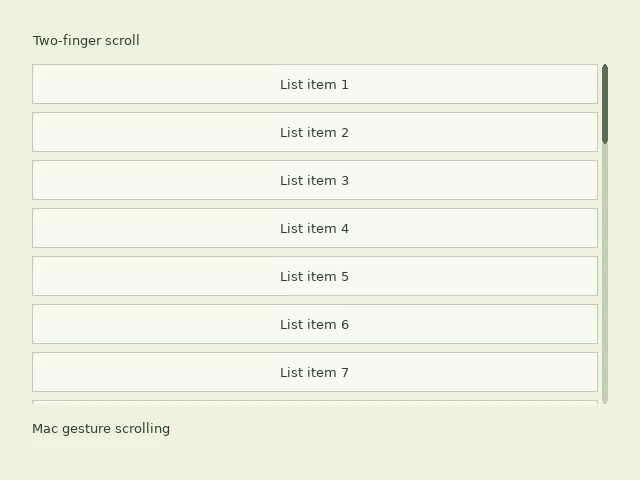

# Mac gesture scrolling verification

Tested feature revision: `4aec20981d514d27b2514af1f7761bd6dc87d9ae`. Integrated base: `2d41365a72771df6ec2394d2e0480d25e810a327`. Clean feature worktree; base changes to shared UI/HUD/settings integrated before the final build.

Environment: macOS 26.6.2 (25G83), arm64, Apple clang 21.0.0 (clang-2100.3.34.2), Homebrew SCons, Python 3.14.7. Release client, GNU C++20, `-O3 -g`, SDL 3.4.16, SDL_image 3.4.6, SDL_ttf 3.2.2, SDL_net 3.2.0 from the cached SDL SDK. Exact compiler/link flags and dependency paths are in the build logs.

## Results and commands

All commands below exited zero. Final client and both harness binaries built. 53 unit cases and 19 engine/display cases passed, no skips. Fullscreen settings transitions, GPU/software settings layouts, small portrait/landscape presentation matrices, scaled event conversion, HUD/editor native routing and existing touch/wheel/map behavior are covered.

```sh
GLOB2_SDL3_PREFIX=/Users/bradley/.cache/glob2-sdl3/prefix /opt/homebrew/bin/scons -j8 release=1 build/darwin/client/release/src/glob2 unit-tests engine-tests
python3 test/run_tests.py --binary unit --filter 'GestureScroll/*' --filter 'ScrollPhysics/*' --filter 'UILayout/*' --filter 'EventQueue/*' --junit artifacts/mac-gesture/final-unit-junit.xml --artifacts artifacts/mac-gesture/final-unit-artifacts
python3 test/run_tests.py --binary engine --filter 'GameGUITouch/*' --filter 'MacScrollMonitor/*' --filter 'Settings/*' --filter 'SettingsGraphics/*' --filter 'ScreenExecution/*' --filter 'UIPresentation/every*small*' --fullscreen --display-jobs 1 --junit artifacts/mac-gesture/final-engine-junit.xml --artifacts artifacts/mac-gesture/final-engine-artifacts
python3 -m unittest discover -s test/build_system -q
```

Build-system contracts: 297 tests passed, one existing skip. Auxiliary build-system and sanitizer/stub checks ran at `bbaeb22b29129029615bfe2179a79abc09229917`; the subsequent commit changes only offscreen clipping in the visual harness. Their tested build inputs and production adapter/controller sources are unchanged. The final client/harness build and 53 + 19 runtime cases were rerun at the feature revision above.

```sh
clang++ -std=c++20 -O1 -g -fsanitize=address,undefined -Ilibgag/include -I/Users/bradley/.cache/glob2-sdl3/prefix/include artifacts/mac-gesture/native-adapter-test.mm libgag/src/GestureScroll.cpp libgag/src/ScrollPhysics.cpp -L/Users/bradley/.cache/glob2-sdl3/prefix/lib -Wl,-rpath,/Users/bradley/.cache/glob2-sdl3/prefix/lib -lSDL3 -framework AppKit -o artifacts/mac-gesture/native-adapter-sanitized
artifacts/mac-gesture/native-adapter-sanitized
clang++ -std=c++20 -Ilibgag/include -I/Users/bradley/.cache/glob2-sdl3/prefix/include -include artifacts/mac-gesture/non-mac-branch.h -c libgag/src/GestureScroll.cpp -o artifacts/mac-gesture/final-non-mac-controller.o
```

Native synthetic adapter samples passed ASan/UBSan with no diagnostics. The portable-stub compile loads Mac standard headers before undefining `__APPLE__`; it checks that branch's syntax, **not** a Linux/Windows build. Scratch drivers included here for reproduction.

One earlier engine attempt stopped when the shared disk filled while saving screenshots. Its failure log is retained. Earlier generated captures were archived to free space; the complete final rerun passed. The source implementation did not change in response to that infrastructure failure.

## Demonstration

[MP4 video](gesture-demo.mp4) — 192 rendered widget frames at 62.5 fps matching the injected 16 ms clock. Contact follows fractional deltas; system-provided synthetic momentum glides once; a direct edge pull springs back. The video is **synthetic**, not a recording of a physical trackpad. It exercises the real Host/controller/scroll widgets. Native normalization/suppression is covered separately by native event contract tests. Captions and clipping were visually inspected.



Representative PNGs show direct scrolling, native glide, edge stretch and settlement. Expanded settings screenshots are included for wording/layout review. Logs and JUnit are gzip-compressed.

## Limits and acceptance

Physical Mac trackpad, conventional wheel and gesture-capable mouse have not been operated; hands-on Retina/windowed/fullscreen feel remains unverified. Automated fullscreen transitions and scaled-coordinate tests do not replace that review. Actual Linux, Windows, mobile and browser builds were not available here. Broader six-size presentation coverage and expensive hosted CI were not requested/run. No simulation/order/save/replay/network code changed, so simulation compatibility suites and a SIM_REVISION bump are not required.

The user requested merge with the documented device/platform verification gaps retained. Scrolling feel intentionally changes on phased Mac gestures. Existing List momentum zero suppresses native UI momentum; positive values preserve macOS speed/duration. Bounce/reduced-motion controls retain their existing fields.

## Pre-merge integration refresh

Tested merge head `2f7f3af72ac69205aa608e263607c6f5df2d6d92`, integrated base `931fca466` (full base SHA available in the feature merge commit). Master added a quick-match strip in shared online-screen layouts, so the client/harness build and focused integration tests were refreshed. No conflicts. Same OS/toolchain/dependencies/flags as above. Build exited 0; 53 unit cases and 10 engine/display cases passed, no skips. The latter cover both small portrait/landscape matrices including the new online strips, all GameGUITouch input cases, native Mac gesture contracts/visual demonstration, and screen lifecycle. Earlier settings/fullscreen/build-system/sanitizer evidence remains attributed to its original revisions; those feature inputs were unchanged.

```sh
GLOB2_SDL3_PREFIX=/Users/bradley/.cache/glob2-sdl3/prefix /opt/homebrew/bin/scons -j8 release=1 build/darwin/client/release/src/glob2 unit-tests engine-tests
python3 test/run_tests.py --binary unit --filter 'GestureScroll/*' --filter 'ScrollPhysics/*' --filter 'UILayout/*' --filter 'EventQueue/*' --junit artifacts/mac-gesture/merge-unit-junit.xml --artifacts artifacts/mac-gesture/merge-unit-artifacts
python3 test/run_tests.py --binary engine --filter 'GameGUITouch/*' --filter 'MacScrollMonitor/*' --filter 'ScreenExecution/*' --filter 'UIPresentation/every*small*' --display-jobs 1 --junit artifacts/mac-gesture/merge-engine-junit.xml --artifacts artifacts/mac-gesture/merge-artifacts
```

Hands-on device/Retina feel and actual non-Mac builds remain unverified. The user explicitly requested merge; these omissions are retained rather than represented as completed validation. The original synthetic demonstration still describes unchanged gesture production code.
