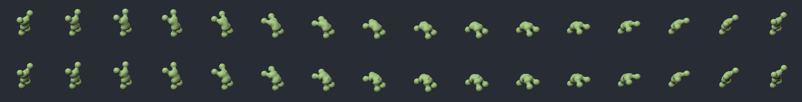
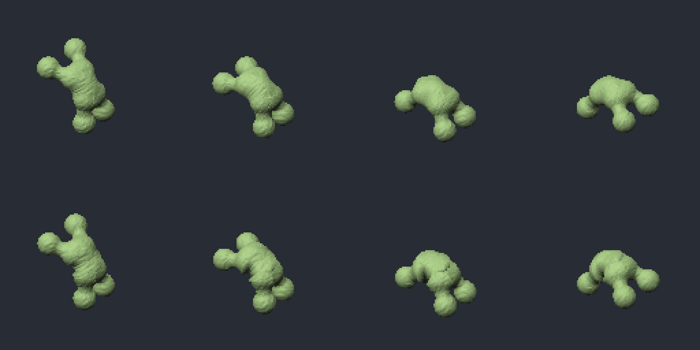
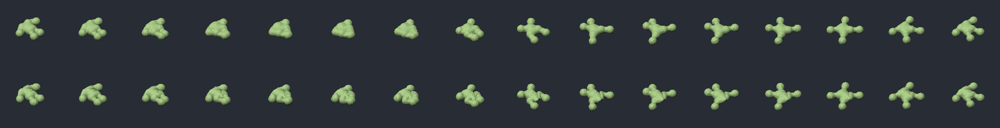
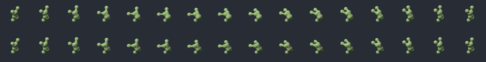
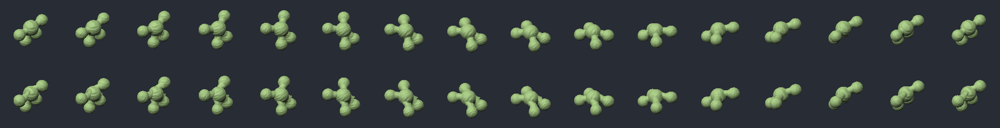
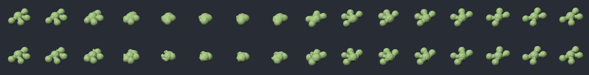
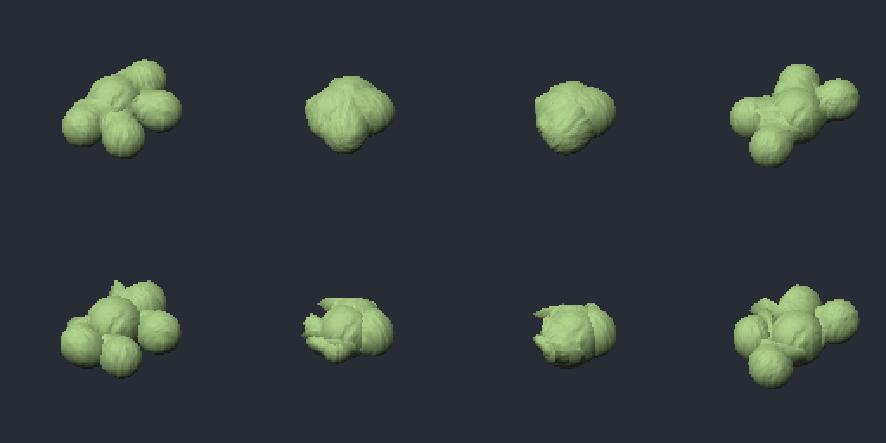
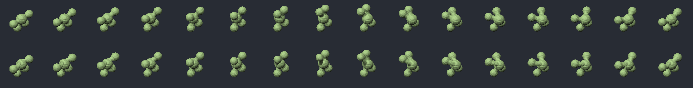
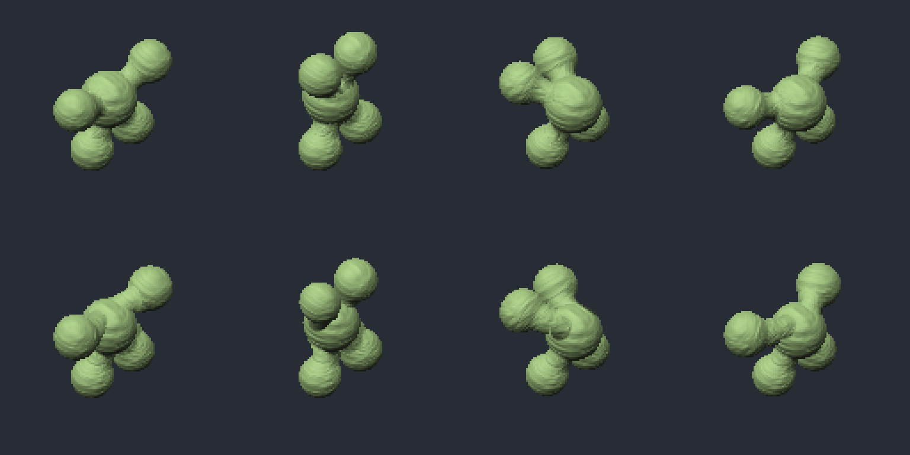

# Fitted unit rigs: local review evidence

Evidence for draft PR #821 after replacing the authored tube-and-sphere rigs with
rigs fitted to the baked metaball clips. Tested commit: `5a8885933` on
`codex/worker-rig-pipeline` (previous head `d396f7e09`). Not a merge request;
all candidates stay `accepted: false`.

Environment: Linux x86-64, GCC 15.2.0, release C++20 `-O3` client, pinned SDL3
prefix from the shared checkout, NVIDIA RTX 2070 SUPER (captures and native
display tests under Xvfb), Blender 3.6.23 (`-t 1`), Node v22.22.1 with the
platform lockfile.

## What changed in the look

The rest surface is the same `limb_surface.py` fit the baked clips use,
evaluated at the source rig's rest pose. Torso vertices may follow the body,
the socket bones and each limb's first segment: in the baked frames the torso
surface slides outward over the shoulder and hip lobes as the limbs move, and
with the body and socket bones alone the limb rings covered the real torso,
leaving a fold across its middle (`worker-torso-5x.png` shows the fixed torso
at 5x; `torso-variants2.png` the variants). Bones sit on the original metaball
chain (plus socket and segment-midpoint bones), weights are solved against
every baked frame, and refinement moves bones only in translation and scale,
bounded to one model unit, with rotations kept on the chain. Worker swim and
harvest are new candidates; the explorer rig is byte-identical to before.

Each strip shows direction 0, every other phase: baked clip above, rig below
(production atlas, flat material). The GIFs animate all 32 phases side by side.

| Clip | Strip | Animation | Zoom |
| --- | --- | --- | --- |
| worker walk |  | [gif](worker-walk-baked-vs-rig.gif) |  |
| worker swim |  | [gif](worker-swim-baked-vs-rig.gif) | |
| worker harvest |  | [gif](worker-harvest-baked-vs-rig.gif) | |
| warrior walk |  | [gif](warrior-walk-baked-vs-rig.gif) | |
| warrior swim |  | [gif](warrior-swim-baked-vs-rig.gif) |  |
| warrior fight |  | [gif](warrior-fight-baked-vs-rig.gif) |  |

Classic sprite above live rig at game scale (`skin-preview --all-phases`, phase
0 pages): [worker walk](compare-rig-worker-walk-phase-0.png),
[warrior fight](compare-rig-warrior-fight-phase-0.png),
[warrior swim](compare-rig-warrior-swim-phase-0.png); the same pages for the
baked clips are beside them (`compare-baked-*`).

## Measurements

Per clip over all 256 gameplay poses. Distances are model units (the models are
about 16 units across; one unit is roughly 2.4 sprite pixels). Silhouette IoU
is the alpha-mask overlap between the rig and the baked clip rendered through
the same atlas (`tools/skins/rig_silhouette.py`); PR #821's authored worker
scored 82.5 % mean against this kind of reference.

| Clip | RMS | p95 | max | IoU mean | IoU min | strayed normals max |
| --- | --- | --- | --- | --- | --- | --- |
| worker walk | 0.473 | 0.938 | 2.913 | 94.1 % | 88.0 % | 511 |
| worker swim | 0.512 | 1.069 | 6.211 | 93.7 % | 87.6 % | 525 |
| worker harvest | 0.642 | 1.481 | 4.085 | 93.7 % | 89.7 % | 643 |
| warrior walk | 0.589 | 1.225 | 5.818 | 96.2 % | 93.0 % | 305 |
| warrior swim | 1.124 | 2.543 | 8.240 | 92.0 % | 78.9 % | 477 |
| warrior fight | 0.594 | 1.282 | 5.715 | 96.5 % | 94.6 % | 313 |

"Strayed normals" counts vertices (of 2834 worker / 2450 warrior) whose
rig-rotated rest normal differs from the posed surface normal by more than
about 45 degrees; it is what shading sees. Full reports: `fit-reports/`.

Design choices and the measurements behind them (worker, from
`fit-sweeps.log`):

- Free skinning-decomposition rotations fit best on distance (walk RMS 0.28)
  but shaded dark crescents at the sockets; weight smoothing, rotation
  anchoring and per-region influence limits did not remove them. Keeping the
  chain rotations and bounding bone displacement to one unit removed them at
  RMS 0.50.
- Segment-midpoint bones lower the error by about a fifth over the bare chain.
- The fold across the worker's torso was not the rest mesh (an un-posed mean
  rest moved it but did not remove it, and cracked the warrior's joints); it
  came from torso vertices being limited to the body and socket bones. Letting
  them follow each limb's first segment removes it at the same error
  (`torso-variants2.png`, `torso-prox-other-frames.png`, `torso-diag-16.png`).
- The warrior's swim stroke is not periodic across directions and keeps 256
  samples; its full retraction merges all limbs into one ball, which linear
  skinning cannot follow, hence its residual.

## Verification

Commands from the repository root (each exits 0):

```sh
blender-3.6.23 --background --factory-startup -t 1 --python-exit-code 1 --python tools/skins/fit_unit_rigs.py -- --model worker --output artifacts/rig/worker
blender-3.6.23 --background --factory-startup -t 1 --python-exit-code 1 --python tools/skins/fit_unit_rigs.py -- --model warrior --output artifacts/rig/warrior
blender-3.6.23 --background --factory-startup -t 1 --python-exit-code 1 --python tools/skins/author_explorer_rig.py -- --output artifacts/rig/explorer
python3 tools/skins/install_rigs.py artifacts/rig/worker artifacts/rig/warrior artifacts/rig/explorer
python3 test/build_system/test_skin_assets.py
blender-3.6.23 --background --factory-startup -t 1 --python-exit-code 1 --python tools/skins/test_fit_rigs.py
CCACHE=1 GLOB2_SDL3_PREFIX=/home/bradley/glob2-claude/build/sdl3/prefix scons -j20 release=1 server=0 skin-preview skin-game-preview tests
SDL_VIDEO_DRIVER=x11 xvfb-run -a -s "-screen 0 1920x1600x24" python3 test/run_tests.py --filter 'Skin*/*' --filter 'ColonySkinPreview/*' --filter 'RenderBatch/*' --jobs 4 --display-jobs 1
npm exec --prefix platform -- vitest run --root platform apps/web/test/skin-rig.test.ts apps/web/test/skin-projection.test.ts apps/web/test/skin-geometry.test.ts apps/api/test/skinPublishing.test.ts
npm exec --prefix platform -- playwright test -c platform/apps/web/e2e/rig.config.ts
npm run --prefix platform typecheck
npm exec --prefix platform -- eslint platform/apps/web/e2e/rig-conformance.ts platform/apps/web/src/skins/geometry.ts platform/apps/web/test/skin-rig.test.ts
```

Results (logs in `logs/`):

- Rig authoring suite (Blender): 7 passed (176 s).
- Installed asset contract: 3 passed.
- Native `Skin*`, `ColonySkinPreview`, `RenderBatch`: 47 cases passed, 0 failed.
- Web unit tests: 72 passed; typecheck and eslint clean.
- Browser conformance (Chromium, Firefox, WebKit): 27 passed.

Coverage targets what changed: authored rig geometry, weights and tracks;
provenance and native/web byte identity; the extended candidate list in the
native loaders, offline sprite export and Studio; decoder and shader agreement
on every installed clip. Omitted: full engine regression, other physical
platforms, Emscripten gameplay, and any performance measurement. No simulation,
save, replay or network code changed. In-play feel review of the live rigs is
still the maintainer's.
