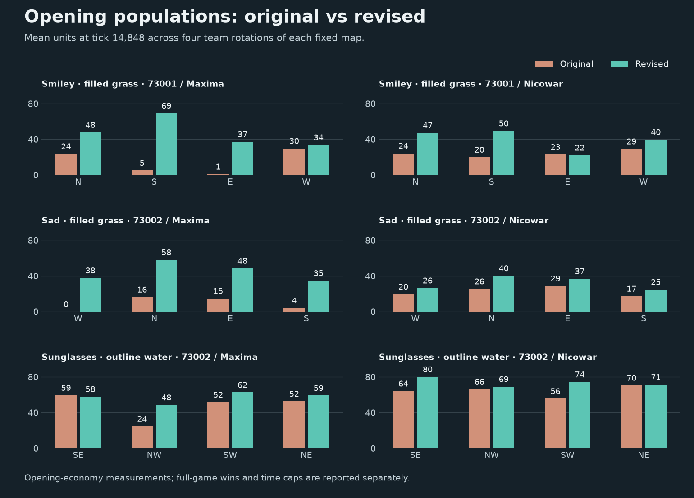

# Emoji balance tuning

Final report

## Result

**The repeated failed openings on the three problem maps were removed while preserving the emoji terrain.** Full-game results below distinguish actual wins from unresolved time limits. This is evidence of improved AI playability, not a claim of universal human balance.

The study ran **320 additional tournament games**, plus two short cross-platform runs. The retained fix reduced opening stalls from **16/96 to 0/96 colonies** on the problem maps; the separate fresh-map check remained **0/256**. Nicowar’s strongest-position wins in the matched full games fell from **8/8, 7/8, 5/8** to **3/8, 4/8, 3/8**. Maxima’s late-game fairness remains less conclusive because **18/24** revised matches capped.

## Why the original starts failed

1. The original search optimized separation after checking a legal town footprint and a broadly fertile shoreline. It did not require enough productive growing area close to the colony.
2. A ten-tile crop exclusion and fertility-first shore planting could put the useful farm beyond a short working route. The static validator accepted wheat/wood reachable within 24 steps. Maxima’s live food model instead uses discovered wheat and a 12-tile harvesting neighbourhood; geometric access alone does not establish a working economy.
3. The traces show the failure before combat: on the original sad-face map, the west Maxima start never recorded a completed inn or a meal in any rotation and lost its original workers. On the smiley, the east start completed its first inn late or never completed one. Other sites already had growing populations.

Moving crops closer alone moved the failures to other starts. Nearest fertile-positive grass can provide poor renewal, and a single patch can be cut short by a shore or road. The successful package combines better local growing ground, short initial supply routes, and retained productive shore farms. The experiments do not uniquely apportion the benefit among every component of that package.

## Change

- Locally refine dispersed starts, by up to ten tiles per axis, using the best 48 fertile grass tiles in a twelve-tile neighbourhood plus building room. Preserve the legal footprint and minimum separation, then randomly deal starts to teams.
- Keep the 48-wheat/48-wood shoreline targets. Supplement them with up to 24 wheat and 16 wood on nearby existing fertile grass; allow several patches when the first patch ends. Keep a six-tile crop exclusion and ten-tile ambient-deposit clearing.
- At non-default abundance, use the existing resource-clearing repair when building room is cramped, then recheck crops. This fixes the retained high-density sunglasses regression.
- Terrain construction is unchanged, and the final validator checks every terrain corner against that design. Controls and Random defaults remain unchanged. No AI, simulation, save-format, or protocol change.

The opening is faster and supports larger populations. Some revised matches last longer because opponents now establish competing economies; a time cap is not itself evidence of a stalemate or fairness.

## Opening experiments

Each candidate used the same three fixed maps, both Maxima and Nicowar mirrors, all four cyclic team reindexings, game seed 91001 and a 20,000-tick limit. The original 24 games were reused from the prior tournament. Five experimental revisions added 120 games.

| Candidate | Intervention | Stalled colonies / assessed | Starvation deaths by 15k |
| --- | --- | ---: | ---: |
| r3 | Original | 16/96 | 42 |
| r4 | Move shore crops closer | 8/96 | 134 |
| r5 | Closer crops + smaller wheat/wood separation | 7/96 | 103 |
| r6 | Retain shore farms + nearby supplements | 17/96 | 39 |
| r7 | Add capped site score (saturated on some maps) | 17/96 | 39 |
| r8 | Uncapped site score + complete multiple-patch supplements | 0/96 | 83 |

A stall means at most the original four units at the sample near tick 15,000, before any recorded combat damage. Population is reconstructed from initial units, births, deaths and conversions at the actual sampled tick. These are correlated rotations of fixed maps. Starvation counts are raw totals: occasional starvation during larger-population growth remains, and was not eliminated by the change.

## Matched full games

Three maps × two AIs × four rotations × game seeds 91001 and 95001: **48 original and 48 revised games**, with a 90,000-tick limit. The original cohort reuses 24 prior games and adds 24 fresh-seed controls. The revised cohort adds 48 games.

| Map / AI | Original wins by seat 0–3 | Original caps | Revised wins by seat 0–3 | Revised caps | Verified games, old/new |
| --- | --- | ---: | --- | ---: | ---: |
| Smiley, filled grass (73001) / maxima | [0, 2, 0, 6] | 0 | [0, 1, 1, 0] | 6 | 8/8 |
| Smiley, filled grass (73001) / nicowar | [0, 0, 0, 8] | 0 | [1, 3, 2, 0] | 2 | 8/8 |
| Sad, filled grass (73002) / maxima | [0, 6, 0, 1] | 1 | [0, 0, 0, 3] | 5 | 8/8 |
| Sad, filled grass (73002) / nicowar | [1, 0, 7, 0] | 0 | [1, 4, 2, 1] | 0 | 8/8 |
| Sunglasses, outline water (73002) / maxima | [0, 0, 1, 0] | 7 | [1, 0, 0, 0] | 7 | 8/8 |
| Sunglasses, outline water (73002) / nicowar | [5, 0, 1, 2] | 0 | [2, 1, 1, 3] | 1 | 8/8 |

Seats refer to the corresponding physical sites before/after local refinement, not engine team indices. Smiley seats are N/S/E/W; sad-face seats are W/N/E/S. Sunglasses seats are SE/NW/SW/NE; seat 0 is the formerly dominant southeast site. Unresolved games contribute no engine winner. Fewer wins from a favorite must be interpreted alongside the number of decisions, not treated as proof of equality.

The revised cohort had **21/48 capped games**, versus **8/48** originals. Every revised capped game recorded combat damage in its final 20,000 ticks ([late-combat measurements](late-combat.json)); these were active unresolved contests. Continued combat does not prove eventual resolution. The comparative win evidence is clearest for Nicowar; Maxima’s three decisive sad-face games all favored the south, so its late-game positional fairness is still unresolved.

## Held-out opening checks

Four other characters (wink, surprised, heart, star), all four major modes, map seed 74011, two rotations, both AIs and game seed 95001: 64 original plus 64 revised games, 20,000 ticks each. This set was separated from the three maps used for tuning.

| Variant / AI | Original stalls / colonies | Revised stalls / colonies |
| --- | ---: | ---: |
| Outline water / maxima | 0/32 | 0/32 |
| Outline water / nicowar | 0/32 | 0/32 |
| Filled water / maxima | 0/32 | 0/32 |
| Filled water / nicowar | 0/32 | 0/32 |
| Outline grass / maxima | 0/32 | 0/32 |
| Outline grass / nicowar | 0/32 | 0/32 |
| Filled grass / maxima | 0/32 | 0/32 |
| Filled grass / nicowar | 0/32 | 0/32 |

## Verification and artifacts

- Native contract tests passed on macOS arm64 and Linux x86_64, including all 32 explicit variants, terrain independence from colonies/workers, and the retained dense-resource failure. Both platforms compared 256 golden rows with zero failures; only Emoji baselines were updated.
- The telemetry-enabled/disabled/repeatability harness passed all 96 cases, including serialized-world and RNG checks. See `telemetry-r8.log` for generation-only timings. This was the gameplay candidate, before the non-default-only final repair.
- The r8 extreme matrix retained a real failure: filled-water sunglasses, seed 74021, 256×256, eight colonies/eight workers, all amounts 200%. The final r9 repair is covered by a dedicated regression and the repeated 64-map extreme matrix (all 32 variants at 256/8/8/200% and 512/8/1/0%).
- [Default map identity](default-identity.json) compares the 19 r8 gameplay maps with final r9 maps. [Terrain preservation](terrain-preservation.json) records identical glyph/terrain construction source and the corner-validation contract.
- [Cross-platform smoke result](compat/REPORT.json) passed on a fixed exported map, four Maxima AIs, seed 96001 and 4,096 ticks: complete per-tick sidecars, replay bytes and initial/final saves were identical. The complete per-tick checksum sidecars are retained under `compat/`; read that result for the actual comparison outcome.
- [Representative maps, previews and named final saves](cases/) cover all three problem cases. The saves are the tested r8 games; final r9 map bytes are identical.
- [Machine-readable comparison](comparison.json), all `openings-*.json`, plans, source snapshots, immutable bundle manifests, raw experiment results, verified logs and selected saves are retained in this directory. [Experiment plan and interventions](PLAN.md) documents rejected candidates as well as the retained one.

## Limits

- The gameplay evidence covers 256×256, four colonies/four workers and default abundance. Extreme settings received generation checks, not a full gameplay tournament.
- Only a small number of distinct map seeds were played. Repeated rotations and fresh game seeds are not independent samples of the generator’s full distribution.
- AI mirror games cannot establish human fun, strategic variety or balance across unequal player skill. Remaining time caps require longer matches or human review to assess late-game resolution.
- All 19 final standard-setting maps match the gameplay candidate byte-for-byte, allowing its results to carry forward to r9. Non-default resource clearing changes those extreme maps intentionally.
