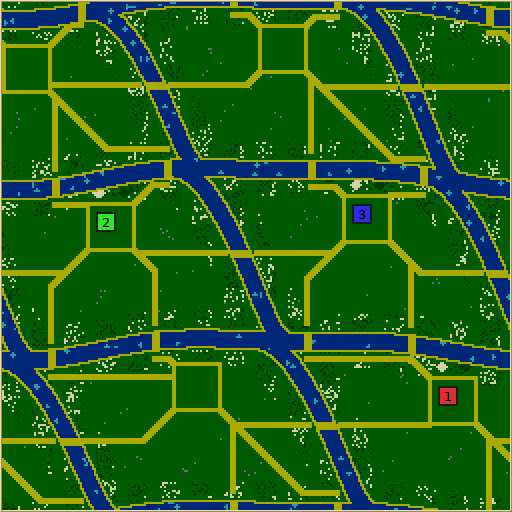
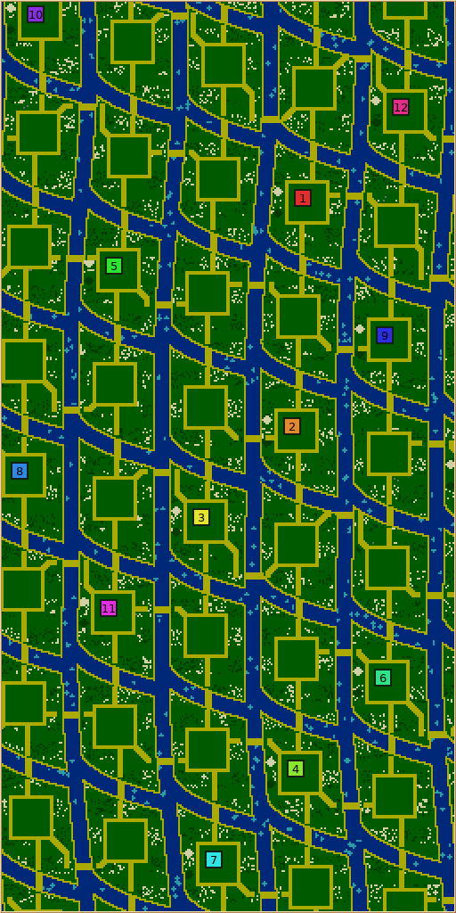
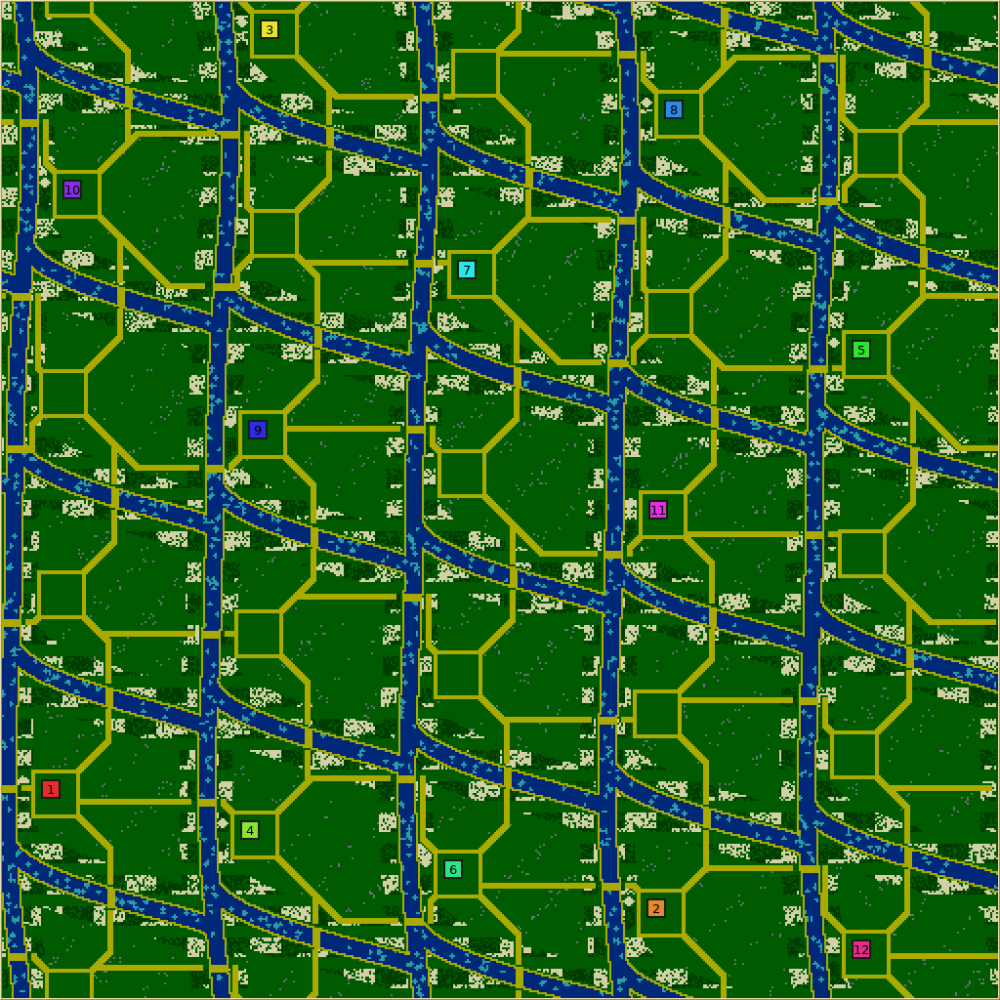

# Braided Delta review evidence

## Results

- Revision 3: **1,509/1,509 supported maps generated**, plus **50/50 expected-invalid
  requests correctly rejected**. No static pathology flags or emergency crop topups.
- Covers 855 supported geometry combinations across nine 128–512 map shapes,
  every 1–12 colony / 1–8 worker pair, every resource slider value individually,
  resource corners, repeated geometry seeds, and 96 held-out resource corners.
  This is not the Cartesian product of every parameter and seed.
- Seven conservative crop-overgrowth fixtures, shared growth-toolkit contracts,
  and full defaults harness passed on macOS and Linux.
- Golden checks: 256 rows on each platform, zero failures; existing generator
  fingerprints unchanged. Telemetry on/off: 96 cases, zero semantic failures.
- All four new labels translated in 33 languages; translation audit/tests passed.
- Fifteen retained outlier maps loaded and were visually inspected. Their complete
  initial reports match before/after extracting the shared growth operations.
- Three revision-3 AI smoke games reached combat by the 45k tick cap, with no worker
  starvation by 15k. Two games had late starvation; these are unresolved capped
  games, not wins or evidence of balanced human play.

**Outstanding:** nine of the 15 saved-map inspection requests fail the study tool's
byte-for-byte full team-rotation round trip. Loading, idempotent saving, references,
and placement checks pass. The byte mismatch remains undiagnosed. Nine requests
were automatically retried five times before the retries were paused; the 45 failed
attempts are retained separately from the generation sweep, which had no retries.
This PR does not claim a successful full rotation audit or cross-platform simulation
checksum equivalence.

## Screenshots

Native-client minimaps loaded from retained Linux maps. The map wraps at its edges.
Green interiors provide building ground; sand approaches keep crossings reachable
as the riverbank crops spread.

### River loops and alternative crossings — seed 710254



### Dense islands, minimum-room outlier — seed 810479



### Maximum ambient resources — seed 711242



The long, regular sand approaches and repeated town enclosures are intentional
access/land-budget tradeoffs; human review should assess appearance and pacing.

## Reproduce and inspect

[validation.tar.gz](validation.tar.gz) contains the reports, requests, per-map rows,
complete primary sweep result records and artifacts, selected maps/previews, all
final revision-3 smoke-game records/logs/saves, test logs, translation audit, source
hashes, and failed rotation inspection attempts. Prior revision-1/2 AI summaries
are included as historical context; their complete raw game archives and compiled
binaries are not included. The bundle manifests referenced in the reports describe
local immutable execution bundles, not downloadable binaries in this archive.

Extract from the repository root:

```sh
tar -xzf validation.tar.gz
python3 artifacts/braided-delta/bulk-r2/analyze.py artifacts/braided-delta/bulk-r3
python3 artifacts/braided-delta/bulk-r2/report.py artifacts/braided-delta/bulk-r3
```

Start with `artifacts/braided-delta/bulk-r3/REPORT.md` and `VALIDATION.md`.
The archive preserves original paths so the offline tournament `Results` reader
can verify artifact hashes. The primary sweep used the revision-3 pre-extraction
binary; fifteen paired reports and platform goldens validate the final read-only
shared extraction. Header comment edits afterward have no compiled effect.

Archive SHA-256: `95ebed02973d888af20869e3fdf09e7b5904a88c81624aaba567fef513cb51a8`.
