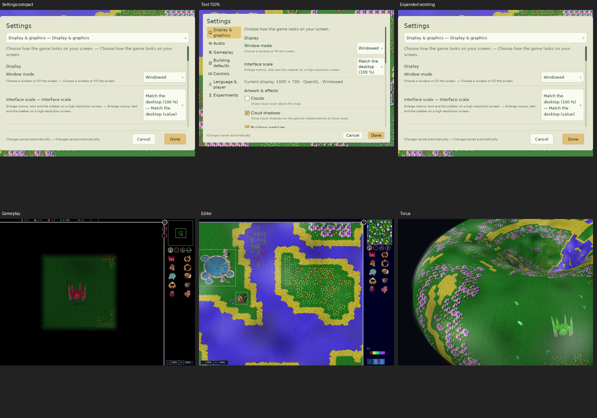
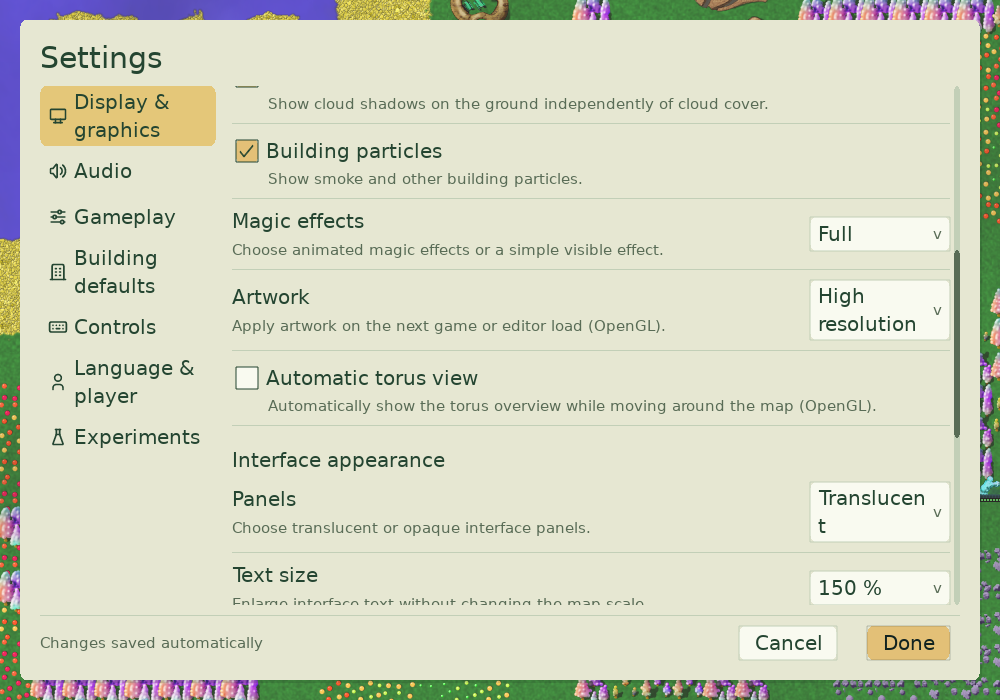
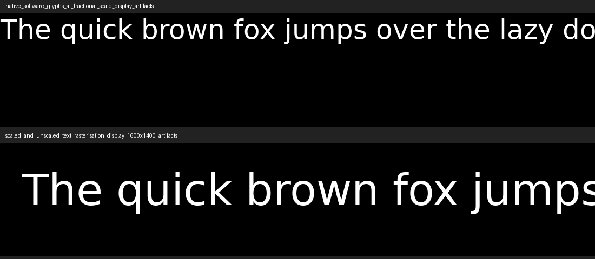

# Graphics and native display review evidence

Effects/text-size change: commit `caec298f4`. Native display change: commit `2f65f52b4` on `codex/graphics-settings-native-display`.
No simulation, save-format, replay/network-version or balance changes.

## Commands

```sh
scons release=1 CXXFLAGS=-g0 -j4 engine-tests build/darwin/client/release/src/glob2
SDL_VIDEO_MAC_FULLSCREEN_SPACES=0 python3 test/run_tests.py --binary engine --filter 'SettingsGraphics/*' --filter 'Settings/*' --filter 'WindowResize/*' --filter 'FullscreenAspect/*' --filter 'TextRaster/*' --filter 'PortableRenderer/*' --filter 'HighResolutionIntegration/*' --filter 'TorusRender/*' --display-jobs 1 --artifacts artifacts/graphics-settings/mac-native --junit artifacts/graphics-settings/mac-native.xml
GLOB2_TEST_DISPLAY=1 build/darwin/client/release/test/glob2-engine-tests -ts=WindowResize '-tc=*software presentation benchmark*'
```

Linux isolated source/build directory: `/tmp/glob2-native-display-39ac` on `pharaoh-dev-1.local`.
Build: `scons release=1 CXXFLAGS=-g0 -j4 engine-tests build/linux/client/release/src/glob2`.
The initial 31-case selection also includes `MapRenderResize/*` and `UIPresentation/*`.
Those full-sized Xvfb fixtures need at least 1800x1100 unscaled output and do not establish Retina coverage.

## Linux results

Linux X11/Xvfb, SDL 2.32.10, Mesa software OpenGL. All 31 selected cases passed across the original selection and corrected-fixture reruns. Initial failures are retained, along with reruns: fullscreen fixture used fixed old capture dimensions; software torus fixture attempted to activate a now-disabled control; HD fixture needed the writes-preferences tag because live fullscreen now persists. Production assertions and pixel comparisons remain intact.

Latest settings rerun: six passed; software torus rerun: passed; HD true-center rerun: passed.
Expanded wording, French, compact/tablet/desktop UI captures are retained in `linux/`.
Gameplay mixed-effects, editor/minimap and native torus captures are retained there too.
`review-linux.png` is an inspection montage; `text-size-native.png` shows the main graphics text-size control.

## Performance method

Before: release commit `caec298f4`, with benchmark-only adaptation to use the actual OS-constrained window size. After: native-pixel release implementation. Both use O3; the final build disables debug metadata only. Same two rectangles, five batches of 60 frames after warm-up, median timing. Cache-only and frame timings are not additive. macOS presentation/refresh timing and host build contention limit conclusions. This does not measure gameplay FPS or claim unchanged native software gameplay performance.

Baseline logs: `benchmark-before.txt`. Native output and comparison: `benchmark-after.txt` (added after final checks).

## Review limits

Windows native display, Wayland, real monitor migration, mixed-DPI displays, minimized/zero-sized output and allocation failure need hands-on platform acceptance. Mobile/browser viewport ownership is retained in code; those targets were not built here. Software HiDPI requires SDL 2.26+.
A maintainer should play the native-display change before merging: fullscreen layout and text sharpness visibly change. Review the effects commit separately first.

## Final macOS/Retina results

Mac Apple M3, SDL2-compat 2.32.70/Cocoa, 2x backing density. Twenty-three selected cases passed across the original unaffected cases and affected-case reruns. `mac-fullscreen-verified.xml` has twelve passing settings/resize/text cases; `mac-final-review.xml` retains a torus-center fixture failure, with its final correction covered by `mac-hd-verified.xml`. The center comparison now checks identical wrapped world locations, matching the camera's existing normalization.

Both renderers rasterize native targets: software and GL text captures are 2560x1280 for a 1280x640 point window. Fractional glyph comparisons pass against independent SDL_ttf output. Settings include 640x480, expanded wording, French and 150% text. Native fullscreen/F11, saved flags/dimensions, input/relative drag and clipping pass.

Initial Mac fullscreen failures exposed this host's background SDL2-compat fullscreen Space no-op. A standalone SDL-only diagnostic reproduces it (`sdl-fullscreen-check.log`); `SDL_VIDEO_MAC_FULLSCREEN_SPACES=0` confirms actual desktop fullscreen (`sdl-fullscreen-desktop-check.log`, 1470x956 points). Production now confirms SDL's resulting mode before persisting, with rollback and initial-window fallback on failure. A focused native-Space play check remains unverified.

## Matched software presentation comparison

| Actual window points | Baseline raster | Native raster | Before frame ms | After frame ms | Before cache ms | After cache ms |
| --- | --- | --- | ---: | ---: | ---: | ---: |
| 640x480 | 640x480 | 1280x960 | 8.301 | 8.917 | 0.037 | 0.345 |
| 1024x697 | 1024x697 | 2048x1394 | 16.533 | 18.947 | 0.136 | 0.938 |

Native output draws four times as many pixels; frame latency increased approximately 7.4% and 14.6% in this presentation microbenchmark. Frame-cache copies cost more. Gameplay software performance remains unprofiled; do not extrapolate these frame timings to FPS.

The larger matched-window command sets `GLOB2_TEST_BENCHMARK_SIZE=1024x697`; the final default 1024x768 window fit, unlike the baseline's OS-constrained 1024x697 window, so its default result is not used for the comparison. Logs: `benchmark-before.txt`, `benchmark-after.txt`, `benchmark-after-matched.txt`.

Final Linux production transition/text rerun: twelve passed (`linux/linux-native-verified.xml`); final HD integration rerun: one passed (`linux/linux-hd-verified.xml`).

## PR cleanup and review

PR #490 integrates master f1c15bfeb. The settings/native commits were rebased to ea717fe3d/7d70f48fa. Cleanup 49214ac74 extracts common glyph sizing, corrects software text documentation, preserves fullscreen opt-in, removes a duplicate settings row and fixes the upstream PointBar harness friend namespace. Follow-up 3e25db730 uses actual runtime blank-value English fallback and tracks exactly 27 accepted pending keys. Strict audit, all 5 translation tests, font coverage and all 12 CI selection tests pass.

The requested second agent reviewed migration, effect wiring, native target replacement, input transforms, fullscreen rollback and the fallback exception scope. Its two cleanup suggestions are implemented; no remaining correctness finding was reported. This is technical feedback by an agent for the same author, not independent maintainer approval.

Screenshots and platform XML above predate the rebase; post-integration results will be added when complete. Some XML deliberately retains earlier fixture failures; the corrected reruns and limits are explained above.




