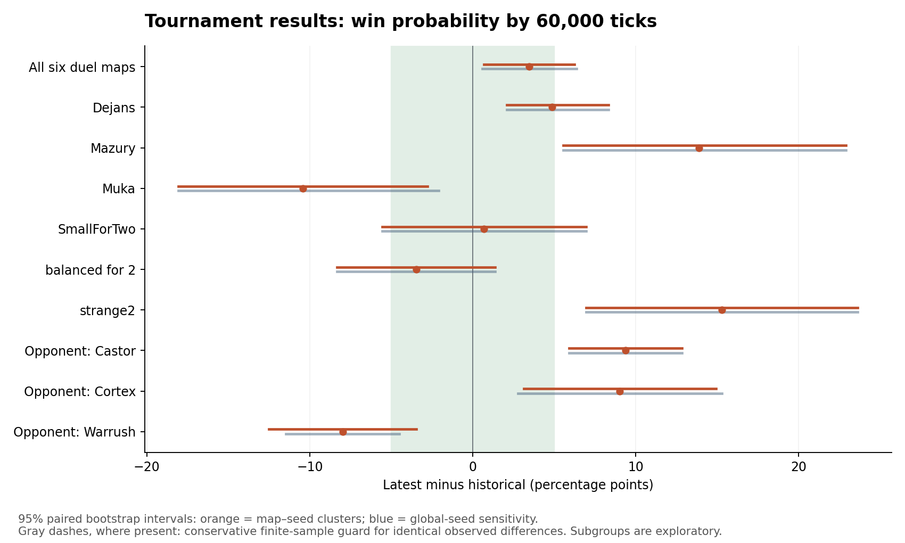
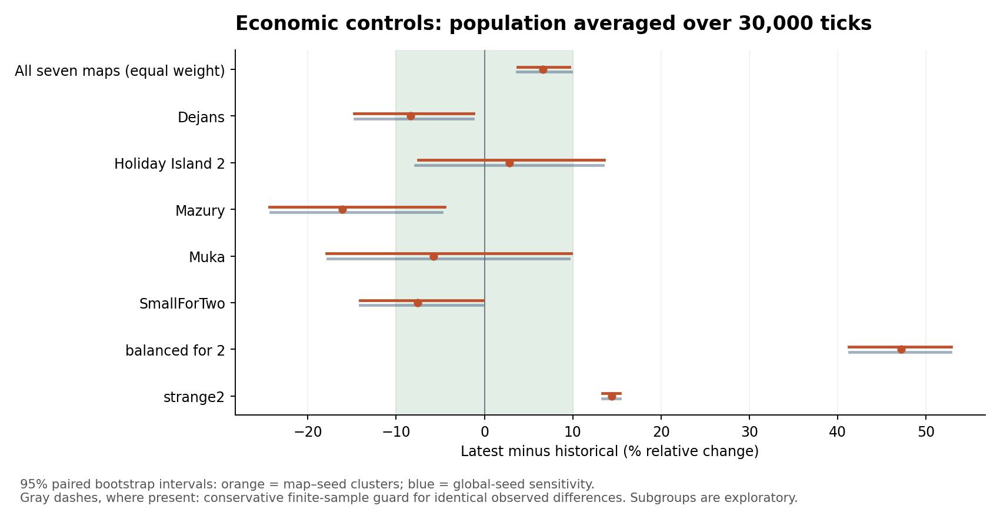
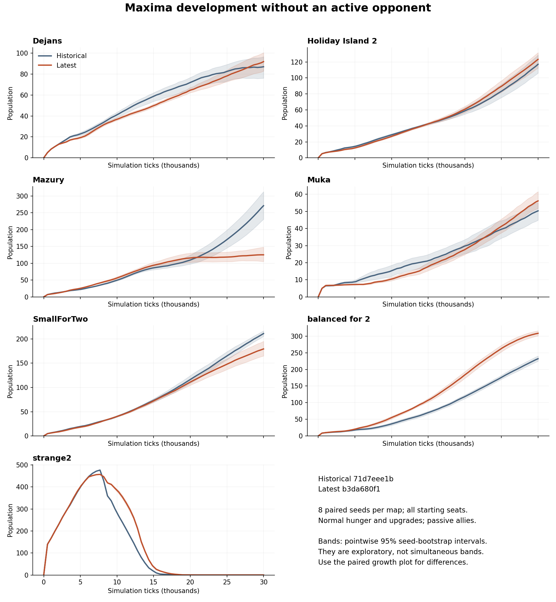

# Maxima producer viability: review evidence

PR: https://github.com/Globulation2/glob2/pull/855

Final source: `8c80349fcda032e134111be856dd6ff7a9c3fd71`.
Integrated master: `ee3be8ecd9d7100de78ef63869271371d427cb66`.
Linux x86_64, GCC 13.4.0, release `-O3`; exact compiler commands, dependency prefixes, clean-tree status and binary hashes are in [final-provenance.json](final-provenance.json) and the build logs in the archive.

## Final verification

- [Native JUnit](verified-tests.xml): **270 passed, zero failures/errors, one display-only screenshot case skipped**. The runner executes unit cases together, hence its console reports 217 successful process/jobs rather than 270 individual cases. [Console log](verified-tests.log).
- [Python checks](python-tests-corrected.log): **53 passed**, covering test-runner, simulation-revision and JavaScript evidence contracts.
- All Maxima suites, AI save portability/state continuation, runtime continuation, multiplayer turn harness, replay/read-phase/worker/gradient checks selected by the recorded inventory, and team statistics/save compatibility are included. The inventory records exactly which filters matched; it is the authoritative case list.
- Active Maxima checkpoint: **256 resumed complete records** agree with uninterrupted execution, accounting only for the map-header save-format-version contribution. **512 serial/threaded complete records** agree exactly. Commands, logs, checkpoints and traces are retained.
- Legacy v115 checkpoint: **512 retained complete-state hashes** agree, and **256 midpoint save/load records** agree. No legacy fixture was regenerated.
- New multiplayer golden verifies with simulation revision 22. Regeneration produced a different human-order sequence (first difference at tick 10); replaying master's original orders with only compatibility metadata updated reproduced **all 703 original golden checksums exactly**. Both records, decoding script, verdict and traces are retained. The mismatch was in inputs, not concealed by normalizing simulation state.
- Twelve games refreshed after integration (six maps, both seats, seed 9500, opponents Castor/Cortex/Warrush): **all completed without crashes, 8/12 wins before and after**. Four match all compared observations; eight have differences, including two unresolved → lost outcomes. This is integration smoke coverage, not an equivalence or strength estimate. The final test-registration commit changes no production source; these games and continuation checks ran at `136abe9a3`, and all final native tests ran at the final SHA.
- The changed food-ledger translation unit's primary `.text` is byte-identical after cleanup to the measured candidate: [comparison](ledger-code-comparison.json). Earlier 100-pair-per-size ABBA/BAAB CPU benchmarks measured +0.99%, +0.31%, −0.22% at sides 128/256/512, with block-bootstrap 95% upper bounds below 3%. Raw timings, commands and benchmark source are included. This measures the changed kernel, **not representative whole-game performance**.

The final archive retains preliminary failures: an initial Python invocation used the wrong module path, and the first subcase-based tests passed their assertions but failed the runner's selected/executed inventory check. The five scenarios were registered as separate ordinary cases and the full final selection reran successfully. Earlier `ledger-tests.*` came from a pre-rebuild binary and are not final evidence. `verified-tests.*` is authoritative.

## Historical strategy comparison

The historical tournament compares `71d7eee1bb2c7105d7f1711a799c967c96687cca` against frozen candidate `b3da680f163041b55a7b5ced65f6153d45e13076`, **not final HEAD**. This evidence branch retains the frozen candidate as its parent so both source revisions remain accessible.

- **2,408 total executions**, zero execution failures. **2,080 analysed games**: 1,728 competitive duels, 96 island games and 256 corrected passive controls. The 72 pilot and 256 superseded controls are retained and excluded from final analysis.
- Duels: 659/864 (76.27%) → 689/864 (79.75%), **+3.47 percentage points**, 95% global-seed bootstrap interval **[+0.576, +6.366]**. Five-point equivalence is not established.
- Gains against Castor/Cortex, losses against Warrush and substantial map variation. Island wins are 33/48 on both versions, with only four seed clusters.
- Passive population-time increases 6.59% overall, masking substantial map regressions; training/barracks occur later. The report includes all findings, including Mazury's final-population decline.
- Both engines and opponents changed. These results do not establish Maxima-only causality or optimality. The accepted objective is competitive strength rather than reproducing historical decisions; no parameters were tuned to these results.

Read [interpretation](interpretation.html), [analysis data](confirmation-analysis.json), [per-game table](games.csv), [protocol](protocol.json), and the [full report source](report.html). Download/extract the historical archive to view the HTML report with all its linked data locally. The [control correction](control-protocol-amendment.json) records the death-only → fixed-horizon script condition change before aggregate analysis; all controls were rerun and prefix/final consistency audited.







## Download and reproduce

[Final validation archive](final-validation.tar.gz) contains exact commands, test inventories, build logs, traces, saves, integration-game records and benchmark sources/timings. [Final manifest](final-evidence-manifest.json) lists the SHA-256 of every included file.

Historical evidence is split into numbered `historical-validation.tar.gz.part*` files in this directory. Download all parts, then:

```sh
cat historical-validation.tar.gz.part* > historical-validation.tar.gz
tar -xzf historical-validation.tar.gz
```

The historical archive contains every execution's command, raw record/result and extracted metrics, all analysis code and charts, plus full stdout/final saves for ten diagnostic cases. The other raw stdout/saves (several GiB) and executables are not uploaded. [Historical manifest](historical-evidence-manifest.json) documents these limits and hashes. Rebuild pinned source revisions and remap machine-local paths in the recorded commands to reproduce executions. [SHA256SUMS](SHA256SUMS) verifies the downloadable files.

Final native command (run from the repository root after the recorded build):

```sh
python3 test/run_tests.py --no-display -j 4 \
  --filter 'Maxima.*/*' --filter 'AISavePortability/*' \
  --filter 'AIStateContinuation/*' --filter 'RuntimeContinuation/*' \
  --filter 'TurnEngineHarness/*' --filter 'SimulationReadPhase/*' \
  --filter 'SharedWorkerLifecycle/*' --filter 'GradientPipeline/*' \
  --filter 'ComputeExecutor/*' --filter 'ReadOnlyPhase/*' \
  --filter '*Replay*/*' --filter 'TeamStatsSave/*' \
  --filter 'JavaScriptCompatibility/*' --filter 'TeamLimit/*' \
  --junit artifacts/maxima-merge/verified-tests.xml \
  --artifacts artifacts/maxima-merge/verified-tests \
  --write-inventory artifacts/maxima-merge/verified-inventory.json
PYTHONPATH=test python3 -m unittest test_check_sim_revision test_run_tests test_javascript_evidence
python3 artifacts/maxima-merge/check-continuation.py
python3 test/maxima/check_save_continuation_fixture.py build/linux/client/release/src/glob2 \
  --output artifacts/maxima-merge/legacy-continuation
python3 test/check_sim_revision.py --base origin/master
```

## Limits

No Windows, macOS, Android or browser execution/checksum comparison; no full hosted development matrix; no new human gameplay session. Display-only screenshot coverage was skipped. No claim of whole-engine 3% performance acceptance, final-HEAD historical equivalence, or optimal strategy. Those limits are separate from the focused correctness and compatibility coverage above. The user accepted the strategic trade-offs and authorized merge; the author accepts this scoped local verification under repository policy.
