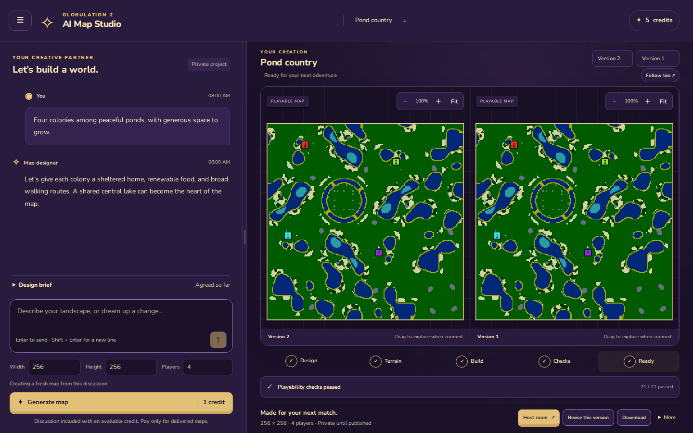
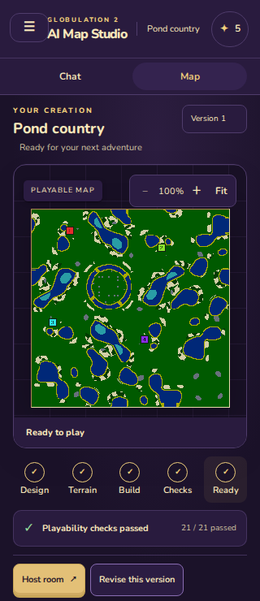
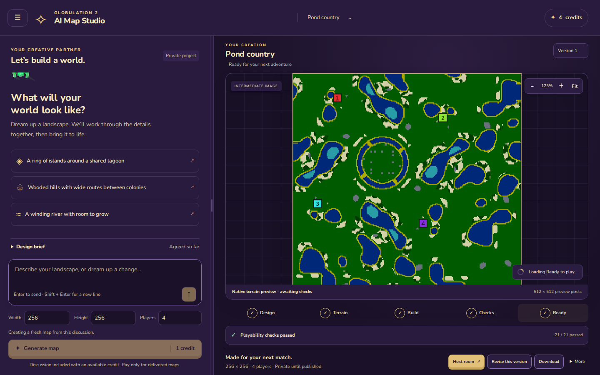
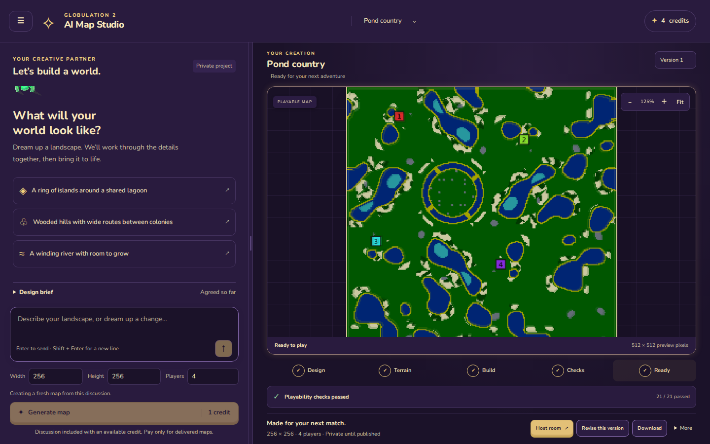

# AI Map Studio — local verification

- Tested commit: `18e0f71c1f4fe822b426d2b4b314e1e565951830`.
- Integrated master: `7b730e405f8a925947b50cd0b18a926d352d8f97`. Resolved the player-profile schema overlap and numbered the additive Studio migration 0037. Reinstalled locked dependencies and rebuilt the native binary against the combined source. The feature diff contains no native algorithms or simulation changes.
- Environment: Linux x86_64, kernel 7.0.0-31-generic, GCC 15.2.0, Python 3.14.4, Node 24.19.0, local Postgres with isolated test databases, Playwright Chromium desktop and emulated phones.
- Dependencies: `npm ci` with the committed lockfile. Native release binary built from this checkout with pinned SDL3 and recording dependencies, detailed below.

## Results

| Check | Result | Evidence |
| --- | --- | --- |
| Full platform unit/service/native integration suite | **561 passed, 76 files** | [test log](logs/integration-platform-tests.log) |
| Platform and web typecheck | Pass | [typecheck log](logs/integration-typecheck.log) |
| ESLint and Prettier | Pass | [lint log](logs/integration-lint.log) |
| Web production build | Pass | [build log](logs/integration-build.log) |
| Studio and shared-shell browser tests | **32 passed, 4 expected skips** | [browser log](logs/integration-browser-tests.log) |
| Player/profile browser tests | **6 passed** | [log](logs/merge-players-browser.log) |
| Studio → Players → Account → Studio | Pass on desktop and phone | [results](ui/shell-integration/results.json) |
| Consolidated stylesheet, old/new comparison | Identical computed CSS and zero axe violations in 21 scenes | [15 regular scenes](ui/new-review-css-final-outcomes.json), [6 tall scenes](ui/new-review-css-tall-outcomes.json) |
| Final rendered comparison, delayed loading, motion, mobile recovery | Pass | [comparison](ui/final/compare/outcomes.json), [reveal](ui/final/reveal/outcomes.json), [failure](ui/final/mobile-failure/outcomes.json), [touch](ui/final/mobile-touch/outcomes.json) |
| SSE flushing through local repository Caddy configuration | Initial frame 3ms; stage frame 753ms, upstream open 2.75 seconds | [timings](logs/caddy-stream.json), [reproduction](logs/caddy-stream-smoke.py) |

## Visual evidence









Additional desktop/phone browser screenshots and reduced-motion/failure states are in `ui/`.
Native initial and revision maps, previews, stage images and structured progress are in `native/`.
These are deterministic test fixtures, not private player material.

## Commands

Commands ran from `platform` with the bundled Node runtime prepended to PATH:

```sh
export PATH=/home/bradley/.cache/codex-runtimes/codex-primary-runtime/dependencies/node/bin:$PATH
npm run lint
npm run typecheck
npm run build -w @glob2/web
GLOB2_BINARY=/home/bradley/.codex/worktrees/f800/glob2/build/linux/client/release/src/glob2 \
  MAP_PYTHON=/usr/bin/python3 \
  STUDIO_EVIDENCE_DIR=/home/bradley/.codex/worktrees/f800/glob2/artifacts/studio/integration-native \
  npm test -- --maxWorkers=6
PORT=4317 SCREENSHOT_DIR=/home/bradley/.codex/worktrees/f800/glob2/artifacts/studio/integration-e2e \
  npm run e2e -w @glob2/web -- studio.spec.ts smoke.spec.ts
PORT=4328 npm run e2e -w @glob2/web -- players.spec.ts
```

Native release binary was rebuilt at the integrated master revision with:

```sh
GLOB2_SDL3_PREFIX=/tmp/glob2-sdl3/prefix \
GLOB2_RECORDING_PREFIX=/home/bradley/.codex/worktrees/75cb/glob2/build/linux/client/release/recording/prefix \
CCACHE=1 scons -j8 release=1
```

Only the pinned recording dependency libraries were reused from the other prefix;
game objects and the binary were built in this checkout. [Native build log](logs/integration-native-build.log).

## Review and risk coverage

Three agents reviewed backend correctness, frontend state/architecture, and rendered UI/UX.
Two additional review/improvement rounds addressed:

- stale snapshot rollback, definitive rejection versus ambiguous paid submissions, and preserved drafts;
- delivered-version comparison and stage inspection staying pinned during live updates;
- decoded-image metadata/markers, delayed final reveal, one-shot celebration, and conversation scroll anchoring;
- failed subscription cleanup, shared concurrent LISTEN readiness, backpressure teardown, and reconnect shutdown races;
- focused component/hook extraction and stylesheet consolidation without changing the verified layout.

Integration review also fixed real soft-account-deletion cleanup, active-worker fencing and creation races. Private journals are purged while anonymous daily call totals preserve provider capacity; tests cover deletion, rollback and UTC migration backfill. The first integration run exposed one stale migration-count assertion (560 passed, 1 failed); it was corrected and the full suite rerun. [Retained failure log](logs/integration-platform-baseline.log).

The full suite covers the shared pub/sub change beyond Studio. Native integration exercises
initial generation and revision, structured playability checks, private delivery, and
exactly-once credit settlement. Other tests cover ordered events/rollback/replay,
notification loss, authorization expiry, artifact access, exports/deletion, database roles,
blob retention, drafts/checkout, and stream cleanup.

## Limitations and acceptance

- The four browser skips are two opposite-device-only cases and two browser-game replay cases needing a separate browser-game build. No affected browser-game code changed.
- Browser execution was local Chromium, including emulated phones. Firefox, WebKit, real phones and other operating systems were not exercised.
- No simulation or native engine behavior changed; cross-platform simulation checksums were not rerun.
- Providers and payment fixtures are deterministic; no live paid requests or production deployment were performed. Caddy transport verification used the repository configuration locally, not the production hostname.
- The production build has an existing ineffective-dynamic-import warning for the shared protocol module; build succeeds.
- Earlier fine-grained motion/CSS captures in `ui/final` and the comparison outcomes were recorded at feature commit `0654f766b`; those Studio presentation files are unchanged in this final revision. Fresh merged-shell and browser captures are in `ui/integration` and `ui/shell-integration`.
- Source and binary inputs match the tested branch. The generated evidence stays on this dedicated evidence branch, outside the feature PR.
- Acceptance: the user explicitly authorized merge after review, improvement and cleanup. Codex completed those reviews and accepts the recorded local verification for this revision; this is not a claim of additional human gameplay testing.

Deploy additive migration `0037_studio_events.sql`, then replace and drain all old authoring workers before updating the API and web client. Old workers count private journal rows; they must stop before the new deletion behavior removes those rows.
