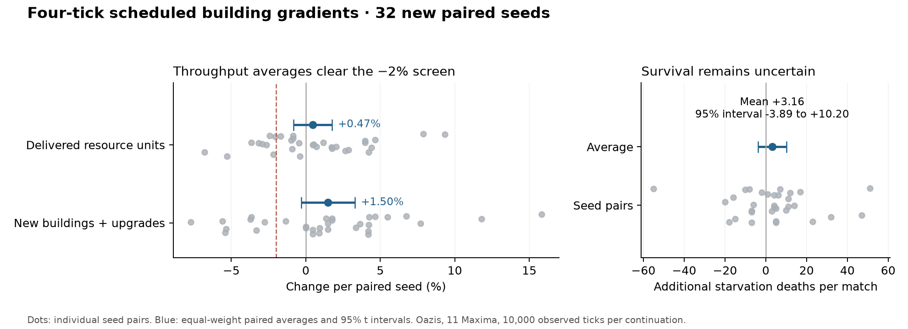

# Building-gradient experiment results

Implemented and measured. This candidate fails the consistent-speedup criterion: the busy and smaller workloads improve, but the mixed workload regresses. The feature remains off by default. Gameplay screening uses 32 independently seeded paired matches; selected discrepancy cases are kept separately.

## Engine performance

Quiet Linux laptop; 2,048 ticks per run, ten balanced paired repetitions per configuration, three checkpoints, delays 2/4/8 and workers 1/2/4, with matching off baselines. All 360 measurements and 36 warmups completed without impact auditing. Confidence intervals cover repeat-run variability on these checkpoints.

Four-tick delay with four workers:

| Workload | Average engine-time reduction | 95% paired-round interval | Tick-loop CPU change | Median p95 tick, off → delayed |
|---|---:|---:|---:|---:|
| Busy | 9.92% | 9.52% to 10.32% | 29.69% | 4.812 → 3.620 ms |
| Mixed | -3.31% | -3.90% to -2.72% | 37.99% | 2.867 → 2.711 ms |
| Smaller | 21.08% | 20.71% to 21.45% | -9.45% | 0.791 → 0.653 ms |

Four ticks/four workers does not clear the 5% speedup criterion across all three workloads. Promotion remains separate; hiring and survival uncertainty also remains.

The CPU increase is primarily broader eager work, not a measured thread-overhead penalty. Across all ten busy four-tick/four-worker runs, tick-loop CPU averages 13.10 → 16.99 seconds. Snapshot capture averages 1.01 CPU seconds and background builds 5.09 CPU seconds, constructing 4,280 walking and 2,425 round-trip fields per run. Deadline waiting averages only 0.51 milliseconds total. The builds replace some synchronous work, so these components cannot simply be added to the baseline. Old queries can stop early; scheduled builds finish whole fields and refresh bundles. Reducing snapshot copying and unnecessary field work is the principal optimization opportunity. Additional workers do not necessarily improve speed; the complete matrix follows.

| Delay / workers | Busy | Mixed | Smaller |
|---|---:|---:|---:|
| 2 / 1 | 9.11% | -7.45% | 16.47% |
| 2 / 2 | 10.51% | -0.73% | 16.98% |
| 2 / 4 | 10.59% | -0.47% | 16.75% |
| 4 / 1 | 10.22% | -6.15% | 20.28% |
| 4 / 2 | 10.58% | -2.63% | 20.96% |
| 4 / 4 | 9.92% | -3.31% | 21.08% |
| 8 / 1 | 8.89% | -4.27% | 12.00% |
| 8 / 2 | 8.76% | -3.37% | 12.42% |
| 8 / 4 | 8.14% | -4.42% | 11.45% |

Scheduling and memory, four ticks/four workers:

| Workload | Peak RSS, off → delayed | Deadline wait, total / p95 per tick | Snapshot / build CPU | Maximum queue buffers |
|---|---:|---:|---:|---:|
| Busy | 505.7 → 505.5 MiB | 0.001 s / 0.001 ms | 1.009 / 5.116 s | 11.62 MiB |
| Mixed | 270.5 → 270.5 MiB | 0.005 s / 0.000 ms | 0.468 / 1.537 s | 6.50 MiB |
| Smaller | 270.5 → 270.5 MiB | 0.001 s / 0.000 ms | 0.083 / 0.325 s | 5.38 MiB |

Synchronous overflow fallbacks across these runs: 0. The machine-speed-independent fallback is covered by dedicated tests.

## Gameplay averages across 32 seeds

Seeds 201–232: Oazis, eleven Maxima players, feature-off warm-up to tick 16,000, then paired off/four-tick continuations for 10,000 ticks. All 64 continuations completed. Each seed has equal weight in the relative changes.

| Measurement | Off mean | Delayed mean | Average paired change | 95% paired-seed interval |
|---|---:|---:|---:|---:|
| Delivered resource units | 7,743.84 | 7,775.34 | +0.47% | −0.81% to +1.76% |
| Completed buildings plus upgrades | 213.84 | 216.84 | +1.50% | −0.32% to +3.31% |
| Starvation deaths | 37.09 | 40.25 | +3.16 deaths | −3.89 to +10.20 deaths |

The average delivery and construction intervals clear the −2% screening margin for this setup. They do not prove an improvement or cover arbitrary maps and AI compositions. Nine seeds lose more than 2% of deliveries; eight lose more than 2% of construction. Starvation remains uncertain. Repairs are counted separately from construction.

## Movement and hiring

The earlier prototype’s four independent audited seeds show completed-trip mean duration +1.20% (95% interval +0.08% to +2.31%). The p95 duration change is +0.44%, with an interval from −3.98% to +4.86%; censored trips remain separate. Worse-direction choices change by +0.021 percentage points, with an interval spanning zero. These audits describe the earlier prototype, not a fresh population audit of the final terrain integration.

Hiring tails remain unresolved. Only 23 missed-hire episodes complete in each audited off/four-tick group; 78/77 are censored. The paired interval for the observed p95 change is −44.6 to +19.6 ticks, so it cannot clear the eight-tick hiring screen.

All 1,630 selected discrepancy records across six workloads are complete. Their paired fresh-field interventions help diagnose specific decisions, but their conditional averages do not estimate typical gameplay effects. They are not pooled with independent-seed statistics.

## Implementation and checks

Refreshes capture immutable inputs at the end of a tick and publish at a fixed later tick. First construction stays synchronous; pending refreshes coalesce without moving their deadlines. Workers use a shared asynchronous executor, and invalid building lifetimes discard results. The 64 MiB limit covers queued field/snapshot buffers; overflow results are spooled privately for the same publication deadline. Published caches, worker scratch and small scheduling metadata are outside that limit.

Native macOS/Linux verification matches all 72 worker/audit configurations and 28 publication-phase save continuations per platform, including per-tick traces and saved bytes. Focused slow-worker, creation-failure, lifecycle, overflow and gameplay fixtures pass. Auditing preserves simulation checksums. Save version 138 keeps the legacy minimum of 58; replay minimum 138, network 56 and SIM revision 15 are explicit compatibility gates.

The full native suites still have external SDK failures: the PNG decoder patch is missing on both SDKs, and Linux has a bundled SDL3_ttf kerning failure. Gradient feature tests pass. Actual browser, Windows and Android execution are unverified. The feature remains off; promotion requires reviewing the unresolved hiring/survival effects and playing it.

## Evidence and reproducibility

[Detailed report and historical cohorts](./building-gradient-detail.md)

[Complete timing statistics](./scheduled-v138-timing-summary.json) · [32-seed statistics](./scheduled-v138-economy-validation-statistics.json) · [Native equivalence proof](./scheduled-v138-final-cross-native-proof.json) · [Selected-case distributions](./scheduled-v135-complete-counterfactual-statistics.json)

Commands, seeds, source/binary hashes, traces and replayable cases remain under ignored artifacts/. The timing/cohort binary is frozen separately from the final replay-gated executable; exact native equivalence checks establish unchanged simulation for the validated configurations. Earlier prototype results remain separate.
