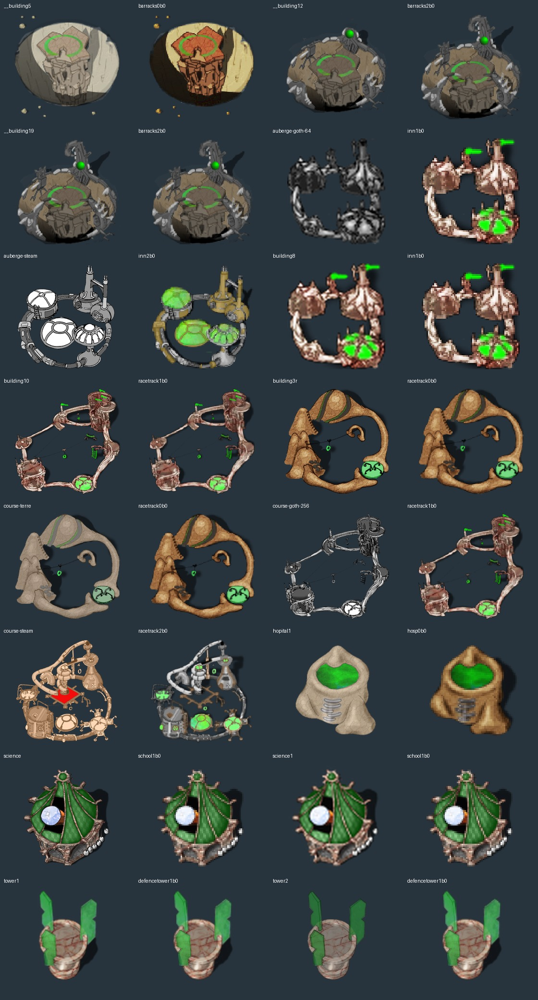

# Visually verified building identities

All 16 recovered building XCFs have been compared with current game sprites, including hidden base/team layers. The family and level match is confirmed; exact state, anchor, layer roles and export settings still require validation. Levels in folder names are human-facing (1–3); runtime suffixes use 0–2.



Each pair shows the recovered source preview on the left and the current classic game sprite on the right. Images are fitted to equal comparison boxes to compare geometry, not to imply equal native resolution. Selected hidden layers are enabled only in disposable previews; no XCF is resaved.

| Historical source | Game reference | Identification evidence |
| --- | --- | --- |
| [__building5.xcf](originals/buildings/barracks/level-1/__building5.xcf) | `barracks0b0` | Terracotta arena, circular court and detached upper-left details. |
| [__building12.xcf](originals/buildings/barracks/level-3/__building12.xcf) | `barracks2b0` | Stone arena, perimeter machinery and rear tower; variant A. |
| [__building19.xcf](originals/buildings/barracks/level-3/__building19.xcf) | `barracks2b0` | Same third-level stone arena and rear tower; variant B. Keep both until registration/state differences are checked. |
| [auberge-goth-64.xcf](originals/buildings/inn/level-2/auberge-goth-64.xcf) | `inn1b0` | Gothic circular enclosure and pointed roof towers. |
| [auberge-steam.xcf](originals/buildings/inn/level-3/auberge-steam.xcf) | `inn2b0` | Three circular vessels linked by pipes and tall rear chimney. |
| [building8.xcf](originals/buildings/inn/level-2/building8.xcf) | `inn1b0` | Hidden base shows gothic inn; visible green flags and lower-right markings match its team layer. |
| [building10.xcf](originals/buildings/racetrack/level-2/building10.xcf) | `racetrack1b0` | Hidden base reveals paired gothic track loops, top-right tower and lower-left enclosure. Green flags/clock match racetrack1, not inn. |
| [building3r.xcf](originals/buildings/racetrack/level-1/building3r.xcf) | `racetrack0b0` | Hidden base and green clock/track markings match earthen racetrack. |
| [course-terre.xcf](originals/buildings/racetrack/level-1/course-terre.xcf) | `racetrack0b0` | Earthen looping track, banked upper-left ramp and lower-right clock. |
| [course-goth-256.xcf](originals/buildings/racetrack/level-2/course-goth-256.xcf) | `racetrack1b0` | Paired gothic track loops, tower and lower-left enclosure. |
| [course-steam.xcf](originals/buildings/racetrack/level-3/course-steam.xcf) | `racetrack2b0` | Mechanical track, overhead pipe and round machinery. |
| [hopital1.xcf](originals/buildings/hosp/level-1/hopital1.xcf) | `hosp0b0` | Earthen hollow hospital with front ladder and pointed top. |
| [science.xcf](originals/buildings/school/level-2/science.xcf) | `school1b0` | Dark tent-like roof, central sphere and surrounding wooden posts. |
| [science1.xcf](originals/buildings/school/level-2/science1.xcf) | `school1b0` | Small counterpart of tent-like school with sphere and team roof. |
| [tower1.xcf](originals/buildings/defencetower/level-2/tower1.xcf) | `defencetower1b0` | Hidden round platform and green upright crystal shapes match second-level defence tower. |
| [tower2.xcf](originals/buildings/defencetower/level-2/tower2.xcf) | `defencetower1b0` | Higher-resolution round platform and hidden green crystal layer match the same second-level defence tower. |

The two third-level barracks sources are retained as distinct variants. A hidden team layer is not a missing building. For example, `building10` initially shows only green markings; its hidden base establishes the second racetrack identity.

Recreate with GIMP 2.10 Python support from the repository root, followed by Pillow:

```sh
gimp-console -n -i -d -f -c --batch-interpreter=python-fu-eval \
  -b 'execfile("tools/artwork/preview_buildings_gimp.py")' -b 'pdb.gimp_quit(0)'
python3 tools/artwork/building_comparisons.py
```
