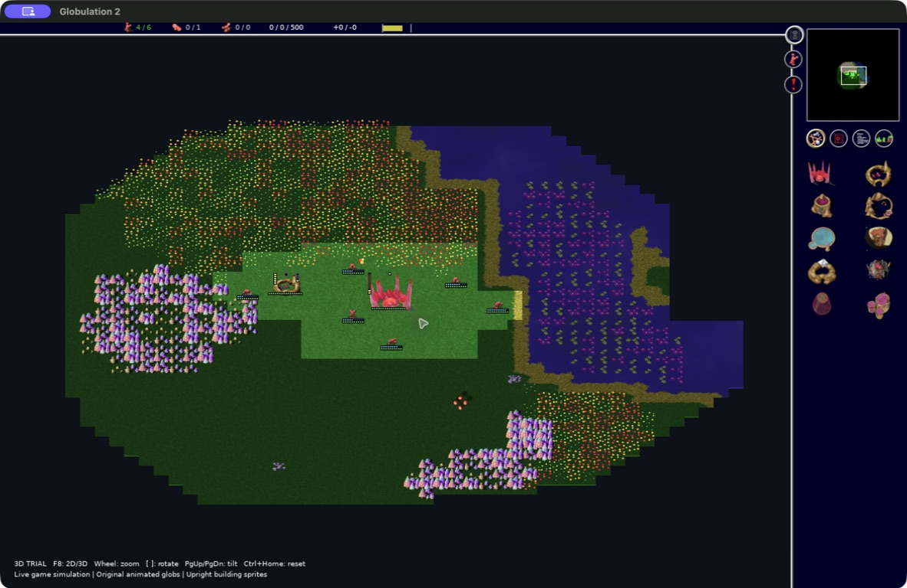
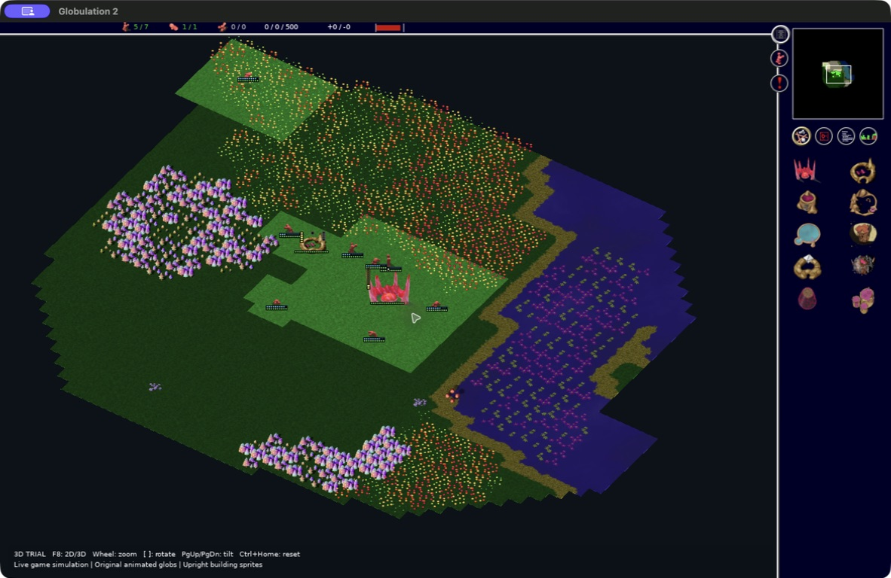

# Playable 3D trial

Branch: `codex/glob-3d`

This experiment adds an optional OpenGL world renderer to the existing C++ game
simulation. It includes animated meshes baked from the original Blender assets,
upright building/resource sprites, camera controls and the original 2D indicators.
The PR is based on current master; unrelated local AI experiments are excluded.

## Screenshots

Captured from the native build on this branch. Unexplored terrain remains dark.

Zoomed out:



Rotated view:



## Run

```sh
scons release=1 -j8 build/src/glob2
./tools/run_3d_trial.sh
```

Use `./tools/run_3d_trial.sh --quick-start` to start a human-versus-Numbi match
on A Big Pond directly. Omit `--quick-start` for the normal menus and Custom Game
setup. The launcher enables OpenGL, starts in 3D mode, and keeps preferences,
saves, logs and replays under `.trial-user/.glob2`. Launching the binary normally
keeps the original 2D view unless toggled. Use `--load games/example.game` to load
a save from the isolated profile.

## Controls

- F8 (or Ctrl+8): toggle the 2D and 3D renderers during the same match.
- Mouse wheel over the world: zoom. The sidebar retains its usual wheel behavior.
- `[` / `]`: rotate the camera.
- Page Up / Page Down: tilt the camera.
- Ctrl+Home: reset the 3D camera.
- I: show/hide building indicators (workers, occupants, food/ammunition and
  health) and unit indicators (carried resource, hunger and health). Counts use
  live game state and the original visibility rules.
- Arrow keys, keypad, edge scrolling and drag panning follow screen directions
  after camera rotation, using the camera's inverse projection.
- Existing selection, construction, flag, area, minimap, and scrolling controls
  continue to use the original order and simulation systems.

Buildings and resources are upright, camera-facing sprites with transparency and
depth testing. Their original team colors and building damage variants are used.
The ground uses the existing terrain tiles, with fog of war and area overlays.
This initial map surface is flat; the camera and objects provide the 3D view.
Building and unit status indicators share the original 2D drawing functions.
Worker slots, occupant counts, food/ammunition and health retain the original
colors, dot spacing, outlines and fill rules. Worker dots sit above the upright
artwork, stock and occupant tracks run along its sides, and health sits at its
base. Unit hunger and health bars use the original style below the model;
carried resources use the original 8px icon above it. There are no floating text
panels or badge backgrounds. Level-up text, magic flashes, unit highlights and
optional team-number labels are also restored. Screen-space dots and icons keep
their pixel size when zooming.

Building and flag artwork sits halfway from its footprint center toward the
camera-facing edge, with previews, indicators and hit bounds following it. The
simulation footprint and flag range stay fixed. Resource anchors remain at tile
centers. Upright artwork uses cached opaque bounds to exclude transparent
padding and faint baked shadows from its pivot. Construction previews, hit
bounds and overhead indicators use the same artwork bounds. Camera motion
retains fractional tile offsets in rendering and picking to keep screen-direction
movement straight between tile boundaries.

Worker walk/swim/harvest, warrior walk/swim/fight, and explorer animation meshes
are baked from the repository's original Blender files. The old sprite-rendering
turntable is removed while the original rig animation is evaluated. There are
16 poses per clip, selected by the simulation's animation phase. Idle uses a
stationary pose; building work reuses the worker harvest clip. Unit heading and
flight altitude come from the live unit state. The metaball topology changes
between poses, so the trial uses per-frame triangle meshes rather than skeletal
skinning. Display lists cache these poses for repeated rendering.

## Rebuild the unit assets

Blender is only needed to rebuild assets, not to run the game:

```sh
blender -b --disable-autoexec --python tools/export_glob_animations.py -- "$PWD"
```

The exporter was run with Blender 3.6.23. Its outputs are `data/models3d/*.g3d`
and a source/frame manifest. Each G3D1 file contains a little-endian frame count,
then per-frame vertex count and float32 position, normal, material RGB and team
color mask for each triangle vertex. Original `.blend` files are not modified.
The renderer accounts for each model's native forward axis: workers/explorers
face -X and warriors face +Y after removing the sprite turntable. This corrects
the reversed harvesting/delivery animation and the warrior heading offset.

## Validation

```sh
c++ -std=c++11 test/World3DCameraTest.cpp -o /tmp/glob2-camera-test
/tmp/glob2-camera-test
c++ -std=c++11 test/World3DPlacementTest.cpp -o /tmp/glob2-placement-test
/tmp/glob2-placement-test
python3 test/World3DAssetsTest.py
```

The OpenGL startup path now checks and releases its context, requests a depth
buffer, and retains master's owned CPU metadata surface for OpenGL windows.
On macOS, individual sprite textures avoid atlas seams.

The native release build against current master passes. Quick-start and loading
a save from its isolated profile were observed running. The camera test passes 6,076 projection,
screen-direction panning and wrapping checks. Heading checks cover both native
model axes in all eight simulation directions. The asset test confirms seven complete, finite animation caches
with 16 frames and changing poses in every clip.

Live validation on the unlocked Mac found and fixed two rendering defects:
the backdrop wrote depth at the terrain plane, producing black bands, and
transparent shore tiles lacked their underlying water layer. Background/water
now render without depth writes, and water retains its original texture scale.
The rebuilt human match was observed running with animated units, camera
rotation and tilt, intact shorelines, and a projected construction preview.
Switching to 2D and back retained the running match.

The placement follow-up puts building artwork halfway from the footprint center
toward the camera-facing edge, shared by buildings and construction previews.
Units use the original integer movement interpolation before choosing their
wrapped map copy; resources use tile-center anchors. Ground shadows identify
the units' ground positions, and the arbitrary 1px ground-unit elevation was
removed. Regression checks cover movement phases, both directions across map
seams, building/flag anchors, and 648 heading/tilt/zoom combinations. The rebuilt
version was observed on the preserved human autosave at default and rotated
camera angles, with construction outlines showing the occupied footprints.

Mouse interaction checks remain pending: automated native clicks did not reach
the SDL window, although keyboard actions did. Selecting a billboard by click,
placing buildings/flags, painting areas, and saving/loading need a manual pass.
Do not treat the rendering checks as complete gameplay validation.

## Scope of this first trial

The simulation, AI, rules, save format, and network orders are unchanged. This is
a visual integration experiment, not a finished 3D renderer. The minimap viewport
box and some old selection/information overlays still use the 2D presentation;
particles, projectiles, and cloud effects are not yet reproduced
in the 3D world pass. Assets have only been built and checked on macOS ARM64.
