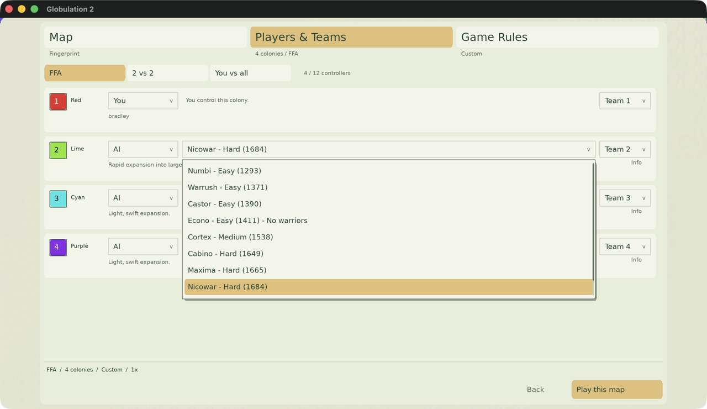

Historical analysis; superseded for UI ratings by [the final duel tournament](ai-strength.md).

# How strong each AI actually is

The difficulty labels in the AI chooser used to be assigned by judgement. This
is what the games say instead.

## Where the numbers come from

A tournament of **2,391 games** — 854 at 1v1, 748 at 2v2 and 789 free-for-all —
drawn uniformly at random over all eight AIs, every map generator and every map
size. 1,475 were decided by the engine; the 916 that ran to the tick cap are
resolved by the economic adjudication the ratings already use.

Strength is fitted by maximum likelihood over the finishing orders
(Plackett-Luce, which is Bradley-Terry when two sides meet) and reported on Elo's
scale, where 400 points is a factor of ten in the odds. See
`tools/tournaments_ai_leaderboard.py`.

| AI | 1v1 | 2v2 | FFA | **Mean** | Difficulty |
| --- | ---: | ---: | ---: | ---: | --- |
| nicowar | 1757 | 1691 | 1604 | **1684** | Hard |
| maxima | 1684 | 1717 | 1594 | **1665** | Hard |
| cabino | 1692 | 1614 | 1640 | **1649** | Hard |
| cortex | 1529 | 1535 | 1548 | **1538** | Medium |
| econo | 1404 | 1393 | 1436 | **1411** | Easy |
| castor | 1349 | 1382 | 1438 | **1390** | Easy |
| warrush | 1361 | 1389 | 1363 | **1371** | Easy |
| numbi | 1224 | 1278 | 1375 | **1293** | Easy |

The fit predicts the winner of a held-in game 76.1% of the time at 1v1 (against
50% for guessing), 71.3% at 2v2, and 55.0% at free-for-all (against 25%).

## Why these tiers

The two widest gaps in the ladder are the **111 points below cabino** and the
**127 points below cortex**. Every other neighbouring pair is within 80. So the
labels are cut at those two gaps, which is why Medium holds a single AI and Easy
holds four — the evidence simply does not put a boundary anywhere else.

Three assignments changed:

- **cabino: Medium → Hard.** It is the third strongest of the eight and beats
  maxima slightly more often than it loses.
- **castor: Medium → Easy** and **warrush: Medium → Easy.** Both sit in the
  bottom cluster; castor has never won a single 1v1 against nicowar.

nicowar and maxima stay Hard, cortex stays Medium, econo and numbi stay Easy.

Because a label is coarse, the chooser also shows the number, so two AIs sharing
one can still be seen to be far apart — econo and numbi are both Easy but 118
points apart, which is a 2-to-1 matchup.

## Raw 1v1 results, for checking

Win rate of the row against the column, so the model above can be checked against
the games rather than taken on faith. 855 one-versus-one games, no draws.

| AI | nico | maxi | cabi | cort | econ | cast | warr | numb | overall |
|---|---|---|---|---|---|---|---|---|---|
| nicowar | – | 0.66 | 0.53 | 0.78 | 0.82 | 1.00 | 0.89 | 0.97 | **0.81** (221) |
| maxima | 0.34 | – | 0.46 | 0.66 | 0.89 | 0.94 | 0.85 | 0.96 | **0.73** (209) |
| cabino | 0.47 | 0.54 | – | 0.68 | 0.85 | 0.90 | 0.79 | 0.92 | **0.75** (222) |
| cortex | 0.22 | 0.34 | 0.32 | – | 0.56 | 0.76 | 0.73 | 0.77 | **0.52** (204) |
| econo | 0.18 | 0.11 | 0.15 | 0.44 | – | 0.45 | 0.60 | 0.76 | **0.35** (202) |
| castor | 0.00 | 0.06 | 0.10 | 0.24 | 0.55 | – | 0.50 | 0.73 | **0.30** (234) |
| warrush | 0.11 | 0.15 | 0.21 | 0.27 | 0.40 | 0.50 | – | 0.66 | **0.34** (211) |
| numbi | 0.03 | 0.04 | 0.08 | 0.23 | 0.24 | 0.27 | 0.34 | – | **0.17** (207) |

The ladder is almost perfectly transitive — every AI beats everything below it
and loses to everything above — with two exceptions worth noting: castor beats
econo (0.55) despite ranking below it, and cabino edges maxima (0.54) despite
ranking below it on the mean. Both are inside what 40-odd games can resolve.

## Why not just report Elo

The leaderboard still reports the iterative Elo rating, but `strength` is the one
to read, for three reasons.

1. **No finite Elo can express a 100% win rate**, and this tournament has one:
   nicowar has never lost a 1v1 to castor. An iterative rating just creeps
   toward it and stops wherever the game count ran out.
2. **It had not converged.** A rating that moves by at most K per game, from a
   1500 start, with a couple of hundred games per competitor, leaves the tails
   pulled toward the middle. The fit uses every game at once.
3. **Elo depends on the order the games were played**; a likelihood does not.

Concretely, iterative Elo spread the 1v1 field over about 490 points where the
fit gives 534. The fitted spread is also insensitive to the ridge penalty across
four orders of magnitude, so it is the data's answer and not the
regularisation's. The ridge is only there to keep an unbeaten competitor at a
finite number.

Even 534 points is a floor rather than a measurement: it implies nicowar beats
numbi 95.6% of the time where the games say 97%. Bradley-Terry has to fit every
pairing with one number per AI, and reality is not perfectly transitive.

## Limits

- These are AI-versus-AI results. Nothing here measures how hard an AI is for a
  *human* to beat, which is what the difficulty label is really claiming.
- The campaign was still running when these numbers were taken; they have moved
  by no more than four points over the last several hundred games, and the
  ordering has not changed at all.
- Strength is averaged over the three formats, which hides real differences:
  cabino is much stronger in free-for-all (1640) than at 2v2 (1614), while maxima
  is the other way round (1594 against 1717). An AI good at surviving a
  four-way is not necessarily good at holding a line with an ally.
- econo never builds warriors at all, so its rating says something different in
  kind from the others: it is how far a purely economic colony gets before
  somebody kills it.

## Related

- [The win probability model](win-probability-model.md) — from the same campaign.
- [Distributed tournaments](tournaments.md) — how the games were run and rated.
