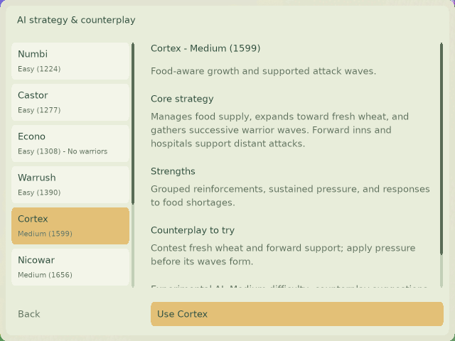

# AI ratings from 20,000 broad duels

The selector displays an order-independent Bradley–Terry fit to **20,000 successful 128×128 duels across 60 compatible generators**. The original 10,000 games are retained and another 10,000 fresh games added. Both batches use source `f2cfcfeb05b39cc17eab43a532ebb551172de8de`, the same binaries/settings, and all five hosts.

| AI | Fitted Elo | 95% paired-bootstrap interval | Difficulty |
| --- | ---: | ---: | --- |
| Maxima | 1857 | 1842–1871 | Hard |
| Cabino | 1689 | 1678–1701 | Medium |
| Nicowar | 1656 | 1645–1666 | Medium |
| Cortex | 1599 | 1586–1611 | Medium |
| Warrush | 1390 | 1377–1401 | Easy |
| Econo | 1308 | 1296–1320 | Easy |
| Castor | 1277 | 1265–1290 | Easy |
| Numbi | 1224 | 1211–1238 | Easy |



All 10,000 paired blocks contain two games with swapped starting sides. Generator totals range from 332 to 336 games. Batch seeds are 20260920 and 20260921; no map seeds or job IDs overlap. Maps use five candidate rolls, a 90,000-tick cap, and probability victory disabled. There are 17,445 engine-decided games and 2,555 prestige-adjudicated tick caps.

Every game has equal weight. Draws score 0.5, ratings have mean 1500 and 400 points per tenfold odds, and there is no K factor or regularization. Input order has no effect. Intervals refit 1,000 bootstrap samples of whole swapped-side pairs within each generator (seed 1), preserving generator quotas. These are sampling intervals conditional on the chosen map mix and adjudication policy; eliminating order weighting does not eliminate model or map-selection bias.

The compatible pool is unchanged: Emoji, Gauntlet, Comb, Encircled Kingdom, Faulted City and Bastion Keys require larger maps or more colonies. Rice Terraces uses `slant=0`; other controls retain defaults. Uniform is editor-only. The Last Treeline arrived after the frozen source and is not included. Pre-play rejected Hilbert River maps are replaced with fresh seeds as complete pairs, retaining the same generator, matchup, binary and settings. Rejected requests, duplicate attempts, smoke tests and older unrelated tournaments do not count.

The selector sorts weakest first, inactive last. Difficulty bands remain below 1450 Easy, 1450–1699 Medium and 1700+ Hard. AI behavior and saved IDs are unchanged. Pooling platform builds does not establish per-tick checksum equivalence.

## Reproduction and evidence

[Summary](validation/ai-elo-20000-20260920/summary.json), [all outcomes](validation/ai-elo-20000-20260920/outcomes.json.gz), [coverage](validation/ai-elo-20000-20260920/coverage.json), [batch-two replacements](validation/ai-elo-20000-20260920/replacements-batch2.json), and [validation](validation/ai-elo-20000-20260920/validation.md) are retained. The [first 10,000-game evidence](validation/ai-elo-10000-20260920/summary.json), including its historical sequential calculation and replacement audit, remains intact.

```sh
python3 docs/validation/ai-elo-20000-20260920/reproduce.py
python3 docs/validation/ai-elo-20000-20260920/test_rating_model.py
```

The model follows the [Bradley–Terry likelihood](https://stat.ethz.ch/CRAN/web/packages/BradleyTerry2/vignettes/BradleyTerry.html). The solver passed analytic tests and an independent optimizer comparison on the first batch. A larger cohort can be added by passing compatible outcome archives to `reproduce.py`; duplicate IDs and incomplete paired blocks are errors. The previous [Symmetric Arena](ai-strength-symmetric-arena-20260919.md) and [mixed-format](ai-strength-20260917.md) studies are preserved but excluded.
