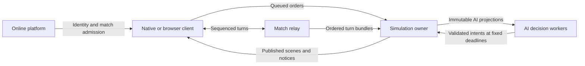

# System overview

Globulation 2 separates deterministic game state from presentation, host services and the online control plane. A colony is a `Team`; a `Player` controls a team, and several players may share one.

The simulation owner is the only authority that changes the match. Clients submit orders and display published results. Background workers calculate from frozen copies of selected state; the owner decides when their results become visible. This keeps game outcomes independent of drawing speed and worker timing.

The platform manages accounts and matches; the relay sequences network turns. The clients run the simulation and render its results.

## Simulation and orders

[Game_sync.cpp](../../src/game/Game_sync.cpp) advances authoritative state. [EngineRun.cpp](../../src/engine/EngineRun.cpp) connects engine timing, orders and clients; [SimulationRunner](../../src/engine/sim/SimulationRunner.h) owns threaded execution. Humans, AI controllers and map scripts produce orders whose delivery is validated by the simulation owner. Worker completion time cannot choose a logical publication deadline.

Units, buildings, teams, resources and maps own their domain state. Map terrain and resource properties feed shared field/pathfinding primitives. [Simulation state](simulation.md) describes those representations; [resource growth](resource-growth.md) describes the deferred ecology pipeline.

## Immutable observations

The game-owned snapshot store captures a union of consumer requirements at a read boundary. AI and gradient workers read immutable projections. Their outputs are published by the owner in stable order. Presentation uses extracted scenes rather than live simulation entities. [AI observations](ai-observations.md) explains retained inputs, compute lanes and deadlines.

## Client and presentation

Simulation/client communication under `src/engine/sim/` uses values, queues and stable entity references. The UI owns input, menus and dialogs; the renderer consumes scenes, view state and assets. Presentation animation and random effects must not alter simulation draws. [Rendering](rendering.md) and the [UI framework](../development/ui-framework.md) describe these contracts.

## Platform services

`GAGCore::ApplicationHost` supplies scheduling, viewport/visibility, file selection, export and persistence. Native and browser implementations preserve that boundary. Browser code owns JavaScript interop and cooperative jobs; shared game code does not include Emscripten APIs. See the [browser overview and decisions](../browser/README.md).

## Persistence and online play

Save capture preserves state and outstanding work at a simulation barrier. Background encoding, atomic replacement and browser durable storage complete separately; failures remain actionable. See [persistence](persistence.md) and [save continuation](../development/savegame-continuation.md).

Online accounts, rooms, ratings and match history live in the TypeScript platform. The relay sequences turns; clients compute their local simulation using an admitted sim version. See [platform architecture](../multiplayer/architecture.md) and [turn protocol](../multiplayer/turn-protocol.md).

## Changing a boundary

Extend the owning domain, update capture/query contracts and test doubles, and build affected harnesses. Verify determinism, continuation and admission boundaries through [simulation verification](../development/simulation-verification.md). Keep presentation caches and diagnostics bounded; never rely on thread scheduling, pointer order or unspecified collection iteration for game outcomes.
