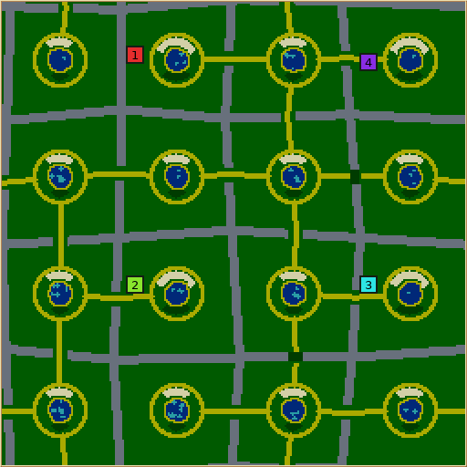

# Breachable highlands: initial evidence

This page preserves the early generator study. For the current revision 4, see
[AI playtesting](playtest/README.md), [bulk generation](bulk-generation/README.md),
and [shared primitives and final verification](framework-refactor/README.md).

Implementation and heuristic explanations:
[design document](../../map-generators/BREACHABLE_HIGHLANDS.md).

## Playable example

[Download the evidence ZIP](playtest-evidence.zip). It contains:

- `breachable-highlands.map`: seed 1, 256×256, four colonies, final defaults.
- A preview and full request/report JSON.
- The 32,000-tick Nicowar replay and its initial save.
- Maxima and Nicowar result summaries for the larger-pond sample.

The Maxima and Nicowar games used the same final sample geography and deposits.
The later saddle-ranking change leaves all non-generation fields of seed 1's
map report identical; its additional telemetry is included in
[sample-report.json](sample-report.json). Saved names can differ.

The image is the production map-preview renderer, not an in-game screenshot.
Final saves and earlier tuning runs are retained locally in
`artifacts/breachable-highlands/`; the ZIP includes the replay needed to inspect
the Nicowar game without those local files.

## Checks performed on macOS ARM64

| Check | Result and evidence |
| --- | --- |
| Final generator matrix | **124/124 successful**, over 28 setting groups; [per-map measurements and source hashes](validation.json) |
| Parameter coverage | Square maps from 128 to 512, both orientations of 128×256 and 128×512, 1/2/4/5/8/12 colonies, 1/4/8 workers, all valley-size choices, control extremes and resource zero/300% |
| Home room | Minimum 460 reachable 4×4 anchors in the measured starting catchment; anchors overlap |
| Destructive contract checks | Removing saddle wood creates an actual shorter route; validators reject missing wood/stone; abundance extremes preserve structure; crowded requests are rejected; [log](contracts.log) |
| Existing and new golden maps | **256 rows compared, zero failures**; existing rows unchanged, eight new macOS rows; [log](golden.log) |
| Telemetry equivalence | **96 cases, zero semantic failures** across the catalog; serialized worlds, outcomes, RNG restoration and repeated records agree with collection off/on; [log](telemetry.log) |
| UI/setup integration | Existing custom-setup harness passed; [log](custom-setup.log) |
| Localization | Strict catalog audit and translation tests passed; [audit](translations.log), [tests](translation-tests.log) |
| Save/load | Loading the sample map and rendering it again produced the same PNG; AI games loaded the generated map and saved checkpoints/final states |

The final matrix uses seeds 30001–30004 for the main variants, 50001–50016 for
held-out defaults, and 50021–50024 for solo/one-worker/long rectangles/intermediate
valley-size checks. Each group's complete resolved parameters and individual
measurements are in `validation.json`. There were no dropped telemetry records.
Saturation at high abundance is intentional: plots stop filling at their boundary
rather than taking the town apron. Invalid-domain and invalid-crowding probes were
kept separately and are not counted as successful matrix cases.

The telemetry timing run observed roughly 79–103 ms with collection off and
74–99 ms on for the three new-generator seeds. Other work was running on this
machine; these are diagnostic timings, not a speedup claim or isolated benchmark.

## AI observations and limits

Both final-default AI samples ran for 32,000 ticks and ended at the tick cap with
all four colonies alive. Maxima ended with 42–58 units and 6–8 buildings per
colony; Nicowar with 12–73 units and 17–19 buildings. The replay and result files
support these observations. Neither run establishes competitive fairness or
successful AI use of wooded saddles.

A paired Maxima comparison of pond radii 4 and 6 improved aggregate population
from 200 to 211 and reduced critically hungry units at the cap from 64 to 44.
That motivated radius 6 as the default. Food pressure remains, and the sample is
one seed rather than a statistically established improvement.

No human playtest, Windows/Linux generator run, or cross-platform checksum
comparison was performed. Simulation rules and serialization formats are unchanged.

## Subsequent playtesting

See the [36-game playtest and tuning report](playtest/README.md) for the later
revision-4 farm layout, matched Linux AI games, cross-platform save checks,
rejected variants and updated artifacts. The files above record the earlier
implementation stage.
