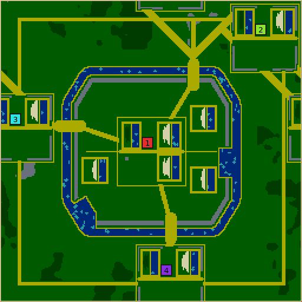
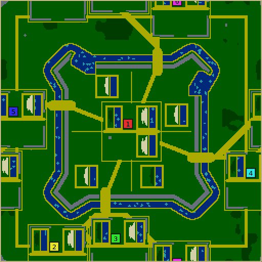

# Encircled Kingdom — design and validation

Colony zero holds a fortified agricultural heartland. The surrounding towns can
coordinate across several land fronts or invest in swimming to bypass the gates.
This is deliberately asymmetric: extra opponents increase the pressure on the
capital. Ordinary units, buildings, alliances and victory rules are unchanged.
See the [generator guide](../../map-generators/ENCIRCLED_KINGDOM.md) for controls,
supported sizes and reproducible generation commands.

## Map views

| Elongated enclosure · 4 colonies | Bastioned enclosure · 6 colonies |
| --- | --- |
|  |  |

[Paired courtyards with twelve colonies](paired-twelve.png) ·
[Played siege at 30,000 ticks](played-siege.png)

The small native previews emphasize terrain and colony positions. Combat evidence
comes from the saved games and simulation counters, not these thumbnails.

## Review and play

An agent reviewed the generator in successive rounds, including a final code review. Revisions added more
usable farm districts, shorter gate crossings, connected town streets, independent
swimming approaches, balanced nearby fronts, an additional capital wheat garden,
seeded expansion plots even at zero abundance, and locally visible starter timber. The landscape review inspected all
three plans at 3, 4, 6 and 12 colonies, including vertical rectangular maps.

The final reviewed three-player game ran 30,000 simulation ticks with Nicowar in
the capital against allied Cortex and Nicowar. The capital finished with 106 units,
23 buildings and 56 worker births, and inflicted 5,659 building damage. All colonies
survived. The outside Nicowar suffered eleven worker starvation deaths, starting
before combat; the capital suffered one. In the preceding route-build siege, the
capital received 5,053 building damage and counterattacked, with both Nicowar
colonies losing buildings. These demonstrate attack and defense, not uniformly
strong AI economies.

The final eight-player repeat reached 25,000 ticks with no worker or warrior
starvation. The previously weak town finished with 51 units, six buildings and 32
wood harvested. All Maxima colonies established six or seven buildings; Cortex
colonies developed more slowly, and no combat occurred. The final twelve-player
opening reached 10,000 ticks without worker or warrior starvation. A preceding
route-build twelve-player game reached 30,000 ticks, with the capital receiving
6,141 building damage and losing seventeen buildings to a coalition invasion.

An earlier three-player siege ended with the capital eliminated after one swarm
and three inns were destroyed. A separate twelve-player all-Cortex game completed
30,000 ticks with every colony alive, but no combat: the capital finished with
88 units and the outer towns with 18–56. Five outer towns suffered late hunger.
The final saves retain contained crops and clear streets and gates.

Opening calibration also compared four-player, 25,000-tick games against Forts
with the same game seed, separately using Nicowar, Cortex, Cabino and Maxima.
These were developmental builds, before the final capital garden and route work;
they establish AI-specific economy checks, not a controlled final balance claim.
Developmental 30,000-tick games cover every colony count from three through twelve;
the final terrain revision is covered by the three-, eight- and twelve-player
checks above. The attached game summary retains each build stage explicitly.

A later large-game audit found a Maxima town whose construction stalled. Its
unfinished inns were located across the map beside an ally, an AI behavior; its
starting wood also fell outside Maxima's local observation radius. The generator
now places 16 tiles of its existing timber budget within 20 tiles of the swarm and
moves the swarm slightly toward the working area. This changes access rather than
adding supplies. The final controlled follow-up is included in the game summary.

## Reliability and controls

The final matrix passed **2,828/2,828 requests**: 624 one-control cases, 2,000
mixed random cases, and 204 extreme cases. It covers all 3–12 colony counts, every supported map
shape, all fortress plans, all individual control values, worker counts 1–8,
abundance extremes and mixed random settings. Previously failing requests are
retained as regressions. Their defects were corrected rather than hidden by
loosening the final validator. This is a broad sampled search across the entire
input range, not an exhaustive Cartesian product of every combination and seed.
An artifact-storage interruption occurred after 1,619 successful requests; the
remaining requests resumed after completed saves were compressed. One request
with an empty measurement file was rerun successfully. The raw log
records both portions of the same ordered matrix.

The one-control study uses eight seeds at 256×256 with four colonies. Gate area,
allocated wheat growth potential, and each resource's tile count are the measured
responses. Every adjacent numeric step must increase its corresponding response
for each seed. Fortress plan is categorical, so no monotonic ordering is implied.
Farmland values are size settings, not percentages; the guide lists actual lengths.

All **536 adjacent-step comparisons** increased strictly; no numeric control had a
dead step across the eight seeds. Endpoint means were:

| Control | Minimum setting | Maximum setting | Measured response |
| --- | ---: | ---: | --- |
| Gate width | 402.25 | 1,207.88 | Crossing tiles |
| Heartland farmland | 1,895,889 | 2,290,425 | Engine growth-potential score |
| Wheat | 332.5 | 1,022.5 | Resource tiles |
| Wood | 129.25 | 10,396.38 | Resource tiles |
| Stone | 2,267.75 | 2,865.5 | Resource tiles, including ramparts |
| Algae | 0 | 1,058.25 | Resource tiles |
| Fruit | 0 | 47.25 | Cherry tiles, representative of each fruit type |

The capital's total food potential and connected building opportunity exceed those
of each single outer town. Front assignment uses actual initial walking terrain;
nearby food potential includes harvestable crop ground. The latter was checked at
0, 100 and 300 wheat abundance with identical results for unchanged farmland.
These measurements describe opportunities, not guaranteed victories. The full
contract suite passed and additionally checks resource growth after 4,096 growth steps,
rejection of deliberately damaged maps, and telemetry-on/off determinism.

## Performance

A macOS sampling profile identified repeated layout construction during generation
and validation. The generator now uses the existing request-keyed design cache,
which preserves named random-stream state and telemetry. Validation still checks
the actual finished map. No shared helper or existing generator was changed. The non-forced golden update
verified all 448 existing macOS fingerprints unchanged and added eight rows for
this generator; the other 440 platform rows remain untouched.

| Measurement | Before | After |
| --- | ---: | ---: |
| CPU time, 100 identical randomized requests | 21.41 s | 18.47 s |
| CPU time, 512×512 / 12 colonies, eight seeds, mean | 567 ms | 522 ms |

The first row is the native generation fixture, about **14% less CPU time**.
The second includes CLI startup and saving the map; Forts averaged 1,223 ms under
the same CLI conditions. Wall time varied with concurrent validation jobs and is
retained in the raw logs rather than presented as a stable speedup. Before/after
saved-map SHA-256 hashes were identical for all 129 retained and representative
requests. The full parameter matrix is repeated against the optimized build.

## Reproduction

From the repository root:

```sh
scons release=1 server=0 -j8 build/src/glob2 \
  build/src/MapGeneratorDefaultsTest build/src/MapGeneratorGoldenTest \
  build/src/MapGeneratorProfileFixture
build/src/MapGeneratorDefaultsTest kingdom-contracts
build/src/MapGeneratorGoldenTest kingdom-golden --require-rows
python3 data/check_translations.py
python3 test/test_translations.py
```

The [evidence archive](evidence.tar.gz) contains parameter requests/results, analysis scripts,
review summaries, representative maps and played saves, game results, and profiling
records. Extract the archive at the repository root; it restores selected files under
`artifacts/encircled-kingdom/`. Gameplay logs in the archive retain the measured
telemetry lines used by the analysis; full diagnostic logs remain in the larger
local working collection. `game-provenance.json` distinguishes developmental
from final-terrain games. Starting maps, the final three-player save, and
per-team results make those observations inspectable without frozen executables.
The larger eight- and twelve-player final saves remain in the local working
collection as `timber-8/final.game.gz` and `final-twelve/final.game.gz`.

```sh
tar -xzf docs/artifacts/encircled-kingdom/evidence.tar.gz
python3 artifacts/encircled-kingdom/parameter-study.py
python3 artifacts/encircled-kingdom/analyze-parameters.py
python3 artifacts/encircled-kingdom/reviewer-r4/analyze_play.py
```

The parameter harness defaults to `build/src/glob2`; `GLOB2_BINARY` overrides it.
Profiling logs record 100 rounds at seed `20260919`. The uncached comparison used
the same source with only `design()` returning `buildDesign(r, c)` directly.
`benchmark-final.py` expects that baseline saved as `final-uncached-build` in the
artifact directory. Executables are intentionally excluded from the archive.

## Limits

AI playtests and visual inspection do not establish human enjoyment or competitive
balance. A maintainer should play colony zero using the existing **You vs all**
preset. Late hunger in some outside AI economies remains an observed limitation.

Twelve-player Nicowar crashes in an existing enemy-team iterator; the same failure
was reproduced on Forts. It is outside this map-only change. Maximum-player tests
use Cortex and Maxima instead. The generator still supports twelve colonies.

Labels were translated and reviewed by a separate agent across all 33 catalogs;
the strict catalog audit and translation regression tests pass. Native-speaker
review and in-game RTL/layout checks were not performed. Generator diagnostics
remain English, consistent with the existing diagnostic display path.

Validation was run on macOS arm64. No Linux/Windows simulation-checksum parity is
claimed. No save format, replay acceptance, network version, existing generator,
AI, or simulation rule is changed. The final three-player save was loaded and continued from
tick 30,000 to 30,512 successfully.

## Integration with master

The generator was assigned numeric ID **62** when merging with master, where
The Gauntlet had already taken ID 59. The stable ID remains `encircled-kingdom`.
The archive records the original development IDs and source snapshot. When using
its numeric headless commands on the merged build, replace this generator's 59
with 62; existing saved terrain can be loaded directly. Post-integration checks
are recorded separately below.
