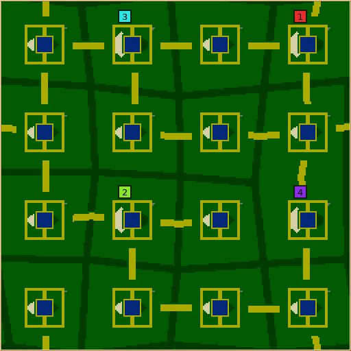
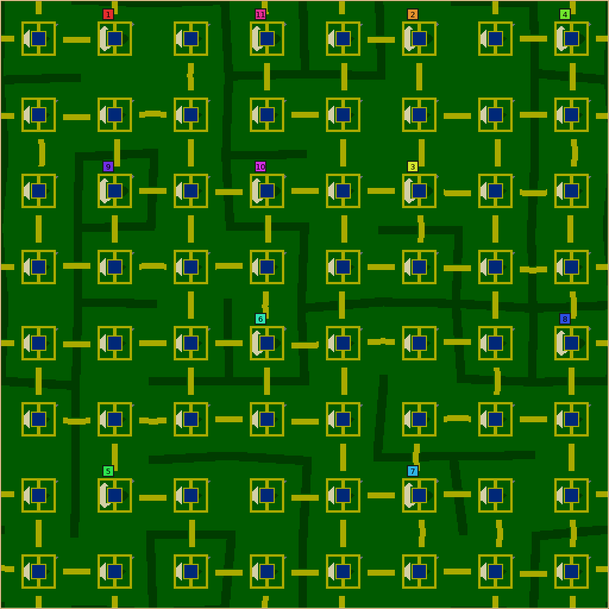
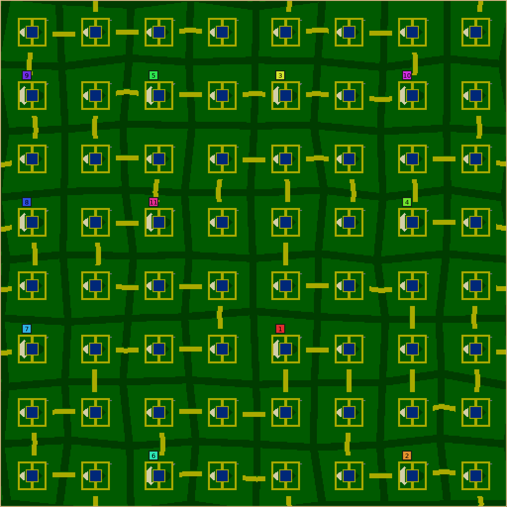

# Hedgerow Country review evidence

These are native map-preview captures, not in-game camera screenshots. Each image
has its exact request/report in the adjacent JSON and a gzip-compressed saved map.
Dark green marks wooded boundaries, yellow marks sand lanes and farm containment,
blue marks ponds, and numbered colors mark colony starts.

## Default layout

256×256, four colonies, seed 19, default controls (revision 6).



## Large stress case

512×512, eleven colonies, seed 4132429259. This fresh-seed case exercised the
shared boundary-clearance repair; the hedge thickness and designed openings remain.
See `large.json` for all controls.



## Known balance limit

512×512, eleven colonies, seed 510294. This revision 5 preview is retained as the
inspected baseline outlier. The final revision also passes construction checks but
still gives a weakest/strongest exclusive walking-territory ratio of 0.135.
Connected roads and starting supplies do not imply equal expansion opportunities.



## Included measurements

- `baseline-*` and `final-*`: complete bulk request plans and per-request screened
  results, summaries, and outliers. JSON plans/rows are compressed to keep the
  review bundle small. Final results are 2,098 supported successes and 133 correct
  rejections, including 512 fresh supported seeds.
- `contractions.json`: all twelve repaired final-build requests; each needed one
  contraction. `paired-verification.json` compares recorded metrics by request.
- `playtest-results.json.gz`: all 80 accepted AI-match records, with configuration,
  seeds, build identities and native result summaries. `playtest-analysis.json`
  retains the opening/late-window analysis. These earlier generator revisions
  were used for economy tuning; they do not certify every revision 6 layout.
- `baseline-results-sample.replay.gz` and `candidate4-results-sample.replay.gz`:
  a before/after Nicowar matchup, map seed 7, game seed 41, rotation 0, four players,
  60,000 ticks. Both reached the cap; neither is claimed as a win.
- Test logs, translation audit, source/bundle identity, and artifact hash-check
  summaries accompany the results. `SHA256.json` covers the packaged evidence.

The complete worker spools, executable bundles, source snapshots, all game
checkpoints/checksum streams and other raw telemetry remain in the original
`artifacts/hedgerow-bulk/` and `artifacts/hedgerow-fairness/` study directories;
those larger archives are **not included** in this compact checked-in bundle.
The hash audit describes those archives, not a claim that every audited file is
published here. See the [bulk report](../../map-generators/HEDGEROW_BULK_VALIDATION.md)
and [playtest report](../../map-generators/HEDGEROW_PLAYTEST.md) for scope and limits.

## Open a retained map or replay

From the repository root, decompress a copy outside this evidence directory:

```sh
gzip -dc docs/artifacts/hedgerow-country/default.map.gz > /tmp/hedgerow-country.map
build/src/glob2 --preview-map /tmp/hedgerow-country.map --output /tmp/hedgerow-country.png

gzip -dc docs/artifacts/hedgerow-country/candidate4-results-sample.replay.gz > /tmp/hedgerow-country.replay
```

Load the decompressed map or replay in the game. No save-format or simulation
change accompanies this optional generator. Windows and cross-platform per-tick
simulation equivalence were not tested, and human balance review remains needed.
