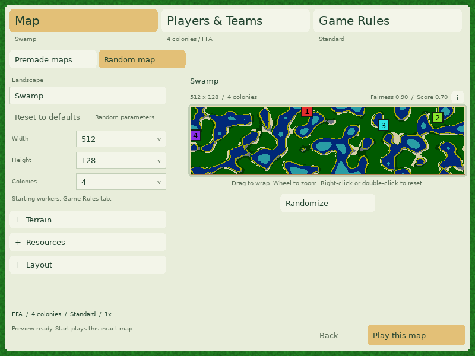
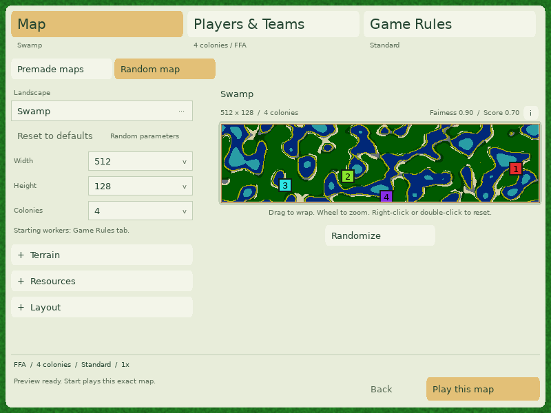

# Pre-game preview review evidence

These captures and logs were produced on macOS/Apple Silicon with an optimized
client build. Software rendering was checked at 800x600 and 1600x1000; the custom-game UI suite was exercised at 640x480 and 1000x700 in OpenGL. The changed thumbnail/databank sources
compiled with `server=1`. This is not a full server build or a live old-client/new-
server session. Linux and Windows executions are delegated to the PR's CI jobs.

## Integration with the generator upgrade

Rebased onto `4c16a8406` (the repository's default branch is `master`).
The asynchronous landscape picker, candidate ranking, start-quality details,
parameter controls, and exact selected-seed handoff are retained. Picker tiles
now consume unpadded high-resolution pixels and cache their scaled raster.

`generator-defaults.log` covers the generator framework and control contracts;
`generator-golden.log` compares all 248 macOS/arm64 golden rows;
`generator-sweep.log` records the landscape/size/colony sweep. These are local
checks, not cross-platform simulation checksum evidence. `translations.log`
records the strict catalog check; new localized help still needs native-speaker
review.

`custom-ui.log` and `custom-ui-large.log` cover the integrated picker and lobby.
The marker assertions now account for centered, seam-repeated markers and the
outer frame. The picker edit test enlarges rather than shrinks its chosen map,
so it does not violate Rain Shadow's minimum home spacing.

The geometry regression checks that fitting an already fitted rectangle is
idempotent, including the narrow 38x309 and 11x89 cases. Native wheel events
check that the map coordinate under the pointer remains unchanged on zoom.

## Look and interaction





`generated-wide.map` is the exact generated map behind these two images. The
harness also compares the displayed terrain bytes with a fresh thumbnail loaded
from that launch snapshot. The random generator was not seeded for this capture;
use the retained map to reproduce the terrain, rather than rerolling it.

`custom-wide-large.png` shows a separate 4:1 map at 1600x1000. `landscape-picker.png` shows the upgraded picker. `custom-colonies.png` shows existing FourSquares1. `wide-zoomed.png` is the
synthetic zoom fixture. `online-loading.png` and `online-failed.png` show the
shared widget's online states, driven locally by the harness, not a public YOG
connection. Pixel assertions require visible green/blue terrain and their
exchange after dragging, in addition to producing screenshots.

## Regressions and measurements

`regression.log` records the codec, geometry, request/cache and disposable-profile
checks. Decode-error diagnostics in that log are intentional corrupt-input
fixtures. `visual.log` includes native input, screenshot, local cache invalidation
and generated-snapshot checks. `custom-ui.log` records the existing OpenGL setup
regression. `baseline.log` reproduces the original missing-file loaded flag and
measures the original header + Game + thumbnail selection path.

| Operation on the retained FourSquares1 copy | Time |
| --- | ---: |
| Original pipeline, 20 selections | 196.438 ms |
| New pipeline, first uncached selection | See `timings.txt` |
| New pipeline, 20 cached selections | See `timings.txt` |

The fixture is a byte-identical copy of `maps/FourSquares1.map`. These are single
local diagnostic runs with a warm filesystem cache, not a general frame-rate or
large-map benchmark. The old pipeline uses the original thumbnail implementation
from `a9c5c13118eabb910a1055f9baa417bf5513aa92`, linked to the pre-rebase engine objects. This historical baseline predates the generator upgrade; it is not a new cross-version generator benchmark.
`Baseline.cpp` is the complete measurement driver. To reproduce it:

```sh
python3 docs/artifacts/map-preview/reproduce-baseline.py
```

The script builds the current harness, obtains its compile/link commands with a
SCons dry run, and compiles the original thumbnail in a temporary directory under
a different class name. It does not replace working-tree source files. The
recorded original missing-file result is `isLoaded=1`; the new regression requires
`isLoaded=false` and zero dimensions.

To repeat the new measurements and native captures:

```sh
scons -j6 release=1 server=0 map-preview-test custom-setup-test
python3 test/run-savegame-safety-tests.py --check-preferences build/src/MapPreviewHarness
./build/src/MapPreviewHarness glob2-map-preview-tests --visual artifacts/map-preview
./build/src/CustomGameSetupHarness
mkdir -p artifacts/custom-game-preview
./build/src/CustomGameSetupHarness artifacts/custom-game-preview
```

Candidate selection and landscape thumbnails use the upstream worker threads. Final snapshot generation and first uncached loads still execute on the main thread. This PR
removes redundant reads and caches completed selections; it does not claim that
large-map generation can no longer stall the UI. Save/replay/network versions and
simulation algorithms are unchanged. Cross-platform simulation traces were not
run for these view-only changes.
