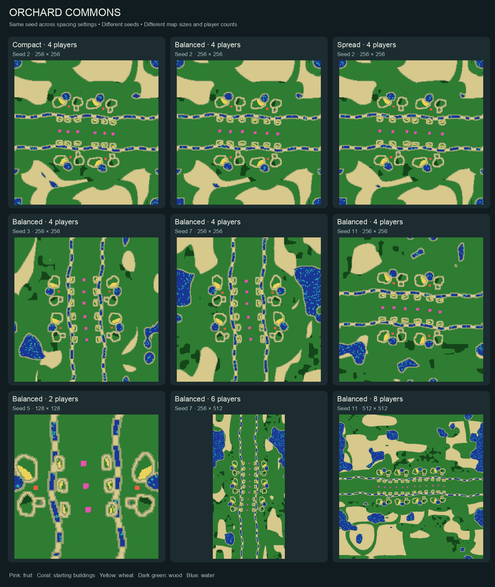
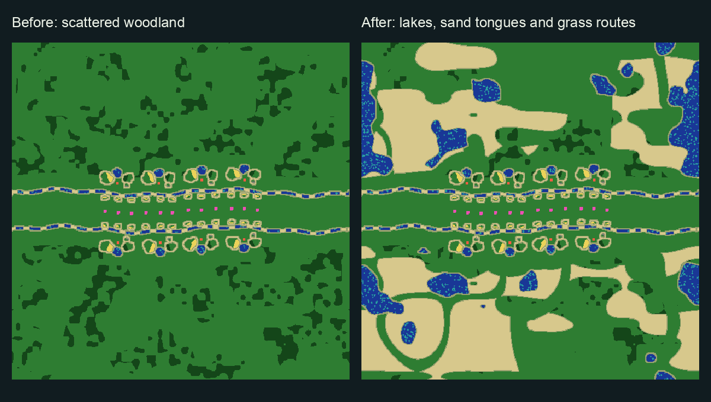
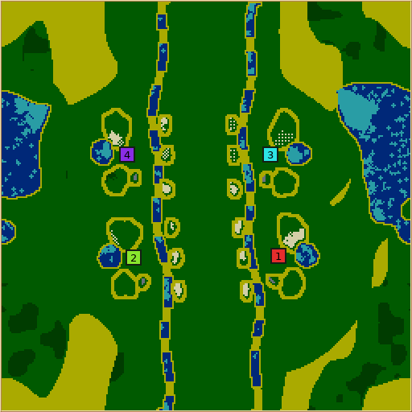

# Orchard Commons: concept and validation

Orchard Commons makes fruit variety a shared objective. Separate cherry, orange and prune groves sit between colonies; nearby wheat and open inn clearings support competing advertised diets. Homes supply survival, while gaining another fruit variety requires reaching the commons. Advertising, wheat supply, capacity and ordinary conversion eligibility still matter. The map grants no inns and changes no unit, building or economy rules.

## Landscape



The first row compares Compact/Balanced/Spread on seed 2. The middle row varies seeds. The bottom row varies dimensions and colony counts. Pink is fruit, coral is starting buildings, yellow is wheat, dark green is wood, blue is water, and pale sand is open travel ground. These are actual generated tile dumps, with each full map fitted into its panel; native thumbnails omit fruit.



A compact orchard front keeps larger maps from stretching the opening march. Outside it, irregular lakes, sandy tongues and winding grass swales create landmarks and optional flanks. Swales exclude ambient woodland and offer potential building shoulders. Sand itself is unbuildable. Terrain fades away from farms and the commons; small maps may omit these optional features.

## Supported requests and controls

- Two to eight colonies; power-of-two sides from 128 to 512, aspect ratio at most 2:1. Five or more colonies require both sides at least 256.
- Orchard spacing: Compact, Balanced, Spread. Wheat/wood/stone/algae/fruit amounts: 0–300% in 25% steps.
- Guaranteed home supplies and six fruit tiles per grove remain at 0%. Default groves request 24 tiles; maximum 60, subject to legal grass. Each grove contains one variety. Algae has no fixed floor.
- Final-map checks cover colony connectivity, 8×8 inn courts, access from multiple colonies, future crop-safe approaches and flanking loops, renewable gathering frontage, building room and fruit containment. First fruit is 24–48 walking steps from usable swarm exits; first and nearest-per-variety access differ by at most 25% among colonies.

## Final generation results

| Check | Result |
|---|---|
| Control/default/extreme cases | 369/369 passed |
| Mixed random requests, seeds 100000–102999 | 3,000 total; 659 explicitly unsupported |
| Supported requests, initial seed | 2,293/2,341 passed (97.95%) |
| Supported refusals through actual five-candidate lobby selection | 48/48 succeeded |
| Golden snapshots, macOS arm64 | 448 rows compared, zero failures; eight new ID 58 rows |
| Conversion and generation harness | Five mechanism scenarios and generation contracts passed |
| Translation validation | Strict audit, five regression tests and font-coverage test passed |

Refusals retain the seed and parameters, and do not loosen fairness/room checks. Successful lobby retries are reported separately from initial-seed reliability. The earlier sparse-landscape version also passed a separate 1,000-seed held-out study and a 56-case worker-count matrix; those are not claimed as final-landscape measurements.

Mean resource tiles over four fixed 256²/four-colony seeds, varying one control at a time:

| Control | 0% | 100% | 300% |
|---|---:|---:|---:|
| Wheat | 288 | 488 | 873.5 |
| Wood | 112 | 1394.5 | 3952 |
| Stone | 16 | 28 | 52 |
| Algae | 0 | 380.5 | 981.75 |
| Fruit | 12 | 48 | 120 |

Fruit counts in the table are per variety. Every 25% step strictly increases its corresponding mean. Stone scales the map-wide extra budget before distributing it, avoiding dead steps from per-quarry rounding. Orchard spacing changes actual nearest-grove distance; neighboring groups mean Spread is not a uniform dilation.

## Playtesting and review

The controlled harness puts two legal inns on unmodified generated ground and uses real game ticks. Superior advertised variety converts a worker; equal friendly diet, disabled advertising, lost fruit advantage and lost wheat prevent it. Full-save repeatability, telemetry neutrality, terrain/resource save-load preservation and 11 invalid requests are also checked. Loading rebuilds the existing conversion cooldown; the harness explicitly matures eligibility after loading and does not claim immediate continuation equivalence.

Four earlier cyclic rotations ran 45,000 ticks each with Nicowar, Cortex, Cabino and Maxima (map seed 2, game seed 19). Nicowar delivered all three fruit varieties and gained 12/17/24/69 workers across those games. Cabino also converted workers without fruit delivery, so aggregate conversion totals do not establish fruit causation. An eight-colony 30,000-tick game and a matching Hedgerow reference game provide additional earlier evidence.

The final landscape ran a matched 45,000-tick before/after game on seed 7 with the same four AIs and game seed 19. Final worker births were 30/26/36/35. Nicowar was eliminated at tick 26677; the other three survived to the cap. Algae access remained reachable, but delivery and upgrade timing changed; Maxima delivered no algae in the final run. This terrain is not claimed to be balance-neutral.



The inspected final save keeps farms contained and the central commons open. Review went through repeated rounds with the same map reviewer, plus a fresh landscape-design review and separate translation/CI-harness reviews. Feedback produced stronger competitive access checks, odd-colony distribution, varied farms, then lakes, directional sand and tree-free swales. Final reviewers requested no further implementation changes. Their review does not replace human play assessment.

## Performance and compatibility

Profiling identified repeated weighted searches in the access validator; the shared unit-cost BFS retained their semantics. A fixed three-size corpus produced byte-identical maps before/after that optimization. The sparse map fell from observed 198–258 ms to about 113 ms at 512²/eight colonies. Final richer terrain averages **168.022 ms telemetry off / 167.717 ms on**, 60 runs each, zero failures. These are local wall-time observations; machine load differed between earlier measurements.

The addition is optional: existing generators and core simulation are unchanged, with no save/replay/network version bump. The new harness is wired into Linux and Windows CI; actual results are reported by the PR checks. New golden rows here are macOS measurements, not inferred Linux hashes. Cross-platform per-tick equivalence and human enjoyment remain unverified.

## Evidence and reproduction

[Downloadable maps, saves, logs, request matrices and manifest](https://github.com/Globulation2/glob2/tree/8802f37da1030c47abb6da1981fd994363814438). The evidence commit is separate from implementation history and includes final maps/requests, all final sweep rows and retry records, final game and conversion saves, earlier rotation logs/results, and per-file hashes. Some bulky earlier final saves are omitted; final candidate and rotation 3 saves are retained. Start with `country-update/README.md` inside the archive.

```sh
scons release=1 server=0 -j8 build/src/glob2 orchard-conversion-test map-generator-defaults-test map-generator-golden-test
build/src/OrchardCommonsConversionTest orchard-check "$PWD" "$PWD/artifacts/orchard-check"
build/src/MapGeneratorGoldenTest orchard-golden --require-rows
python3 .agents/skills/glob2-map-design/scripts/control_study.py orchard-commons ablation --seeds 4 --jobs 2 --out /tmp/orchard-study
python3 .agents/skills/glob2-map-design/scripts/control_study.py orchard-commons random --count 3000 --jobs 6 --out /tmp/orchard-study
build/src/glob2 --generate-map --generator 58 --map-seed 7 --param teams=4 --param width=8 --param height=8 --write-map true --report terrain --output-dir /tmp/orchard-map
build/src/glob2 --run-game --map-file /tmp/orchard-map/map-r0.map --game-seed 19 --player nicowar --player cortex --player cabino --player maxima --ticks 45000 --save final --telemetry team-timeline --output-dir /tmp/orchard-play
```

Use fresh output directories; generation refuses to overwrite completed results. See [generator design](../../map-generators/ORCHARD_COMMONS.md) and [test documentation](../../../test/README.md#orchard-commons-fruit-conversion).
