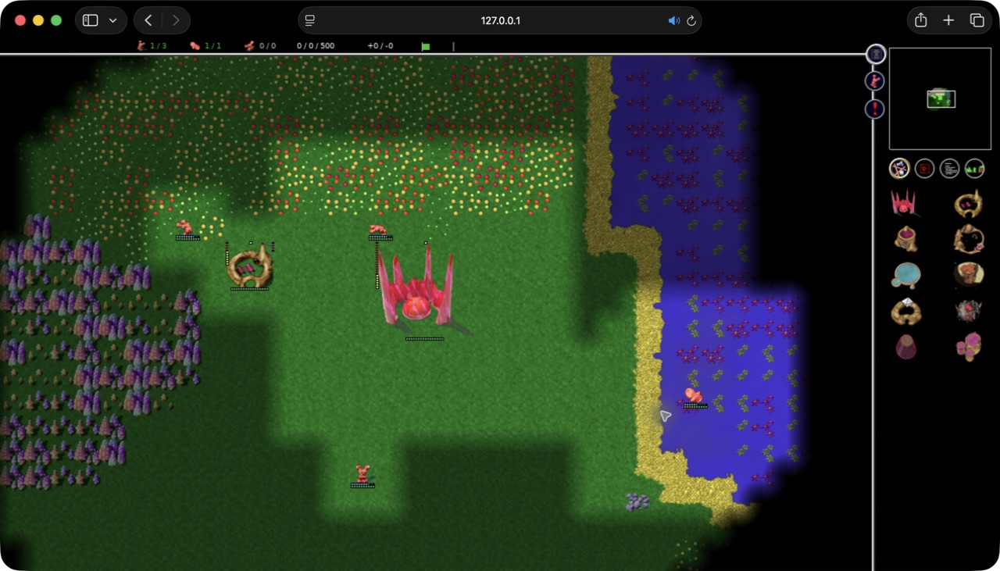

# Safari manual smoke check — 2026-09-08

Tested implementation: `15986f936` (checkout `c7c534b8d`).
Browser: installed **Safari 26.6.2**, macOS arm64. This was the actual Safari app,
operated through its UI, separate from Playwright's WebKit engine.
URL: `http://127.0.0.1:18770/?renderer=webgl2`.

## Observed results

- The full-page main menu rendered inside Safari's normal browser window.
- Custom game → A big pond → OK started a live match with the two default Numbi
  opponents. Units moved and the population changed during observation.
- Escape opened the in-game menu. Save game accepted the name `Safari smoke`
  through keyboard input and completed back to gameplay.
- Safari's toolbar Reload returned to the main menu. Load game listed
  `Safari smoke`, displayed its map preview, and successfully resumed gameplay.
- With the game menu open, dragging the right window edge reduced the captured
  window from 1280 to 1080 pixels wide. Rendering and the menu followed the new
  width. Clicking Quit the game at its new position reached the end-game screen.
- No missed map or menu clicks were observed in this run.

## Full-window captures

These are genuine Safari window captures, including browser chrome. No browser
frame was composited onto the game. They contain only local test data.

[Restored save](screenshots/safari-window-restored-save.jpg) ·
[Resized game menu](screenshots/safari-window-resized-menu.jpg)

## Scope and limitations

This is a manual smoke check of one installed Safari version, not the full
current/previous-major release matrix. WebGL2 was requested in the URL; the
actual backend was not independently inspected through Safari developer tools.
The automated renderer tests separately assert backend selection in their
supported engines. No FPS, memory, checksum, audio-output or performance claims
are inferred from these screenshots.

The toolbar reload path was verified. A keyboard reload attempt while the canvas
was focused did not reload; browser shortcut handling remains an interaction
item to investigate, rather than a verified Safari shortcut pass. This run did
not cover quota exhaustion, context loss, clipboard, export permissions, hidden
tabs, long campaigns or multiplayer in Safari. The named test save remains in
this Safari profile's local store.
