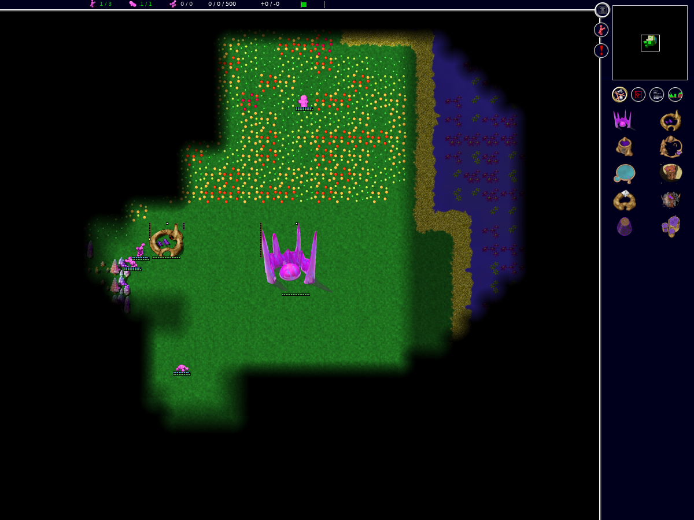

# Implementation status

Browser support remains experimental. This ledger distinguishes delivered
infrastructure from the supported-release acceptance criteria.

## Delivered in this branch

- Shared SCons source manifests and native/web configuration isolation,
  including generated headers, compilation databases, objects, caches,
  signature databases, temporary directories, and build-directory locking.
- SDK revision selection and checksummed Emscripten ports, including Boost.
- Native desktop, headless lobby, headless router, WebSocket gateway, and
  browser build entry points. The headless router defaults to a local lobby;
  `GLOB2_YOG_HOST` selects another private lobby.
- Shared injectable byte transports: native TCP/WSS and browser WebSocket, with
  transport-independent framing, bounded queues, malformed-input rejection, and
  greetings queued during connection establishment. Browser YOG login now reaches
  a native server through the gateway in integration tests. Successful account
  login and lobby exit are covered; the browser uses YOG chat without the optional
  native IRC bridge. Passwords are redacted from authentication message formatting.
- Real-control multiplayer tests create, join, ready, and start YOG rooms,
  then compare browser/browser order checksums. A native headless client records
  250 ticks for comparison with browser checksums at command boundaries.
- A bounded fixed-backend gateway with origin checks, backpressure,
  health/metrics endpoints, and real TCP/WebSocket integration tests.
- A development Compose deployment with private lobby/router/gateway services,
  Caddy HTTPS/WSS routing, persistent volumes, and container health checks.
  The lobby supports explicit external-router mode; desktop/LAN keeps the
  embedded router default. Empty router pools refuse room creation safely.
- An explicit native/browser application-host boundary for transitional
  waits and diagnostics. No forced SDL delay macro or sleep inside rendering.
- Explicit screen begin/update/input/draw/finish phases, with a legacy host-loop
  wrapper and automated lifecycle/completion tests. An owning screen stack
  now drives campaign selection, custom setup/options, load/replay selection,
  single-player sessions, and end-game transitions with retained ownership.
  The outer application update API is shared by native polling and scheduled
  browser callbacks. The map editor also uses explicit input/update/draw phases
  and an owned save-before-quit prompt. Nested editor/network dialogs and loaders
  still need migration.
- Incremental engine session phases with host-supplied timing, separate drawing,
  and delay calculation. Gameplay accepts explicit input batches and tracks
  held input from events, clearing it on focus loss. Modal handling, application
  visibility, and loading remain transitional.
- Bounded, cancellable fertility jobs with staged results and an explicit commit.
  Editor overlay/save actions run them through a scheduled progress screen;
  cancellation preserves unsaved edits. Old-format cooperative loading also uses the job; file serialization and durable
  storage remain transitional.
- Explicit cooperative game/map loading jobs and a cancellable editor-entry
  loading screen with staged ownership and RNG restoration. Terrain chunks and
  team parsing yield; the shared 8-bit helper gradient sweeps can also yield; other expensive operations and loading
  callers still need migration and latency validation. Single-player startup
  (custom/save/replay/campaign) now owns the engine in a cancellable loading
  screen, including replay cleanup and error transitions. In-editor replacement
  retains the current map until a new one loads successfully; cancellation and
  failure preserve its unsaved edits.
- Explicit generation seeds and per-instance noise state, removing generation's
  libc RNG/time reseeding and shared-noise interference. All nine native generation
  fixtures match synchronous and scheduled execution after unrelated RNG/noise
  activity. Editor generation uses an owned cancellable preparation screen with
  RNG restoration and error transitions. Height-map noise, stamps, placement searches,
  and normalization now yield through nested jobs with owned temporary arrays and
  instance-local stamp state. Concrete-islands/isles distance floods, point spacing,
  weighted area expansion, player-land partitioning, point collection/filtering,
  resource filling, oval creation, and area scoring also use nested jobs.
  Upstream resource and area gradients remain lazily constructed.
  Building-specific gradients and other long terrain operations still need subdivision;
  cross-platform generation parity is not yet certified.
- Shared measured loading/generation slices with an injectable steady clock,
  a four-millisecond target, and a 64-checkpoint cap. Deterministic tests cover
  elapsed-time stopping, completion, oversized steps, and a frozen clock.
- Saved-team parsing yields while loading units, buildings, and their links.
  The preparation game owns partial teams throughout cancellation and failure.
- A maintained, dependency-locked Playwright suite with real input and
  read-only diagnostics, plus CI failure traces.
- A replay-stall fix: measure the waiting-player mask after local orders are
  inserted, so filtered replay null orders cannot leave a stale waiting flag.

- Frame-boundary software viewport resizing for scheduled single-player menus,
  matches and the editor, including camera-center tiles, minimap hit regions,
  centered overlays and an in-game minimum-size notice. See [the contract and
  remaining limitations](viewport.md).

## Local validation

After isolating browser work and rebasing onto upstream `master` (`88934ecf`),
on macOS arm64 in September 2026:

- Desktop and release Wasm builds succeed from the same checkout.
- Nine build identity/architecture tests, seven native WSS tests, eight gateway
  tests, and shared framing/native TCP round-trip tests pass.
- Native session/loading/cancellation tests pass, including matching 50-tick
  checksums under regular callbacks, delayed callbacks, and the screen stack.
- Upstream save-safety and weighted-gradient tests pass. Binary-string tests
  now cover embedded zero bytes, which occur in persisted password hashes.
- All 42 single-player browser scenarios pass across Chromium, Firefox, and
  WebKit after fixing an empty-gradient refresh loop on the first loaded tick.
  The native save-safety harness also covers ticks before any lazy gradient
  has been requested. Loading/error translations use the required paired-line
  format so the progress screens display their messages.
- Both Compose deployment tests pass after the binary-string fix: trusted
  HTTPS/WSS, private routes, account persistence across recreation, router-loss
  refusal, and admission after restart.
- All 18 default multiplayer scenarios pass across Chromium, Firefox, and
  WebKit: protocol/login and lobby flows, browser/browser matches without AI
  and with Cortex, and browser/native 250-tick command-boundary checksum
  comparisons through both TCP and verified WSS. The native peer ran on macOS
  arm64; this is not the complete cross-platform per-tick release matrix.
  The six upstream AIs are retained unchanged. The optional all-AI suite still
  needs rerunning after isolation; no Maxima or tournament changes are included.
- `screenshots/native-cross-play.png` is refreshed from the post-rebase
  Chromium/native TCP test.

After the subsequent rebase onto `f50ab27ac`, desktop and Wasm builds, all 42
single-player scenarios, nine build-system checks, native session/resize tests,
and current/version-88/version-84 team-statistics save fixtures pass. All 15 viewport scenarios also pass across Chromium, Firefox and WebKit, with
reviewed screenshots in `screenshots/resized-game-menu.png` and
`screenshots/minimum-viewport.png`. Earlier
multiplayer and deployment results above have not yet been rerun at this revision.

These are focused regressions, not a complete campaign, AI, deterministic
cross-platform, or supported-browser certification matrix.

## Still required for the supported release

1. Complete dependency archive verification and reproducible release gates
   on all supported native toolchains.
2. Complete editor/network/modal transitions, resumable/cancellable loading,
   and removal of Asyncify from the scheduled browser host.
3. WebGL2 rendering and context restoration, resize in remaining legacy flows,
   complete gesture/layout qualification, focus/visibility behavior, and browser interaction handling.
4. Transactional persistence with durable completion and failure states,
   quota handling, and validated import/export for all local data types.
5. TLS-only internet connection policy, native trust-store qualification, compatible protocol handshake,
   bounded protocol parsing, and deterministic browser/native cross-play.
6. YOG guests/accounts, invitations, room controls, password migration, and
   coordinated 120-second checkpoint-based recovery with fault injection.
7. Versioned self-hosting distribution, TLS deployment tests, backup/migration,
   draining/rollback, operations documentation, and performance/soak gates.

Short cross-play tests do not establish sustained determinism across native
platforms. Reconnect, WebGL2, durable-save failure recovery, and stable browser
support remain outstanding.

## Immediate delivery focus

Deliver the missing multiplayer and self-hosting features next. Single-player
is already playable; further refactoring must resolve a concrete release blocker.
Next delivery work is the upgraded handshake, secure endpoint configuration,
identities/rooms, and coordinated recovery.
Rendering, lifecycle, durable storage, and removal of Asyncify remain acceptance
gates for the supported release, not reasons to keep expanding preparatory work.

## Gameplay evidence

Chromium during the browser/native integration match on macOS arm64. This
screenshot illustrates the full-page client; the automated checksum assertions,
not the image, establish the short cross-play result above.

