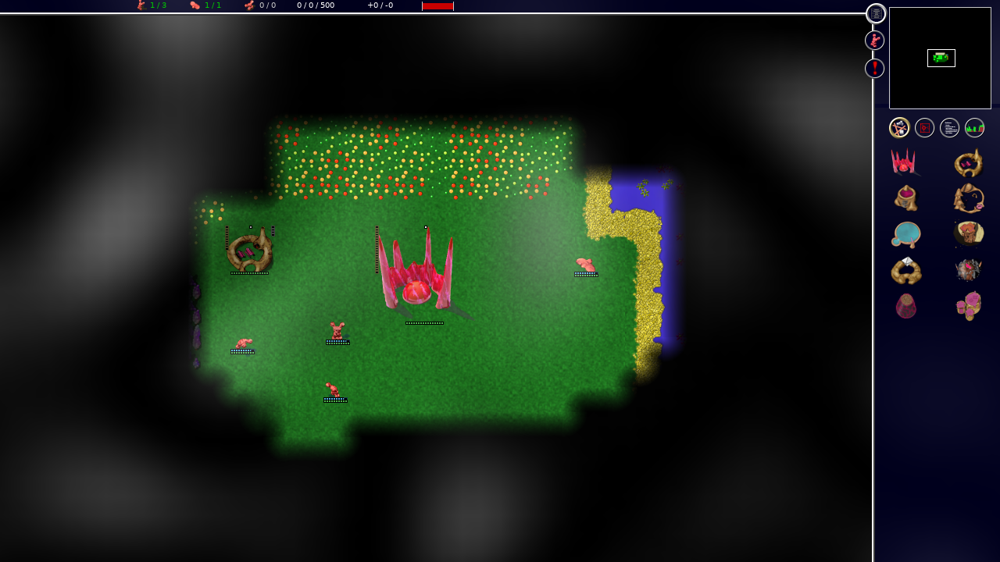
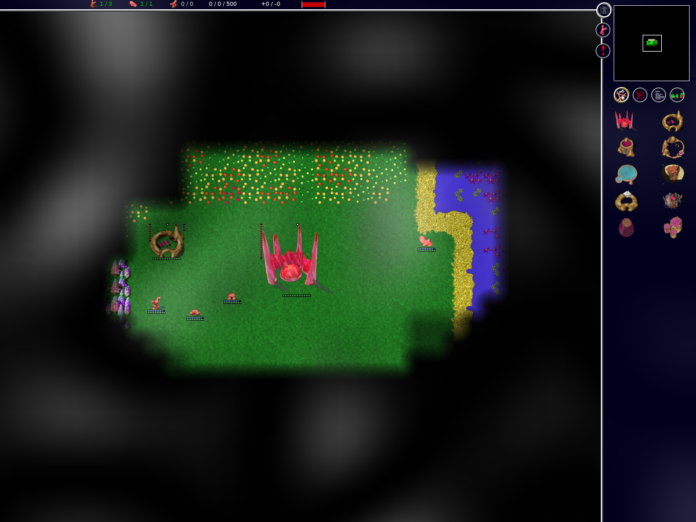
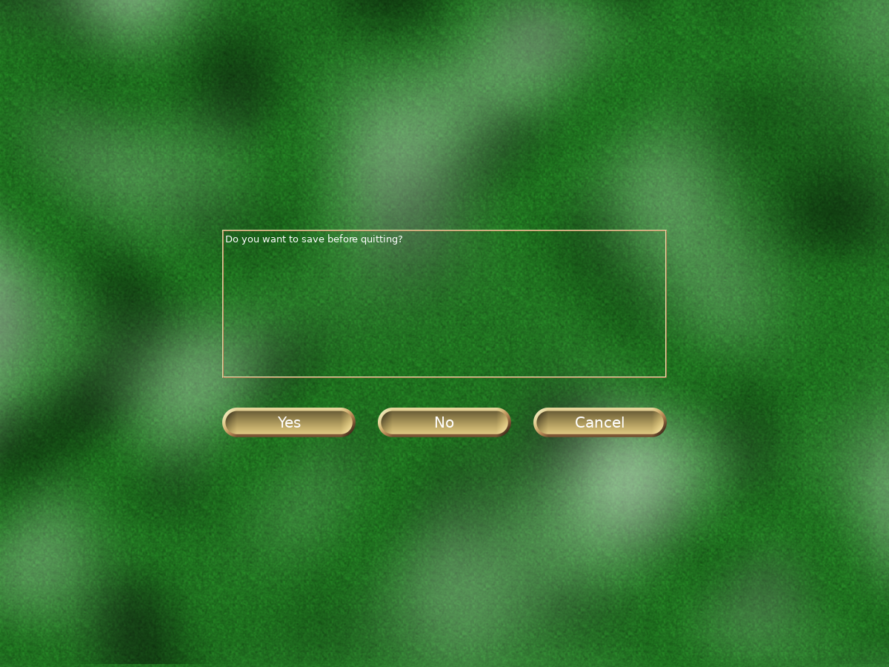
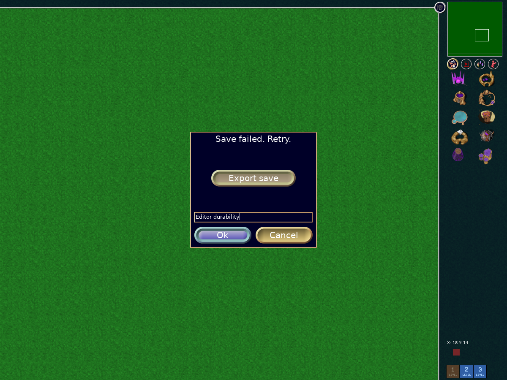
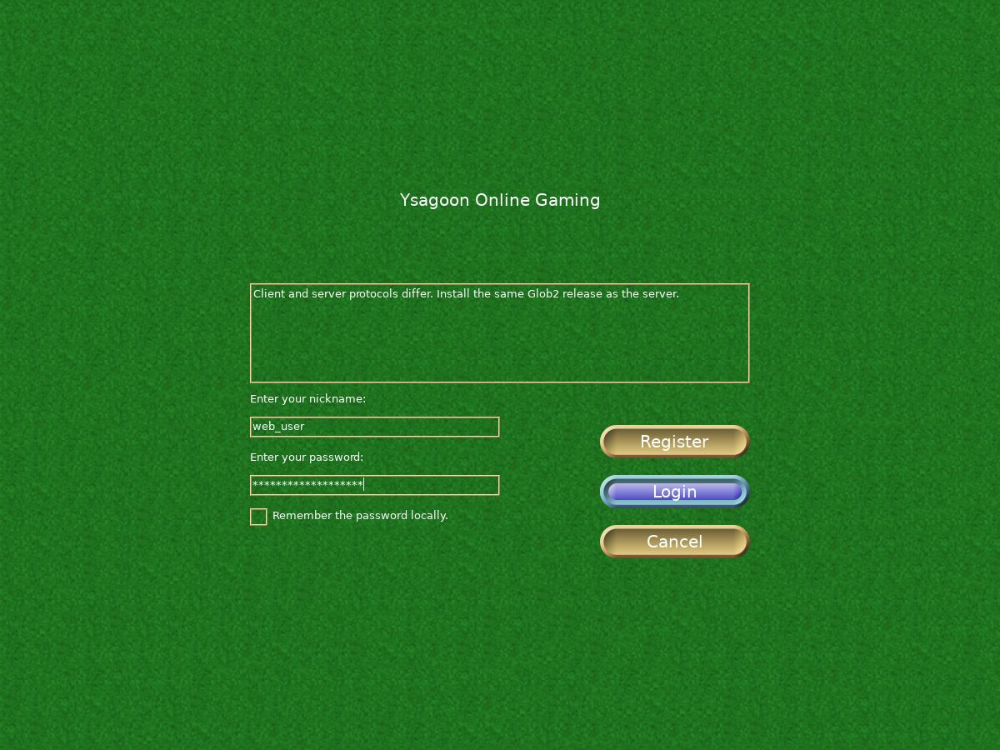
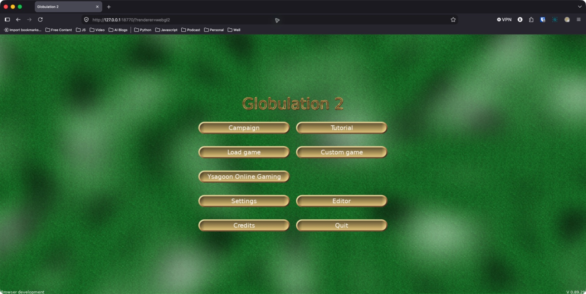
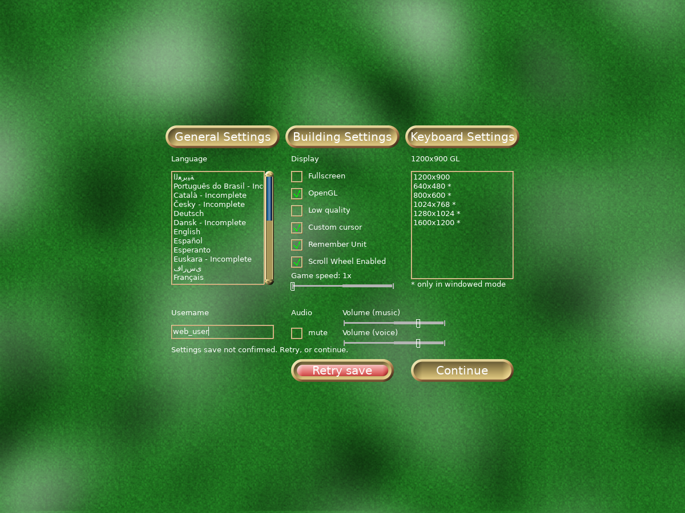

# Implementation status

Browser support remains experimental. This ledger distinguishes delivered
infrastructure from the supported-release acceptance criteria.

## Current single-player milestone

The browser game is playable end to end. Campaigns/tutorials, custom matches,
AI, the map editor, full-page resize, WebGL2 and software rendering, context
restoration, saves/replays/maps import/export, campaign-progress backups and
settings persistence are implemented. The sections below retain dated evidence;
an older unchecked release gate does not mean its implementation is missing.

This closeout addresses final persistence on application Quit and campaign
creation/editing. Both use the shared host persistence interface and keep the
interface alive until completion. Failed writes remain visible and retryable.

The next single-player release decisions are qualification: actual Safari/Edge,
controlled GPU performance baselines, and remaining focus/input coverage.
Asyncify removal still requires migrating legacy dialogs (particularly YOG/LAN
and rare error paths). It does not require rebuilding the ordinary single-player
screen flow. Abrupt tab/process termination cannot guarantee a final write.

The original full-platform release also requires substantial multiplayer work:
guests/invitations, account migration, richer compatibility negotiation and
120-second checkpoint recovery. Basic cross-play already works. Those features
and production deployment qualification must not be described as delivered.

## Delivered in this branch

- In-game save/map/replay import and export use a browser file-selection
  adapter and a shared C++ validation/persistence job. Complete input is read
  before an atomic write; name collisions create numbered copies, preserving
  existing files. The chooser waits for durable persistence, offers export and
  retry on failure, and supports cancellation while validating. See
  [browser files](storage.md) for behavior, boundaries and remaining work.
- Map headers use checked binary reads, reject unsupported versions, negative or
  excessive team counts and invalid saved-game flags, and retain the previous
  header if parsing fails. Malformed player records now fail loading instead
  of invoking a constructor assertion. Validation is shared by desktop/browser.
- Shared SCons source manifests and native/web configuration isolation,
  including generated headers, compilation databases, objects, caches,
  signature databases, temporary directories, and build-directory locking.
- SDK revision selection and checksummed Emscripten ports, including Boost.
- Native desktop, headless lobby, headless router, WebSocket gateway, and
  browser build entry points. The headless router defaults to a local lobby;
  `GLOB2_YOG_HOST` selects another private lobby.
- Shared injectable byte transports: native TCP/WSS and browser WebSocket, with
  transport-independent framing, bounded queues, malformed-input rejection, and
  greetings queued during connection establishment. Browser YOG login now reaches
  a native server through the gateway in integration tests. Successful account
  login and lobby exit are covered; the browser uses YOG chat without the optional
  native IRC bridge. Passwords are redacted from authentication message formatting.
- Real-control multiplayer tests create, join, ready, and start YOG rooms,
  then compare browser/browser order checksums. A native headless client records
  250 ticks for comparison with browser checksums at command boundaries.
- A bounded fixed-backend gateway with origin checks, backpressure,
  health/metrics endpoints, and real TCP/WebSocket integration tests.
- A development Compose deployment with private lobby/router/gateway services,
  Caddy HTTPS/WSS routing, persistent volumes, and container health checks.
  The lobby supports explicit external-router mode; desktop/LAN keeps the
  embedded router default. Empty router pools refuse room creation safely.
- An explicit native/browser application-host boundary for transitional
  waits and diagnostics. No forced SDL delay macro or sleep inside rendering.
- Explicit screen begin/update/input/draw/finish phases, with a legacy host-loop
  wrapper and automated lifecycle/completion tests. An owning screen stack
  now drives campaign selection, custom setup/options, load/replay selection,
  single-player sessions, and end-game transitions with retained ownership.
  The outer application update API is shared by native polling and scheduled
  browser callbacks. The map editor also uses explicit input/update/draw phases
  and an owned save-before-quit prompt. Nested editor/network dialogs and loaders
  still need migration.
- Incremental engine session phases with host-supplied timing, separate drawing,
  and delay calculation. Gameplay accepts explicit input batches and tracks
  held input from events, clearing it on focus loss. Modal handling, application
  visibility, and loading remain transitional.
- Bounded, cancellable fertility jobs with staged results and an explicit commit.
  Editor overlay/save actions run them through a scheduled progress screen;
  cancellation preserves unsaved edits. Old-format cooperative loading also uses the job; file serialization and durable
  storage remain transitional.
- Explicit cooperative game/map loading jobs and a cancellable editor-entry
  loading screen with staged ownership and RNG restoration. Terrain chunks and
  team parsing yield; the shared 8-bit helper gradient sweeps can also yield; other expensive operations and loading
  callers still need migration and latency validation. Single-player startup
  (custom/save/replay/campaign) now owns the engine in a cancellable loading
  screen, including replay cleanup and error transitions. In-editor replacement
  retains the current map until a new one loads successfully; cancellation and
  failure preserve its unsaved edits.
- Explicit generation seeds and per-instance noise state, removing generation's
  libc RNG/time reseeding and shared-noise interference. All nine native generation
  fixtures match synchronous and scheduled execution after unrelated RNG/noise
  activity. Editor generation uses an owned cancellable preparation screen with
  RNG restoration and error transitions. Height-map noise, stamps, placement searches,
  and normalization now yield through nested jobs with owned temporary arrays and
  instance-local stamp state. Concrete-islands/isles distance floods, point spacing,
  weighted area expansion, player-land partitioning, point collection/filtering,
  resource filling, oval creation, and area scoring also use nested jobs.
  Upstream resource and area gradients remain lazily constructed.
  Building-specific gradients and other long terrain operations still need subdivision;
  cross-platform generation parity is not yet certified.
- Shared measured loading/generation slices with an injectable steady clock,
  a four-millisecond target, and a 64-checkpoint cap. Deterministic tests cover
  elapsed-time stopping, completion, oversized steps, and a frozen clock.
- Saved-team parsing yields while loading units, buildings, and their links.
  The preparation game owns partial teams throughout cancellation and failure.
- A maintained, dependency-locked Playwright suite with real input and
  read-only diagnostics, plus CI failure traces.
- A replay-stall fix: measure the waiting-player mask after local orders are
  inserted, so filtered replay null orders cannot leave a stale waiting flag.

- Frame-boundary software viewport resizing for scheduled single-player menus,
  matches and the editor, including camera-center tiles, minimap hit regions,
  centered overlays and an in-game minimum-size notice. See [the contract and
  remaining limitations](viewport.md).

- Browser visibility changes suspend scheduled screens, discard held gameplay/editor
  gestures, and reset the single-player timing baseline on return. Native hosts
  retain their visibility policy. A dedicated real-window Chromium test disables
  Playwright focus overrides and checks hidden/visible transitions, suspended
  ticks, resumption without catch-up, and working input afterward. This does not
  implement coordinated multiplayer suspension.

- In-game manual saves use the shared checked atomic-write helper instead of
  overwriting the destination directly. A write failure retains the prior file
  and keeps the save dialog open with an error. Native short-write/flush failure
  regressions and all three browser save/reload scenarios pass. This protects
  filesystem replacement; durable completion is covered by the persistence flow below.

- Browser persistence uses a serialized coordinator instead of the SDK queue
  that drops persistence errors. Generation-specific completion promises wait
  for their write callback, failures remain observable, and failed restore
  prevents later writes from replacing unrestored data. Four injected-adapter
  tests and all three browser save/reload tests pass. Completion/failure UI,
  quota fault injection and recovery/export are covered below.

- Manual in-game save dialogs retain an owned platform persistence operation,
  show a saving caption while pending, close only after success, and remain open
  with an error on failure. Native injected completion-state tests and browser
  save/reload tests across all three engines pass. Quota/error injection and
  export recovery are covered below; other legacy persistence callers remain.

- Six browser database-boundary fault tests pass across Chromium, Firefox and
  WebKit: aborted transactions and injected quota errors preserve the previous
  durable save (verified from another page), then retry persists the replacement
  across reload. The short failure caption is visually checked in
  `screenshots/save-persistence-failure.png`. These are injected faults, not a
  full browser-profile capacity or interrupted-upgrade qualification.

- Failed browser manual saves offer an in-game download of the retained file.
  Export reads through the shared filesystem interface, bounds allocation to
  64 MiB, and passes bytes to the browser host. All six abort/quota scenarios
  verify the downloaded filename and byte digest, preservation of the old
  durable save, and successful retry. Campaign-progress handling is covered below; explicit messaging for
  oversized simulation-file exports remains unfinished.

- Failed browser storage restoration opens an in-game explanation before the
  menu. Players may continue with persistence disabled and export manual saves,
  then reload to retry restoration. Three database-open failure scenarios pass
  across Chromium, Firefox and WebKit, including no write retries while restore
  is failed and a successful fresh restore. The notice screenshot is checked.

- The browser load-game chooser offers normal export of its selected save or
  replay through the shared bounded file-export helper. Three save/export/load
  scenarios pass across Chromium, Firefox and WebKit, verifying exact downloaded
  bytes. This earlier export coverage is extended by the import flow above.
  Campaign-progress support is covered below. Native build and session checks pass.

## Campaign-progress support

- Browser campaign/tutorial menus import and export versioned progress backups.
  Validation matches mission definitions and merges completion/unlock state
  without removing current progress. Legacy text saves remain compatible.
- Campaign saves use checked atomic replacement. Menus wait for browser
  persistence, expose retry and backup export on failure, and restore previous
  bytes (or remove a newly created file) when the user discards a failed save.
- Twelve campaign backup/persistence scenarios and nine existing campaign,
  tutorial and editor-menu scenarios pass across Chromium, Firefox and WebKit.
  Native client/Wasm builds and the expanded native save-safety harness pass.
  The format and tradeoffs are documented in [browser files](storage.md).
  Review screenshots: [restored progress](screenshots/campaign-progress-import.png)
  and [persistence failure with recovery controls](screenshots/campaign-persistence-failure.png).

## Import-flow verification (September 2026)

- Twelve import/export scenarios pass across Chromium, Firefox and WebKit:
  saved-game round trips and continuation, duplicate-name preservation, malformed
  input rejection, custom maps, complete replay command streams, and quota
  failure/export/retry. Save tests explicitly select and verify filenames; an
  initial test accidentally exported an autosave and was corrected.
- The existing 75 single-player, storage, viewport and rendering scenarios pass
  across the three engines. The first run passed 52 before the local HTTP server
  began returning empty replies; all 25 WebKit scenarios passed after restarting
  that server. Multiplayer was not rerun for this import change.
- Native client and release Wasm builds succeed. The native save-safety harness
  covers complete imports, malformed headers/player records/map offsets,
  cancellation, RNG and preference preservation, and persistence failure/retry.
  Eleven browser adapter unit tests and nine build-system tests pass.
- Review screenshots: [save import](screenshots/imported-save.png),
  [map import](screenshots/imported-map.png), and
  [persistence failure](screenshots/import-persistence-failure.png).

## Local validation

After isolating browser work and rebasing onto upstream `master` (`88934ecf`),
on macOS arm64 in September 2026:

- Desktop and release Wasm builds succeed from the same checkout.
- Nine build identity/architecture tests, seven native WSS tests, eight gateway
  tests, and shared framing/native TCP round-trip tests pass.
- Native session/loading/cancellation tests pass, including matching 50-tick
  checksums under regular callbacks, delayed callbacks, and the screen stack.
- Upstream save-safety and weighted-gradient tests pass. Binary-string tests
  now cover embedded zero bytes, which occur in persisted password hashes.
- All 42 single-player browser scenarios pass across Chromium, Firefox, and
  WebKit after fixing an empty-gradient refresh loop on the first loaded tick.
  The native save-safety harness also covers ticks before any lazy gradient
  has been requested. Loading/error translations use the required paired-line
  format so the progress screens display their messages.
- Both Compose deployment tests pass after the binary-string fix: trusted
  HTTPS/WSS, private routes, account persistence across recreation, router-loss
  refusal, and admission after restart.
- All 18 default multiplayer scenarios pass across Chromium, Firefox, and
  WebKit: protocol/login and lobby flows, browser/browser matches without AI
  and with Cortex, and browser/native 250-tick command-boundary checksum
  comparisons through both TCP and verified WSS. The native peer ran on macOS
  arm64; this is not the complete cross-platform per-tick release matrix.
  The six upstream AIs are retained unchanged. The optional all-AI suite still
  needs rerunning after isolation; no Maxima or tournament changes are included.
- `screenshots/native-cross-play.png` is refreshed from the post-rebase
  Chromium/native TCP test.

After the subsequent rebase onto `f50ab27ac`, desktop and Wasm builds, all 42
single-player scenarios, nine build-system checks, native session/resize tests,
and current/version-88/version-84 team-statistics save fixtures pass. All 15 viewport scenarios also pass across Chromium, Firefox and WebKit, with
reviewed screenshots in `screenshots/resized-game-menu.png` and
`screenshots/minimum-viewport.png`. Earlier
multiplayer and deployment results above have not yet been rerun at this revision.

These are focused regressions, not a complete campaign, AI, deterministic
cross-platform, or supported-browser certification matrix.

## Still required for the supported release

1. Qualify reproducible builds and same-checkout coexistence across supported
   native toolchains; the isolated build architecture and CI jobs already exist.
2. Finish legacy modal migration and remove Asyncify. Ordinary single-player
   uses the shared screen stack and cooperative loading/generation jobs already.
3. Qualify GPU performance, actual Safari/Edge versions, and remaining focus,
   audio/clipboard and input cases. WebGL2, live resize and context restoration
   are implemented and have cross-engine regression coverage.
4. Complete the persistence audit for legacy writers and destructive operations,
   malformed-file fuzzing, and backup/export coverage for custom campaign
   definitions. Game/editor saves, imports, progress, settings, campaign authoring
   and orderly Quit now wait for durable storage. Failed destructor-only local
   writes and abrupt browser termination remain limitations.
5. Add capability/simulation/data-hash negotiation, complete per-room protocol
   authorization and secure endpoint policy, and qualify sustained all-AI/native
   platform cross-play. Exact protocol admission and short cross-play are tested.
6. Implement YOG guests, invitations, account credential migration and coordinated
   120-second checkpoint recovery with fault injection.
7. Qualify versioned self-hosting releases, backup/migration, draining/rollback,
   operational metrics, performance and soak gates. Development Compose exists.

## Immediate delivery focus

Close concrete single-player defects and collect release evidence on the
existing implementation. Keep the PR reviewable and distinguish implemented
features from qualification gaps. The full multiplayer/recovery release remains
a separate substantial delivery stage within the original plan.

## Gameplay evidence

Chromium during the browser/native integration match on macOS arm64. This
screenshot illustrates the full-page client; the automated checksum assertions,
not the image, establish the short cross-play result above.

## WebGL2 renderer milestone

The browser now provides actual WebGL2 GPU drawing using `?renderer=webgl2`,
with software fallback when unavailable. Software remains the default because
initial GPU performance and full-suite qualification are unresolved. The existing
2D GPU renderer is shared with desktop through the pinned Emscripten compatibility
layer; see [ADR 006](adr-006-webgl2-rendering.md) for that delivery compromise and
its maintenance costs. Texture initialization and atlas normalization fixes also
keep the native non-rectangle texture path valid.

The rendering suite verifies real custom-game controls, drawing-buffer resize,
software selection, and two context-loss/restoration cycles without restarting
the match. All 93 default-suite scenarios pass in Chromium, Firefox and WebKit
on macOS arm64, including the dedicated opt-in WebGL cases. The 15 viewport
scenarios also pass with WebGL selected explicitly; one Chromium cold-start
timeout passed on a focused rerun. The startup allowance now accommodates cold
texture creation on headless software GPUs. The assertions remain unchanged.
Both native and Wasm clients build, all nine build-system tests pass, and the
native session harness passes. A fresh current-build WebGL run passes all 22
Chromium single-player, viewport and rendering scenarios, including the earlier
editor-load and startup-cancellation deadline failures, without changing their
deadlines. Complete cross-browser GPU qualification, controlled performance
baselines and actual Safari/Edge release testing remain open.

The settings/editor/confirmation context-restoration scenario also passes in
Chromium, Firefox and WebKit. It restores the real context three times and
verifies the retained controls can still cancel or complete the dialog.

## Editor save durability

Map-editor writes now use checked atomic replacement and retain the save dialog
until durable persistence succeeds, including Save before quit. Quota and
transaction failures provide retry and export without losing the open editor.
Six new failure/export/retry scenarios and six existing editor save/cancellation
scenarios pass across Chromium, Firefox and WebKit. Native client/Wasm builds,
the native save-safety harness and the expanded native session harness pass.
The native regression checks save/reload and preservation of live metadata when
replacement fails. The existing fixture is restored before subsequent
scheduled-versus-synchronous comparisons.

See [storage behavior and cancellation semantics](storage.md#editor-saves).

## GPU generation fixture correction

The Firefox/WebKit WebGL core run completed with 45 of 46 checks passing. The
WebKit concrete-islands case timed out waiting for the editor because the game
had shown its explicit generation-failure dialog; it was not a stalled GPU.
The editor takes its generation seed from wall time, so the test previously
requested a different map on every run. The browser generation tests now inject
a fixed wall clock corresponding to seed 12345, matching the native generation
fixture, while leaving animation and cooperative timers running normally.
No production behavior or test deadline was changed.

All six fixed-seed generation/cancellation cases now pass with WebGL across
Chromium, Firefox and WebKit. The six new editor persistence-failure cases also
pass with WebGL across those engines. An intermediate test installed the fixed
clock after startup and reported two WebKit SDL audio-buffer errors; the final
fixture installs it before runtime initialization and passes. This does not
establish that all audio activation races are resolved.

## Protocol 29 admission milestone

Browser and native clients now require an exact protocol match in both greeting
directions before credentials are sent. YOG rejects authentication out of order,
repeated greetings and attempts to replace an authenticated identity. Update
browser assets, desktop clients and YOG together: this is a protocol change.
See [the wire contract and remaining authorization work](protocol.md).

The full multiplayer matrix passed 30 scenarios across Chromium, Firefox and
WebKit, including browser/browser and browser/native matching-checksum matches.
A subsequent translation correction passed all nine mismatch UI scenarios with
visible-text assertions and the native session harness. Native client, headless
server and Wasm builds and the transport harness passed. Capability/data hashes,
room-specific authorization and recovery remain open; this is not public-service
security qualification.

## Review screenshots

The following is an uncomposited full Firefox window on macOS, with the address
bar and tab visible, running the local WebGL2 build. Gameplay and editor captures
above show the game surface.

## Full WebGL single-player baseline

At browser-defaults commit `6d1d8bbae`, all 114 selected single-player scenarios
passed with `GLOB2_TEST_RENDERER=webgl2` across Chromium, Firefox and WebKit on
macOS arm64 (19.3 minutes). This covers campaigns, editor, import/export,
persistence failures, gameplay, rendering/context restoration and viewport
behavior. The explicit software-fallback case remains software by design.
Command: `GLOB2_TEST_URL=http://127.0.0.1:18770 GLOB2_TEST_RENDERER=webgl2 npx playwright test single-player viewport rendering storage import campaign-progress editor-storage file-selection`.

This closes the previously incomplete full cross-engine single-player GPU test
pass on this host. It does not establish controlled performance baselines,
actual Safari/Edge coverage, the supported previous-major matrix, multiplayer
recovery, or freedom from all audio races. Software remains the default.

## Settings persistence and broader GPU gates

Preferences and both keyboard-layout writers now return checked atomic-write
results. Settings remains open until host persistence completes; failures offer
Retry and Continue with no promise that Continue saved or discarded local files.
The same screen state machine runs on desktop and in the browser. See the
[preferences contract](storage.md#preferences-and-keyboard-bindings).

At `46a4d56d0`, the new settings cases plus existing rendering/context-restoration cases pass
all 24 scenarios under WebGL across Chromium, Firefox and WebKit. The new native
checks verify preference/keyboard round trips, preservation of prior bytes on
write failure, and that Settings closes only after persistence completion.
The save-safety/session harnesses, desktop/Wasm builds, 11 browser unit tests and
nine build-system tests pass. A real headed Chromium WebGL test also verifies
background-tab suspension and return without advancing overdue ticks.

CI now exercises WebGL gameplay, settings storage, rendering and viewport cases
in addition to the default suite, and runs real background-tab checks with both
renderer selections. These CI additions are locally checked coverage changes,
not a claim that the hosted workflow has already completed.

The four settings cases also pass with Chromium's software renderer. Real headed
visibility checks pass with both renderer selections; software passed once and
then three consecutive repeats, and the final WebGL fixture passed once.

An initial software visibility run completed its background checks but missed
the Quit interaction. A diagnostic attempt incorrectly equated menu visibility
with the explicit pause flag, and another run missed map selection. The final
fixture waits for the presented Quit label, preserves all timing assertions,
and retains a screenshot, state and delivered-input diagnostics on failure.
The subsequent passes do not prove every headed input/focus race is resolved;
that qualification remains open. No production input behavior or deadlines were
changed to obtain these results.

## Single-player persistence closeout

Orderly application Quit and campaign authoring now wait for durable storage.
Quit waits after gameplay-screen teardown, offers Retry or explicit exit after
failure, and presents a completed message before releasing graphics. Campaign
creation/editing retains its screen on failure and no longer opens a blocking
message-box loop. Both use the shared host interface on desktop and browser.

Focused validation on this implementation:

- Release Wasm and native desktop builds pass from the same checkout; the native
  session harness also passes, including repeated application-close events.
- All 27 settings/shutdown/campaign-authoring storage cases pass with WebGL2
  selected across Chromium, Firefox and WebKit (2.4 minutes). These include real
  IndexedDB quota/transaction failures, stalled writes and reload verification.
- Five explicit software-renderer shutdown/campaign-authoring cases pass in
  Chromium (23 seconds).
- All 69 existing gameplay/viewport/rendering cases pass across the three
  engines with WebGL2 selected (5.5 minutes), including explicit fallback checks.
- Eleven browser unit tests and nine build-system/platform-boundary tests pass.
- Reviewed failure-screen captures: [Quit](screenshots/shutdown-save-failure.png)
  and [campaign authoring](screenshots/campaign-editor-save-failure.png).

The SDK, protocol and simulation rules are unchanged by this closeout. Earlier
multiplayer evidence remains scoped to its recorded revisions; multiplayer was
not rerun for these UI/storage changes. No stable-release claim is added.

### Click-coordinate follow-up and handoff boundary

A real-window WebGL check reproduced the earlier unselected-map failure before
reaching its background-tab assertions. DOM diagnostics confirmed focused,
visible button events at the intended coordinates. Inspection of pinned SDL
2.32.8 found that its button callback takes coordinates from the last motion.
An injected missing-motion regression reproduced the failure in Chromium.

The browser shell now synchronizes absolute position before SDL handles each
button event. The new regression passes in all three engines (3 cases, 51.6s),
including starting a match and clicking after resize. The release Wasm rebuild
passes. The 69/27/5 results above preceded this final adapter; broad regressions,
software input testing and real-window visibility must be rerun on the adapter
before treating the intermittent headed issue as resolved. Work stopped here
at the user's request to transfer subscriptions. See [handoff](HANDOFF.md).

## Resumed click-fix qualification — 2026-09-08

The user resumed after the subscription handoff. Testing uses implementation
`15986f936` from checkout `c7c534b8d`, including the final click adapter; no
production code changed during this follow-up.

- Real-window Chromium visibility passes with WebGL2 (9.5s) and software (8.7s).
  These checks select a map, start a match, verify hidden-tab pause and resume,
  and click the in-game Quit control. Logs: `/tmp/glob2-resume-visibility-webgl.log`
  and `/tmp/glob2-resume-visibility-software.log`.
- The complete selected WebGL suite passes on the final adapter: 99 cases across
  Chromium, Firefox and WebKit (13.1m), covering input, gameplay, viewport,
  rendering, settings, shutdown and campaign authoring. Explicit software
  fallback cases are included. Log: `/tmp/glob2-resume-webgl.log`.
- The missing-motion regression passes with software in Chromium, Firefox and
  WebKit (3 cases, 20.7s). Log: `/tmp/glob2-resume-software-input.log`.
- Browser unit tests pass (11). Log: `/tmp/glob2-resume-unit.log`.
- Actual Safari 26.6.2 passes a manual custom-game, save, toolbar reload, restored
  gameplay and resized-menu smoke check. [Procedure and scope](safari-smoke.md)
  includes full-window screenshots. This is one installed Safari version and
  does not replace the supported-browser release matrix.

The real-window results close the specific rerun gap recorded at handoff.
They do not claim that every focus/input race has been excluded. Multiplayer,
controlled performance gates, previous-major Safari/Edge qualification and the
other original supported-release criteria remain outside this follow-up.

Hosted CI audit: the latest older run inspected,
[34274132634](https://github.com/Globulation2/glob2/actions/runs/34274132634),
failed at head `47e9e41ed`. Windows harness paths used `build/windows` despite
`mingw=1` selecting `build/mingw`; these paths are now corrected. The current
Linux aspect-test commands also still used the old unnamespaced output path;
those are corrected. The old run's resource-fetch step is absent from this
checkout's workflow and needs examination in the PR merge/base context.

Coexistence assertions now identify changed files and distinguish content from
mtime-only changes without relaxing the check. The local macOS concurrent-build
and repeated-no-op coexistence run passes (`/tmp/glob2-resume-coexistence.log`),
as do all nine build-system unit tests. A native dry run reports the executable
and library up to date. These results do not resolve or replace Linux/Windows
hosted CI qualification; a new hosted run is still required.

## Upstream integration

Integrated upstream `master` at `753531310` using a merge to preserve the
reviewed PR history. Conflicts from wording changes were resolved around the
existing scheduled application/editor loops; those loops and durable campaign
controls remain intact. Upstream's resource-fetch target fix and regression are
included, as is its shared-object SCons environment fix. The newly imported
resource-fetch workflow command now uses the isolated Linux output path.

Post-integration validation passes: release Wasm, native session/resource-fetch
harness builds, the resource-fetch regression with unchanged disposable-profile
preferences, native session/editor/fertility tests, nine build-system tests,
15 Chromium WebGL single-player/input scenarios (2.1m), and both browser/native
TCP and verified-WSS checksum matches (1.9m). The matches check at least 250
native ticks and shared command-boundary checksums; they do not prove long-run
all-AI determinism. Logs are `/tmp/glob2-upstream-{native,web,resource,session,
single-player,crossplay,build-tests}.log`. The earlier 104-case qualification
preceded this upstream simulation change and remains scoped to its revision.

## Browser navigation shortcut follow-up — 2026-09-08

The shell now preserves Ctrl/Cmd+R and Ctrl/Cmd+L browser default actions while
the game has focus. A regression against the installed SDL listeners fails
before the adapter and passes afterward in Chromium, Firefox and WebKit.
Ordinary menu input and the existing missing-motion click regression also pass:
six WebGL cases (40.6s) and six software cases (47.1s). Release Wasm rebuild
passes. Logs: `/tmp/glob2-shortcuts-{before,build,webgl-rerun,software}.log`.

The first WebGL run passed five cases but timed out in Chromium's existing
click test at tick 20. Its trace shows successful map selection and continuing
simulation with `paused=false`, but slow frames. The unchanged rerun passes;
the earlier trace remains under `build/browser-shortcuts-webgl`. No timeout or
assertion was relaxed, and this is not a controlled performance qualification.

Actual Safari also passed Command-R from the custom-game chooser and Command-L
followed by address navigation. A disposable plain-page probe revealed a local
keyboard-layout mismatch in the earlier automation attempt, which had emitted
Command-P rather than Command-R. See [Safari evidence](safari-smoke.md). The
adapter uses logical key values, preserving the browser's keyboard layout.

## Hosted CI and standalone harness fixes — 2026-09-08

Run [34288392154](https://github.com/Globulation2/glob2/actions/runs/34288392154)
at `ce7e55d2d` passes the Windows/MinGW client, save compatibility and YOG-server
job. Both Linux jobs pass their earlier native, session, save, LAN and renderer
steps, then fail while building the standalone `test/` suite: it still selected
C++17 despite the shared coroutine headers requiring C++20.

The standalone build now uses C++20. Local validation also exposed and fixed its
missing native application-host and stream-hash archive members and the replay
fixture's obsolete GameGUI constructor signature. These changes retain the
existing test assertions and use the production host/hash implementations.
The complete standalone build and all 20 executables pass on macOS, including
170 CppUnit cases. Logs: `/tmp/glob2-standalone-tests-{build,run}.log`.
The new Linux hosted run is still required; local results do not substitute for
the compiler/platform matrix. The coexistence jobs from the run above were
still running at this checkpoint.

## Cold-build configuration dependency fix — 2026-09-08

The native-first coexistence job subsequently failed at its first no-op native
build. Its expanded diagnostics showed widespread recompilation with identical
compiler commands and unchanged object bytes (apart from the date/time banner
and linked executable). A fresh local one-object build reproduced the failure:
SCons reported `BuildConfig.h` as a new dependency only on the second invocation.
The prior local coexistence passes used an already populated build directory.

Native configuration is now registered as a generated SCons target with the
configuration contents as its input. The scanner can discover the header on a
cold build; unchanged contents retain the file and object timestamps. A fresh
CursorManager build followed by a second invocation is a no-op. Changing the
font configuration rebuilds the header and dependent object, then another
unchanged invocation is again a no-op. The full local concurrent/incremental
native/Wasm coexistence check and nine build-system unit tests pass. Logs:
`/tmp/glob2-config-{probe-second,fixed-first,fixed-second,fixed-changed,
fixed-changed-noop,coexistence,build-tests}.log`.

Coexistence now includes SCons rebuild explanations in CI output and retains
all byte/timestamp/source-contamination assertions. Hosted cold-build jobs still
need to confirm this correction on their Linux runners.

## Scheduled YOG menus — 2026-09-08

Login/registration, lobby tabs, create-map selection, join progress, map upload
and download navigation, and their error notices now use the shared screen
stack. Tabs are owned by the YOG session; the game tab is owned by the lobby.
Active map transfers are cancelled when their screens are destroyed. The join
progress screen has an explicit Cancel action. Upload uses Enter, leaving
Escape exclusively for Cancel.

A first real login test exposed listener invalidation when transitioning inside
the login-accepted notification. The transition now waits until network update
returns before replacing listeners. Native coverage caught an empty-tab cleanup
case; removing an already removed tab is safe without leaving an empty tab's
listener registered.

The first cross-play rerun exposed a second ownership issue: the legacy join
overlay deleted the shared drawing surface after screen-stack execution replaced
its private surface pointer. Join progress is now a regular scheduled screen,
with centered layout and no privately owned rendering surface. Its real-match
regression waits for the join screen to finish before clicking room controls.

Native release and Wasm release builds pass. The native engine-session harness
passes, including owned-tab cleanup and existing save/load/cancellation checks.
Four navigation scenarios pass across Chromium, Firefox and WebKit (12 checks):
lobby entry/exit, registration resize/cancel, map selection/upload resize/cancel,
and disconnect-notice resize/return. Logs: `/tmp/glob2-yog-session-final.log`
and `/tmp/glob2-yog-cross-platform.log`. These are navigation checks, not proof
of successful map transfer or reconnect recovery.

Hosted run [34290131165](https://github.com/Globulation2/glob2/actions/runs/34290131165)
at preceding commit `c2447aec2` now passes Windows and both Linux native jobs.
The concurrent job passed cold build coexistence and reached browser testing;
the native-first and web-first jobs also pass. The concurrent job’s browser
and deployment steps remain pending at this checkpoint.

Multiplayer match execution, multiplayer settings and LAN navigation still have
blocking calls. This change does not remove Asyncify or complete the larger
rooms/identity/recovery milestones.

After the join-screen correction, four Chromium/WebGL cross-play checks pass:
browser/browser with no AI and Cortex, and browser/native over TCP and verified
WSS. Both native peers complete at least 250 ticks, with command-boundary
checksums matching the browser. Log: `/tmp/glob2-yog-crossplay-fixed.log` (3.1m).
The final four Chromium navigation checks also pass; the first failed cross-play
run and its trace remain in `build/browser-yog-final` for the ownership diagnosis.
