# Custom-game setup

The native lobby has Map, Players & Teams, and Game Rules tabs. The fixed footer
keeps the match summary and launch action available while dense content scrolls.

## Behavior

- Start with FourSquares1 and four-player FFA: you plus three Numbi AIs.
- Unix map libraries separate installed and user roots. Windows/shared-root
  installations show one combined library so shipped maps remain accessible.
- Select a premade map or generate a random world. Random previews appear
  automatically after a 500 ms edit debounce, with generation deferred during a
  drag or open choice menu. The displayed snapshot is the map that launches.
- Expand Terrain, Resources and Layout to tune the applicable generator controls.
  Starting workers belong to Game Rules; premade maps retain authored units.
- Each colony has a numbered color swatch, controller, AI/difficulty and team.
  You, AI, shared You + AI, and Closed are explicit choices. Shared control uses
  two of the twelve controller records; the UI explains unavailable combinations.
- FFA, 2 vs 2 and You vs all presets preserve explicit alliance state. Reducing
  map capacity retains hidden assignments for a later larger map.
- AI profiles explain strategy, strengths and suggested counterplay. Cortex is
  Medium / Experimental. The seven existing AI implementations are retained;
  Maxima is not in the base branch and is not introduced here.
- All-AI matches launch live watching, with whole-map visibility, optional colony
  viewpoints, pause/speed/inspection, and no gameplay orders from the viewer.
- Rules expose victory, terrain visibility, alliance changes, pace and generated
  workers. Standard, Quick clash, Open book and Last colony standing are visible
  presets. Session speed is restored when the match ends.

Save/replay encodings are unchanged. Generated maps use owned temporary snapshots
outside the map library; saves and replays remain self-contained after cleanup.
All 32 non-English language tables include localized lobby labels, AI profiles,
and help text. Older English fallback labels were audited as well. Translations
were machine-assisted, edited in a separate three-agent review, and checked
for terminology, placeholders, paragraph structure, and bundled-font coverage.
They have not received human native-speaker review. Standard key legends,
proper names, and shared vocabulary remain unchanged. A regression test rejects new English
fallbacks outside the documented shared-vocabulary allowlist.

## Native screenshots

These images show compiled game UI, not HTML mockups. Compact captures are
640×480; spacious captures are 1000×700.

| Premade library | Automatic random preview |
| --- | --- |
| 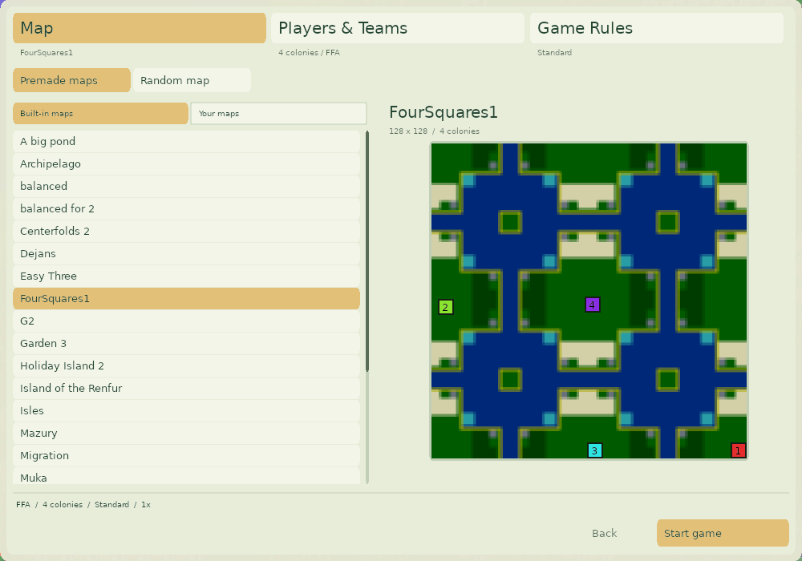 | 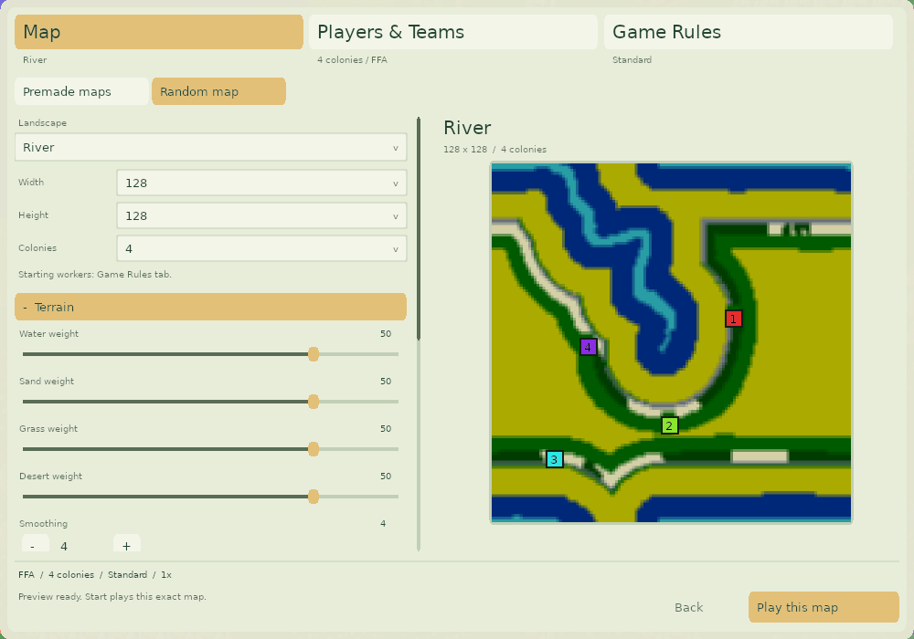 |

| Players and teams | Compact roster |
| --- | --- |
| 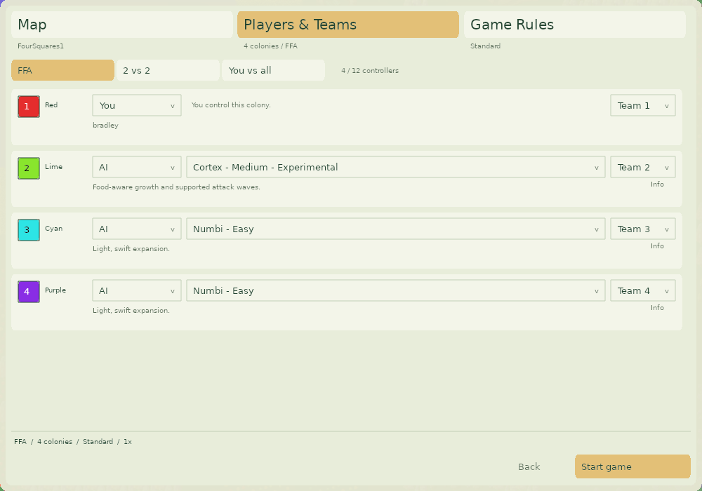 | 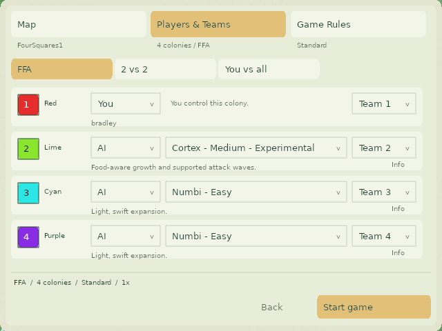 |

| AI difficulty choices | AI strategy profile |
| --- | --- |
| 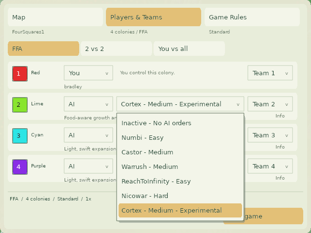 | 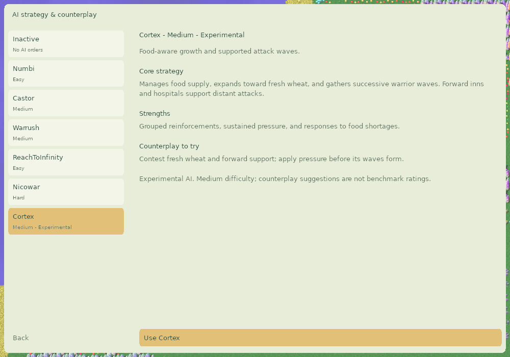 |

| Standard rules | Custom starting conditions and speed |
| --- | --- |
| 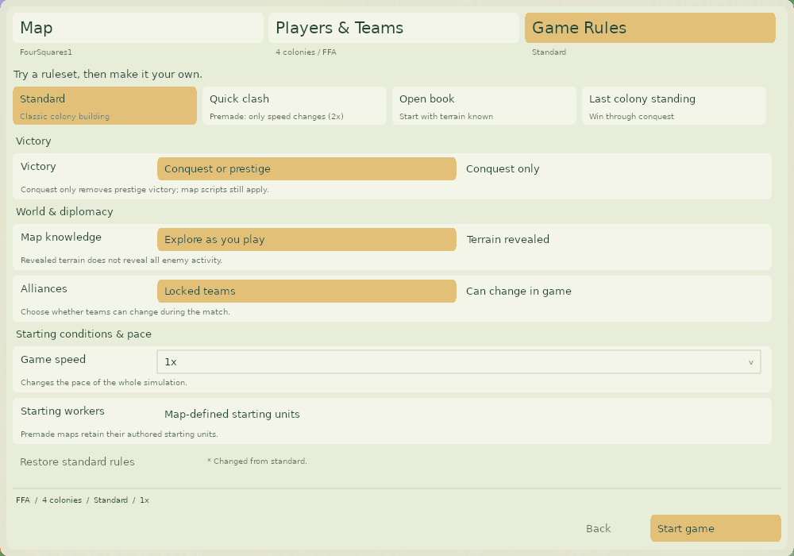 | 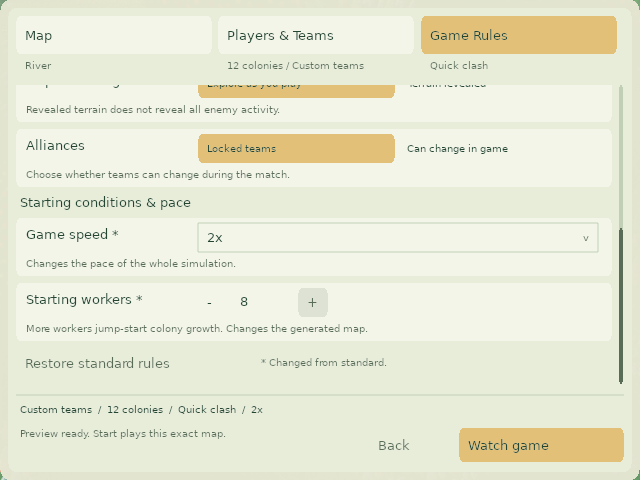 |

| Expanded generator | Shared-control limit |
| --- | --- |
| 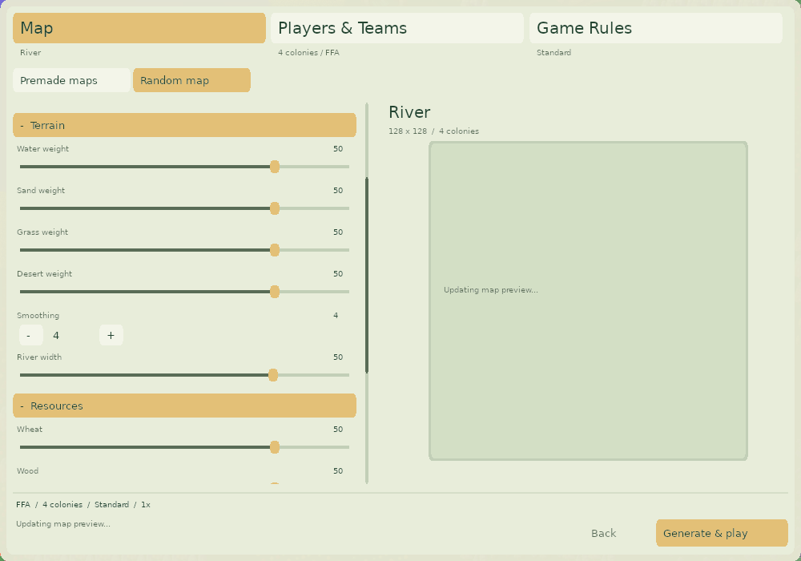 | 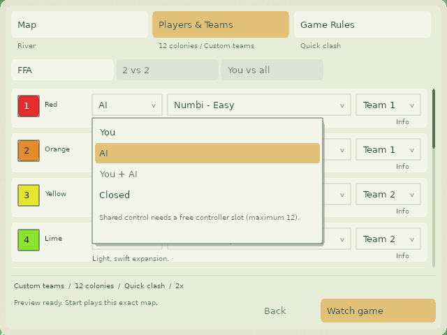 |

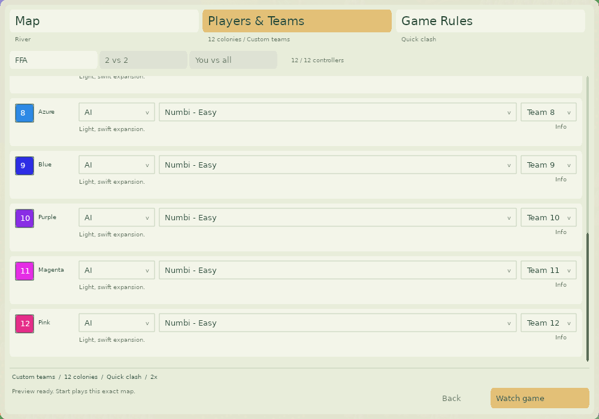

## Reproduce verification

Run from the repository root on a machine with the native dependencies:

```sh
scons -j8 release=1 custom-setup-test speed-tests build/src/glob2
build/src/CustomGameSetupHarness
mkdir -p artifacts/custom-game/compact artifacts/custom-game/large
build/src/CustomGameSetupHarness artifacts/custom-game/compact
build/src/CustomGameSetupHarness artifacts/custom-game/large large
build/src/CustomGameSetupHarness artifacts/custom-game/compact ui
python3 test/run-game-speed-tests.py
python3 data/check_translations.py --strict
python3 test/test_translations.py
python3 test/test_font_coverage.py
python3 test/test_text_area_layout.py
```

The custom harness covers model validation and restoration, canonical map catalog
identity, stable selection/scroll/focus, inline choices and dismissal, controller
limits, automatic previews/debounce, failure recovery, exact map serialization,
AI order routing, save/load and replay playback. The UI mode drives production
SDL event loops through human, shared-control and AI-only launches.

The Linux workflow runs the headless harness and native compact UI checks under
Xvfb. macOS desktop event injection was unreliable during development; see
[the automation guide](../../test/LOBBY_AUTOMATION.md) for the working SDL approach
and the distinction between game-side input coverage and physical OS input.
