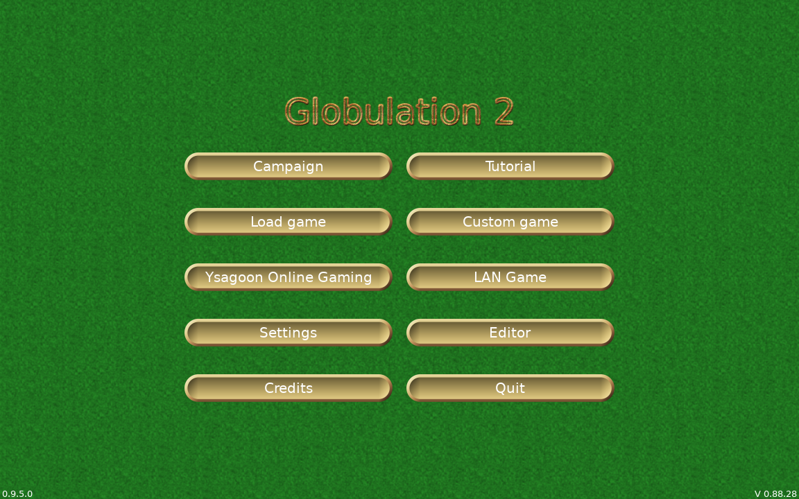
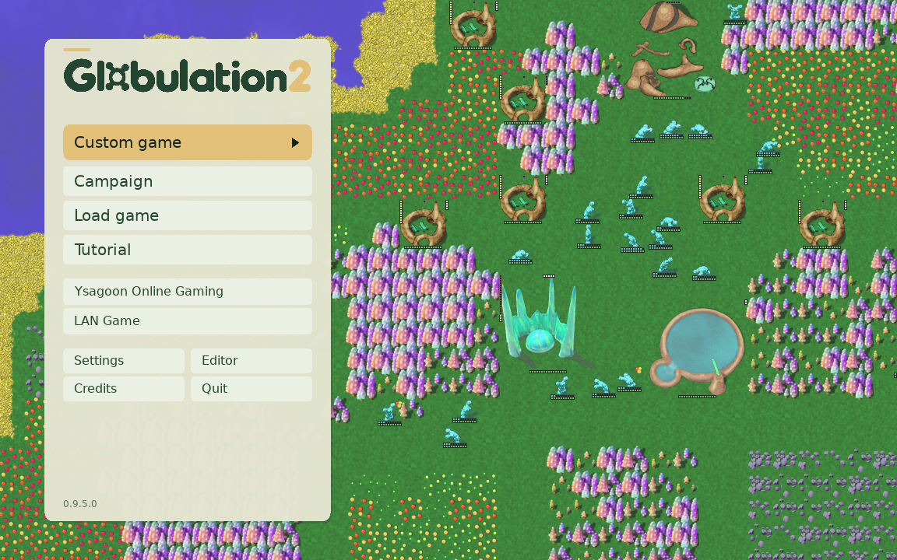
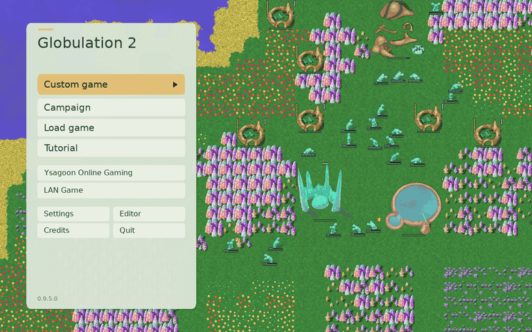
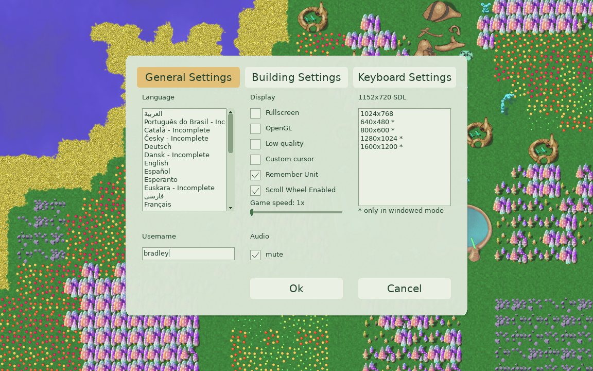
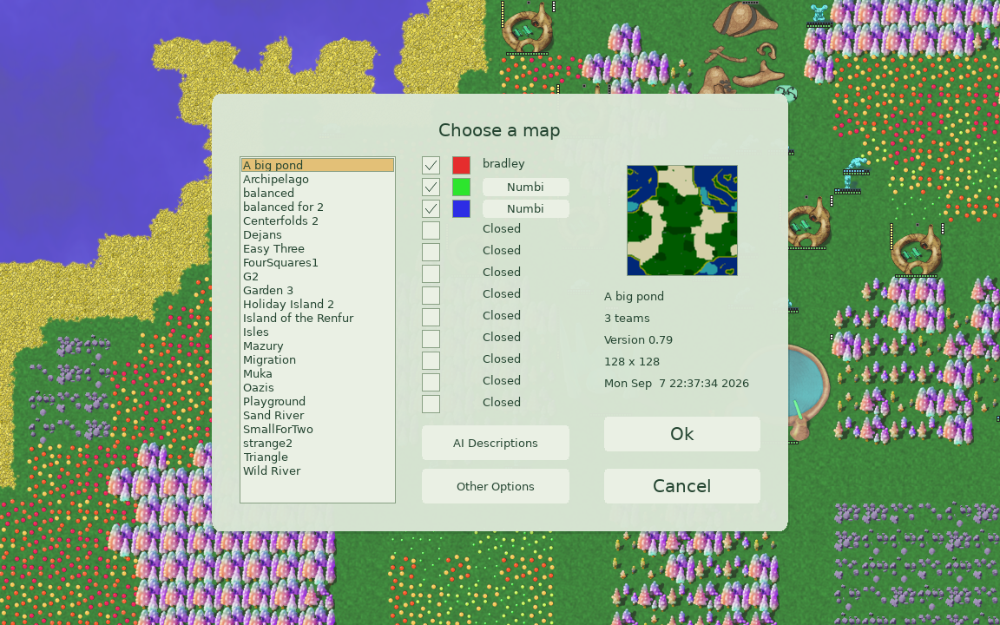
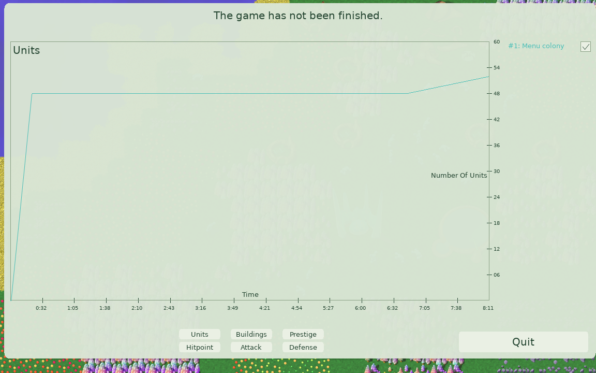
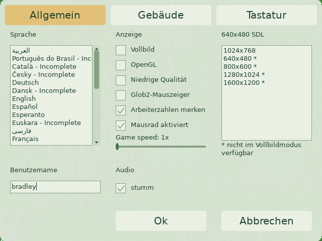

# Front-end refresh

The opening menus should feel like an invitation into Glob2's living world. This
proposal keeps the game's colorful colony art, gives it a real AI-driven life
behind the menus, and replaces the old textured widget frames with a restrained
sage-and-gold presentation. The main action is prominent; secondary actions are
quieter. This is a visual refresh of the existing screens, not a replacement UI
or rendering engine.

## Design and coverage

The main menu uses a narrow left panel. Other menus retain their existing control
positions, with a shared panel fitted around their content. Text, buttons,
checkboxes, fields, selections, scrollbars, sliders, tabs, progress indicators,
and modal frames use the same palette. Explicit team colors and status warnings
remain distinct.

Coverage includes campaign and tutorial selection, saved games/replays, custom
game setup, settings, LAN and online entry/lobby flows, editor entry/map creation,
credits, match results and the save-replay dialog. Gameplay and map/campaign editor
sessions suspend the theme, including dialogs opened from those sessions.

## Implementation boundaries

`FrontendTheme` uses the existing GAG `Style` interface. Optional drawing hooks
have legacy no-op defaults. `FrontendScope` restores the previous style and font
styles when a screen returns, and suspends presentation around game/editor loops.
The existing `Glob2Screen` and `Glob2TabScreen` classes share the background and
panel calculation. There is no new layout system, shader, rendering backend,
worker thread, or network session.

`MenuColony` owns a separate `Game`, camera state, fixed-step accumulator and RNG.
It polls Reach to Infinity, executes its order and advances the normal simulation
at 25 ticks/second. Each update runs at most two steps, dropping excessive lag.
Loading, stepping and drawing temporarily exchange the legacy global RNG and
recording sinks with the menu's own context, then restore them. Drawing also
restores replay visibility flags. The colony has no GUI input or sound producer.

The simulation changes are three null-GUI guards: mission script input and the
unit/building selection-clear notifications. Ordinary and headless Engine games
still have a GUI context and follow their original paths. A resource gradient is
initialized through the existing lazy getter before menu simulation begins.
The software sprite tint path also preserves alpha using the sprite surface's
pixel format, avoiding opaque rectangles on a window surface without alpha.

The colony continues across front-end screens and pauses during games, replays,
editor sessions and loss of window focus/minimization. Returning never catches up
hidden time. It does not reset periodically, cap population, write saves or
persist across application launches. Natural decline remains possible.

The first frame uses a still image; the next presentation frame loads the snapshot
synchronously. Failure leaves the still visible and logs one error. The snapshot
is small and fixed; loading does not start a background thread. CPU fitting of the
still happens only when the logical resolution changes, since the software
renderer does not implement stretched surface blits.

## Reproduce the colony

From the repository root:

```sh
scons release=0 server=0 CXXFLAGS='-O2 -g0' menu-colony-harness
SDL_VIDEODRIVER=dummy SDL_AUDIODRIVER=dummy \
  build/src/MenuColonyHarness generate "$PWD/data/menu/colony.bin"
```

The committed snapshot was generated against engine revision `f2b6d4329`.
The later upstream pathfinding fix changes newly generated colonies; the commands
above regenerate the procedure on the checked-out engine, rather than promising
identical bytes across engine revisions. The bundled snapshot remains compatible.

The generator uses seed 481516, the existing 128x128 legacy island generator,
one team, an island-size parameter of 35, 48 starting workers, and small resource
patches seeded through the existing map API. It runs Reach to Infinity for 12,000
normal simulation ticks before saving. The AI implementation identifier remains
`REACHTOINFINITY`; renaming it to Econo is a separate change. Victory conditions
are empty and there are no opponents or mission scripts.

`colony.bin` contains a small menu-specific version marker, the unmodified `Game`
serialization (including AI state), and its RNG state. It is a bundled presentation
asset, not a new user save format. Regenerate it when game serialization changes.
Both the snapshot and the still are installed with the normal game resources.

## Validation commands

```sh
scons release=0 server=0 CXXFLAGS='-O2 -g0' build/src/glob2 menu-colony-harness speed-tests
SDL_VIDEODRIVER=dummy SDL_AUDIODRIVER=dummy \
  build/src/MenuColonyHarness check data/menu/colony.bin
GLOB2_PREVIEW_GL=1 SDL_AUDIODRIVER=dummy \
  build/src/MenuColonyHarness capture settings /tmp/settings.png 1152 720
SDL_VIDEODRIVER=dummy SDL_AUDIODRIVER=dummy \
  build/src/MenuColonyHarness soak 3600
python3 test/run-game-speed-tests.py
scons --build=build-server release=0 server=1 CXXFLAGS='-O2 -g0' build-server/src/glob2-server
```

Linux CI builds the harness and runs `check` and `navigation` on both supported
Ubuntu toolchains. The check command covers timing, bounded catch-up, pause/resume, nested style/font
restoration, missing/incompatible assets, main-menu keyboard routes, and matching
real-game checksums/RNG with and without interleaved menu simulation. It also
checks that menu activity cannot write into a real match's replay buffer.

The harness uses a separate `glob2-frontend-test` profile. Set
`GLOB2_PREVIEW_LANGUAGE=de` to inspect longer labels, and omit
`GLOB2_PREVIEW_GL` with `SDL_VIDEODRIVER=dummy` for software-rendered captures.
Capture names include `main`, `settings`, `custom`, `load`, `campaign`,
`campaign-select`, `missions`, `lan`, `lan-find`, `login`, `register`, `editor`,
`new-map`, `credits`, `results`, `options`, `save-replay`, `settings-buildings`,
`settings-keys`, and `fallback`. Run `navigation unused` to enter and cancel
14 actual front-end screen loops through queued mouse events. Run `sessions unused`
to play/quit a short match, finish its replay, return through results, and enter/quit
the map editor using injected SDL input. Only this test mode uses an SDL timer;
production menu simulation stays on the existing main loop.

## Captures

These are captures of the real C++ client renderer and repository assets.
The baseline uses the original main-menu source from `f2b6d4329`. The animation
advances the real simulation at its normal rate; it is not a video background.

| Before | After |
| --- | --- |
|  |  |



| Settings | Custom game |
| --- | --- |
|  |  |

| Results, preserving team colors | German labels at 640×480 |
| --- | --- |
|  |  |

To regenerate the still and animation source frames:

```sh
SDL_VIDEODRIVER=dummy SDL_AUDIODRIVER=dummy \
  build/src/MenuColonyHarness capture colony data/gfx/menu-colony.png 1600 900
SDL_VIDEODRIVER=dummy SDL_AUDIODRIVER=dummy \
  build/src/MenuColonyHarness record /tmp/colony-frames 200 1152 720
```

## Validation record

Host: Apple M3, macOS; optimized assertion-enabled client (`-O2 -g0`).
Measurements are from the harness with warm filesystem caches. Builds and other
work ran concurrently, so maximum frame times include host scheduling delays.

- Normal client and server-only builds passed.
- On the original engine base `f2b6d4329`, the generator reproduced the bundled
  save byte-for-byte (SHA-256
  `8280d9028524fb8e26654e0819c3cec027ebc32ffa78a4147ef330a1e8680c35`).
- Live and fallback rendering survived resolution changes at all three sizes
  in both renderers, preserving the simulation checksum and RNG state.
- Install dry-run lists both `data/menu/colony.bin` and `data/gfx/menu-colony.png`.
- The focused checks passed in software and OpenGL: RNG and drawing-state
  restoration, replay-buffer isolation, real-game deterministic checksums,
  nested menu/gameplay theme scopes, missing/incompatible snapshots,
  pause/resume and bounded catch-up, main-menu mouse/keyboard routes,
  replay-dialog typing/editing/cancellation, and custom-map selection.
- The existing seven engine checksums matched across game speeds/pause and replay
  playback speeds (`test/run-game-speed-tests.py`).
- The real Engine game → results → menu, replay → results → menu, and map-editor
  → menu paths passed using injected SDL input. Menu styling returned and the
  colony resumed without a catch-up burst.
- Actual menu event-loop cancellation and scope restoration passed across
  14 front-end screens. This uses queued SDL events, not desktop automation.
- Software captures cover 19 screens/states at 640×480, 1152×720, 1920×1080,
  plus German at 640×480. OpenGL captures cover main, settings and both additional
  settings tabs, custom game, results and fallback at the same sizes/languages.
- Warm startup samples: existing global assets 105–249 ms; added theme/still setup
  13–22 ms; colony snapshot load 27–32 ms. The still is presented before the
  snapshot load, which runs synchronously on the next frame.

The ten-minute run with the final background rendering completed 13,136 frames
and advanced from tick 12,000 to 26,998. Simulation update calls averaged 0.397 ms
(maximum 16.467 ms; each call can run up to two ticks). Complete software menu
frames averaged 3.913 ms, with an 80 ms maximum. Queued mouse clicks continued to
work; maximum handler dispatch was 0.0071 ms, which excludes OS input latency.
Peak resident memory for the whole harness was 62,930,944 bytes (60.0 MiB), not an
estimate of incremental menu overhead.

The one-hour integration soak completed 79,282 software-rendered frames and
advanced from tick 12,000 to 101,989 without a crash or reset. Mean frame cost was
4.982 ms, maximum 119 ms, and peak resident memory was 63,389,696 bytes (60.5 MiB).
This run started before the final text/sprite visual fixes; it exercises the same
colony simulation, asset and lifetime. The separate ten-minute run above covers
the corrected background rendering and injected input. Both longer runs preceded
the final rebase onto `88934ecfb`. After rebasing, the client/server builds,
software/OpenGL isolation checks, navigation, real session returns, display
changes and existing game-speed regression passed again. A one-minute smoke
advanced 1,499 ticks with no crash and working injected clicks. Full output is
in [validation.txt](validation.txt).

### Remaining acceptance checks

The desktop remained locked during final native testing. A manual walkthrough
of live network lobby and multiplayer setup, physical wheel scrolling, real
focus/minimize transitions, and display-setting control interactions is still required before merging. Rendering and scoped-state tests cover
those shared code paths, but do not establish those end-to-end outcomes. No
network account was created and no multiplayer session was joined for validation.

This is a substantial stylistic proposal. Feedback is especially welcome on the
sage/gold palette, panel opacity, menu density, readability on smaller displays,
and whether the live colony is inviting or distracting. The screenshots and
small shared theme are intended to make that discussion concrete.

### Review follow-up: modal presentation and bounded labels

Replay saving now draws the results screen without presenting it, composites the
save dialog, and presents once. Ordinary screen dispatch still presents by default.
Front-end text wrapping is opt-in and constrained to an explicitly sized box;
overflowing single-line labels are clipped to their existing bounds. The display
mode note reserves 30 pixels for wrapping, with the restart warning moved below it.

The harness checks presentation counts through `Screen::dispatchPaint`, raster
pixels outside text bounds, single-line behavior, and restoration of clipping.
The normal client and harness build, isolation/determinism checks, and menu
navigation passed after these changes. The German settings screen was also
inspected at 640×480. No new OpenGL session or long soak was run for this follow-up.
