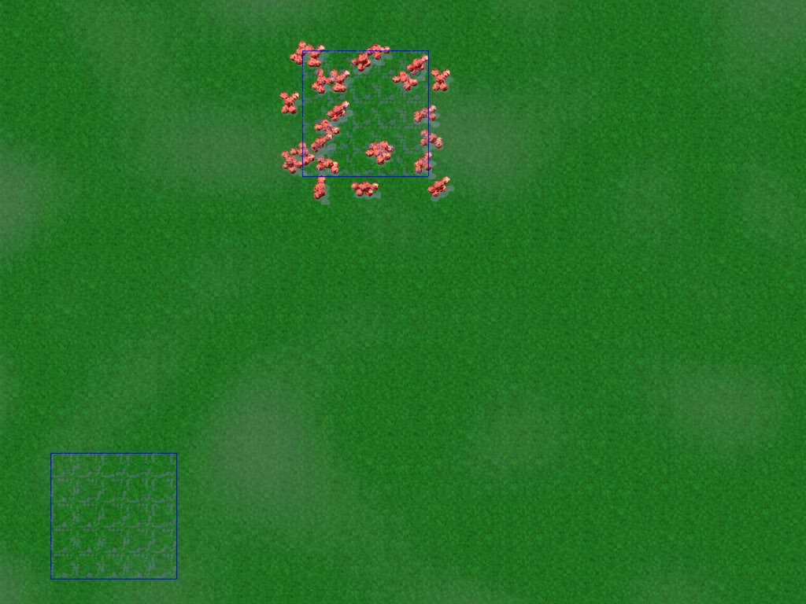
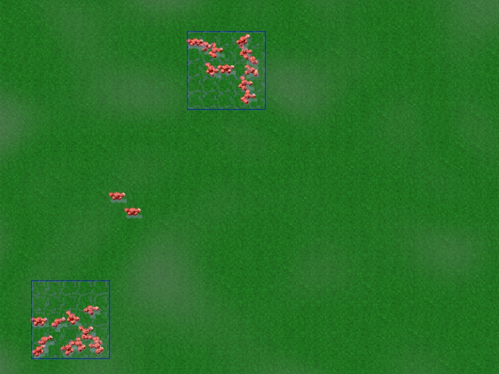
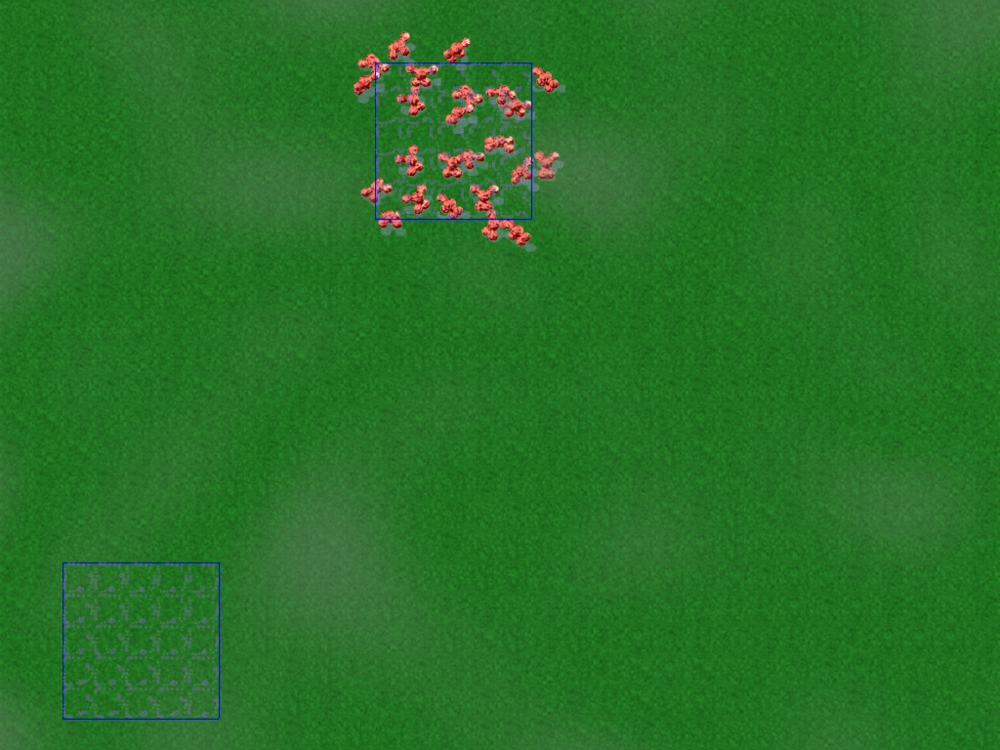
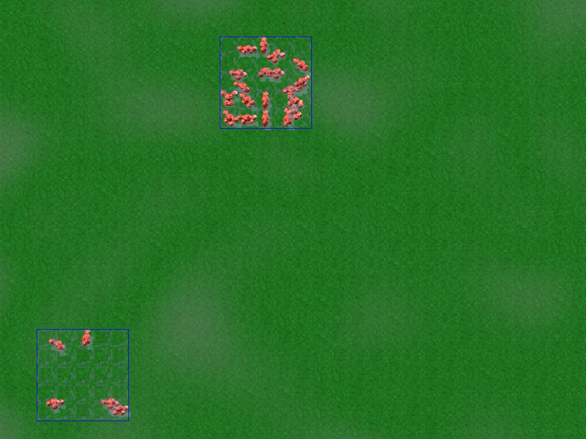
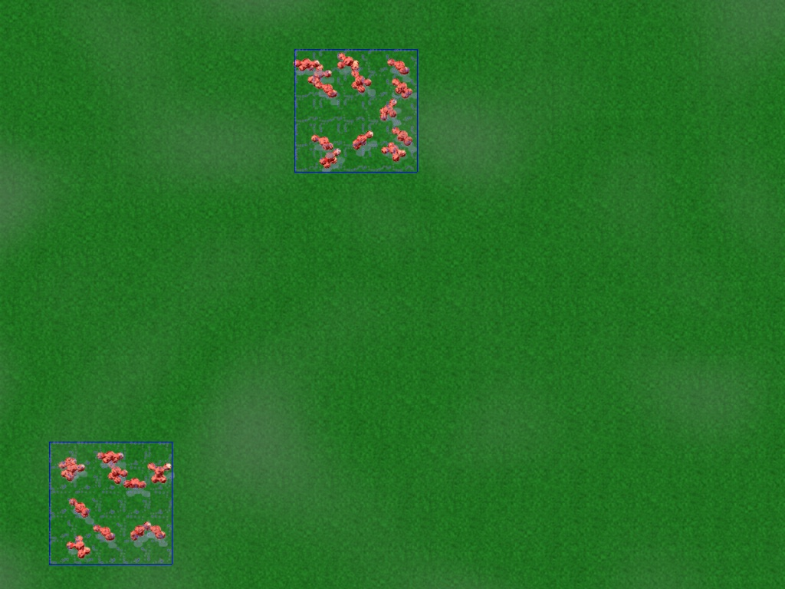

# Guard-area balancing

## Why

Guard areas were only half usable. Painting one told the warriors where to go,
but not how many would go: every free warrior walked to the nearest painted area
whatever was already there, so a batch trained in one place all took the same
area and any other area stayed empty. How many warriors a defence ended up with
depended on where the barracks stood, not on what the player painted, and the
only dependable tool was the war flag.

Since version 97 painted tiles are seeded with a crowding cost, so warriors
spread between areas in proportion to painted size, an area that is over-full
drains into the others, and a bigger painted area gets more warriors. Painting a
guard area now means what a player expects it to mean.

| Before: everyone takes the near area | After: both areas are held |
| --- | --- |
|  |  |

24 warriors spawned at the top left, a 5x5 area 10 tiles east and another 16
tiles south, 4,500 ticks later. Rendered by the harness described below.

## Mechanism

The rules live in `src/map/gradient/MapGradientArea.cpp`,
`src/map/pathfind/MapPathfindArea.cpp` and
`src/map/pathfind/MapPathfindRessource.cpp`; the constants in
`src/map/MapInternal.h`.

- **Crowding.** At each guard-gradient rebuild the map counts, for every tile,
  the team's warriors within `GUARD_CROWD_RADIUS` tiles (Chebyshev, units inside
  buildings excluded), and separately the painted tiles within the same radius.
  Each count is a box sum: positions are splatted onto a map-sized scratch grid
  and summed with two sliding-window passes, rows then columns, both row-major.
  The torus wrap is the same index masking the gradients use. Each pass is
  linear in map size, independent of warrior count and radius, and both only run
  for a team that has painted tiles and warriors.
- **Seeding.** A painted tile is seeded at `GRADIENT_AT_GOAL` minus
  `GUARD_CROWD_COST_PER_WARRIOR` per counted warrior, scaled by
  `GUARD_CROWD_REFERENCE_AREA` over the painted count and capped at
  `GUARD_CROWD_COST_MAX`: warriors nearby per painted tile nearby. A 5x5 area
  costs the full per-warrior amount, a four-times larger one a quarter, so shares
  follow painted size. Dijkstra then gives every tile the best of "distance to an
  area plus that area's crowding". A warrior outside any area steps uphill as
  before. Two areas settle where their crowding difference matches the walking
  distance between them, so balance is traded against distance rather than
  forced: a far area is allowed a few fewer warriors.
- **Leaving.** Inside an over-full area another area's field runs over the
  painted tiles, so an uphill step out exists. Every warrior there sees the same
  field, so following it is gated to one action in `2^GUARD_LEAVE_CHANCE_SHIFT`;
  the other actions move to a higher painted neighbour or keep the old in-area
  wander. Leavers still count toward the area they left until they are
  `GUARD_CROWD_RADIUS` tiles out, which costs more than the one warrior's worth of
  crowding they freed, so the trickle stops before it overshoots and a leaver
  does not turn back (`static_assert` in `MapInternal.h`).
- **Staying.** A warrior standing on a painted tile that has to take a random
  step (the area is packed) only steps onto painted tiles. Off the paint it
  would look like a new arrival to the field, which is how a full area used to
  drain all at once.

The guard gradient is rebuilt where it always was: on every area order, on
building death, and once per round of the per-tick gradient round-robin. Nothing
new is saved: the crowding grids are scratch, the field itself was already saved
with its refresh flag, and a loaded game refreshes on the same schedule as an
uninterrupted one. The harness's `saveload` scenario checks that a game saved
mid-balancing continues identically for 1,000 ticks after loading.

| Drain: 24 warriors fill the near area when the far one is painted | 1,000 ticks later | 4,000 ticks later |
| --- | --- | --- |
|  (old engine, 4,000 ticks later: nobody moved) |  |  |

## Tuning

| Constant | Value | Meaning |
| --- | --- | --- |
| `GUARD_CROWD_RADIUS` | 8 tiles | Warriors and painted tiles this close to a tile count toward it. Must exceed the per-warrior cost in tiles, and be at least the size of a typical area: with radius 3 a 5x5 area has cheaper edge tiles and warriors spread to them instead of leaving. |
| `GUARD_CROWD_COST_PER_WARRIOR` | 4 tiles | Extra walking one nearby warrior is worth in a 25-tile area. 8 tightens the split (11/13 instead of 13/11 in the harness) at the price of a stronger pull on a moving crowd. |
| `GUARD_CROWD_REFERENCE_AREA` | 25 painted tiles | Painted count at which the per-warrior cost applies in full; larger paint counts divide it. |
| `GUARD_CROWD_COST_MAX` | 400 tiles | Keeps seeds above the unreachable sentinel. |
| `GUARD_LEAVE_CHANCE_SHIFT` | 6 (1 in 64 actions) | Drain rate. At 64 a full area of 24 loses 10 to a new area over about 2,000 ticks with no overshoot. |

Shares follow painted size roughly, by design: the equilibrium is a band as wide
as the walking distance between the areas divided by the per-warrior cost, and
which point in the band a game lands on depends on how the warriors arrived. An
exact split would have warriors walking between areas to correct a difference of
one, which is both wasteful and not what a player painting two areas expects.

Things that were tried and dropped: a "leave only for a clear gain" margin on
the uphill step never fires, because a smooth field only rises one step per
tile; labelling areas as connected components was replaced by the radius count,
which also handles a warrior standing next to a small area and two patches
painted close together; and radius 3 broke balancing outright.

## Measurements

`test/GuardAreaBalanceHarness.cpp` (target `guard-area-balance-test`) runs the
real engine on a blank 64x64 map with one team and 24 level-0 warriors. Two 5x5
areas are painted, "near" 18 tiles from the spawn block and "far" 32 tiles away
on the other axis. Counts are warriors within 7 tiles of an area's centre.
`report` prints without asserting, so the same source built against the previous
engine gives the before-numbers; the default `check` mode asserts. The
`--resource-gradients` and `--slow-cadence` options allocate the fields a small or
a large game would have, which sets how often the round-robin refreshes the guard
field (about every 10 and every 170 ticks).

Scenarios:

| Name | What it checks |
| --- | --- |
| `spawn` | Warriors arriving from the base take both areas. |
| `drain` | A clump that fills one area thins into a newly painted one, with no overshoot. |
| `patches` | Two unconnected patches 3 tiles apart share as one position. |
| `size` | A 9x9 area farther away takes more than a 5x5 area nearer. |
| `three` | Three areas at increasing distance are all guarded. |
| `erase` | Erasing an area sends its warriors to the remaining one. |
| `saveload` | A game saved mid-balancing continues identically after loading. |
| `crowding` | The box sum equals a brute-force count across the torus seam. |
| `timing` | Rebuild wall time on 64x64 and 256x256 maps. |
| `--screenshots DIR` | Renders the spawn and drain stories to PNG through the real map renderer. |

Warriors at each area after 4,500 ticks, macOS arm64, release build:

| Scenario | Before (near / far) | After, every-tick refresh | After, ~10-tick refresh | After, ~170-tick refresh |
| --- | --- | --- | --- | --- |
| spawn: both areas painted, warriors arrive | 24 / 0 | 13 / 11 | 13 / 11 | 12 / 12 |
| drain: 24 inside near, then far painted | 24 / 0 | 14 / 10 | 15 / 9 | 15 / 9 |
| patches: near is two 3x3 patches 3 tiles apart (18 painted tiles) | 24 / 0 | 11 / 13 | 12 / 12 | 9 / 15 |
| size: near 5x5, far 9x9 | 24 / 0 | 4 / 20 | 5 / 19 | 10 / 14 |
| three: near / far / third at 18, 32 and 45 tiles | 24 / 0 / 0 | 5 / 10 / 9 | | |
| erase: far erased after settling | | 24 / 0 | | |

Drain trace, every-tick refresh (near / far / walking): tick 0: 24/0/0, 500:
21/0/3, 1000: 18/4/2, 1500: 14/6/4, 2000 and after: 14/10/0. The count in the
first area never dips below its final value. In-area wandering, measured as tile
moves per warrior over the last 500 ticks, is 24 to 25 before and after.

Guard-gradient rebuild wall time, median of 200 rebuilds with two 5x5 areas
painted, both engines timed back to back twice on the same machine (the spread is
run-to-run noise):

| Map | Before | After, no warriors | After, 24 warriors | One box-sum pass |
| --- | --- | --- | --- | --- |
| 64x64 | 31 to 32 us | 26 to 27 us | 36 us | 5 us |
| 256x256 | 444 to 510 us | 383 to 464 us | 529 to 582 us | 73 to 90 us |

A team that has painted nothing pays nothing beyond the old seeding pass; a team
with paint and warriors pays two box-sum passes (warriors and paint), about a
quarter of a rebuild on the largest map. The rebuild schedule is unchanged, so
this is the whole per-rebuild cost.

Full simulation step in the spawn scenario, wall time per `Game::syncStep`
averaged over 4,500 ticks with the resource fields of a small game allocated:

| Warriors | Before | After |
| --- | --- | --- |
| 24 | 16.0 us | 15.8 us |
| 96 | 181.9 us | 70.0 us |

With 96 warriors and 25 painted tiles the old engine is slower because warriors
blocked around the packed area retry the area pathfinder, and a blocked retry
rebuilds the whole guard gradient; spreading them over two areas removes most of
those rebuilds. That retry path is unchanged and still exists.

A whole headless Warrush-against-Warrush game (`SmallForTwo`, seed 42, 20,000
ticks from a saved tick-0 state, both undecided at the end) takes 2.09 s of user
CPU on the old engine and 2.00 to 2.06 s on the new one. The two games diverge as
soon as warriors move, so this only shows there is no gross regression; the
harness numbers above are the controlled measurement.

## Cross-platform equivalence

The same tick-0 state was run for 20,000 ticks with `GLOB2_CHECKSUM_SIDECAR=1` on
macOS arm64 (Apple clang) and Ubuntu x86_64 (g++ 14). The 188 MB per-tick,
per-unit, per-building checksum files are byte-identical (md5
`00f7fa38804129c9e786ece0089f986e`), and the harness prints identical tables on
both for every scenario and cadence. When comparing builds this way, list
`build/src/glob2` among the scons targets: a harness target alone rebuilds the
objects without relinking the client, and a stale client looks like a platform
divergence.

## Compatibility

- Saves: no format change. Older saves load as before.
- Replays and mixed clients: the simulation changed, so `VERSION_MINOR`,
  `REPLAY_MINIMUM_VERSION_MINOR`, `NET_PROTOCOL_VERSION` and the YOG client floor
  all moved to refuse older replays and clients.
- The Warrush AI paints guard areas on every discovered enemy building and relied
  on its warriors flooding the nearest one; its attacks now spread across them.

## Feel

Arrival at a first area is slower than before when a whole batch walks together:
the crowd counts against the area it approaches from eight tiles out and part of
it diverts, so 90 percent of a 24-warrior block is in some area by tick 1,000
instead of 250. A packed area no longer spills warriors onto the tiles around it.
An over-full area empties as a trickle over a couple of thousand ticks, not at
once. Warrush, which paints guard areas on the enemy buildings it has found,
spreads its attack across them instead of massing on the nearest. These are the
effects a maintainer should look at in play.
