# Final artwork comparisons

Left: original source enlarged 4× with nearest-neighbor sampling. Right: final runtime pack at the identical pixel dimensions. Both use the same background and green team layers. These are direct asset composites, not generator mockups. Click an image to inspect at full size. No intermediate candidates are shown.

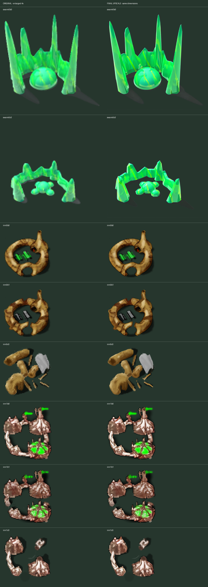

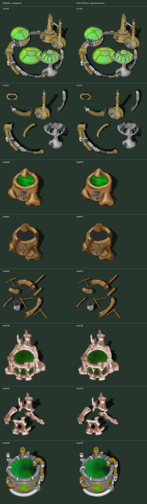

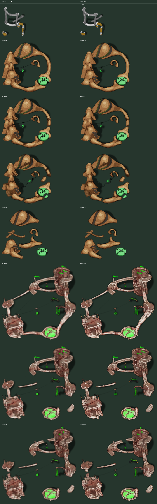

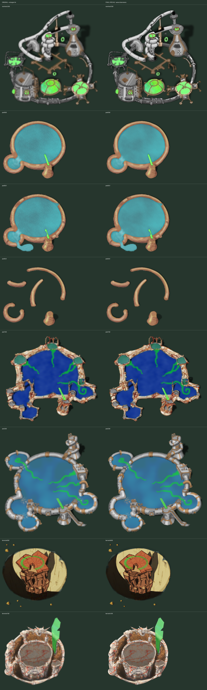

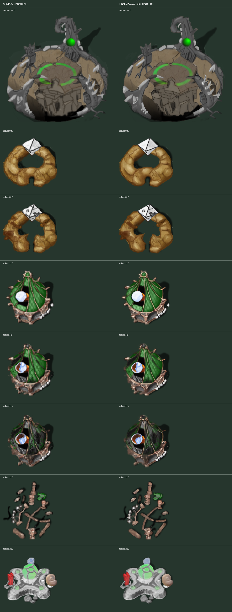

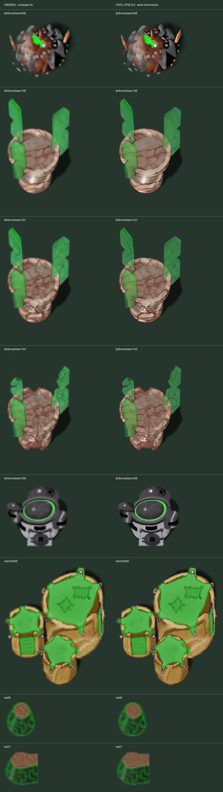

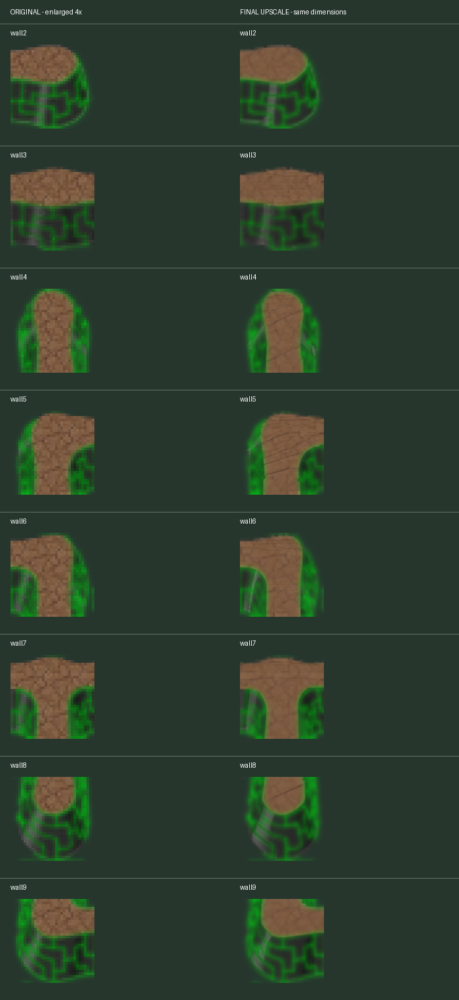

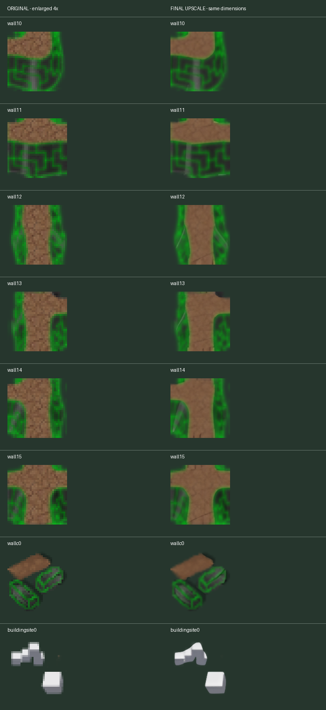

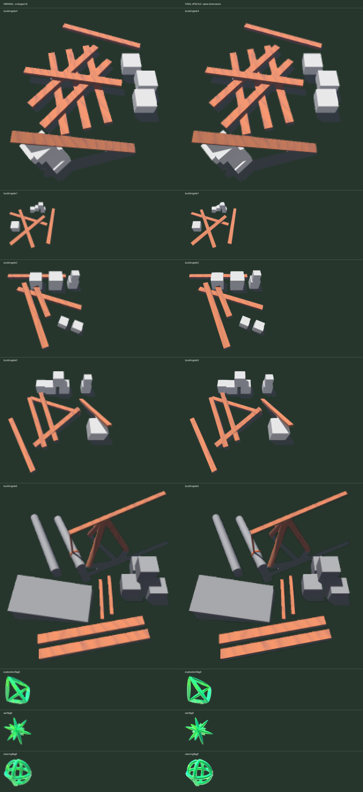

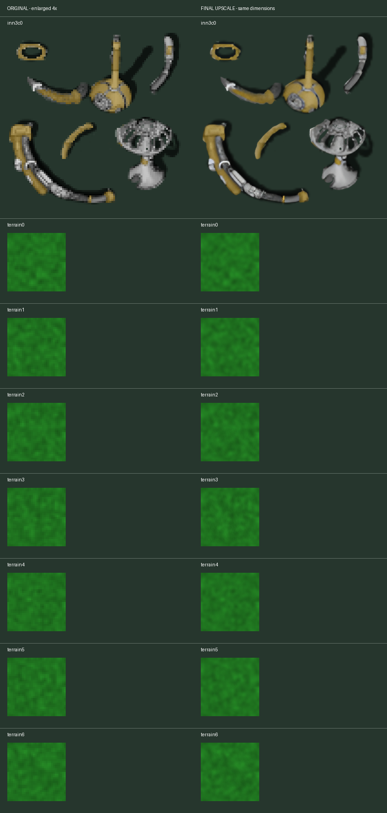

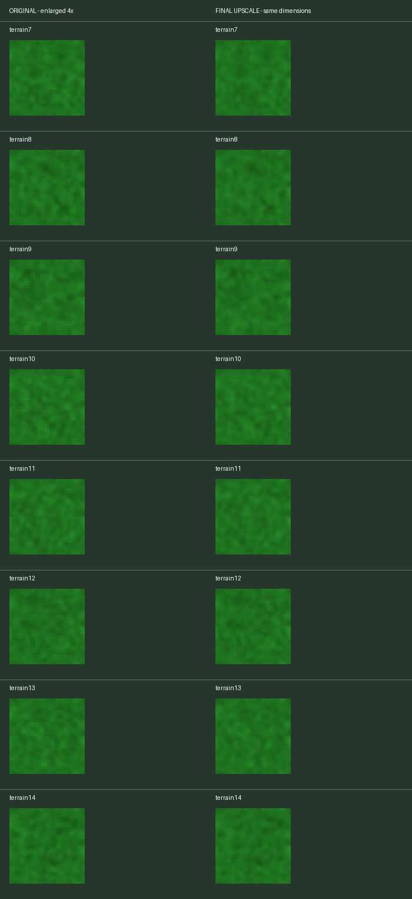

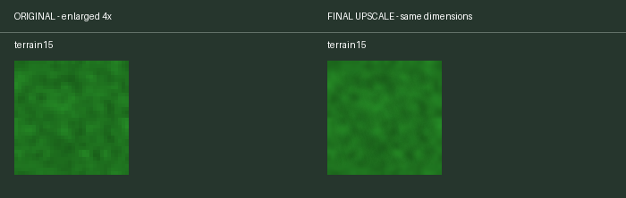

