# High-resolution artwork and map zoom

Original artwork is now organized in [datasrc/gfx](../../datasrc/gfx/README.md), with a [source catalog](../../datasrc/gfx/CATALOG.md) and [coverage report](../../datasrc/gfx/COVERAGE.md). Twenty frames now use recovered originals: ten tree growth/variant frames, both hives, three flags and five construction sites. See the [reproducible recipes and remaining gaps](../../datasrc/gfx/RECOVERED-RUNTIME.md). The other runtime artwork remains experimental. Replace frames with verified deterministic exports from originals as mappings are established; retain existing upscales where usable originals are unavailable.

This experiment upgrades selected map artwork while retaining the original 32-unit grid, sprite geometry, building footprints, simulation and orders. OpenGL draws the extra texture pixels directly into the framebuffer at 50%–300% zoom. Gameplay, replays and the editor use the same presentation camera; sidebar controls, menus and the minimap keep their normal size relative to map zoom.

**High-resolution artwork** defaults on for OpenGL sessions. To use classic artwork, turn it off in General Settings and load a new session. An explicitly saved preference is respected. Alt + wheel zooms about the pointer; the − / 100% / + controls use the map center. In gameplay and replays they sit at the bottom of the right sidebar; in the editor they remain at the bottom left. Software rendering retains original artwork and 100% scale.

## Before and after

[All 487 final frame comparisons](COMPARISONS.md). Originals are enlarged 4× using nearest-neighbor sampling; final runtime images appear at exactly the same pixel dimensions. The comparison preserves the original lack of detail rather than hiding it behind a smaller image. No intermediate outputs are included in this gallery.

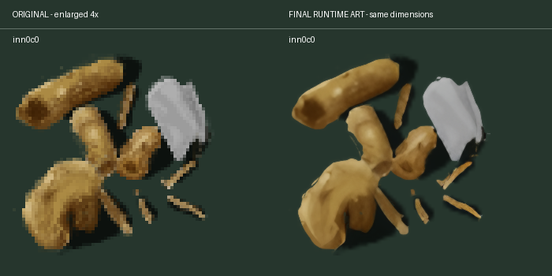
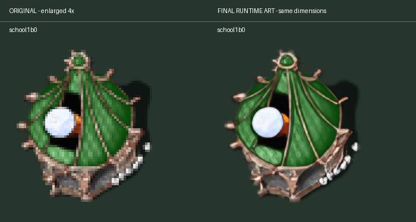
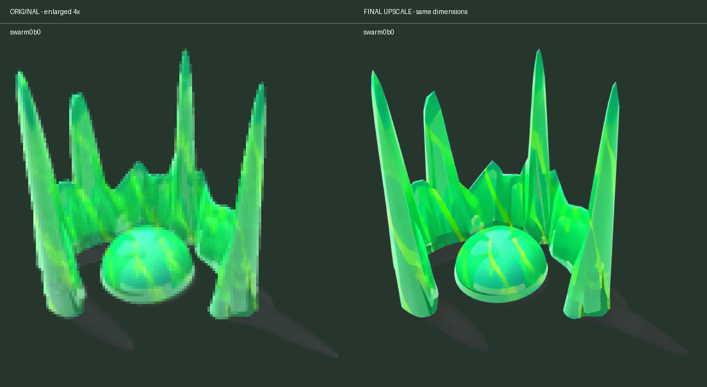

## Original-source exports

The recovered PNGs have their white backgrounds removed using native color/matte data, with independent green team and neutral shadow layers. They retain logical dimensions and are packaged at 4×; native detail varies from 2× to 4×. No AI is used for these twenty replacements. Trees preserve native GIMP layer opacity and shadows; their final images also populate the resource atlas. Layered buildings and remaining resources still await migration.

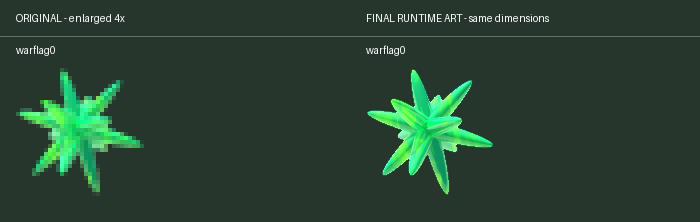
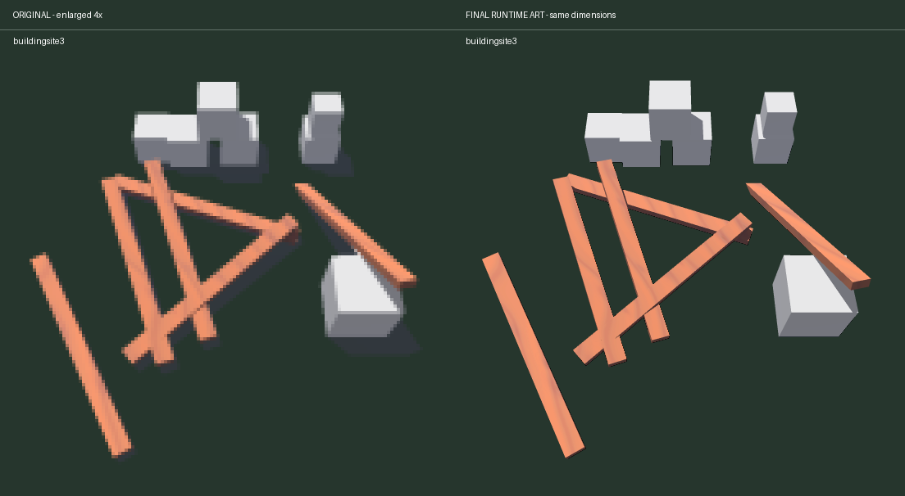

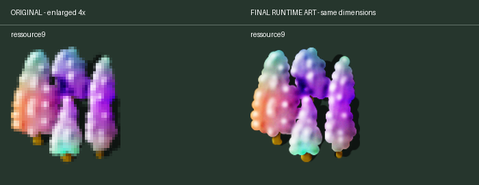

## Experimental fallback pipeline

1. **Separate color and alpha before inference.** Start from the original base and green team layers. Fill transparent RGB from nearby visible pixels and pad buildings by 16 source pixels. Run local Real-ESRGAN x4plus through ncnn Vulkan on RGB, retaining logical geometry independently of the output resolution.
2. **Constrain changes to the source style.** Restore broad source color/shading by subtracting low-frequency model differences. Retain 65% of the remaining building detail. This avoids globally changing palette or treating the model output as authoritative geometry.
3. **Finish by family and frame.** Most improvements come from selective outline reconstruction rather than wholesale repainting. The outline repair combines learned alpha with the original (85% learned contribution), applies a narrow 0.45-output-pixel smoothing pass, and preserves dark translucent shadows. Painted repair blends 45% of the alternative anime model's structural RGB into the existing painted result. Team overlays with corresponding bases remain separate. Tower crystal repair caps reconstructed opacity at the source layer's maximum so damaged crystals stay translucent. Thin fragments and shared construction states are reviewed together.
4. **Keep successful references fixed.** `pool0b0` and `school1b0` keep their approved baseline output bytes exactly. Walls retain the conservative treatment to preserve connected borders and translucent markings. `finishing.json` records the per-image selection, reference locks and review decisions.
5. **Retain generator experiments as history.** Two generated swarm states were tested with their own green team layers and extracted shadows. They have now been replaced in the runtime pack by the recovered original renders; the historical prompts and selected candidates remain available for reproduction.
6. **Construct terrain as a connected tileset.** Terrain is built as a connected tileset. The selected generated grass uses short flat grass with restrained contrast, so resource plants retain distinct silhouettes at 100% zoom; sand retains its selected grain. Both materials are made periodic. Grass is matched to the original mean palette with 65% of the generated contrast retained. Transition masks follow the engine's four-corner grass/sand/water lookup, with shared boundary irregularity and seeded interior variation. Compatible edge profiles and corner pixels are matched in RGBA at every mip level before padding and packing. This changes the shoreline artwork, while tile IDs, simulation terrain and picking remain unchanged. All 91,136 allowed directed joins across four mip levels are checked against the exported atlas, along with every corner class.
7. **Export a standalone pack.** The versioned pack contains 487 frames and 546 base/team layers, original logical dimensions, scale and provenance hashes. Export validates source selections, dimensions and registration. The runtime reads a compact versioned index, validates required layers, and falls back atomically when a frame is incomplete. Python, models and the experiment gallery are not runtime dependencies.

The experiments established that one recipe is insufficient: a universal generator repaint worked well for the swarm but failed to preserve the inn construction fragments; a full anime restoration simplified painted textures; unrestrained alpha reconstruction could make translucent overlays too bright. The selected pipeline therefore uses conservative color restoration, per-frame finishing, protected reference outputs and selected generated grass/water materials, with recovered original exports taking precedence. The gallery shows only those final choices.

The committed selected sources support deterministic runtime export. Upstream inference/finishing scripts and model provenance are retained under `experiments/ai-upscale` for auditing and further work. Model binaries and discarded intermediate outputs are intentionally omitted. Recreating upstream inference requires the recorded models and generation tools; exported runtime images do not.

## Engine changes needed for zoom

- **Texture resolution no longer defines geometry.** Sprite width/height remain logical source dimensions. GPU-only high-resolution surfaces and atlas regions draw into those rectangles. Original surfaces remain available for CPU/software use. Smaller team layers retain their own registration and dimensions.
- **A shared camera converts both drawing and interaction.** Fractional world origin, zoom, viewport bounds and toroidal normalization live in `MapCamera`. Existing tile-origin helpers receive the camera's integer tile origin plus fractional offset. The world pass uses a scoped GL transform; queued batches flush before transforms change, and projection/clipping restore before UI drawing. There is no low-resolution map framebuffer enlarged afterward.
- **Every world layer follows that transform.** Terrain, water, units, buildings, fog, clouds, effects, particles, placement ghosts, selections, brushes and world indicators move together. Particles retain world positions. Screen-edge indicators use screen space.
- **Input uses the inverse conversion.** Hover, placement, drag tools, painting, selection, minimap navigation and event-centering agree with the displayed tiles. Alt-wheel is consumed before building-order handling, including fractional trackpad input. Drag and edge/key panning account for zoom. Zoom is local state, reset to 100% each session.
- **Wrapping and culling use visible world bounds.** The viewport is divided by zoom, with existing overhang allowance. Toroidal picking and drawing share the same origin. Small maps repeat to fill the viewport. Tile traversal repeats terrain, resources, buildings and units; additional presentation passes repeat flags, effects, ghosts and selection overlays. Copies retain one object identity and map back to the same wrapped tile.
- **Sampling and resources stay explicit.** HD uses normalized 2D textures with linear sampling and mipmaps. Padded per-tile mips preserve terrain batching down to 50%. Team-color surfaces are created lazily and released with session resources. Legacy filtering and software originals remain available.
- **Window and drawable pixels are distinct.** HiDPI output renders to the actual GL drawable. F11 toggles fullscreen without discarding textures. This experiment's window resize keeps the configured logical resolution and letterboxes/scales it; it does not implement the reflow and exposed-event caching in PR #198. Integration with that PR needs review because both touch the renderer/window code.

## In-game captures

These are actual OpenGL captures from the integration harness, not generated mockups.

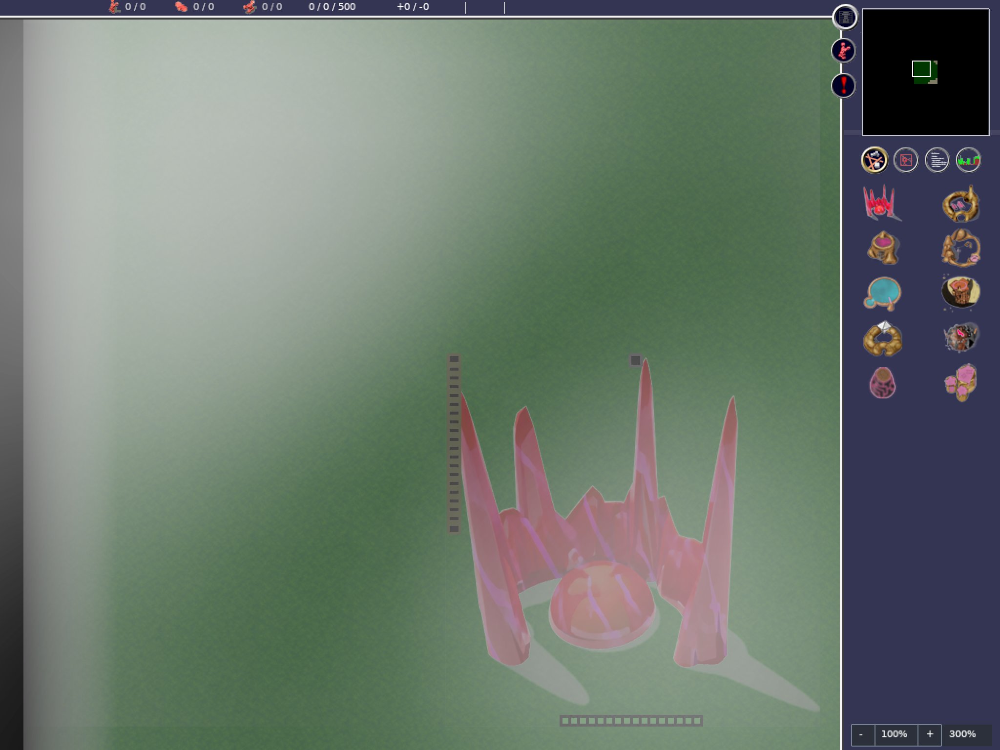
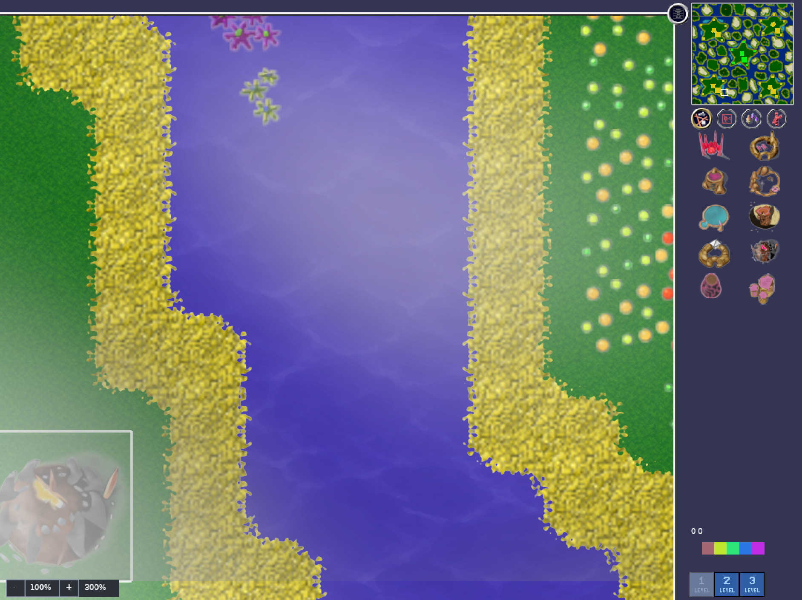
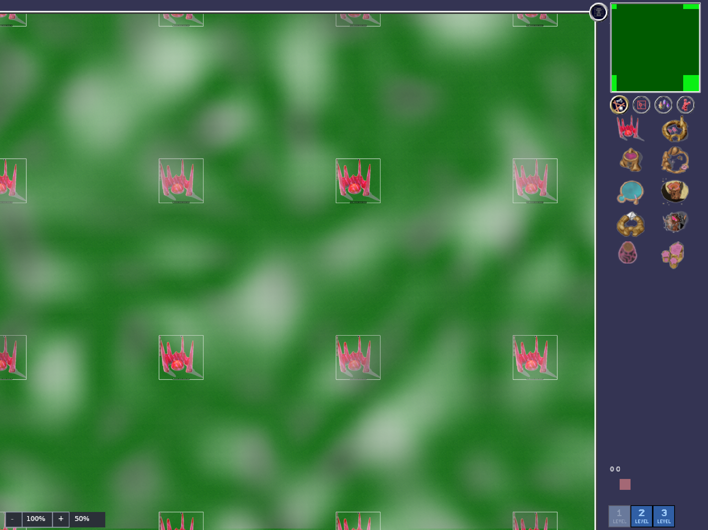

## Validation, cost and follow-up

See [runtime instructions and measured results](../../experiments/ai-upscale/HIGH-RESOLUTION-RUNTIME.md). The optimized build, pack validation, camera tests, eight wheel tests, gameplay/editor/replay integration, software rendering, fallback cases, and all-frame/all-hue cache checks pass in the experiment checkout. A 50-tick original/HD comparison produces matching simulation checksums. The clean PR branch passes its full 171-test CppUnit suite.

On the development Mac, the expanded dense four-team fixture uses about 358 MB GPU memory with HD artwork, versus 45 MB with originals. At 50% zoom, measured frame times are 12.4/8.4 ms HD/original; at 300%, 1.1/1.4 ms. Draw calls are 24,634/24,623 at 50% and 613/613 at 300%; terrain and resources remain batched. The all-487-frames/all-16-hues stress test reaches 856 MB CPU and 1.50 GB GPU allocation, with 944 cached colored frames; cache size stabilizes and releases on session close. These are local measurements against the updated renderer with original art, not a historical renderer benchmark or a cross-platform performance guarantee.

**Unit upscaling can be done alongside [PR #201, increasing core unit animation poses from 8 to 32](https://github.com/Globulation2/glob2/pull/201).** Its added poses should be finished as coherent animation sequences, with consistent silhouettes, team layers, anchoring and frame coverage. This PR already scales unit rendering with the map, but deliberately retains original unit textures; it does not generate the expanded unit atlas.

## Reviewer decision: keep classic artwork selectable?

HD artwork is enabled by default in this PR, with a user-facing switch back to classic artwork. Should the classic option remain available long-term, or should HD become the only selectable OpenGL artwork? The current implementation keeps the switch pending that decision. Original assets remain necessary for software rendering and missing/invalid-pack fallback regardless of the user-facing choice.

## Playtest fixes: full-period seams and Retina cursor

Building rendering now deduplicates by visible wrapped position while the visible-building collection retains one object identity. This preserves both clipped parts of seam-crossing footprints. Units draw at the visited wrapped tile occurrence instead of mapping every occurrence back onto the same position. A viewport spanning the full minimap width or height gets a complete outline, rather than identical wrapped endpoints collapsing to a line.

On the Cocoa backend, native cursor artwork scales in window points, without applying Retina density a second time. Map zoom never changes cursor size. Regression coverage checks four-corner building/unit visibility, exact building compositing, single object identity, a full minimap outline and the native cursor scale.

## Resources and remaining world artwork

All 65 resource frames now use the constrained Real-ESRGAN RGB pass, with exactly preserved bilinear source alpha. A separate padded atlas accommodates their different dimensions and builds mip levels independently for each frame. Terrain coverage expands to all 272 frames; shoreline masks now follow shared corner topology, with compatible RGBA edges at every mip. Water, bullets, explosions, magic and particles use constrained finishing. Fog, clouds and area markings use faithful 4× bilinear resampling because they should retain their soft mask structure. Unit sprites and unit death animations remain with the unit animation follow-up.

Regenerate with `upscale_resources.py` and `upscale_world.py` (both accept `--cache`), followed by `water_material.py`, `connected_terrain.py`, `export_runtime.py`, `validate_runtime.py` and `pr_comparisons.py`. Selected corrected sources and model provenance are retained; inference inputs, raw trials and model binaries are excluded from the runtime pack.

## Connected terrain review

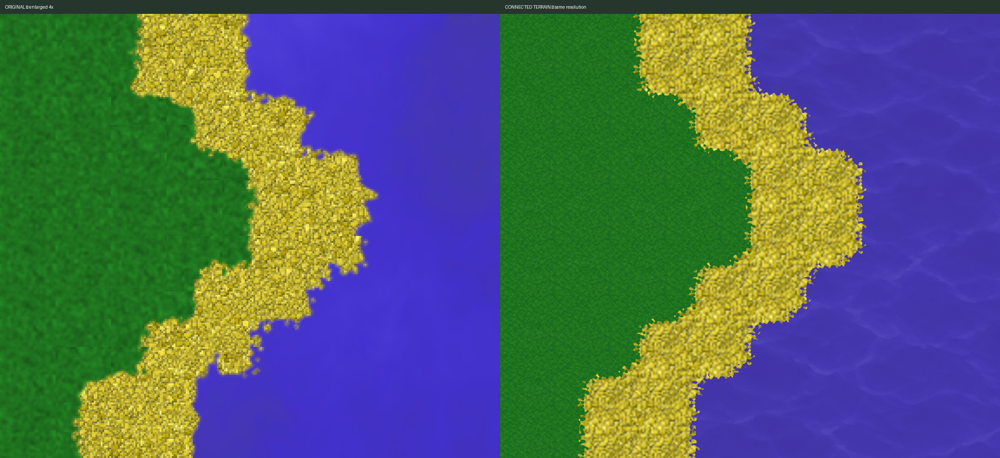

Transition masks now use stronger shared irregularity to restore rugged grass/sand and sand/water borders while preserving matching joins. Water uses subtle small ripples in the existing scrolling pass: a quiet generated source, 55% retained contrast and 80% chroma after matching original mean color. Upright grass tufts are removed to avoid competing with resource plants. Texture resolution and logical tile size remain unchanged. Periodic correction and an eight-texel matched collar keep its opposite edges compatible through four mip levels. Run `water_material.py`, then `connected_terrain.py`, then export and validate. Selected generated materials and their exact built-in image_gen prompts are retained in `experiments/ai-upscale/materials/`. Runtime assets still require no generation tooling.

Normal-scale material review (100% map zoom):

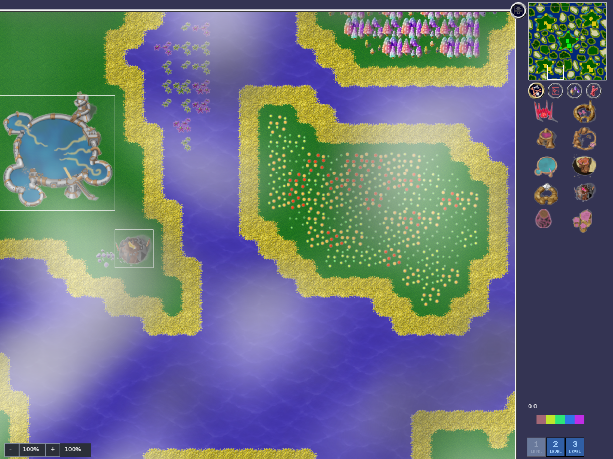
