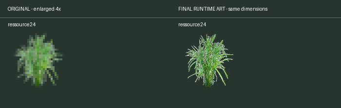

> Part 3 of 3: based on the original-artwork PR; adds the remaining approved AI/material/mask finals.
> The 60 original-source frames are inherited unchanged. [Candidate pipeline](../../tools/artwork/ai/README.md).

# High-resolution artwork and map zoom

This PR adds 50%–300% map zoom and higher-resolution artwork while retaining the
32-unit tile grid, original logical sprite dimensions, building footprints and
simulation orders. Gameplay, replays and editor share the camera. The toroidal
map repeats to fill the viewport; drawing and picking use the same conversions.
OpenGL draws the detailed textures directly, without enlarging an intermediate
low-resolution framebuffer. Menus, sidebar and minimap remain screen-sized.

HD defaults on; saved classic preferences are respected. Alt+wheel zooms around
the pointer. Gameplay/replay controls sit in the right sidebar footer. Software
rendering uses classic assets at 100%. Units remain with animation PR #201.
Whether to retain the classic graphics setting long-term is a reviewer question.

## Final artwork and source structure

The pack contains 487 frames / 546 layers. Sixty frames use recovered originals:
ten trees, eight wheat, five papyrus, two hives, three flags, five construction
sprites, school, two racetracks and 24 area markers. Other approved assets retain
the reviewed upscales/materials where usable originals are unavailable.

- `datasrc/gfx/originals/`, `reference-exports/`, `concept-art/`: preserved artist work.
- `datasrc/gfx/derived/`: deterministic exports from original sources.
- `datasrc/gfx/production/`: approved finals separated into original-derived,
  AI-upscaled, AI-material and resampled-mask folders, plus atlases/metadata.
- `data/highres/v1/`: assembled HD runtime pack.
- `data/gfx/`: unchanged classic runtime fallback.

Historical trials, rejected images, model tooling and intermediate AI outputs
are excluded from Git. Normal packaging uses only approved production inputs.
[Folder workflow](../../datasrc/gfx/production/README.md),
[original recipes and gaps](../../datasrc/gfx/RECOVERED-RUNTIME.md),
[per-frame provenance](ASSET-PROVENANCE.md).

## Final comparisons

[All 487 before/after frames](COMPARISONS.md). Classic sprites are enlarged 4×
with nearest-neighbor sampling; final artwork is shown at identical dimensions.





## Artwork processing

Original-source exports preserve native geometry and alpha, saved layer opacity,
and separate green team-color layers from neutral shadows. White-background
renders use matching mattes or deterministic extraction. Native detail varies;
a uniform 4× runtime canvas does not mean every source provides 4× detail.

Fallback upscales used constrained Real-ESRGAN detail with per-frame contour and
translucency finishing. Unconstrained repainting did not reliably preserve the
style. Only selected final results remain. Terrain uses shared subdued materials
and rugged transition masks with matching edge/corner profiles at each mip;
water uses periodic edge correction. This preserves tiling and readability.

## Build and validation

```sh
python3 tools/artwork/package_runtime.py --check
python3 tools/artwork/package_runtime.py
python3 tools/artwork/validate_runtime.py
python3 tools/artwork/runtime_provenance.py --check
python3 tools/artwork/pr_comparisons.py
scons release=1 -j8 build/src/glob2
scons release=1 -j8 highres-integration-test
```

Packaging uses Python's standard library. Pixel validation/comparisons require
Pillow and NumPy; original-source exporters additionally use GIMP/SciPy as noted
in their recipes. The game needs none of these development dependencies.

Tests cover logical dimensions, whole-frame fallback, team colors, atlas edges,
91,136 terrain joins, camera/picking, Alt-wheel isolation, replay checksums and
cache release. `test/RuntimePackCheck.cpp` exercises every frame/all 16 hues;
captures go under ignored `.cache/highres-runtime-check/`.
Prior full CppUnit run: 171/171 passing. [Recorded results](validation.txt).

Mac checks do not establish cross-platform readiness. Dense four-team HD GPU
allocation is approximately 358 MB. The all-frame/all-hue stress case reaches
approximately 856 MB CPU / 1.50 GB GPU, stabilizes, and releases on session close.
The latest dense 50% run was materially slower than earlier runs; controlled
profiling remains necessary before merge. Coordinate window changes with #198.

[Current status and remaining work](HANDOFF.md).
