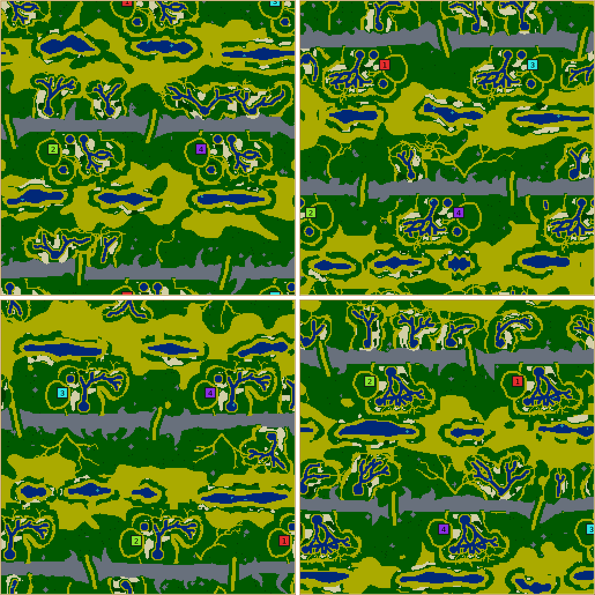
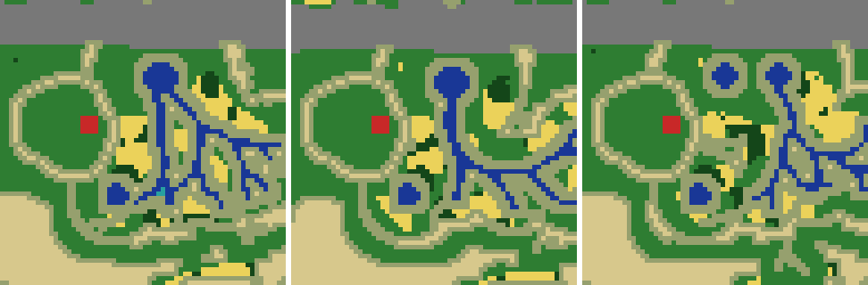
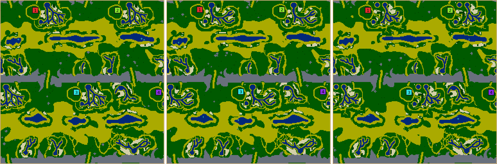
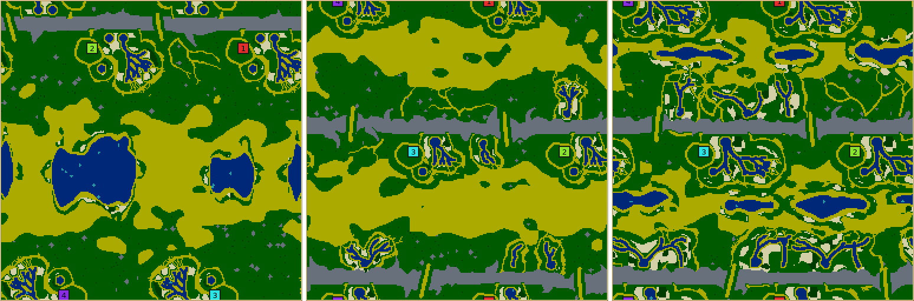
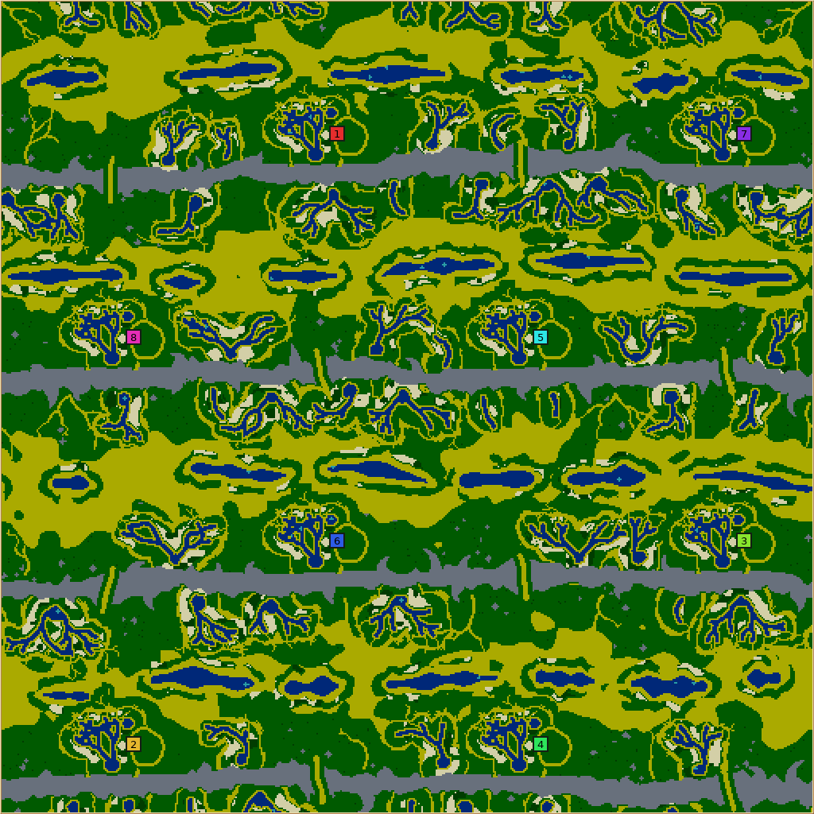

# Bajada

**Bajada** (`bajada`, numeric ID 55, revision 1) is a desert mountain front: the country where a dry
range meets its basin, as in the Mojave or the Great Basin. Long stone ranges cross the map, each cut
by a few passes. Below both faces of every range hangs a row of alluvial fans, each a spring at the
range's foot and a tree of streams that splits as it runs downhill, green along its streams and dying
out in sand washes. A belt of gravel runs along the foot of the ranges and gives way downhill to dune
sand; in the middle of each basin lies the playa, a chain of shallow lakes with salt-flat rims and
meadows. Every colony's home is a fan of its own with its town on the fan's dry shoulder.

## How it plays

- **A fan is a farm.** Crops regrow only where the growth probe finds water, so a fan's streams are
  its farmland. Every home fan carries its starter wheat in a garden between the town's ring and the
  streams, beside a small garden pond, a few steps from the swarm.
- **The gravel is room.** The belt along the ranges is grass that crops reach only near water:
  colonies build out onto it beside their fans. The basin's dune sand below it is walkable and
  unbuildable.
- **Neutral fans are the contested farms.** Fans between the homes and on the far face of each basin
  are fertile ground nobody starts on; their streams keep 26 tiles from every town, so the water
  within a short walk of a town is its own.
- **Ranges are walls.** Stone never runs out and cannot be cleared, so a colony's back is safe except
  through a pass. Passes are gorges between stone shoulders; the number per range is a control.
- **The playa is the middle.** Its meadows are the only wet ground away from the ranges, and they face
  the fans of the basin's other side. Swimming turns its lakes from obstacles into short cuts.

## How it is built

`src/map/generator/generators/BajadaGenerator.cpp`; the header comment (with the notes from four
review rounds) and the comments on the constants record why each choice was made.

| Stage | What happens |
| --- | --- |
| Plan | As many ranges as fit one `range-spacing` apart across the height. The slope from a range to its playa is shared: fans take 60% of it (34 tiles at the defaults, up to 60) and the widest playa the control allows takes the rest. A home design (Broad fan, Long fan or Twin springs) and a mirror image are drawn once per map. Homes go evenly along one face of each range (a single range's one basin takes both faces). |
| Home stencil | One home fan drawn in its own frame: springs at the range's foot, a town of radius 11 with a rough outline and a full ring of sand corners, a garden pond just outside the ring, and a distributary tree (`growBranches`) grown four times from the design's stream with the fullest kept, its streams kept seven tiles off the town. Green ground follows the streams, narrowing downhill, edged with a fraying fringe of sand corners. The kit (24 wheat, 14 wood nearest their seeds) and the fan's share of farmland are sown on the stencil's own growth field (`cropGrowthField`). Close homes get smaller towns so the fan keeps room. |
| Ranges | A centre line that sways across the map but never towards a home (per face), with massifs, a rough edge, spurs, and a core that always stands. |
| Passes | Wandering sand floors through the stone, the stone cleared a little wider, stone shoulders either side, at the phase farthest from the homes. |
| Neutral fans | At every slot whose apex clears a home's footprint: some left empty, a quarter dry (sand washes only), the rest a spring and a tree of their own; small fans get no pond. Washes run downhill past every leaf and fork once. |
| Playa | Lakes of varied lengths with salt-flat crossings between them, swelling into two or three basins, a lobed salt rim and a broken meadow. |
| Homes stamped | Every home's footprint is erased (lakes, neutral halos, dunes) and the stencil drawn over it, tile for tile, turned half a turn for homes below the far face. |
| Terrain and resources | Dune sand covers 48% of the open desert in bands along the contour that gather towards the playa. Stone on the ranges; the stencil crops; farmland on neutral fans and meadows (`furnishGround`); rock outcrops and lone scrub on dry gravel; fruit on the meadows; algae in the lakes. |

## Controls

Effects measured over 6 seeds at 256×256 with 4 colonies (low / default / high), from a 516-map study.

| Control | Range (default) | Effect |
| --- | --- | --- |
| Range spacing | 128–256 (128) | Ranges across the height (a 256 map has 2 at 128 and 1 from 144) and, with one range, longer fans and wider lakes: fan length 34, 39, 44, 53 and 60 tiles at 128, 144, 160, 192 and 224–256; water 4.9% at 128, 10% at 256. |
| Ridge width | 8–16 (12) | Stone share of the map: 7.2% / 10.1% / 13.1%. |
| Passes | 1–6 (2) | Passes per range, exactly. Neutral fans 12 / 9.7 / 3.5: at 6 the passes' clearances take most fan slots. |
| Fans per range | 3–8 (6) | Fan slots per 256 tiles of range: neutral fans 4.2 / 9.7 / 12 (7 and 8 both fill the room between homes). |
| Stream reach | 70–150 (100) | Length and forking of every stream tree: wheat tiles 1,318 / 1,987 / 3,176. Longer streams carry water further from home. |
| Playa | 0–100 (80) | Lake width only (the fans are sized for the widest): water 2.3% / 4.9% / 5.7%. |
| Home design | Random, Broad fan, Long fan, Twin springs | The one home stencil every colony gets. |
| Wheat amount | 0–200% (100) | Neutral fan, meadow and home farmland; above 200% everything fertile is already sown. The kit is guaranteed. |
| Wood, stone, algae, fruit amount | 0–300% (100) | Linear. The ranges are structural and not scaled. |

## Verification

- **Reliability.** 2,000 random rolls over every control, all eight shapes from 128×128 to 512×512
  and 1–12 colonies generated 1,618 maps; the other 382 were refusals naming what to change ("Too many
  colonies for this map"), all where home footprints would overlap: 128-wide maps with 5 or more
  colonies (some with 3–4 at wide ranges), 12 colonies below 512×512, a few 8-colony rolls. A second
  2,000 with other seeds: 1,604 generated, 396 of the same refusal, nothing else. Every control at
  its minimum and its maximum, and all of them at once, generate at 128×128/2, 256×256/4 and
  512×512/8. The shape sweep refuses only 64×64, 128×128 with 6 or more colonies, and 12 colonies on
  256×256, 128×512 and 256×128.
- **Validation** (`validateWorld`) checks that every home keeps its spring, that designed stone
  stands, that every home's terrain is the first home's tile for tile (except where crowded homes
  share tiles) and still holds its stencil's crops, that no town starts with a crop, that with the
  passes shut no range can be crossed, that no town's grass touches grass outside it where a crop
  could grow, and that every colony can walk to the first. The contract test in
  `test/MapGeneratorContracts.h` covers the envelope and its refusal, all three designs, resource
  extremes, 4,096 ticks of growth with every town still sealed, and refusals of damaged worlds.
- **Growth potential** (`.agents/skills/glob2-map-design/scripts/growth_potential.c`), seeds 1–6 at
  256×256 with 4 colonies:

  | Map | Water | Total yield | Yield ≤24 steps (median) | ≤48 steps (median) |
  | --- | --- | --- | --- | --- |
  | Bajada | 4.3–5.9% | 440–677 | 24–36 (28) | 59–102 (77) |
  | Forts | 13.0–13.4% | 1,348–1,666 | 27–50 (37) | 53–176 (123) |

  A desert has less food than a fortified plain; near-home food is about three quarters of Forts'.
  Every home is the same stencil, so the spread within a map comes from neighbours: over the
  reviewer's 40 default maps (revision before the garden pond) the best colony's 24-step yield was a
  median 1.15 times the worst's, and no map reached 2×.
- **Fairness** (start model): 0.93–0.97 averaged per control setting in the study.

## Review

Five rounds with an independent reviewer on frozen builds, recorded in the header comment. The
first previews read as rings, lozenges and blobs with almost no building room; the second as a green
park with stickers; the third as a desert front with glyph-like homes whose towns held one building;
the fourth fixed the homes but starved the opening (seed 202, every AI food-capped at 15–36 units),
which the garden and its pond fixed (Cortex 37–120, Cabino 58–80 on the same map).

## AI games

Maps the lobby would pick (`--candidates 5`) at 256×256 with four colonies of one newer AI, game seed
1, 25,000 ticks, `--telemetry team-timeline`, summarised with
`.agents/skills/glob2-map-design/scripts/game_economy.py`. Units per colony at the end:

| Map seed | Nicowar | Cortex | Cabino | Maxima | Forts, Nicowar |
| --- | --- | --- | --- | --- | --- |
| 101 | 69, 73, 95, 65 | 74, 74, 93, 83 | 94, 74, 50, 84 | 47, 89, 60, 45 | — |
| 202 | 69, 31, 72, 51 | 60, 33, 73, 73 | 52, 43, 47, 50 | 47, 64, 52, 48 | 24, 26, 26, 53 |
| 404 | 49, 70, 82, 127 | 100, 96, 83, 74 | 66, 70, 75, 69 | 64, 52, 48, 48 | 28, 23, 32, 24 |

No colony was eliminated in 25,000 ticks and none starved out; starvation deaths per map were 0–19
(Maxima 25–39). Eight Nicowar colonies at 512×512 (map seed 7) ended at 64–103 units. A 50,000-tick
Nicowar game on seed 101 went to war (132 units killed, one colony eliminated at tick 39,284), and
its final map shows the gravel, towns and routes still open; the lakes fill with algae.

Opening food decided the last review rounds: with the town moved onto dry gravel and the kit 12–16
tiles out, seed 202 capped every AI at 15–36 units; the garden (wheat beside the ring) brought
Cortex back to 68–120, and the garden pond raised the near-home growth potential by about five yield
tiles on every design. Single games vary widely (two runs of one map and AI differed by up to 40%),
so these are a sanity check, not a balance measurement.

## Limits

- Home fans are identical copies along their row: fair, and visibly stamped.
- Food near home is about three quarters of Forts'; the total is under half.
- 128-wide maps take at most 4 colonies (fewer at wide range spacings), and 128×128 with 4 colonies
  has no neutral fans; single-range maps put homes on both faces, half a turn apart.
- Some lakes pinch into a bow tie; twin-spring homes show their springs and garden pond as round
  pools.
- No rotation tournament or human playtest has been recorded.

