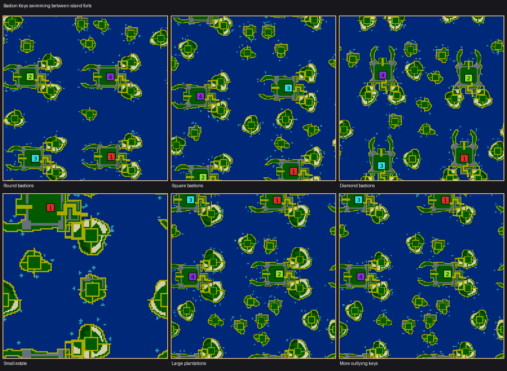

# Bastion Keys

Bastion Keys (`bastion-keys`, numeric ID 68) is an archipelago of harbour forts
whose wheat and timber grow outside their ramparts from the beginning.
**Swimming is required between estates and to reach outlying islands.** There
are no inter-fort roads or causeways. Each colony starts with a swarm and a
completed swimming pool.

The three signatures are stone bastions enclosing a clear town court, crescent
harbours, and paired exposed plantation islands. Short local supply piers connect
each town to its own farms and grain fields. A folded fortified landing guards
one gate; the harbour provides another. Attackers can swim to exposed plantations
or choose their landing around the fort. No towers are granted.

Each plantation has a permanent sand-contained service court. Each colony gets
at least 72 wheat and 32 timber tiles on its plantations, plus 48 wheat in two
small landing fields. Sand and water contain crop growth; no no-growth flags are
used. The pool and courtyard leave room for construction and upgrades.

## Controls and supported settings

| Control | Default | Range | Effect |
| --- | --- | --- | --- |
| Home size | 14 | 13–15 | Fort half-width and interior construction room |
| Plantation size | 14 | 14–18, step 2 | Size of each external home farm |
| Outlying islands | 3 | 1–5 | Requested neutral keys per colony, limited by open water |
| Resource amounts | 100% | 0–300%, step 25 | Wheat, wood, stone, algae and fruit |

Each map side must be at least 128 tiles, with at most one estate per 128×128 area:
128×128 supports one colony, 256×128 supports two, 256×256 supports four, and
512×512 supports all twelve. Other shared colony/worker limits apply. Crowded
requests are refused explicitly.

Wheat and timber amounts interpolate from starter guarantees at 0%, through
normal density at 100%, to fertile plot capacity at 300%. Landing fields stay
fixed. Stone walls remain at zero stone abundance; that control changes extra
outwork deposits. Fruit appears on neutral orchard keys. Requested outlying
islands may not all fit; telemetry reports both requested and placed counts.

Homes share a fort design and facing chosen once per map. Coastlines, home
positions and neutral islands vary. Starts have comparable opening budgets;
this natural archipelago does not claim exact competitive balance. Both axes wrap.

## Validation and review

The validator checks ramparts, gate isolation, outside production, permanent
building courts, starter access, completed pools, and swimming reachability.
After treating buildings and harvestable crops as cleared, no walking component
may join two estates or connect an estate to a neutral key. Both local plantation
courts must remain connected to their own town. Outlying courts and at least one worker from each colony must be reachable using
the engine's swimming movement predicate.

The generator uses existing simulation rules. It changes no engine behavior,
save format, replay acceptance, network protocol, AI, or existing generator.

Checked-in [review evidence](../../test/fixtures/bastion-keys/README.md) includes
native maps and a final save, parameter measurements, gameplay counters,
cross-platform checksums, translation review and profiling results.

The final swimming layout passed 2,508 supported requests across control,
random and shape studies; 2,773 unsupported requests were rejected explicitly.
Wheat, wood, stone, algae and fruit abundance increased their measured deposits.
Outlying islands saturate when the available water cannot fit another key.

Nicowar and Maxima established growing colonies in the opening tests. Cabino
struggled to staff its first inn with four starting workers, and Cortex resigned
early; these are known AI limitations, also observed in the Forts reference.
Automated games establish economy and combat behavior, not human enjoyment or
exact competitive balance.
