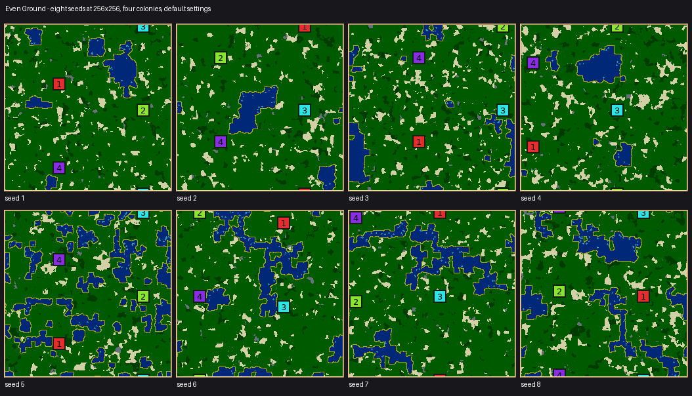
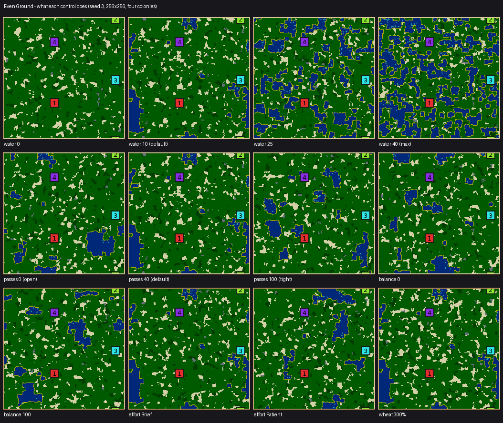

# Even Ground: terrain solved against targets instead of drawn

`even-ground`, legacy id 58. Source: [EvenGroundGenerator.cpp](../../src/map/generator/generators/EvenGroundGenerator.cpp).

Every other landscape in the catalog decides what it looks like and then works to make that shape
fair. This one has no drawn shape at all. It states what the finished map must be true of, and
searches for ground that satisfies it.

Worth looking at before reading the numbers: the ground is speckled rather than composed, because a
search over terrain mostly rediscovers noise. That is this generator's main finding about itself,
and it is the reason [the toolkit's own guidance](../../src/map/generator/shared/Solve.h) says to
point a search at a decision rather than at a landscape.

> **These figures predate the stream rename and describe different maps.** Renaming the
> generator's random streams moved every map it makes, so the numbers below — control
> correlations, fairness scores, refusal rates, river rates and the tournament — were measured
> on the previous maps. Revision 2 also corrects the crop-clustering objective. Treat the historical conclusions
> as hypotheses until remeasured. Current checks and results are recorded in the
> [review evidence](evidence/constraint-solved/review/README.md).

## The play contract

Experimental lake country: green plains with lakes and crop fields, with a search intended to
reduce differences in reachable resources and building room. This is a design target, not a
promise of balanced games. Because the balance is found by
measurement rather than by mirroring, the map is asymmetric — you cannot infer your opponent's
position from your own — and the ground between colonies tends to be the richest on the map, which
is where the fighting goes.

That last property is not drawn either. The catchment is walking-distance-decayed, so ground far
from everybody costs almost nothing in fairness to leave rich; the search discovers that piling
surplus into the middles is the cheapest way to satisfy its targets.

## The search

A map is far too big to search tile by tile, so the search runs on a lattice of cells 8 to 32 tiles
a side (roughly 16 to 32 cells along the long side, at least 6 along the short one). Each cell is
water, open ground, or a field of one crop. Two annealing passes:

| Pass | Move | Scored on | Cost per move |
|---|---|---|---|
| Shape | swap a water cell with a land cell | equal reachable land, width of the tightest way between neighbours, clear ground near every home, water forming a few lobed bodies, a severe penalty for cutting anyone off | every colony's walk re-measured |
| Stock | swap the contents of two land cells | every colony's decayed catchment of each crop equal, and the worst-served colony's catchment as large as possible | two terms per colony |

Both passes preserve their own budget and search only over arrangement, so a slider sets a quantity
the search may place but may not argue with. The exactness is on the lattice: the finished map
carries somewhat less water than requested, because painting lays a beach along every bank.

The solved lattice is painted through a jittered Voronoi with a noise warp, not as squares.

## What was measured

Canonical quality (`canonical_quality` in the JSON map report), median over 16 seeds at 256×256 with
four colonies, seeds 3001–3016. `fairness` is the report's own colony-fitness fairness; `worst fit`
is the weakest colony's fitness, which is an absolute measure rather than a relative one.

| generator | fairness | win-probability spread | worst fit |
|---|---|---|---|
| symmetric-arena | 0.998 | 0.001 | 0.497 |
| savannah | 0.940 | 0.057 | 0.392 |
| **even ground** | **0.930** | **0.065** | **0.204** |
| rain-shadow | 0.927 | 0.063 | 0.139 |
| watershed | 0.824 | 0.163 | 0.155 |
| continents | 0.796 | 0.198 | −0.144 |

So the search beats the asymmetric landscapes it is most like, matches Rain shadow, and does not
reach Savannah — which gets its balance from a designed contained home farm, a much stronger
mechanism at the range that matters most. Exact symmetry remains in a different class, as it should.

The pass that earns this is the stock pass: catchment spread falls from a median 0.366 before it to
0.006 after, a factor of about 60.

Noise floor: three disjoint 16-seed ranges gave fairness 0.884 / 0.894 / 0.890 on one configuration,
so differences under about 0.01 in these tables are not signal.

### Effort, over 16 seeds

| effort | water bodies (asked 2–5) | shore per water cell (asked 0.8) | shape moves kept | fairness | worst fit |
|---|---|---|---|---|---|
| Brief | 6.0 | 1.62 | 302 | 0.892 | 0.186 |
| Normal | 5.0 | 1.31 | 771 | 0.916 | 0.214 |
| Patient | 3.5 | 1.02 | 1801 | 0.913 | 0.221 |

The shape pass does not fully reach its water-shape targets at Normal; Patient nearly does. This is
a budget limit, stated rather than hidden — the telemetry reports target and achieved side by side.

### Balance, over 16 seeds

| balance | 0 | 20 | 40 | 70 (default) | 100 |
|---|---|---|---|---|---|
| fairness | 0.832 | 0.894 | 0.920 | 0.924 | 0.912 |
| worst fit | −0.015 | 0.160 | 0.173 | 0.192 | 0.188 |

## Four things that were tried and did not work

Recorded because each is a trap the next person to touch this will otherwise fall into.

1. **Speckle.** With only the fairness, room and route targets, the search produces a rash of
   single-cell puddles: scattered water satisfies every one of those targets as well as lakes do.
   The shoreline-length target exists to rule that out, and is not a matter of taste.
2. **Uniformity.** Equal catchments are most easily satisfied by making everywhere identical, so the
   maps came out featureless and every seed looked like every other. Two changes fixed it: a short
   catchment decay, which leaves the middles nearly free, and a per-seed target for the number of
   water bodies, which forces large-scale structure the even solution cannot provide.
3. **Plantable doorsteps.** Letting crops sit in the ring of cells around each home looks obviously
   right — a crop at the door is worth most to a catchment. It measured worse on both counts,
   fairness 0.912 → 0.875 and worst fit 0.124 → 0.053, because a cleared doorstep leaves every
   colony taking the same guaranteed opening patch from `secureStartingCrops`. The engine's own crop
   guarantee is the better leveller at that range.
4. **A balance slider that did nothing.** It originally weighted only the shape pass, and read 0.900
   / 0.896 / 0.912 across its whole range — noise. The pass that equalises a map is the stock pass,
   and it ran at full strength whatever the slider said. The slider is now how many moves that pass
   gets.

A fifth finding is about the map rather than the search: cells carrying a crop and how densely each
is planted buy different things. Trading cells for cover (11 per cent of cells at 55 per cent cover)
bought building room at the cost of fairness resolution. Many thin fields gives both.

Water share was set from a sweep over three seed ranges: fairness is flat from 10 to 20 per cent
while the worst colony's building sites fall steadily with every extra lake (about 1470 sites at 10
per cent, 1200 at 20, 750 at 35), so the default is 10.

The slider's *ceiling* was set the same way, after a later control study found the top of its
original range was not a map. Over 40 seeds at 256×256 with four colonies it refused on 10 per cent
of seeds at 50, 15 per cent at 55 and 20 per cent at 60 — colonies with no wood in reach, or too few
4×4 building origins to settle — and the band bought less and less of what it asked, the flood
saturating near 53 per cent actual water however much more was requested while build sites fell from
about 13,000 at 40 to 7,700 at 60. The range now ends at 40, where 80 seeds refused once.

The slider is a target, not a figure: the brief multiplies it by the seed's wetness
(`kWetLeast`–`kWetMost`), so it sets the middle of a band and one seed comes out a lake country and
the next dry downland. What it promises is its direction, and the study confirms it — mean actual
water rises monotonically across the whole range.

## What the controls do

Every value of every control, eight seeds each at 256×256 with four colonies, plus both extremes on
a small, a large and a rectangular map — 785 maps. Each control was given a claim, checked as a rank
correlation against the value:

| Control | What it should move | ρ | Range |
| --- | --- | --- | --- |
| `water-share` | water share | +1.00 | 0% → 37.2% |
| `passes` | passage width in cells | −1.00 | 6.0 → 3.6 |
| `balance` | catchment spread after the stock pass | −0.90 | 0.5 → 0.0 |
| `balance` | stock proposals made | +1.00 | 0 → 20,000 |
| `effort` | shape proposals made | +1.00 | 875 → 5,829 |
| `effort` | shape cost finished at | −1.00 | 1.5 → 0.4 |
| `wheat-amount` | wheat tiles | +0.99 | 43 → 7,462 |
| `wood-amount` | wood tiles | +1.00 | 40 → 5,681 |
| `stone-amount` | stone tiles | +1.00 | 0 → 982 |
| `algae-amount` | algae tiles | +1.00 | 0 → 511 |

`balance` and `effort` both buy search rather than shape, so they move the arrangement without
changing what the map is made of; `water-share` is the one that transforms it. The crop sliders
saturate near the top — wheat is flat from 250 per cent upward at 256², because the ground it is
allowed to plant on runs out — which is a ceiling on the map rather than a dead control.

## Cost and limits

- About 1.0–1.25 s at 256×256 with four colonies at Normal; 3.5 s at 512×512 with eight colonies at
  Patient. This is the slowest generator in the catalog, which is what a search costs. Telemetry
  collection adds about 1.4 per cent.
- Generation succeeds on 24/24 seeds at every shape tested except 512×128 with 8 and with 12
  colonies, which were 23/24; the failing seed is refused by the generator's own validator for a
  colony 25 steps from wheat against a limit of 24. The lobby retries, so this is not player-visible.
- A later sweep over seven shapes against 4–8 colonies, twelve seeds a cell, puts that rate at 9 late
  failures in 384 attempts (2.3 per cent). They are not spread evenly: every one falls on 512×512,
  512×128 or 128×512 — about 8 per cent of seeds on those cells and none at all at 256² or below —
  and every one is a marginal miss of the starting-crop guarantee (25 steps against 24, 33 against
  32) rather than a colony left without a crop. The 36 other refusals in that sweep are 64² with six
  or more colonies, refused up front with a reason.
- Requests refused up front: fewer than 6 cells on either lattice axis, or fewer than 12 cells per
  colony (a 64-tile map takes at most 5 colonies).
- **Not promised**: equal room to expand into, equal defensibility, or equal contact costs. Only
  catchments, reachable land, building room at home and route width are searched for.

## The tournament says this map is not fair

It has now been played, and **it fails its own premise.** Six maps, every rotation, two engine
seeds each — 48 games with `nicowar` in all four slots, against Symmetric arena as the control
([full report](evidence/constraint-solved/fairness-tournament.md)).

| | Position bias | Biased maps (BH) | Any-bias p | Best start / fair |
| --- | ---: | ---: | ---: | ---: |
| Symmetric arena (control) | 0.0 pp | 0 / 6 | 0.786 | 1.75 |
| **Even Ground** | **25.9 pp** | **3 / 6** | **<0.001** | **2.50** |
| Marchland | 12.2 pp | 0 / 6 | 0.059 | 2.00 |
| *fair-map floor* | *11.6 pp* | | | |

Position bias is the root-mean-square gap between each start's win rate and the fair 25%, corrected
for the scatter a fair map shows anyway. Anything under the 11.6 pp floor cannot be told from fair.
Even Ground is at more than twice that, Marchland is at it.

The individual maps are worse than the average sounds. On seed 2006 start 3 won **8 games out of
8**; on 2001 start 2 won 7 of 8; on 2005 start 3 won 6 of 8. Three of the six maps reject a uniform
split after Benjamini-Hochberg correction. Pooled over maps, wins by the generator's own colony
index run 3 / 11 / 16 / 18 (p 0.004) — a near-monotonic advantage to the colony it places last.

**Why this matters more than a tuning miss:** this is the generator whose entire argument is that
fairness should be *measured and searched for* rather than drawn. Its static fairness score is
0.894, in the same band as the hand-designed maps. The games disagree, and the map's own per-colony
fitness already disagreed — on seed 2006 the four starts scored 0.27 / 0.45 / 0.31 / 0.46, and the
0.46 start won every game. So the search is equalising the thing it optimises (decayed catchment of
each crop) while the thing that decides games varies widely across the same colonies.

That is not an argument against solving for fairness. It is an argument that **this objective is
the wrong one**: catchment equality with a short decay says nothing about expansion room, about
defensibility, or about how contact goes, and the fairness model's own fitness — which the same
tournament shows is genuinely predictive (rho 0.38 with win share, p 0.020, across both generators)
— is not in the objective at all. The obvious next move is to put fitness spread into the shape
pass's cost and re-run this tournament, not to widen a slider.

Until that is done this generator should be treated as **experimental and not balanced**, whatever
its start-quality score says.

## What has not been done

- **No human play**, so whether the contested middles produce the fights the design expects is still
  untested; and the AI result above is `nicowar` only, on 128×128 with four colonies.
- The tournament above is 6 maps a generator. It is enough to reject fairness for Even Ground (three
  maps individually significant) but not enough to certify Marchland as fair — only to say it is
  indistinguishable from fair at this sample size.
- Single-platform (macos-arm64) golden rows only; generator floating-point output is not promised
  identical across platforms, and this generator uses floating-point scoring throughout.
