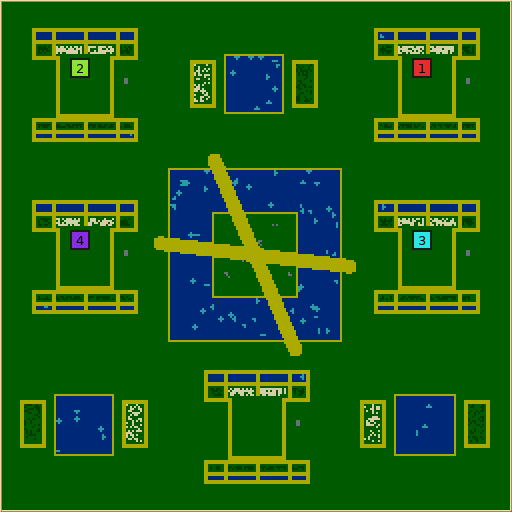
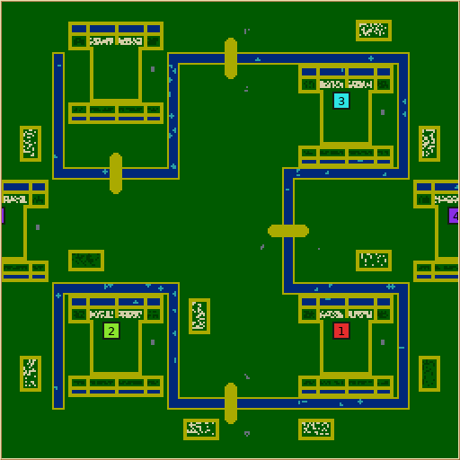

# Fractal maps and recursive geometry

## Play contract

**Sierpiński Gardens** (`sierpinski-gardens`, numeric ID 49, revision 2) surrounds a
central orchard island with a rectangular lake, eight first-level districts, and
smaller central-third lakes in eligible districts. Home reservations stop further
cutting. Opposing causeway pairs provide distinct island approaches; the outside
land remains joined across the torus. Every lake bank offers contained farms and
nearby construction land, and garden beds and ambient deposits fill the meadows the
recursion leaves between them.



Engine map preview: seed 20001, default controls, 256×256, four colonies.

**Hilbert River** (`hilbert-river`, numeric ID 50, revision 2) follows a continuous
Hilbert curve. Broad pockets between folds hold colonies. Walking around the river
ends and across map seams remains possible; direct bank crossings shorten those
routes, and swimming offers further alternatives. Orchards sit by regional crossing
courts. Farms follow both banks of every segment, and garden beds sit in the pockets
the folds enclose.



Engine map preview: seed 20001, default controls, 256×256, four colonies.

Both maps favor establishing an economy before contesting expansion. They permit
different surroundings rather than promise tile symmetry. Defaults are 256×256 and
four colonies. Supported inputs are 128–512 tiles on each axis and 2–8 colonies,
**subject to geometric fit**. In particular, dense 128-tile maps can lack room for
the requested number of homes. Every failed request is retained in studies; the
CLI does not substitute another seed. The evidence report records the measured
support envelope and any unresolved failures.

### Controls

| Gardens control | Range | Default | Meaning |
| --- | --- | --- | --- |
| `maximum-nesting` | 1–4 | 3 | Maximum lake nesting, stopped by district size or homes |
| `minimum-district-side` | 24–48, step 4 | 24 | Minimum side of children created by subdivision |
| `lake-size` | 75–125%, step 5 | 100% | Size relative to the exact central-third opening |
| `major-crossing-pairs` | 1–3 | 2 | Opposing pairs, giving 2–6 island approaches |

| River control | Range | Default | Meaning |
| --- | --- | --- | --- |
| `maximum-fold-depth` | 1–4 | 3 | Maximum uniform Hilbert order |
| `river-width` | 4–10 | 6 | Full stroke width in undermap-corner units |
| `minimum-land-spacing` | 24–40, step 2 | 28 | Bank separation before beaches |
| `local-crossings` | 0–2 | 1 | Optional shortcuts per eligible recursive parent |
| `major-shortcuts` | 0–4 | 2 | Optional regional shortcuts over the whole map |

Hilbert always retains one direct bank crossing with both optional budgets at zero.
It is mandatory by the map's play contract, although the open-ended river does not
necessarily disconnect land without it. Optional crossings must improve graph
travel; counts are upper budgets and reported shortfalls are possible. At 256×256,
spacing and homes commonly reduce order 3 to order 2. Maximum nesting is not an
instruction to destroy home ground to achieve a number.

Both have 0–300% wheat, wood, stone, algae and fruit controls. Home wheat/wood retain
an opening minimum at zero; ambient bank crops do not. Home stock density ranges
from 50% to 100%, and ambient bank density from 0% to 100%. Opening quarries retain
six tiles per module at zero ambient stone. Objective fruit/stone and algae scale
with their amounts. Plot area and permanent lanes do not grow with abundance.

### Garden beds and the open land

Until 2026-09-16 the land between the design's features carried nothing: deposits
lived only inside objective courts and contained plots, and both maps measured
around 1,400–1,900 resource tiles against a 7,800 median across the 48 playable
landscapes, third and sixth lowest of all of them. Three things now fill it, and
none of them may touch a home module, a crossing, an objective court or an existing
plot:

- **Bank plots** sit against the water, sharing the shore's own sand as their cap on
  that side, because how fast a crop regrows depends on how much water is near it and
  a plot laid a dozen tiles inland was not worth the walk. They slide along the bank
  and retry two tiles smaller before reporting an omission, instead of refusing on the
  first blocked box, and a site that would leave fewer than forty crop tiles is passed
  over rather than stamped. Gardens proposes all four banks of every smaller lake (was
  two); Hilbert proposes one plot on each bank of every segment, large and square-ish,
  since a plot's sand rim is set by its perimeter and many small plots cost a tenth of
  the map in rim alone. Three banks in four carry food.
- **Garden beds** are the home module at a quarter scale — a square pool, a ring of
  crops it waters, a sand cap that contains them — dropped on a jittered lattice
  through the open land, sized to the pockets between Hilbert's folds. They are the
  water away from the one fractal channel, in the same square-on-a-grid language.
- **Ambient copses** cover the rest: timber, on every other cell of the same 8-lattice
  the objective courts use, so 3×3 copses always alternate with permanent gathering
  lanes and open ground still outweighs them. The engine's saved `canResourcesGrow`
  flag holds each copse where it was put, so out here a patch is finite, something to
  go and take, and it can never spread into a route. Renewable food stays inside the
  contained plots. The lattice gaps are also what keep each module's expansion anchors
  available, which the finished-world check requires.
- **Stone** is not scattered at all. A handful of quarries — two plus half the colony
  count — go as far from every home as the map allows, each a clump the size of a
  building court, typically sixty tiles or more from the nearest module. The six-tile
  opening quarry inside every module is what keeps a colony from being stuck before it
  gets there. **Fruit** fills the objective courts instead, at full density: a court
  sits on the central island or beside a crossing, which is where a prize worth
  fighting over belongs. Scattering both across the whole map read as confetti and gave
  neither of them anywhere to be.

Measured over 128/256/512 maps at two to eight colonies, six seeds each, this takes
Hilbert from 1,871 to 4,902 resource tiles and Gardens from 1,422 to 4,442, against
a 7,764 median across the 48 playable landscapes; the maps stay
deliberately short of that median, since most of it is timber on landscapes that are
forest first. Water rises from 10.2% to 13.0% and from 12.7% to 18.0%, still well
under the field's 29.8%: these are maps of land
cut by one fractal channel, and the median belongs to archipelagos. Widening the
channel was tried and rejected — a seven-tile river leaves no room for a crossing
court on a 128 map, which costs the smallest supported size entirely — so the extra
water comes from the beds instead. `river-width` and `lake-size` remain the controls
for players who want more.

Inside a module, the two irrigation strips are five rows deep and continuous: the sand
aisles that limit crop width stop at the crops, where they used to run on through the
water and leave each strip as four short ponds. The timber side had two rows against the
wheat side's four and read dry, which is also how fast it fed.

The home module's outer sand cap is frayed one or two tiles outward over open grass,
from a hash of the home's own coordinates rather than any random stream, so the
colonies no longer all open inside an identical stamped rectangle. Sand is only ever
added, and only inside the 61×61 the module already reserves, so every containment
proof is unchanged. The fray is deliberately shallow: sand is not building ground,
and at four tiles deep it cost eight-colony 256 maps their ninth module's expansion
room.

### Home and start policy

`generators/FractalMapSupport` contains the economic policy shared by these two
maps; it is deliberately outside the neutral geometry toolkit. A home module
occupies roughly 56×56 corners. It contains 24×24 pure-grass construction tiles,
separate renewable wheat and wood plots, several harvesting aisles, a quarry,
and access to outside building ground. Sand caps contain most crop edges. A grass
service apron directly beside wheat fits feeding buildings; the existing saved
`canResourcesGrow` flag protects this apron from future crops. Near timber bays
shorten inn construction and upgrade deliveries; the southern plot supplies bulk wood. No emergency resource clearer may carve another crossing.

A bounded maximin search tries up to 64 initial anchors, with toroidal separation.
Gardens prefers complete first-level districts where they are large enough; narrow
maps use wrapped lattice anchors. Hilbert reduces the entire order when necessary
for homes, preserving entry/exit continuity. One spare module may be furnished
where it fits without reducing order. It becomes an expansion farm/court.

After terrain and resources are finished, start selection checks actual renewable
harvesting frontage, quarry access, expansion anchors, and walking/swimming contact
using engine movement predicates. It exhausts the small set of ways to omit a spare,
favoring the weakest economy and more even nearest-rival walking distances. Selected
sites are then randomly dealt to team indices. The completed world must connect
all colonies and fit ten separate 4×4 buildings per home on a six-tile grid, leaving
two-tile circulation lanes. A separate alternative layout must fit at least six full
6×6 upgrade envelopes with circulation; smaller initial buildings can occupy those
reserved cells without blocking their future growth. Counts of overlapping anchors
alone are not this proof.

## Shared primitive interfaces

### Reusable operations on existing toolkit modules

The generators compose these operations; home sizes, crop budgets, resource guarantees,
scoring weights, and rejection messages remain economic policy in the small shared
`generators/FractalMapSupport` layer.

| Module | New operation | Reuse example |
| --- | --- | --- |
| `Geometry` / `Drawing` | Half-open `RegionBounds`; exact wrapped `fillRectangle` | District reserves, crop beds, canals, masks |
| `BalancedStarts` | `selectSeparatedSites`: bounded deterministic maximin selection over legal tile candidates | Space city plazas or reservoirs before assigning owners |
| `Grid` | `groundUnitTiles(map, canSwim)` | Compare walking and swimming routes with the same engine predicate |
| `Resources` | `resourceFrontages(map, flood, range, fertility)` | Score quarry access or renewable harvesting faces using a previously computed catchment |
| `Growth` | `cropSpreadEnvelope(map)` | Prove sand-contained farmland cannot overrun a building court |
| `Room` | `potentialBuildingTiles`, `arrangeBuildingGrid` | Prove a city district fits separate buildings and access after all proposals are built |

`selectSeparatedSites` returns candidate indices, search attempts, and a failure reason;
it consumes no RNG and does not retry seeds. Shuffle the input explicitly when wanted.
Its limits are 4096 candidates, 32 requested sites, and 64 first-anchor attempts.

`BuildingGrid` specifies unwrapped bounds, rectangular footprint size, gap, and inset.
The arrangement considers every complete footprint in fixed row-major order, blocks
all of them in the walking mask, and requires a reachable cardinal face for each from
the supplied entrances. It reports failure if circulation is lost. This is a feasible
layout check, not a maximum-packing optimizer. The caller supplies the minimum count.
`potentialBuildingTiles` ignores mobile units but retains resources and existing buildings;
it describes future room rather than permission to place a building immediately.

The growth envelope floods pure grass from wheat/wood across seams, ignoring buildings
and current fertility. It deliberately overestimates spread, so containment survives
building demolition and fertility changes as long as terrain and saved growth restrictions remain.
`preventResourceGrowth(map, mask)` sets that existing tile flag without clearing resources;
it returns the number changed, or −1 for a wrong-sized mask without mutation. The
envelope honors these restrictions. Engine-growth fixtures and map round trips check
the actual mechanism, including wrapped tiles.
Frontage counts describe edges, not unique resource deposits or concurrent worker slots.

### `RecursiveGeometry.h`

`RegionBounds` are integer half-open `[x0,x1) × [y0,y1)` bounds in unwrapped tile
coordinates. `partitionRegions(bounds, divisions, maximumDepth, minimumSide, stop,
maximumNodes)` supports divisions 2 and 3. It computes shared boundaries once per
parent, distributes integer remainders without gaps, and assigns breadth-first IDs.
Each flat-tree node records its parent, children, depth, bounds, and terminal stop
reason. IDs belong to geometry, never to a team number.

The callback may return `Home`, `Spacing`, or `Caller`; the helper adds `Depth`,
`Size`, and `Limit`. A stopped region still covers its entire rectangle. The result
reports actual depth and an explicit failure. Defaults cap output at 16,384 nodes;
public arguments have separate safety limits. A limit failure is not a valid partial
map. Existing generators have not been migrated to these helpers.

`hilbertPath(bounds, maximumOrder, minimumSpacing, orientation)` returns ordered
points, segments, and its binary region tree. Segment IDs are path order; segment
hierarchy is the endpoints' lowest common ancestor. Eight global rotations/reflections
are supported. The decoder preserves recursive entry/exit continuity. Uniform order
is reduced until cell spacing on the shorter axis fits. Coordinates are transformed
before rectangular scaling; callers pass their own tile-unit widths to `strokePath`.
The helper never wraps a segment onto a shorter unintended route.

### `HierarchicalCrossings.h`

`selectCrossings(torus, regionCount, existingEdges, requiredRegions, candidates,
localPerParent, majorBudget, separation, seed, compatible)` accepts at most 256 graph nodes and
2,048 candidates. Each candidate carries a stable ID, two region IDs, endpoint
positions, level, parent, and travel length. Generators propose legal geometry.
Level zero uses the global major budget; higher levels use per-parent local budgets.

The selector joins required components first, then greedily maximizes the reduction
in all-pairs graph distance. It recomputes marginal benefit after each selection.
Mandatory crossings do not consume optional budgets. Stable integer seed/ID mixing
breaks ties without drawing generator RNG. Midpoint separation uses toroidal distance.
The result includes crossings in selection order, their benefit estimates, counts,
shortfalls, and connectivity failure. This is a bounded greedy heuristic, not an
optimal constrained-network solver; separation choices can prevent later connections.

The generators' coarse graph uses raster land floods that include seam and end-around
routes. The graph precedes resources and settlements, so final-world validation still
matters: a correct graph cannot prove a beach preserved a crossing, a building did not
block access, or farms left useful gathering frontage. Benefit estimates are not game
travel times. Gardens ranks an approach to the required island destination and stamps its opposing
counterpart as the same causeway pair. The counterpart is not credited in that coarse
benefit estimate. Pair paths may share the island court; geometric approach angles
and the shared compatibility predicate provide separation. Measuring only travel between outer banks would omit the island
objective and incorrectly reject valid maps with short seam routes.

## Worked reuse examples

```cpp
// Recursive city districts: reserve the administrative/home quarter before zoning.
auto city = partitionRegions({0, 0, 256, 512}, 2, 4, 24,
    [&](const RecursiveRegion &r) {
        return reservedDistrict(r.bounds) ? RegionStop::Home : RegionStop::None;
    });
// Each terminal's complete bounds become a district. Use its parent for regional roads.

// Nested reservoirs: thirds share exact boundaries even on a 128×512 torus.
auto reservoirs = partitionRegions({0, 0, 128, 512}, 3, 3, 24);
// Paint the central opening only in eligible nonterminal regions; preserve a land rim.

// Folded roads: geometry moves with the rectangle, road width stays three tile units.
auto road = hilbertPath({-32, 0, 224, 512}, 4, 30, 5);
std::vector<StrokePoint> stroke;
for (auto p : road.points) stroke.push_back({p.x, p.y, 1.5});
strokePath(roadMask, torus, stroke);

// Candidate bridges across canals: sampling does not assign owners or edit terrain.
auto proposed = transverseCrossings(road.segments, {0.5, 0.25, 0.75}, 8, 12);
// Filter candidates against protected masks with strokeIntersectsMask, then build
// crossingEndpointGraph(torus, passableTiles, legalCandidates). Its edges include
// ordinary streets, river ends and seam routes.
auto bridges = selectCrossings(torus, districts, streetEdges, requiredHomes,
                              legalBridgeCandidates, 1, 2, 12, seed);
if (!bridges.failure.empty()) return bridges.failure;
// Stamp bridges, finish terrain/resources, then check engine walking predicates again.
```

Keep hierarchy through rasterization: it distinguishes a shortcut inside one parent
from a regional connection, allows home reservations to stop only their descendants,
and makes achieved-depth/omission telemetry interpretable. Flattening everything to
an unlabeled bitmap throws away those decisions.

## Reproducible validation and pilot

`python3 -m tools.fractal_maps.plan --bundle BUNDLE --output PLANS` reads the immutable
bundle catalog and prepares training/held-out geometry, control boundaries, all-AI
mirror games, and four-colony Nicowar/Maxima blocks. Execution uses the existing
`tools.tournaments` coordinator and disposable local worker profiles. It creates no
alternative runner. Geometry studies disable candidate selection.

Evidence lives under `artifacts/fractal-maps/`; see its `INDEX.md` and the checked-in
[validation report](FRACTAL_VALIDATION.md) for exact build identities, commands, results,
tuning changes, support limits, and missing coverage. Saves/replays use existing
formats. No simulation, AI-policy, save-version, replay-version, or network-version
change is part of these generators. Cross-platform execution equivalence requires
actual matching checksum runs; local results do not establish it. Human fun remains
a maintainer playtest judgment.

### Operational validation notes

Pilot bundles precede the final registration audit: consult each bundle catalog when
reading numeric generator IDs. ID 33 remains retired; the delivered registrations
are 49 (Gardens) and 50 (Hilbert). Prototype IDs are not a save-format change.

The analyzer normalizes omitted control defaults and lists distinct successful and
rejected seeds per configuration in `support.csv`. Duplicate baseline/grid jobs do
not become independent evidence. Mixed seed outcomes require investigation.

The optimized custom-setup harness generates both maps at seed 20001, runs a real
match, and plays its replay with normal engine checksum assertions. The toolkit
harness independently checks zero-ambient-resource map serialization. These are
local platform checks; they do not establish cross-platform execution equivalence.

`crossingEndpointGraph` builds a coarse graph directly from a passable raster and
candidate endpoints, assigning endpoint-region IDs while retaining feature hierarchy.
Its wrapped floods include river ends and seams; it refuses blocked endpoints.
`strokeIntersectsMask` checks proposed corridors with the exact drawing raster against
reserved masks. `selectCrossings` also accepts a pure symmetric compatibility predicate
for constraints beyond midpoint separation (for example, keeping both shores of an
opposing causeway pair distinct). These operations support roads, canals, and bridges
without embedding either fractal map's layout.

Gardens first proposes its three usual opposing approaches. When home reservations
exclude too many, it tries a bounded five-degree angular grid, rejecting complete
strokes that touch protected irrigation water, crop corners, or the construction court.
Empty external home lanes may meet a causeway. Pair selection keeps both bank
approaches at least ten tiles apart, including across seams.
It never clears a home farm or changes the nested lakes to force a crossing.

`transverseCrossings` proposes perpendicular crossings along caller-supplied recursive
segments at stable fractional sample slots. Span and end clearance are tile units;
segment hierarchy survives in each candidate. It keeps coordinates unwrapped and
omits samples too near bends, with explicit size/input limits. Raster legality stays
with the caller. Hilbert initially samples midpoints, then tries fixed interior
fractions only when every midpoint court conflicts with homes. This also supports
bridges across canals or junctions along folded roads.
