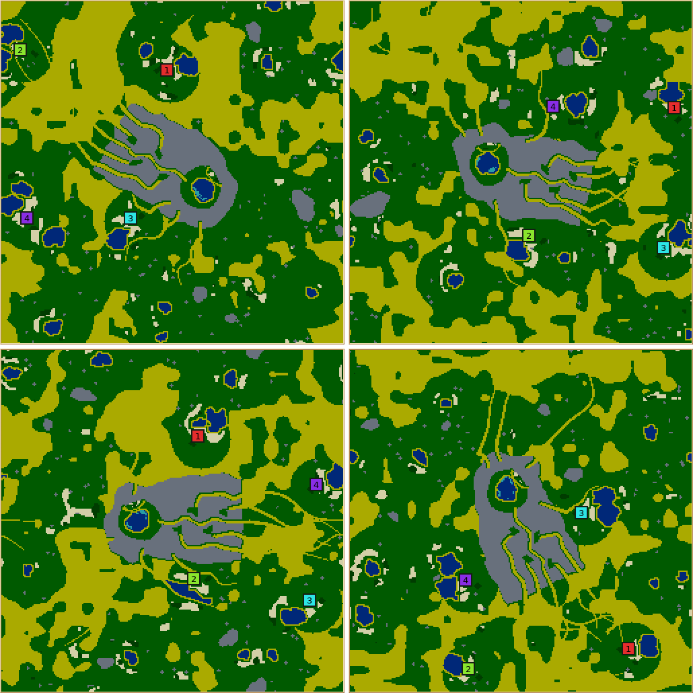
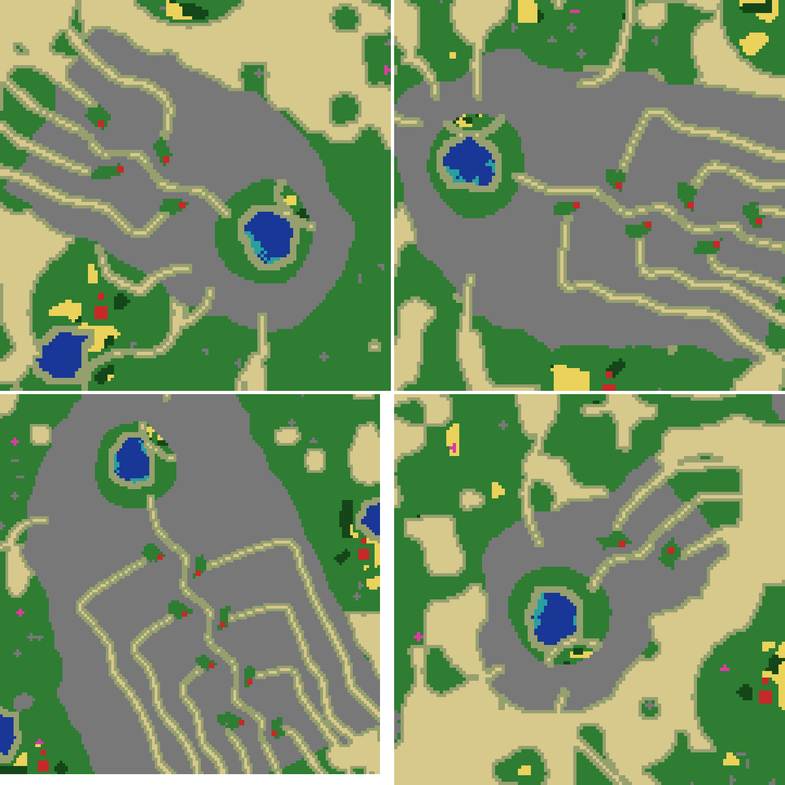
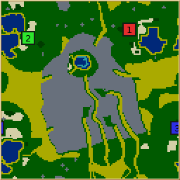
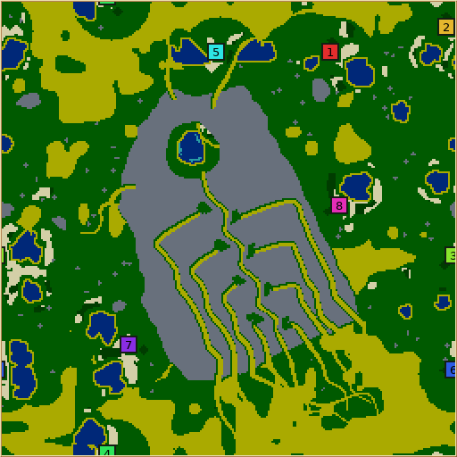
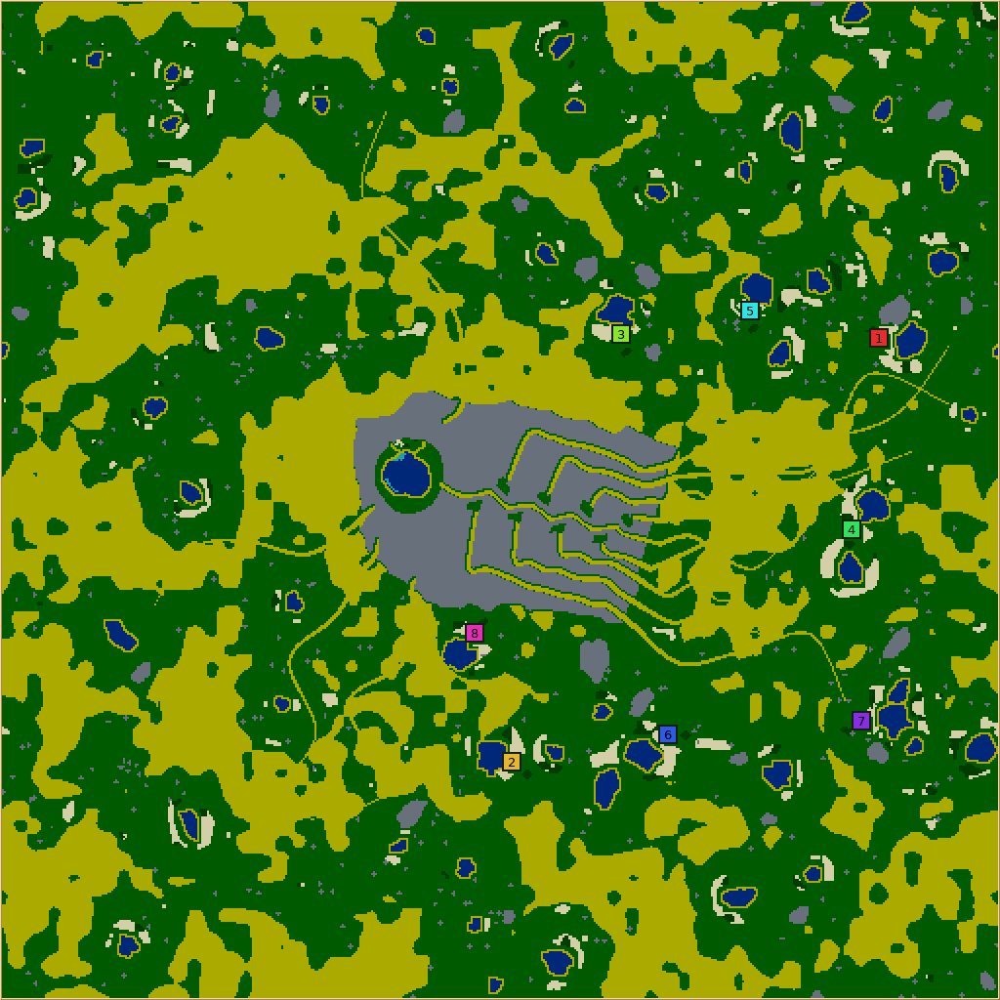
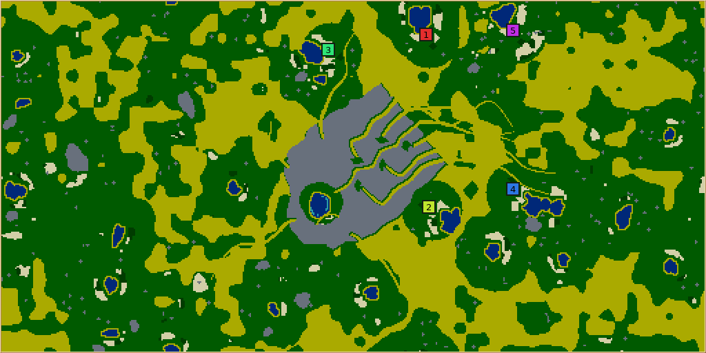

# Hidden Oasis

**Hidden Oasis** (`hidden-oasis`, numeric ID 57, revision 1) is dry canyon country of steppe, sand
seas, washes, mesas and springs, round one great sandstone plateau. Inside the plateau lies a hidden
basin with a green pond, the only algae in the world, and one winding slot canyon, the gorge, is the
only way in. Every colony starts with a defence tower over the gorge. It is
[Central Quarry](CENTRAL_QUARRY.md)'s game with algae as the prize and the colonies themselves as the
lock.

## How it plays

- **Algae is the prize.** Even a level-0 school costs 2 algae (its upgrades 12 and 10, a level-2 pool
  8, the top tower 2), and a worker may only work on a building of its own build level or below
  (`Building::canUnitWorkHere`), which it raises only at a school. Algae is harvested away and regrows
  only beside sand, so the pond's size is a sustained yield, not a permanent mine.
- **The colonies are the lock.** Every colony starts with one level-1 tower covering a three-tile
  pinch of the gorge, the towers on alternate sides of it and out of range of one another. A tower
  shoots over stone, so each stands outside the gorge, on a grass ledge behind two tiles of rock.
  Workers who walk the gorge under another colony's tower die; to reach the algae a colony must knock
  out the other colonies' towers.
- **Every tower has a back door.** Each ledge lies at the head of its own box canyon, which runs
  forwards inside the plateau in a lane of its own and opens on the cliff beside the gorge's mouth.
  Its owner walks in to resupply the tower (12 shots and the stone for 12 more; the canyon's walls are
  stone), rebuild it and defend it; attackers come up the same canyon. Each ledge has an open pad for
  a second tower.
- **Whoever breaks the seal holds the pond.** The basin has validated building room and a small
  garden of wheat and wood, sealed by sand so it never spreads, to feed a garrison. The gorge's floor
  is sand: nobody walls it or builds in it.
- **Every colony is as far from the prize.** Colonies start in a band of equal walk to the gorge's
  mouth (55 steps on 256×256 with four colonies, more with more colonies or on 512), at least 45
  steps from one another, on watered ground of a similar yield. Every tower's door is beside the
  mouth, so a colony fairly placed for the prize is fairly placed for the towers. A deep tower's
  canyon is longer, for its attackers as much as for its owner.
- **A granted school (on by default).** With the seal holding, no AI completed a school in any
  towers-on game, so a game with no other school is played at level 0 throughout. Every colony
  therefore starts with one finished level-0 school; the pond still gates more schools, every school
  upgrade, the level-2 pool and the top tower. Turning `Starting school` off gives the total lock.

## How it is built

`src/map/generator/generators/HiddenOasisGenerator.cpp`; the header comment and the comments on the
constants record why each choice was made, round by round of review.

| Stage | What happens |
| --- | --- |
| Frame | The gorge runs from the basin out along a random axis to the mouth; the whole plateau is centred on the map. |
| Gorge | One pinch for every colony on the axis, 10 to 12 tiles apart (unevenly), the first 12 inside the mouth's cliff and the last 10 from the basin; a bend between every two pinches sways either side. A Catmull-Rom curve (`splinePath`) stroked as sand corners, narrowed at each pinch. |
| Plateau | The rock the design needs (a back wall round the basin, a flank either side of the gorge wide enough for the outermost canyon lane, a cliff at the mouth) swollen by a lobed `RadialShape`, ragged by noise, and padded round every ledge so no ground outside lies within a tower's reach of one. |
| Posts | Towers on alternate sides. Each ledge is carved, not searched for: the band of ground from two tiles back from the gorge's floor to three more, a few tiles either way along the axis, swayed by noise. The tower site is the one that only just covers its pinch at range 5 and keeps the rest of the ledge walkable from the canyon; the pad is the farthest footprint from it. A ledge that fits nothing is carved again larger. |
| Canyons | The r-th ledge of a flank slides out to its own lane and follows it, swaying to its own rhythm, to the cliff. Blind canyons notch the rest of the rim. |
| Basin | A rough pond off-centre away from the entrance, building ground round it, and a sealed oval garden (`stampSealedOval`, shared with Central Quarry). |
| Country | Washes from every canyon turned towards one drainage direction; springs; the desert (the control's share of the country as sand where a noise field is driest, never near a spring or the mouth); mesas; the savanna kit; lone scrub trees where nothing regrows. |
| Sites | `spreadInWalkBand` (shared with Central Quarry): a band of equal walk to the mouth, spread by walking distance, preferring watered, evenly fed ground. Ledges are dealt to colonies by least sum of squared walks. The desert keeps 22 tiles off every home; a dry start is dug a pond off its route. |
| Finish | Kits facing the nearest water, topped up if crowded; pond algae from the shore inwards; the garden; the towers (`placeTower`, level 1, stocked); the granted school; trails to the mouth and to each colony's own ledge; routes; the crop guarantee. |
| Redraw | A design whose gorge left no room for a ledge, or whose country left the band no room, is drawn again (up to four times) before the request is refused. |

## Controls

Effects measured over 8 seeds at 256×256 with 4 colonies (lowest / default / highest), every value of
every control, 975 maps with the other sizes' extremes; the full tables are in
[the control study](evidence/hidden-oasis/CONTROL_STUDY_TABLES.md).

| Control | Range (default) | Effect |
| --- | --- | --- |
| Pond size | 5–12 (8) | The pond's radius in tiles, exactly (capped at 5 on 128 maps, ×1.4 on 512): basin building room 123 / 167 / 231 footprints. |
| Pond algae | 8–48 (24) | Algae tiles, exactly: the only algae on the map. |
| Starting towers | off/on (on) | Every colony's level-1 tower over the gorge; off leaves the ledges as open pads. |
| Starting school | off/on (on) | Every colony's finished level-0 school; off is the total lock. |
| Desert | 0–80 (40) | Sand 5.5% / 36% / 64% of the map; 4×4 building sites 39.6k / 21.1k / 9.3k; wheat 2,034 / 1,274 / 729. |
| Mesas | 0–10 (5) | Mesas placed 0 / 5.5 / 10.9. |
| Springs | 0–10 (6) | Springs placed 0 / 8 / 14; mean fertility 294 / 528 / 694. Dry starts are still dug ponds at 0. |
| Wheat amount | 0–300% (100) | Wheat 197 / 1,274 / 3,143 tiles; starter kits and the basin garden are guaranteed. |
| Wood amount | 0–300% (100) | Wood 80 / 448 / 1,250, scrub 0 / 151 / 453. |
| Stone amount | 0–300% (100) | Stone off the plateau 0 / 867 / 2,238 tiles (outcrops and mesas); the plateau's 4,201 tiles are its structure and never scaled. |
| Fruit amount | 0–300% (100) | Fruit 0 / 107 / 331 tiles, linear. |

There is no algae amount: the pond is the only algae, and `validateWorld` refuses any algae off it.
The study found three controls with dead steps (springs 5 and 6 one map; stone 50 and 75 one map;
fruit moving only at 50, 150 and 250) and fixed them: the last two came from the shared biome kit
counting outcrops and groves as whole numbers per 1,000 tiles, so the kit gained optional counts per
100,000 that only this generator sets.

## Verification

- **Reliability.** Every control at every value alone (975 maps: 256×256 with 4 colonies on 8 seeds,
  and each control's extremes on 128×128/3, 512×512/6 and 512×256/5): all generated and validated.
  2,000 random requests (seven shapes, 2–8 colonies, every control random;
  [rows](evidence/hidden-oasis/random-requests.jsonl)): 1,948 generated and validated; the other 52
  were one refusal at the request check, "The massif does not fit this map", all eight colonies with
  pond size 10 or more on a map 256 tiles wide or tall. No validation failures. About one map in
  twelve had its design drawn twice (a ledge that would not fit), and a trail was re-cut after the
  crop guarantee on 2 maps.
- **Fairness under random settings.** Longest walk to the mouth over shortest: median 1.13, worst
  1.41. Pond algae equals the request on every map.
- **Envelope.** Two to eight colonies; 128×128 holds up to three. More is refused at the request check.
- **Performance.** Profiled with `MapGeneratorProfileFixture` under `sample`. About half of generation
  was whole-map walking floods; the seal and ledge proofs now flood outwards from the basin and the
  ledges, trails are re-cut after the crop guarantee only where a walk no longer holds, and a shared
  bounded flood (`reachFrom`) replaced `floodFrom` for the site search's small floods. Twelve fixed
  requests across every size: 4.4–5.3 s of CPU before, 3.3–3.9 s after, maps byte-identical through
  every step but the trail change. Random requests average about 350 ms against Central Quarry's 570.
- **Shared code.** Central Quarry's site search, territory flood, trail opener, sealed garden, field
  trimming, wheat top-up, sliver removal and spline path moved to `shared/`, with Karst towers'
  design cache; every other generator's golden rows are unchanged.
- **Translations** in every catalog, reviewed by a separate agent (10 lines corrected).

## Review and playtests

Three rounds with one independent reviewer on frozen builds (2026-09-17), and 48 headless AI games of
30,000 ticks (Nicowar, Cabino, Cortex, Maxima) plus the reviewer's nine. Look and playability out of
10: 5/3.5, 6/4, 6.5/5.5. The findings that changed the design:

- **Round 1: a spiral gorge.** The pond lay about 170 steps from home and every tower 77–133 from
  its owner. Two schools in ten games, even with no towers; every tower fired its 32 shots and was
  never resupplied. The gorge became a short winding slot.
- **Round 2: nobody could serve the towers.** `Building::canUnitWorkHere` lets a worker serve only a
  building at or below its build level, which needs a school, which needs algae: a level-2 starting
  tower could never be resupplied or repaired. Towers became level 1, which level-0 warriors also
  hurt (5 a hit against armour 8, where armour 12 leaves 1). Placing each colony by its own ledge had
  made tower walks fair but put two colonies on one oasis and mouth walks up to 2.6× apart.
- **Round 3: every door beside the mouth.** Canyons that left the plateau sideways made a map fair on
  the walk to one's tower or on the walk to the prize but not both. Running forwards to the mouth's
  cliff fixed both with one search. The reviewer also found a rival's tower outside the cliff could
  reach the shallowest ledge, so the first pinch moved deeper and the plateau is padded.

[Game summaries](evidence/hidden-oasis/AI_GAMES.txt) for the last two rounds. With towers on and no
granted school, towers were resupplied (Nicowar: 29–74 stone and 98–224 shots a tower), AIs destroyed
some (Cortex three of four), towers cost Nicowar 5–26 workers a colony, and no colony completed a
school in any game. With the granted school, builders trained in every colony and 0–13 buildings a
colony were upgraded.

## Limits

- **The siege is a human game.** No AI besieges a tower on purpose, garrisons the basin or builds a
  forward inn; against an AI the seal is a toll. Whether a person can break it, hold the basin and
  feel the lead was earned needs a human playtest.
- **The pond is far.** About 100–120 steps from home with four colonies and 140–175 with six to
  eight, beyond what Central Quarry's review found an AI works. A forward inn at the mouth is the
  human answer.
- **AIs may spend their granted school.** No colony held a finished level-1 school at the end of any
  game; an AI upgrading its only school waits on 12 algae it cannot reach (unverified).
- **Eight colonies at most**, three on 128 maps: every colony adds a pinch to the one gorge.
- **Deep towers have longer supply lines.** In an eight-colony game the four shallow towers fired
  168–183 shots and the three deepest 15–34.
- **A level-3 tower on a ledge reaches neighbouring ledges.** The promise is at the starting range;
  only the pond's holder can build one.
- **The country is plain.** Sand seas and green oases in smooth patches; dune bands and scrub
  hollows would add texture. Wood rings unsettled springs over a long game (494 to 1,682 tiles in
  45,000 ticks), bounded by dry ground.
- **A dry start is not validated.** On 46 of 2,000 random maps a colony that landed dry had no room
  for a dug pond (telemetry `ponds.none`); the wheat near every swarm is validated, the fertility
  round it is not.
- **Colonies fill the mouth's side of the map**; the country behind the plateau is remote ground.
