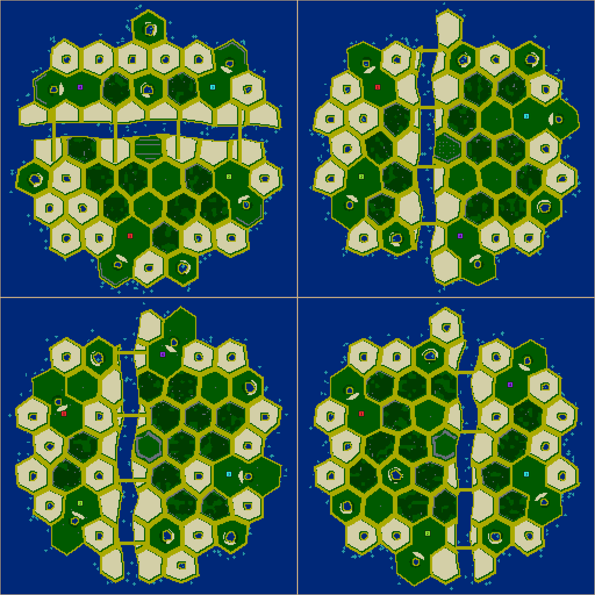
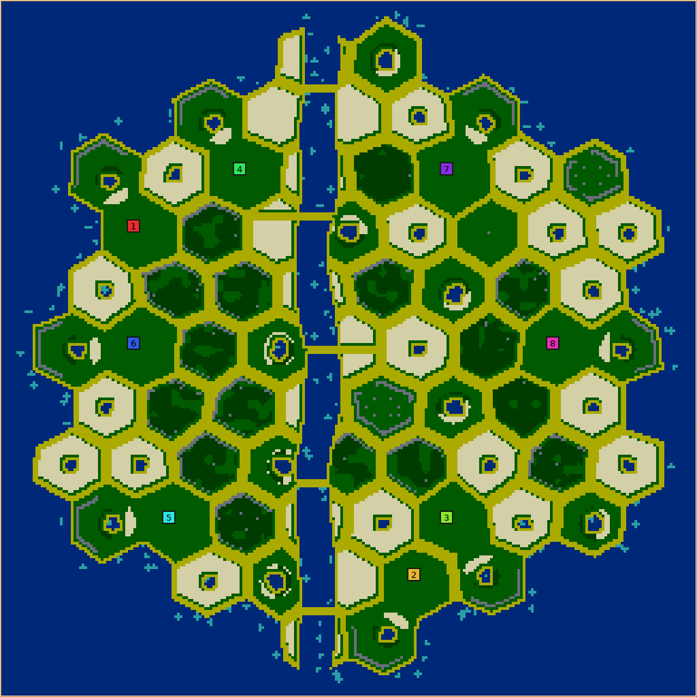
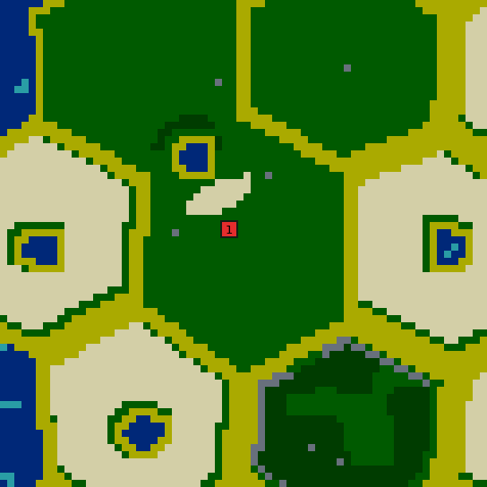
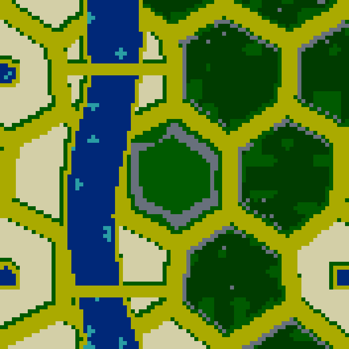
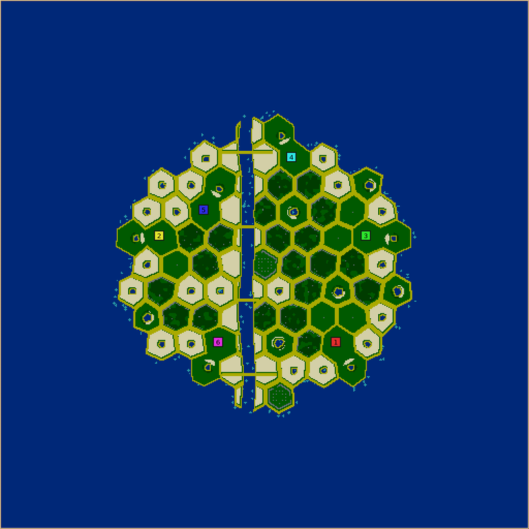
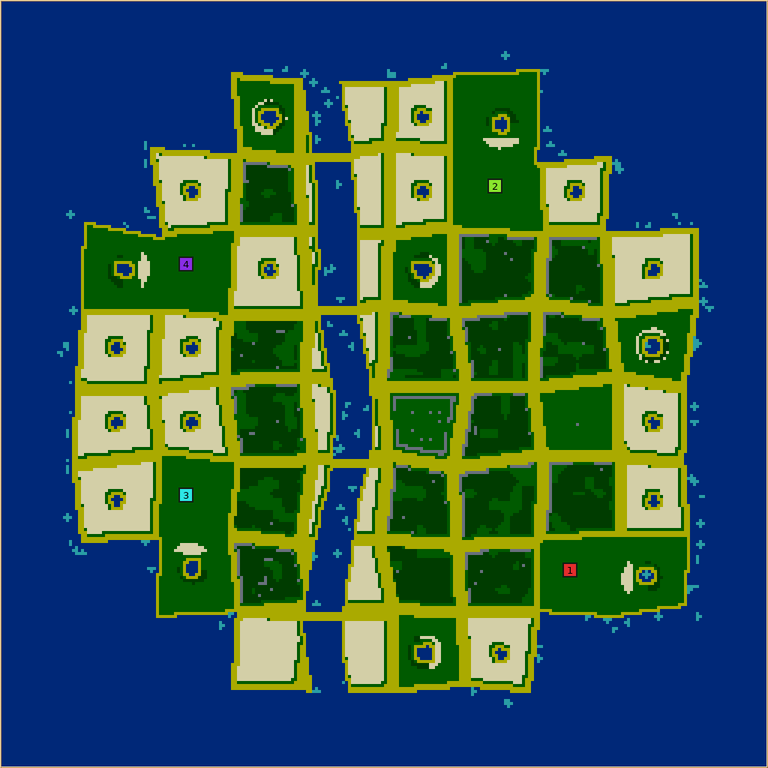

# Honeycomb isle

**Honeycomb isle** (`honeycomb-isle`, numeric ID 53, revision 1) is a city of hexagon blocks on an
island in a lagoon, cut in two by a wide river that a few bridges cross. Paved streets draw the
honeycomb. Pale wheat fields ring the island's edge and line the river. The blocks inside are ruins:
stone outlines broken open onto the street and filled with overgrown rubble, with a few open squares,
crater gardens round flooded craters, and the shell of a landmark at the middle with an orchard in it.
Every colony's home is two blocks with a cistern garden.

## How it plays

- **Crowded by design.** The city is only as big as the colonies need (`blocks-per-colony`), and the
  lagoon and river can't be crossed until units swim, so colonies start a block or two apart and
  nobody expands away from the fight.
- **Rubble is cover and lumber.** Rubble is wood: it blocks walking and building, and it is the
  city's main wood supply, so a colony builds its town by clearing its own cover. Cutting through a
  ruin opens a way into a neighbour's flank. Stone outlines can't be cleared, so ruins keep their
  shape and only their gaps and fill change hands.
- **Food on the edges.** Wheat fields fill the blocks along the lagoon and the river. The bridges are
  where the two halves of the city meet, and the landmark's orchard is the prize in the middle.

## How it is built

`src/map/generator/generators/HoneycombIsleGenerator.cpp`; the header comment records the original
vision, how it evolved and the tradeoffs.

| Stage | What happens |
| --- | --- |
| Blocks | A warped hexagon tiling (`hexTessellation`, pitch 150% of the block size) or squares at 140% (the same block area). Blocks shrink towards 16 on crowded maps. |
| River | A wandering band along one axis, all the way round the torus in three legs, a little off centre. Blocks it takes a fifth of are bank blocks. |
| City | The blocks nearest the middle, at most three fifths of the map's blocks, so a lagoon always surrounds it. A crowded map squeezes colonies down to three blocks each, and refuses them below that. |
| Homes | Two adjoining blocks per colony, spread farthest apart and kept off the river's banks, then dealt at random. One of three designs per map: **well yard**, **walled cellar** (the back of the outline still standing) or **garden court** (the well on the street between the blocks, stone posts round it). |
| Block kinds | The landmark (a **stadium**, **cathedral** or **station** shell round an orchard), craters (spread between the homes), wheat fields (every edge block, half the riverside blocks, and some inner blocks), and ruins, collapsed blocks and squares by weighted draw. |
| Streets | Paved with sand everywhere except inside a home. The sand seals every block, so each block is a plot of its own and no pond or field needs a sand ring. |
| Bridges | Sand decks across the river where it runs through the city, with rubble-free landings. |

On a small map the river can leave too few blocks away from its banks for the homes; the layout
then runs again without the river, and the lagoon still supplies the water.

## Controls

| Control | Range (default) | Effect |
| --- | --- | --- |
| Block shape | Squares, Hexagons (Hexagons) | The tiling. |
| Block size | 16–22 (18) | Target block size; crowded maps shrink it. |
| Street width | 2–5 (3) | Street bands; wider streets mean less building room. |
| Warp | 0–100 (50) | How irregular the blocks are (visual; no measurable effect on the economy). |
| Blocks per colony | 8–16 (11) | City size, and so how much of it is ruins. |
| Rubble | 20–90 (70) | How full the ruins are. |
| Outline gaps | 0–100 (40) | Chance each side of a ruin's outline is broken open; every ruin keeps at least one gap. |
| Craters per colony | 0–3 (1) | Crater gardens between the homes. |
| Wheat fields | Few, Normal, Many (Normal) | Few: half the edge and a quarter of the riverside blocks, none inside. Many: every edge and riverside block and more inner ones. |
| River width | 0–20 (12) | 0 removes the river. |
| Bridges | 1–6 (3) | Plus one per four colonies. |
| Wheat amount | 0–100% | Garden extras and how full the fields are (fields are full at 100). |
| Wood amount | 0–200% | Garden wood and rubble density (rubble is full by 150–200). |
| Stone amount | 0–300% | Masonry chunks in the rubble only; outlines are structural. |
| Algae, fruit amount | 0–300% | Algae in the shallows; the orchard grows from 0 to 6 groves. |

## Verification

All numbers below are from the final code unless marked otherwise. Scripts and raw results were
run from a session scratchpad and are summarised here.

- **Reliability.** 2,628 maps: every control at its minimum and maximum alone and together, on
  128×128, 256×256 and 512×256 with 2, 4 and 8 colonies, plus 2,016 random rolls over every control,
  seven map shapes and 2–8 colonies. None failed unexpectedly. The only refusals are 128×128 with
  5 or more colonies (always for 6–8). Water is never under 37% of the map (median 47%), no colony
  pair is unreachable, and every colony has at least 276 4×4 building sites.
- **Control study** (earlier build, same logic; 6 seeds per value at 256×256 with 4 colonies). Each
  control moves what it should: rubble 20→90 gives 1,390→4,610 rubble tiles, craters 0→3 gives
  0→12 craters, wheat fields Few/Normal/Many give 4,030/9,092/11,301 wheat tiles, algae and fruit
  scale linearly, street width 2→5 takes building sites from 4,350 to 3,760. The study also drove
  fixes: squares were at a fifth of the building sites until given the hexagons' area, wheat and
  wood amounts did nothing past their new maximums, and a minimum of 8 blocks per colony keeps
  ruins in the city.
- **Contract** (`test/MapGeneratorContracts.h`, `honeycombIsleContracts`): shapes and the refusal,
  all three home and landmark designs, resource extremes, 4,096 ticks of unattended growth staying
  inside every block, the design cache returning the same map and telemetry, and a colony stripped
  of its starter wheat failing validation.
- **Golden rows** for macos-arm64 and linux-x86_64.
- **Performance.** A generation asks for the design three times (the request check, generation and
  validation); the last design is cached per thread and its telemetry replayed, and whole-map
  distance transforms were replaced by local disc scans. Cold single-map time (median of 5 seeds):
  256×256 with 4 colonies 72→21 ms, 512×512 with 8 colonies 310→71 ms. A 214-map output corpus
  (terrain, resources, starts, dump and telemetry) was identical before and after. The shared
  `warpCorners` skips tiles that can't be nearer than the closest found so far; every other
  generator's golden rows are unchanged.
- **AI games** — see [AI games](#ai-games).

## AI games

Local calibration games on the final code: the map the lobby would pick for map seed 101 (256×256,
four colonies, `--candidates 5`), four copies of one AI, game seed 1, 25,000 ticks,
`--telemetry team-timeline`, summarised with `.agents/skills/glob2-map-design/scripts/game_economy.py`.
Only the newer AIs are played ([which AIs to play](../../.agents/skills/glob2-map-design/references/tuning-playbook.md#which-ais-to-play)).

| AI | Units per colony at tick 25,000 | Worker births | Wheat harvested | Notes |
| --- | --- | --- | --- | --- |
| Nicowar | 117, 34, 127, 113 | 41–74 | 656–1,022 | Colony 1 peaked at 55 and fell back; some fighting |
| Maxima | 75, 41, 82, 96 | 36–67 | 503–789 | Fighting and some starvation (up to 28 deaths) |
| Cortex | 77, 86, 48, 77 | 10–25 | 344–625 | Slow start; growth from tick 8,000 |
| Cabino | 92, 73, 94, 85 | 42–57 | 649–821 | Even growth, light fighting |

For scale, Forts on the same map seed reached 20–32 units with Nicowar in the same length of game
(an earlier session measurement). Colony 1 falling back in both the Nicowar and Maxima games could be
that start position or ordinary fighting; one game per AI can't tell, and a rotation tournament is
the next evidence. Earlier drafts measured Numbi at 5–10 units and Castor at 8–12 with two
colonies starved out.

## Limits

- On 512-sided maps with few colonies the city is a small island in a large lagoon (about 85–94%
  water with 2–4 colonies).
- Rubble and fields use the wood and wheat sprites; there is no rubble graphic.
- Fairness is statistical, not exact: the ruins, craters and fields between homes differ, and square
  blocks scored lower on the start-fairness model than hexagons over six seeds (0.76 against 0.85).
  No rotation tournament has been run yet.
- Numbi and Castor stall on this map (they harvest wheat but barely breed); by the maintainer's
  decision maps are not tuned for the older AIs.
- No human playtest of the final version has been recorded.

