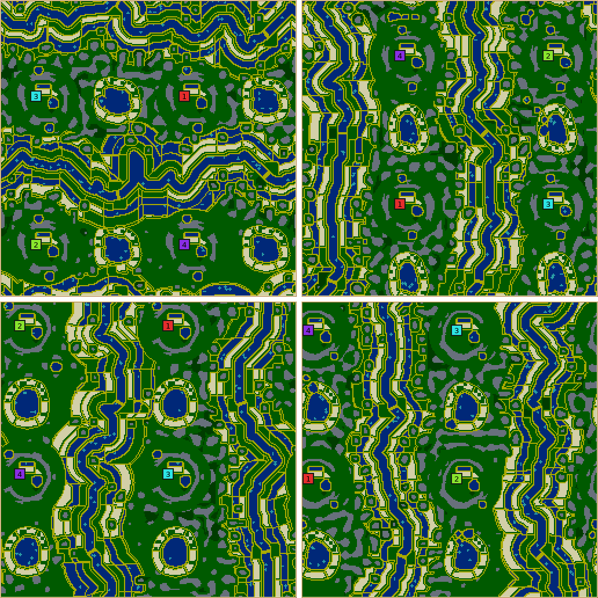
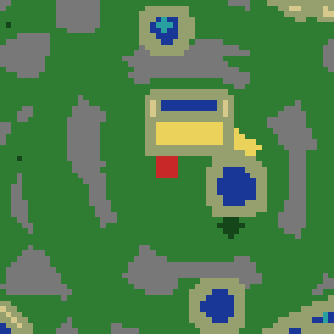
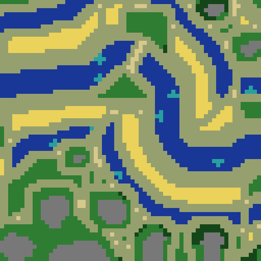
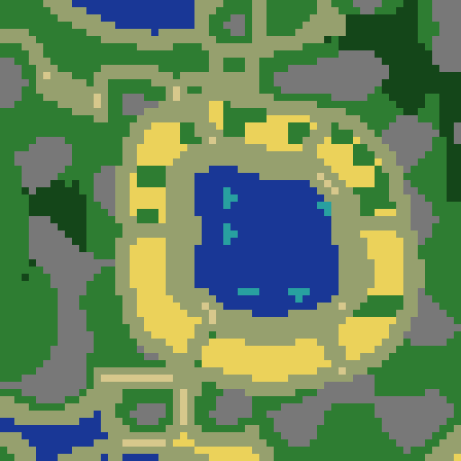
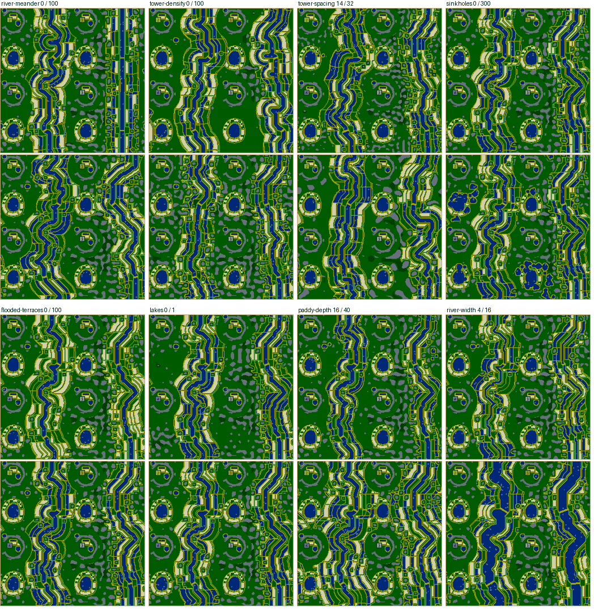
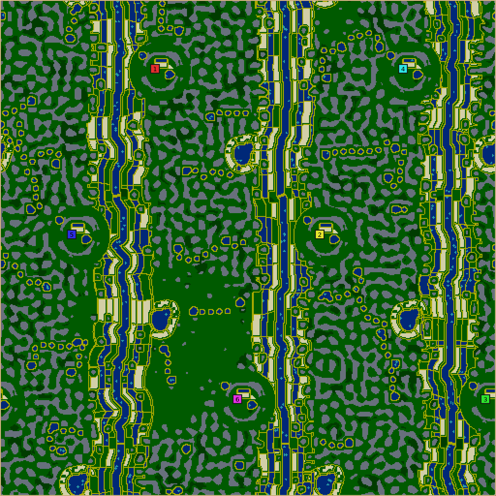

# Karst towers

**Karst towers** (`karst-towers`, numeric ID 54, revision 2) is river country among limestone
pinnacles, the way Guilin or Ha Long Bay look. Thickets of stone towers stand on open grass with
sinkhole ponds between them, rivers wind along the valleys between the rows of homes, and the flat
ground on their banks is terraced into paddies: strips of wheat between flooded strips. Every
colony's home is a bowl in the karst, a clearing walled by a ring of towers with gates, and a doline
lake in a ring of fields lies between neighbouring homes.

## How it plays

- **Gates are the only ways home.** Stone never runs out and cannot be cleared, so a bowl's ring is
  permanent and its gates (one, two, three or four, by the map's design) are where a colony is
  attacked. Home ground is safe and rich in stone, and it holds one irrigated paddy's worth of food.
- **The terraces are the surplus, and they are the front.** Rivers run between the rows of homes,
  so the river terraces lie between rivals. Fords, evenly spaced along each river, are where the
  rows meet; swimming turns a river from a wall into a shortcut through the paddies.
- **Food follows water.** Crops regrow by the density of pure water near them, so every field the
  map plants has water beside it: the home paddy's channel, the flooded terraces, the doline lakes.
  Flooded terraces trade wheat area for regrowth.

## How it is built

`src/map/generator/generators/KarstTowersGenerator.cpp`; the header comment and the comments on the
constants record why each choice was made. The design is a sequence of stages:

| Stage | What happens |
| --- | --- |
| Homes and rivers | Homes on a lattice (`latticeSites`), dealt at random. Rows of homes are found across one axis, and a river goes in the middle of every gap between rows wide enough for two of the smallest bowls and the river. On a square map the axis with more such gaps wins; of an even number of four or more rivers, every other one is kept. With no gap that wide, one river runs free round the bowls. Homes are sized to leave their rings and the rivers room. |
| Towers | The spots of a Turing pattern (`turingPattern`). A slow fractal noise lowers the cut where the karst is thick, so towers grow fatter and closer in thickets but never pool into one mass. |
| Bowls | A clearing, a solid ring three tiles deep with a lumpy outer edge, gates, and an apron. Ring edge, lumps and gate pools are read from one noise stencil at each tile's offset from its home, with one gate design and one facing per map, so every bowl is drawn the same. Gates face across the rivers. |
| Rivers | The cheapest walk round the torus through waypoints inside each river's band (`cheapestWalk`), dear within eight tiles of a tower, with a noise term for meander. A banded river may only step forwards along its axis, so it cannot double back. |
| Fords | Sand bridges straight across each river, evenly spaced along it from half a spacing past the first home, so with as many fords as homes in a row they fall between the homes. |
| Lakes | One lobed doline lake halfway between neighbouring homes in a row, the same shape each time, left out where it would touch a bowl or come within eight tiles of a river. |
| Sinkholes | Ponds at troughs of the tower field beyond the valleys, and from each a chain of pools towards the river that stops before the paddies, with land between the pools. |
| Valleys | Towers thin out towards each river, and none stands on a shore or a ford's landings. |
| Terraces | Bank bands by distance from the river (9 tiles of crops, 6 of water, repeating), cut across every 24 tiles of river by a flood of the centreline's index. A field's corners are bunds where the next field starts, one row of sand corners each. Water-ribbon paddies are flooded on every corner inside their bunds. A few crop-ribbon paddies are flooded too. Lake fields are six sectors in a ring 2–10 tiles round each lake, cleared of towers and never flooded. |
| Home water | A bunded home paddy north of the middle with a two-tile channel, a doline pond on the clearing's rim (the starter kit is planted round it), and a lobed pool beside the first gate and the third, where the design has one. |

Resources follow: the home paddies sown whole, a share of the dry terraces sown whole, the lake
fields in the same patches round every lake, woods in the thickets and in broken patches at tower
feet (wood that the water could spread is kept 16 tiles from bowls and lakes), orchards on open
ground off the bowls and paddies, and algae in the shallows.

A crowded map whose big homes or wide rivers leave a river no way through is not refused at once:
the design shrinks the homes two tiles at a time to the smallest home size, then narrows the rivers
to the narrowest, and telemetry records each step.

## Controls

| Control | Range (default) | Effect (6 seeds, 256×256, 4 colonies: low / default / high) |
| --- | --- | --- |
| Tower spacing | 14–32 (16) | The towers' wavelength; mostly visual. Wider spacing finds fewer sinkhole troughs (4.2 / 3.0 / 0.8 per map). |
| Tower density | 0–100 (50) | Thicket extent and lone towers: stone 4.9% / 10.2% / 13.8% of the map. |
| River width | 4–16 (7) | Water 9.0% / 12.3% / 20.6%. Crowded maps narrow it. |
| Fords | 1–6 (2) | Fords per river. |
| Paddy depth | 16–40 (24) | How far the terraces reach from a river: water 11.8% / 12.3% / 15.6%, buildable land 40.6% / 35.9% / 28.5%. Below 16 no flooded strip fits. |
| River meander | 0–100 (50) | How much the rivers wind; at 0 they keep to the middle of their bands and bend only round towers. Visual. |
| Flooded terraces | 0–100% (88) | Share of the water strips flooded, and in proportion a few crop strips: water 7.8% / 12.3% / 13.2%, wheat 10.9% / 7.9% / 7.4%. |
| Sinkholes | 0–300% (100) | Number and (up to double) size of sinkholes: water 12.1% / 12.3% / 15.9%, sinkholes 0 / 3 / 33. |
| Lakes | on/off (on) | Doline lakes and their fields: water 10.9% / 12.3%, wheat 5.9% / 7.9%. |
| Home design | Random, Horseshoe, Twin gates, Three gates, Four gates | Gate layout; the shortest rival walk is 124–147 steps by design. |
| Home size | 12–22 (15) | Clearing radius; crowded maps shrink it. |
| Wheat amount | 0–200% (100) | Sown share of the dry terraces and lake fields (terraces are fully sown by 200). Home paddies and the starter kit are guaranteed. |
| Wood, algae, fruit amount | 0–300% (100) | Linear. Towers are structural and not scaled by any amount. |

## Verification

- **Reliability.** 2,000 random rolls over every control, 128–512 sides and 2–8 colonies: 123
  refusals, all on 128×128 with 6–8 colonies or 128×256 with 6, each with a message naming what to
  change. The shape sweep refuses only 64×64 with 2 or more colonies, 128×128 with 6 or more, and 12
  colonies on 128×512 or 256×128. Every control at its minimum and maximum, and two all-extremes
  combinations, generate on 256×256/4, 512×256/6, 128×128/2 and 512×512/8.
- **Validation** (`validateWorld`) checks that every home keeps its pond, that no pure-grass tile of
  a paddy, home paddy or lake field touches pure grass of another field (so crops cannot spread
  out), that no gate is closed by stone, that every ford is dry, and that every colony can walk to
  the first.
- **Growth potential.** Measured with the engine's growth kernel over the final terrain
  (`.agents/skills/glob2-map-design/scripts/growth_potential.c`; "yield" is the summed growth chance
  of farmland in full-fertility tiles). Seeds 1–6 at 256×256 with 4 colonies:

  | Map | Water | Total yield | Yield ≤24 steps | ≤48 steps | Home 4×4 sites |
  | --- | --- | --- | --- | --- | --- |
  | Karst towers, revision 1 as first reviewed | 5.0–5.8% | 513–603 | 11–14 | 11–54 | 253–309 |
  | Karst towers | 11.4–15.0% | 1,662–1,938 | 28–56 | 52–237 | 223–302 |
  | Forts | 13.0–13.4% | 1,530–1,650 | 28–47 | 61–156 | ~199 |
  | Braided river | ~10% | 1,710–1,725 | 44–91 | 95–207 | — |

- **Fairness** (start model, seeds 1–6): 0.86–0.98.
- **Control study**: the table above; each default reproduces the earlier map tile for tile.

## AI games

The map the lobby would pick for map seed 101 (256×256, four colonies, `--candidates 5`), game seed
1, `--telemetry team-timeline`, summarised with
`.agents/skills/glob2-map-design/scripts/game_economy.py`. 50,000 ticks:

| AIs | Units per colony at tick 50,000 | Wheat harvested | Notes |
| --- | --- | --- | --- |
| 4× Nicowar | 84, 37, 141, 38 | 743–1,385 | No starvation to speak of |
| 4× Maxima | 78, 46, 79, 14 | 559–988 | The 14 lost 35 units in combat |
| 2× Cortex, 2× Cabino | Cortex 160, 90; Cabino 58, 56 | 736–1,925 | Cortex outbred even this harvest and starved 45 workers and 66 warriors late |

Over the same game wood grew by 0.1–17% and wheat by 0.4–4%, and buildable 4×4 sites fell 11–16%
with the colonies' buildings included. Forts on the same map seed reached 2–73 units with Nicowar.

## Limits

- On crowded maps (256×256 with 8 colonies) the rivers' bands shrink to nothing and the rivers run as
  straight canals; on very narrow maps (512×128) rivers and terraces flatten into parallel stripes.
- Bunds and beaches make much of the map sand-grass or sand-water mix (buildable land about 36%
  against Forts' 52%).
- Sinkholes near 300% give about 30 ponds on a 256×256 map and look blobby.
- Two colonies on a non-square map can score low on the start-fairness model (0.51 at worst in the
  random rolls).
- No rotation tournament or human playtest has been recorded.

