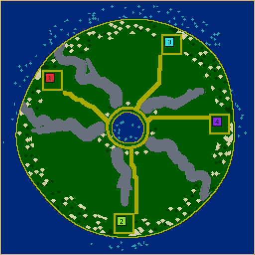
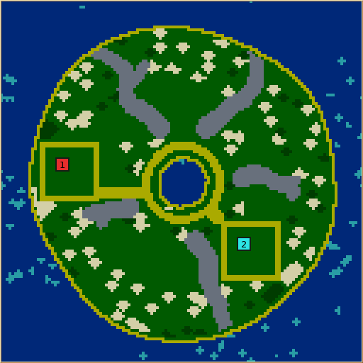
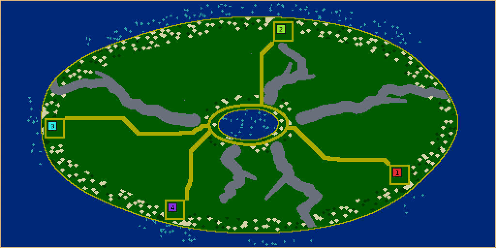
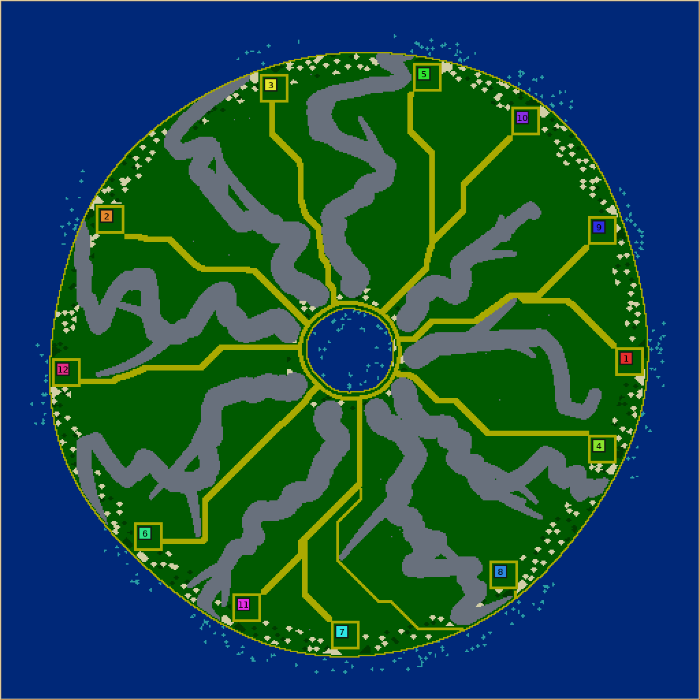

# Lava shield

## Play contract

Lava shield is an asymmetric volcanic island: a crater lake in a stone summit,
branching lava tongues running downhill, and unequal green wedges between them.
The ocean surrounds the island across the toroidal map seams. Colonies occupy
scored usable ground, not repeated angular slots. The crater is the only inland
water body; coastal and crater-side fields support renewable production, while
middle slopes supply relatively dry construction and expansion ground.

The opening should establish food, wood, population and training within a roomy
home clearing. First contact is a choice between neighbouring coastal approaches
and the exposed crater rim. The rim offers renewable farmland and fruit, with room
for feeding infrastructure. Swimming changes coastal approach costs; it never
allows units to cross stone. Stone is also an inexhaustible quarry, so ammunition
scarcity is deliberately not this map's pressure.

### Engine constraint and chosen adaptation

Legal stone deposits require pure grass. The beach pass separates that grass from
water with walkable sand. Consequently, simply drawing a stone tongue into the sea
leaves a beach bypass: it does **not** seal a coastal route. The user chose broad green gaps versus narrow beach detours, preserving the
inland crater. All colonies can meet on foot; swimming adds another approach.
No colony requires swimming to survive or meet rivals.

## Construction and validation

Reserve the crater, its walking rim, and the ocean before growing lava. Use
independently sized angular intervals and downhill walks with correlated turns;
never rotate one completed branch tree into colony copies. Collision checks stop
side branches before they erase usable wedges. Report requested and surviving
branches, refused growth and effective coastal variants.

Select homes by usable footprints, fertility, accessible supplies and separation.
Randomly deal selected sites to teams. Judge completed settlements with
`StartQuality`, retaining absolute resource-access and room floors; equal scores
alone do not prove equal expansion, contact costs or winning chances.

Keep starter guarantees distinct from ambient abundance. Scale every optional
resource layer, including rim fruit, with its control. Structural lava stays at
zero stone abundance. Sand reservations must preserve travel and construction
through future crop growth without adding home ponds that erase the crater's role.

Validation must inspect final pure terrain and resources: the crater survives,
stone remains legal and continuous where required, the reserved rim stays open,
homes have room and both primary resources, colonies reach the rim, and coastal
route claims hold under both walking and swimming. Reject infeasible settings or
failed essential geometry with a stage-specific explanation; do not quietly carve
through lava or add inland ponds as a repair.

## Evidence policy

Support limits and numeric tuning are recorded below. Seed sweeps, held-out seeds,
preview comparisons, resource extremes and actual AI expansion inform the defaults.
Generation repeatability, static viability, AI performance and human enjoyment are
separate claims. Missing platform and human-play coverage remains explicit.
The [504-request paired bulk study](LAVA_SHIELD_BULK_20260915.md) records
the final starter-field fallback, complete control coverage, compact and
rectangular results, translation audit and committed review artifacts.

### Review previews

These committed previews are native generator screenshots from the current
revision-1 implementation. They show the preserved crater lake, unequal green
wedges, branching stone, scored coastal towns and continuous beach bypasses at
four useful scales. Resource sprites appear as small light marks; the dark radial
shapes are quarry deposits.

| Default 256² | Minimum 128² |
| --- | --- |
|  |  |

| 512×256 rectangle | Denser 512² layout |
| --- | --- |
|  |  |

## Implemented interpretation

The user chose to keep the inland crater lake and allow narrow beach paths around
all tongues. Short tongues leave broad green coastal gaps; long tongues push that
route onto their beaches. All colonies can meet on foot. Swimming adds ocean
approaches and may shorten travel; it is not a prerequisite for crossing a seal.
The generator does not introduce a new terrain type or alter resource/movement rules.

### Controls and support envelope

| Control | Values; default | Player consequence |
| --- | --- | --- |
| Lava tongues | 3–9; 5 | More permanent ridges divide the slopes into more, smaller wedges. Independent of colony count. |
| Long tongues | 25%, 50%, 75%; 50% | Percentage of primary flows reaching the coast. Rounded to a count, with at least one long and one short flow. Changes broad versus beach-only coastal detours. |
| Branching | 0–3; 2 | Side-branch proposals per primary flow. Crowded or uphill proposals are omitted, with counts in telemetry. |
| Crater rim width | 6–12, step 2; 8 | Grass budget outside the fixed shoreline/circuit margin, before the stone roots begin. |
| Wheat/wood amounts | Shared percentage controls | Scale optional fertile patches; external starter patches remain guaranteed. |
| Stone amount | Shared percentage control | Scales sparse optional outcrops. Structural lava remains an inexhaustible quarry at zero. |
| Algae amount | Shared percentage control | Scales shallow-water clumps, using the engine-derived growth preference. |
| Fruit amount | Shared percentage control | Scales sparse rim prizes. Zero removes this reward; the fertile rim remains. |

Supported sides are 128–512 tiles, with aspect ratio at most 2:1.
The shorter side limits colonies to 2 at 128, 8 at 256, and 12 at 512.
On a 128-tile short side, or with more than four colonies on a 256-tile short
side, use at most five tongues and rim width eight. The highest-density combined
controls failed town/approach budgets in the first held-out study; this conservative
restriction keeps the tested default geometry budget at those densities. Larger
or less crowded worlds retain the full controls. These are explicit geometric
bounds, not a claim that every accepted seed succeeds.
The shared worker control supports 1–8 workers. The settlement operation itself
requires each worker to touch the swarm, whose adjacent ring has twenty cells.
Invalid dimensions/counts are rejected before mutating a world.

### Geometry constants and why they exist

All distances below are tiles unless stated otherwise. They are design heuristics,
not engine constants; the actual four-corner terrain rules and growth predicates
remain authoritative.

| Budget | Meaning and rationale |
| --- | --- |
| Island radius `0.43 × shorter side`, roughness `0.06` | A gently irregular island with ocean left across every toroidal seam, including at maximum positive coastline wobble. Stretch changes centres to fill rectangles; flow thickness stays in map tiles. |
| Crater radius `max(8, 0.06 × shorter side)`, roughness `0.08` | A visible lake at minimum size without consuming the whole slope. No starter ponds are added. |
| Crater circuit at local lake radius + 5, half-width 1.5 corners | Pays for beach and transition tiles and leaves a continuous sand route. The circuit uses approximately one sample per circumference tile. |
| Stone roots at lake radius + rim width + 5 | Separates the useful rim budget from the fixed shoreline/circuit cost. Thick root lobes form a broken stone crown; the openings admit approaches. |
| Angular interval weights `0.65 + U[0,1)` | Unequal green wedge sizes with a lower bound. The weights normalize to a full turn; no complete branch is copied into another sector. |
| Primary steps 3; angular memory 0.72; angular noise 0.055 radians | Bends persist over several steps instead of alternating in a noisy zigzag. Heading stays within 30% of the smaller adjacent angular interval. Radius always increases. |
| Width `clamp(shorter/70, 2, 5)`, roots ×1.8 | Thick roots taper to legible, raster-safe fingers. Width does not grow without bound on large maps. |
| Short-flow setback 12–22 × `sqrt(shorter/128)` | Broad coastal detours remain useful as size grows. A conservative minimum coastline radius protects the gap against a later bend. Long flows end beyond the maximum coastline radius. |
| Fork origins 25–75% along parents | Branches emerge along the slope, leaving roots readable and avoiding coast-tip stubs. |
| Fork lengths 35–60% of remaining radial extent; angles 0.35–0.65 radians; bend ±0.1 | Side growth makes asymmetric fingers without routinely reversing uphill. Half-width starts at 75% of the parent's and ends at 2. |
| Branch clearance 6; coastal clearance 8 | Optional branches must leave land between unrelated flows and keep the primary flow's coast/gap role. All primaries exist before forks compete. Paths belonging to the same primary (parent and siblings) are exempt and may merge into a lobe. An explicit radial check rejects uphill bends; `1e-6` only tolerates floating-point reconstruction at the shared root. |

### Town selection, crops and room

Candidates lie on a four-tile sampling grid. Each needs twelve tiles of
Chebyshev clearance from non-grass or structural rock, and must be 12–21 eight-neighbour grid
steps from ocean water (crater sources are excluded). A radial exclusion keeps crater-side candidates out so the
summit starts neutral. Fertility is summed over a 23×23 neighbourhood: the town and
its immediate external growing edges.

Each proposal starts in the fertile half of candidates, then uses shared weighted
maximin spreading. The preference multiplier spans 0.6–1.0, keeping spacing relevant
when fertility differs. A 28-tile Euclidean separation is an absolute floor. Sites
are dealt to team indices before placement. Four proposals are fully materialized;
`StartQuality` scores actual swarms, workers, harvest trips, resources and room.
A proposal must have wheat within 24 steps, wood within 32, at least 48 reachable
4×4 building origins, and weakest/best score ratio at least 0.65. Origins overlap;
48 does not mean 48 separate buildings. The winning proposal maximizes the shared
weakest-start score times fairness. Ties keep the earlier proposal.

Each town reuses `stampFarmPlot` to leave 16×16 pure grass inside a two-corner sand
ring. A sand approach begins just outside that ring and reaches the crater circuit,
protecting town and route from future crop growth. It first requests three tiles
of width. If that cannot fit, the same shared operation tries a one-tile route with the
same protected terrain and routing costs. Existing walkable non-grass beach
tiles are reused unchanged; only new stretches are painted pure sand. This explicit narrow-detour
fallback can be congested; static economic scoring does not measure convoy throughput. No guaranteed
crop may end up inside the town after repair. These reservations consume buildable
land deliberately; they make the remaining building space durable.

Starter wheat aims for 40 tiles, starter wood for 32. Their seeds maximize positive
engine fertility within a 16-tile box of the home; growth stays within 18 tiles and
outside all reservations. At least half each target must fit or the proposal fails.
This shortfall tolerance preserves usable harvest edges without moving water or
rock. Final walking access is checked separately; straight-line distance is not
accepted as a substitute.

The broad 2026-09-15 control sweep isolated rare failures at this stage: the
single highest-fertility seed can lie on an isolated grass island beside stone or
sand. A field below its acceptance floor now makes up to three bounded secondary
patch attempts. `seedForPatchCapacity` ranks legal clear ground by the number of
eligible tiles in its 5×5 neighbourhood, then fertility. This local density probe
costs work only after a shortfall, and avoids a full map-component search for
every team. Each retry has the same 16-tile seed and 18-tile growth reach, cannot
overwrite prior crops, and stops as soon as half the target exists. The generator
still rejects a town without sufficient renewable starter frontage. Sufficient
first fields use the original path. A whole map can still change when one of its
previously rejected settlement proposals becomes viable and scores above the old
choice; the paired bulk report counts these changes rather than assuming that
every formerly successful seed is byte-identical.

Ambient seed cells are seven tiles apart with independent jitter. Two thirds of
patch proposals are wheat (12 tiles at 100%), one third wood (8 tiles); counts scale
with the appropriate amount. Patches use positive-fertility grass, stop within an
eight-tile Chebyshev radius, and cannot occupy reservations. Large percentages can
saturate eligible space; proportional final tile counts are not promised.

Prizes sample jittered five-tile cells. On the rim, base fruit probability is
450/1000, scaled by fruit amount; each deposit draws one of the three fruit types.
Outside the rim, optional stone probability is 30/10000, scaled independently.
These sparse deposits leave circulation and outpost room. Algae uses one clump per
100 eligible shallow tiles at 100%, 1–12 steps offshore, preferring the best-growing
half of that band. The shared algae helper evaluates its own engine growth rule.

### Fallbacks, errors and final checks

- A side branch that collides, approaches the coast, or travels uphill is omitted.
  No partial clipping or extra retry silently fills its missing shape. Telemetry
  records requested, placed and refused branches.
- A site search can return an incomplete proposal. It does not shrink towns, cut
  rock, change water, or relax the separation floor.
- Approaches first reserve three tiles of width, then one if necessary. The wide
  failure leaves the terrain untouched. The narrow fallback changes no water or
  rock and keeps crop growth off the path; telemetry records its use and actual width.
  The caller identifies existing passages using native walkability and `!isGrass`,
  so mixed beach tiles need no illegal pure-sand conversion.
- Full proposals fail on missing town/worker room, absent fertile starter fields,
  starter patches below their floor, missing protected approaches, or quality floors.
  Scored selection records each failure and returns an actionable reason if none fit.
- Shared crop guarantees run with structural rock protected. A final crop-clearing
  route may remove crops, but fruit, stone and water stay blocked. The reserved
  sand approach should make that operation a no-op in ordinary cases.
- Final validation reconstructs terrain from the request, checks crater/ocean water,
  every legal structural rock tile, the entire reserved crater circuit, and actual
  worker connectivity to every colony and every part of the circuit. A failed map
  is discarded by the generation service.

### Reusable operations

`Drawing::downhillPath` is a deterministic, tapered radial random walk. It rejects
invalid/nonfinite geometry before drawing RNG, includes the exact end radius, and
bounds pathological requests to 65,536 segments. `Points::spreadRankedSites` supplies
weighted maximin proposals with toroidal spacing, stable ties and explicit partial
failure; it normalizes finite weights before multiplying distances to avoid overflow.
Neither operation assumes a volcano or a team count.

`Roads::reserveSandRoute` reserves a cardinal or eight-neighbour route of chosen
width in a terrain sketch. It protects every water corner and every tile the caller marks, including
corner-conversion margins. Failure leaves the sketch untouched. It cannot create
a ford. Radius 0 gives one pure-sand tile across; radius 1 gives three.
At radius zero, an optional existing-passage mask permits reusing caller-proven
walkable, crop-proof tiles without painting them. These tiles may sit beside
protected terrain but cannot themselves be protected. A nonzero radius with that
mask is rejected: narrow existing terrain cannot certify a broad road. This
operation is useful for mixed beaches and existing paths, independently of lava.
The caller supplies the semantic mask; the helper validates its dimensions and
still protects every corner it actually changes.
Optional positive tile costs guide Dijkstra routing. Eight-neighbour travel uses
10/14 cardinal/diagonal step lengths; cardinal-only mode keeps unit lengths. Costs
are bounded by `INT_MAX / tileCount / maximumStepCost`, avoiding path-sum overflow.
Malformed masks, negative radius or invalid costs fail atomically.

Lava shield supplies a smooth periodic noise field with 24-tile cells and costs
100–399. This roughly fourfold preference makes approaches bend around favoured
ground without encouraging huge detours. Eight-neighbour routing avoids the long
right-angle elbows observed in the first cardinal-only previews. The three-tile
width still reserves every affected terrain corner, including at diagonal turns.
The maximum supplied cost 399 also stays below the helper’s safe 585 bound at
512×512 with fourteen-unit diagonal steps.

`ScoredSettlements::chooseScoredSettlements` evaluates caller-provided settlement
proposals in fresh worlds. It copies the caller's current named RNG streams and
reuses the same engine RNG state for every trial, restoring engine RNG even on an
exception. It returns the winning sites and measured quality; the caller builds
those sites using the same callback and unchanged RNG state. Rejected trials never
mutate the destination. The proposal list is the work budget. This is separate
from the legacy `BalancedStarts` placement model and changes no existing caller.

Regression coverage lives in the existing `MapGeneratorDefaultsTest` toolkit
checks, already run by CI. It includes monotone radius and drift limits, terminal
width, repeatability, malformed input, seam-aware spacing, complete road width,
water/protected terrain preservation, atomic route failure, advanced named-stream
copying, engine RNG restoration on rejection and exceptions, and reconstruction of
a successfully scored proposal, and a protected corridor in which the atomic
three-tile attempt fails but a one-tile route fits, and an unchanged mixed beach
passage that cannot legally be repainted beside water and stone.


### Tuning findings retained for review

- Empty maps need **potential** fertility: `Fertility::forMap(map, false)` bypasses
  the existing-deposit gate while placing the first crops. The original default
  call measured zero on empty terrain and rejected starter fields. Final-world
  scoring still uses actual resources and engine growth rules.
- Resource-type ranges must include an upper bound. The empty-resource sentinel
  sorts above fruit; `type >= CHERRY` accidentally protected empty ground and
  prevented route repair. The final predicate is `CHERRY <= type <= PRUNE`, plus
  stone. Empty ground remains traversable.
- Four colonies on 128-square seed 1 could not fit the protected towns. The minimum
  size now permits two colonies, retaining the home, crater and stone budgets.
  The failed seed and its diagnostic JSON are retained in the evidence directory.
- Cardinal-only approaches looked mechanically rectangular. Smooth costs followed
  by eight-neighbour routing improved the paths without changing water or rock.
  Initial and final previews are retained so that this judgement is reviewable.


### Telemetry interpretation

Telemetry uses the shared bounded collector and stays disabled during disposable
settlement trials. The selected world's furnishing counters are therefore reported
once, rather than summing discarded proposals into the final map.

| Key family | Meaning |
| --- | --- |
| `lava-shield.tongues.requested`, `.long` | Primary count and effective rounded long-flow count. “Long” describes a coast-reaching design, not a walking seal. |
| `lava-shield.branches.requested`, `.placed`, `.refused` | Side proposals and collision/coast/uphill omissions. `branches.omitted` records the fallback when any are refused. |
| `lava-shield.crater.radius`, `lava-shield.rim.width` | Effective design-frame radius and selected rim budget in tiles. |
| `lava-shield.starts.candidates` | Terrain shortlist before complete-world trials. |
| `starts.scored.proposals`, `.viable`, `.selected` | Trial budget, number passing construction and quality floors, and zero-based chosen proposal (−1 on failure). |
| `starts.scored.outcome`, `.score` | Per-proposal outcome text and viable score; subject is the zero-based proposal index. |
| `lava-shield.approach.width`, `.narrow` | Width actually reserved (3 or 1), and an explicit fallback record when the one-tile attempt succeeds. |
| `lava-shield.approach.steps` | Centreline tile count per reserved approach; repeated records are separate homes. Diagonal steps are counted as tiles here, not Dijkstra cost. |
| `lava-shield.starter.wheat`, `.wood` | Actually planted guaranteed tiles per team; subject is the team index. Targets are 40/32, acceptance floors 20/16. |
| `lava-shield.starter.secondary` | Fallback occurrence when a starter crop needs another compact patch because the first seed had insufficient connected frontage. Successful first fields do not probe or change. |
| `lava-shield.ambient.wheat`, `.wood`, `.stone`, `lava-shield.prizes.fruit` | Actual optional tile placements, distinct from guarantees and structural lava. |

The generic algae helper supplies its existing counters. Counters reuse values
already computed by generation; they do not draw RNG or introduce analysis scans.
The bulk report joins them to final resource, room, movement and quality metrics.

## Verification and review evidence

Evidence is retained under `artifacts/lava-shield/` in this checkout. These are
primarily macOS arm64 release-build results. Linux x86-64 golden/contract checks
and a cross-platform continuation are recorded below.
The immutable tournament bundle identifies the exact binary, data, source snapshot
and build options. `build-options.json` explains the local warm-build data-path
fallback; tracked `SConstruct` is unchanged.

Reproduce the core checks after building the corresponding SCons targets:

```sh
build/src/MapGeneratorDefaultsTest lava-shield-contracts-final
build/src/MapGeneratorGoldenTest lava-shield-golden --require-rows
build/src/MapGeneratorGoldenTest lava-shield-golden --telemetry
build/src/MapGeneratorGoldenTest lava-shield-sweep --sweep 21/31
build/src/CustomGameSetupHarness
```

The sweep shard is the current zero-based playable catalog position out of 31;
recompute it if the catalog gains another generator. New golden rows use stable
ID 51 (it took 33 first, which is retired and never reused). Existing golden rows must remain unchanged. Use disposable `GLOB2_USER_DIR`
profiles as recorded in the evidence commands.

For an inspectable map:

```sh
build/src/glob2 --generate-map lava-shield -d "$PWD" --seed 7 \
  --width 256 --height 256 --teams 4 \
  --output artifacts/lava-shield/final-7.map \
  --preview artifacts/lava-shield/final-7.png \
  --json artifacts/lava-shield/final-7.json
```

The training and held-out studies use `tools.tournaments`, supplied immutable
bundles and a local worker. Their manifests, accepted native reports, compressed
artifacts and offline analysis remain in `training/` and `held-out/`. Width and
height in study job parameters are exponents; native report parameters are tiles.
`summary.json` deduplicates identical seed/settings for its distributions, while
retaining logical-job counts and all failures. `summarize.py` explains this step.

### Observed gameplay and visual limits

Previews include default seeds 7 and 20001, 128-square/two-colony seed 20002,
512×256/four-colony seed 20003, nine-tongue/widest-rim seed 30001 on 256-square
with four colonies, and same-size seed-7 Coral/Spider-web comparisons.
Lava shield retains a continuous green landmass with broad unequal wedges; Coral
and Spider web expose much more water between narrow land threads. The sand
approaches remain visibly constructed paths, even with diagonal noise-guided routing.

Two four-player games on default seed 7 ran to 16,384 ticks with game seed 19,
one all-Nicowar and one all-Maxima. Both ended at the tick cap with every colony
alive and armies trained. Nicowar had 65–104 units and 11–18 buildings per colony;
Maxima had 46–72 units and 6–11 buildings. At the final snapshot Nicowar had 4–13
critically hungry units per colony; Maxima had 0–3. This food stress deserves human
inspection rather than being hidden by the aggregate population growth.

Wheat/wood tile counts grew from 1,542/624 to 2,399/2,220 with Nicowar and
2,656/2,402 with Maxima. Total stone coverage remained 4,947 tiles. All colony pairs
remained walk-connected. Global overlapping 4×4 building origins declined from
17,788 to 15,003/15,827, retaining substantial dry construction space. These totals
do not prove that every colony has equal usable expansion land.

Seed 7's starting-score ratio is 0.9766, but nearest-rival walking costs span
75–148 steps. Swimming shortens some pair costs (for example 175 to 73), while
others are unchanged. Asymmetric access is an intended decision; equal economic
scores do not certify fair contact timing. These are static path costs, not observed
swimming tactics. Saves, replays, final-map JSON and previews are retained for both
AI games. No seat-balanced win study or human playtest was performed. The rim's tactical enjoyment remains a human-review question.

### Automated check results

- Default/primitive contracts passed again on the final binary, including the new
  independent tongue/rim request guards, actual structural-stone corruption
  rejection and clean rejection of unsupported rectangles.
- All 256 macOS arm64 golden rows matched again on the final binary; eight rows were added for Lava shield
  and no existing golden was changed.
- The focused colony sweep passed all 36 accepted combinations; unsupported
  128-square/four-colony and 256-square/twelve-colony requests were skipped explicitly.
- Telemetry off/on/repeat checks passed all 96 cases across 32 registered generators
  (including editor-only Uniform), with zero byte, outcome, RNG or telemetry failures.
  Lava shield seeds 1–3 took 574–648 ms without collection and 563–652 ms with it.
  The machine was shared with other builds, so this measures approximate generation
  cost and semantic safety, not a precise overhead percentage.
- The complete custom-setup harness passed, including real match/replay playback.
  Translation validation reported zero structural errors; five translation tests
  and one bundled-font coverage test passed.

The final translation inventory cleanup removed accidentally appended non-path
lines from `texts.incomplete.txt`; it now matches the unchanged baseline. The
immutable study bundle retains those unused lines. A seed-7 regeneration with the
corrected data produced **identical map bytes and complete JSON report**; see
`data-map-comparison.json`. The initial bundle predates the final combined-control request restriction. A
separate final bundle and validation cohort retain that change; successful layouts
inside both envelopes are compared below. Earlier results are not relabelled as
final-binary runs.

### Seed studies and the final support decision

The initial training matrix completed 52 logical jobs: 40 successful generations
and 12 intended invalid requests (four colonies on a 128-tile short side). Four
successful inputs repeat the default baseline, leaving 36 distinct successful
seed/settings pairs. All 144 settlement trials for those distinct worlds were
accounted for: 142 viable and two rejected for insufficient starter-field area.

The first held-out matrix completed 112 jobs: 107 successful generations and five
construction failures. All five failures belonged to the two deliberately combined
crowding cases: nine tongues, rim width twelve and branching three, on either
128-square/two-colony or 256-square/eight-colony maps. Three of four small-map seeds
lacked enough complete home proposals; two of four crowded-map seeds lacked a
protected approach. Those eight requests now fall outside the final envelope.
The other 104 held-out requests all succeeded, including all sixteen default seeds,
individual control endpoints, resource extremes, rectangles and the default
maximum colony counts. The five original failures are retained rather than rerun
or removed from the first cohort's denominator.

The final guard deliberately uses the short side and colony density, rather than
recognizing individual failing seeds. It retains the tested default tongue/rim
budget for compact towns. It does not reduce home size, crop guarantees, separation
or approach width, and does not make secret layout repairs. The separate
`final-validation/` cohort checks this revised request boundary and fresh seeds.


The envelope-validation cohort then exposed three failures among four new
512-square/twelve-colony/nine-tongue/widest-rim seeds. A one-tile *pure-sand*
retry also failed the retained seed 30001: the beach bypass existed, but repainting
its mixed terrain would spoil neighbouring stone. The final shared route operation
can instead reuse existing walkable, non-growing terrain unchanged. New portions
still become sand under the original corner protections. This is the user's
beach-detour interpretation expressed as a reusable operation, not permission to
write stone onto sand or water. The extra terrain-predicate scan is lazy: it occurs
once per settlement proposal only when a wide approach fails, and later sand
reservations cannot invalidate its cached permissions.

Offline training analysis uses 1,000 bootstrap draws with seed 19. The stress and
final validation reports use zero bootstrap draws: their purpose is descriptive
counts, ranges, failures and complete metric retention, not inferential balance
claims from four seeds per extreme. All raw observations and percentile summaries
are retained; the zero-draw reports intentionally omit confidence intervals.

| Retained cohort | Logical jobs | Generated | Invalid requests | Construction failures |
| --- | ---: | ---: | ---: | ---: |
| Initial training | 52 | 40 | 12 | 0 |
| Initial held-out matrix | 112 | 107 | 0 | 5 |
| Envelope validation before existing-beach reuse | 48 | 37 | 8 | 3 |
| Final existing-passage validation | 32 | 28 | 4 | 0 |

These are successive immutable builds, not pooled independent samples. The final
cohort uses fresh seeds 40001–40004, retained dense seeds 30001–30004, eight paired
default/small inputs, and four expected compact-envelope rejections. All 28 accepted
requests succeeded. Minimum observed starting-score ratio was 0.8654; the minimum
local overlapping 4×4 building-origin count was 226; maximum starting wheat/wood
walking distances were 11/14. Of those maps, only the three formerly failing dense
seeds selected a narrow fallback, each for one of twelve approaches. The fourth
dense seed kept all twelve broad approaches.

All eight paired final-map reports match their earlier physical/quality reports
exactly after excluding the intentionally extended telemetry trace. Final seed 7
also has identical saved map bytes, preserving both four-player AI runs. The new
collector adds approach-width records. Final default/primitive contracts passed;
the final golden update retained every baseline row and added only the generator's eight
rows. Final telemetry off/on/repeat checks passed all 96 cases with zero semantic
failures. Lava shield seeds 1–3 took 733–1,401 ms off and 959–1,157 ms on under shared
host load; these noisy three-sample timings are not an overhead estimate. All four
bulk analyses had zero missing or truncated telemetry traces.

### Existing Nicowar limit found by the larger playtest

The twelve-colony Nicowar smoke game crashed in the existing enemy-building
iterator. A twelve-colony **Old growth** control reproduced the same SIGSEGV and
stack. Source inspection finds an apparent missing array bound in
`enemy_team_iterator::set_to_next`: it looks for a null sentinel, while a full game
occupies every one of `Team::MAX_COUNT` (twelve) slots. The filtered crash reports,
initial saves, replay prefixes and reproduction command are retained in
`artifacts/lava-shield/NICOWAR_12_COLONY.md`. This is an AI compatibility limit
independent of the new terrain; twelve-colony generation success must not be
presented as safe Nicowar play. A Maxima run exercises the larger map separately.

Maxima completed the rescued twelve-colony seed 30001 to 8,192 ticks with every
colony alive: 11–23 units and 3–5 buildings per colony. Eleven colonies had no
critically hungry units at the final snapshot; one had one. Wheat/wood coverage
grew from 2,962/1,336 to 3,999/4,095 tiles, while stone remained 32,532. All colony
pairs remained walk-connected, and global overlapping 4×4 building origins declined
from 70,663 to 68,002. This exercises growth around the retained narrow passage;
it remains an opening smoke test, not a measurement of late army congestion.
The map, replay, initial/final saves and final native analysis are retained in
`maxima-beach-30001/` and `maxima-beach-30001.json`.


### Linux and cross-platform compatibility evidence

An isolated source/build directory on the configured Linux x86-64 host compiled
the same implementation with GCC 15.2. The native default/primitive contracts
passed. All 256 Linux golden cases passed after adding the eight Lava shield rows;
all 256 macOS cases are also covered. The final table retains **every pre-existing
row** and adds sixteen rows total. The copied-cache build procedure, source-archive
hash, compiler/platform identity and logs are retained under `artifacts/lava-shield/linux/`.

Both platforms loaded the exact same four-colony Maxima initial save from seed 7
(game seed 19) and ran 2,048 ticks. The entire checksum sidecar, including every
tick and per-entity details, is byte-identical. Their recorded replay files are
also byte-identical, verifying the same orders as well as the resulting simulation.
See `cross-platform.json`, `cross-macos/` and `cross-linux/` for hashes and raw files.

Direct generation of seeds 7 and 30001 produced platform-specific map differences;
the native Linux reports and maps are retained. The repository already keeps
platform-specific generator goldens, and the final Lava shield rows do likewise.
A seed alone therefore does not promise identical generated map bytes across these
platforms. Transfer the saved `.map` when comparing games. The verified identical
continuation starts from the same saved state; it is not a claim that independent
generation is identical. Windows execution and human balance play were not tested.

### Follow-up AI playtesting and default tuning, 2026-09-15

[Checked-in playtest summary and telemetry](evidence/lava-shield/playtest/README.md)
contains the 512-tick economy series, game summaries and a finished preview.
The exact Linux bundle, verified saves/replays/logs and full native reports
remain in this checkout's local `artifacts/lava-shield/playtest/` directory. Three AI
mirror games on a default 256-square map and three on the supported 128-square
duel all reached 16,384 ticks with every colony alive and their land routes
connected. Numbi grew slowly but built and did not starve; Nicowar trained armies
and fought. Four-player Maxima remained mostly food-secure, while Nicowar showed
late hunger even with abundant wheat and wood still reachable in the final world.

A paired candidate raised wheat to 125% and lowered wood to 75%. On two matched
four-colony seeds it increased wheat by about 400 initial tiles and reduced wood
by about 100–140, but lost about two percent of initial global 4×4 placement
origins. Nicowar's final critical-food and starvation-death counts worsened on
both seeds; Maxima improved slightly on one seed and worsened on the compact duel.
More initial wheat did not consistently improve delivered food. **The registered
100%/100% defaults are retained.** This is a tested tuning choice, not proof of
optimal resource balance. A one-step ownership rotation of an identical default
map did not make slower economies consistently follow one physical wedge, so the
current scored placement also remains.

The supported 512-square, twelve-colony, nine-tongue/widest-rim seed 30001 was
played directly on Linux to 32,768 ticks. All twelve colonies had grown and were
walk-connected at 16,384 ticks. Eleven survived the final tick cap; one was
eliminated at tick 27,644 amid combat and food-service loss. Wheat and wood still
grew, and all eleven surviving colonies remained mutually walk-connected. The
final map reporter's 22 unreachable directed pairs refer only to the eliminated
colony, which had no unit source. The [32,768-tick preview](evidence/lava-shield/playtest/dense-32768.png)
and telemetry record the crowded variant's late hunger; human pacing and beach
throughput are still review questions.

For this all-twelve-team Linux map, native construction succeeded, but the
structured study returned `artifact_failure` after its cyclic team-rotation
round-trip check failed. The raw map and quality report were retained and the
same tested binary ran the direct game. This harness limit must not be counted
as a generation failure or ignored as a successful structured job. No movement,
AI or simulation rule changed during the follow-up. New AI games were not used
to claim human enjoyment or cross-platform generation equivalence.
