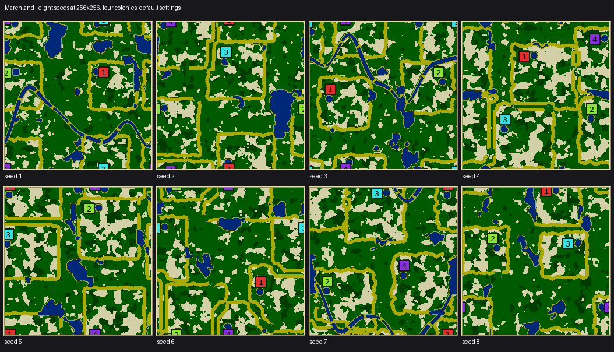
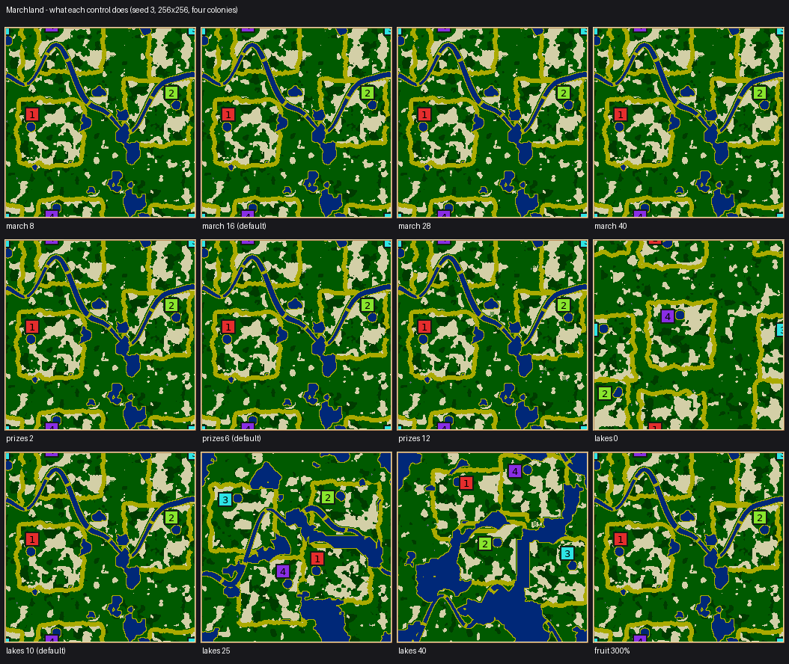

# Marchland: drawn country, solved rope

`marchland`, legacy id 59. Source: [MarchlandGenerator.cpp](../../src/map/generator/generators/MarchlandGenerator.cpp).

Homelands of farmed country, bounded by dry collars and separated by shared grassland, with a rope
of prizes strung through it. Every prize is a fruit grove with a quarry beside it, on a clearing of living
ground — the only fruit on the map, and the only quarry worth marching for.

The pale ring round each homeland is the dry march; the winding channel on seeds 1, 3 and 7 is the
river some seeds cut through the commons. The homelands are visibly squarish, which is a known
limitation rather than a design: see [what has not been done](#what-has-not-been-done).

> **These figures predate the stream rename and describe different maps.** Renaming the
> generator's random streams moved every map it makes, so the numbers below — control
> correlations, fairness scores, refusal rates, river rates and the tournament — were measured
> on the previous maps. Treat their conclusions as hypotheses until remeasured. Current revision-2 checks and
> results are recorded in the [review evidence](evidence/constraint-solved/review/README.md).

## The play contract

Your homeland supplies the opening economy. A thin sand collar contains its crops; beyond it,
the commons has grass, sparse wheat and wood, and room to expand. The fruit groves and quarries
give colonies reasons to cross that collar. The search places each prize near a front between
two colonies and limits the difference in how many prizes each colony can contest. These walking
cost checks do not establish equal starting economies or equal chances of winning.

## What is drawn and what is solved

This is the point of the map, and the reason it exists alongside [Even Ground](EVEN_GROUND.md),
which solves its terrain outright.

**Drawn, entirely from the shared toolkit** — because construction reaches these, and a search would
be a worse way to get any of them:

| Property | Primitive |
|---|---|
| Equal ground per colony | `growTerritories` over the whole torus |
| A march between homelands | `separateTerritories` |
| Spread-out homes, seated inside their own ground | `farthestSites`, then `regionHome`; sites are not recentered |
| A swarm the same walk in from the march everywhere | `Homes.h`'s `regionHome` |
| **A private lake of exactly the same size for everyone** | `growLakeBeside` with a fixed target |
| Ambient fields that leave a clear town to build in | `plantCoverShare` outside a `dilateRound` town |

**Solved** — one decision, because it is the only one construction cannot reach: *which candidate
sites in the march become the prizes.* That is a constraint over an N-colony by K-prize matrix of
walking costs on asymmetric ground with lakes and borders in the way. It is scored with the engine's
own cost model (`Contact.h`) on the finished map, and it is cheap: each colony's cost field is
flooded once, so a move is a table lookup and the whole search costs microseconds.

The `levelling` slider is how many moves that search gets, so its worth is measurable rather than
asserted.

### The river: a third category

A river is neither of the above, and it is the case that made the split worth naming. It cannot be
solved for — see the head of `shared/Rivers.h` — because a target on where the water goes is met by
a blob or a ruled line just as well as by a river, and "one joined-up channel crossing the map" is
topological rather than statistical: nine tenths of a river is a lake and a pond, and scores no
better than one tenth of one, so there is no gradient for a search to descend.

So the bed is **drawn** (a closed wandering loop across the torus, joined up and the right width by
construction), and only its **placement is scored**: fourteen candidate beds, each rated on whether
it keeps out of the towns, how evenly it touches the homelands, how much of it lies in the commons,
and whether it puts the colonies on both banks. Fourteen candidates is an exhaustive loop, not an
annealing run — reaching for a search there would be the same mistake in the other direction.

Which crossings exist splits the same way. That the country stays in one piece is an *invariant*, so
`fordsToRejoin` guarantees it by construction; how many more fords there are beyond that minimum is
*character*, and is what keeps the bed a landform instead of a wall.

Over 120 seeds at 256×256 with four colonies, 34 cut a river and 86 did not, and none failed.

A seed is allowed to have no river: crowded country has nowhere to put one, and beds lying less than
`kLeastCommonsShare` (0.45) in the commons are refused rather than run through somebody's fields,
which would be ambient water in one larder and not another's — the inequality the water rule exists
to prevent.

**A river was thought to cost fairness. It does not, and the earlier figure was measuring a bug.**

| 120 seeds, 256×256, 4 colonies | Fairness | Worst start | Lowest seed |
|---|---|---|---|
| With a river (34) | 0.895 | −0.074 | 0.789 |
| Without (86) | 0.892 | −0.104 | 0.748 |

This table replaces one that read 0.871 with a river against 0.910 without, over 40 seeds, and was
used here to argue that varied country was worth a few points of fairness. That measurement was
taken while `strokePath` was still being asked to close the bed's loop, which drew — and scored — a
ruler-straight reach clear across the map alongside the meander. A straight chord through the
contested ground really is terrain one colony is nearer to than another; the meander that replaced
it is not. Re-measured on the fixed bed over three times the seeds, a river is worth about nothing
either way, and if anything slightly helps the worst start.

Two things follow. The map is not trading fairness for character here, so that argument is gone.
And a figure that justified a design decision outlived the code it was measured on, which is the
reason these tables carry their seed counts and their date in the history.

Not every seed that wants a river gets one: over 40 seeds the brief asked for a river on 17 and 12
were cut, the other 5 refused for want of room. That is the `marchland.river.no-room` fallback firing on
just under a third of the seeds that ask, which is worth knowing when reading the split above — the
"without a river" column is not all seeds that were never offered one.

## What the search buys

Median of 16 seeds at 256×256 with four colonies, in walking steps. *Contest* is how much nearer the
closest colony is to a prize than the next one along — how far a prize is from being a fair fight.
*Share* is how unevenly the colonies' walks to the whole rope come out.

| levelling | contest | share |
|---|---|---|
| 0 (dealt at random) | 32 → 32 | 18 → 18 |
| 20 | 32 → 5 | 18 → 1 |
| 50 | 32 → 4 | 18 → 1 |
| 100 (default) | 32 → 3 | 18 → 1 |

A rope dealt and left alone missed the contest bar on **16 seeds out of 16**. The search is not
polish on this map; it is what makes the map possible. Both figures are recorded in the telemetry of
every map the generator makes, so any seed carries its own before-and-after.

Canonical start quality is 0.856 fairness / 0.006 worst-colony fitness, against Savannah's
0.940/0.392 and Watershed's 0.824/0.155. That model measures advantage in the *starting economy*,
and Marchland deliberately moves the map's contested value out of the homelands and onto the rope, which
the model does not weigh. The homelands themselves are level by construction — equal ground, equal
lake, equal kit — and a typical map gives its four colonies 209–388 wheat, 100–275 wood and 839–1067
building sites each.

## Four things that were wrong on the way

1. **The first promise was over-constrained and wasn't even the right one.** "Every prize the same
   walk from every colony" has no solution once you also want the prizes spread out — a site
   equidistant from four colonies lies near one place on the map — and the search stalled at 31
   steps from a start of 72. Worse, a rope with no near end for anybody is a rope nobody can start
   pulling. The property this map actually wants is per-prize: each one sits on a front between the two
   colonies contending for it.
2. **"Equal mean walk to the whole rope" was also a mis-statement.** With more than two colonies a
   colony is naturally near its own fronts and far from the ones across the country, so that measure
   reads the shape of the map more than the fairness of the rope: on a 4:1 map it came out 126 steps
   apart for reasons no arrangement could fix. What it should say, and now does, is that every
   colony is a *contender* for the same number of prizes.
3. **Contested ground belongs in the candidate set, not the objective.** Filtering candidates to
   sites that are already near-equidistant between their two nearest colonies turned the promise
   from something the search hoped to reach into something the candidate set guarantees. Three
   colonies on a 512-tile map went from 4 valid seeds in 8 to 8 in 8.
4. **A solid prize is a wall.** Fruit and stone can never be cleared, so a solid 7×7 grove blocks
   the approach — and its two sides are not the same walk from everywhere, quietly undoing the
   levelling. Planted solid it moved one colony 43 steps out of step. The grove is now planted open,
   every other tile.

A fifth was a plain bug worth recording: ambient wheat was laid on a noise field and wood on *the
same field inverted*, which makes the two perfectly anti-correlated. One colony had 531 wheat and 46
wood while another had 43 and 401 on the same map. They get an independent field each now, finer
than the 24 steps a catchment is reckoned over.

A sixth came out of a control study that ran every value of every control: **`fruit-amount` was not
connected to anything.** The prize groves were planted at a fixed radius, so all thirteen values of
the slider produced identical maps — the only place the option was read was the cramped-start
relief, which rarely runs. The grove now answers to it, scaled by *area* rather than by radius,
because scaling a radius directly delivers the square of what the slider asks: 300 per cent would
have ringed every prize with a nine-times grove of uncleanable fruit, which is finding 4 above
reintroduced through a slider. `scaledRadius` lives in `Resources.h` beside `scaledCount`, and the
quarry uses it too.

## Envelope

Swept over seven shapes (64² to 512², plus 64×256, 512×128 and 128×512) against 2–8 colonies, four
seeds a cell: every one of the 196 attempts either produced a valid map or was **refused up front
with a reason**. No combination generates a map and then fails its own validator. Refused up front:

- fewer than two colonies (a march needs a country on each side);
- fewer than 3000 tiles of map per colony;
- maps longer than 2:1 with fewer than six colonies — too few to ring a long map, so the fronts come
  out lopsided and no arrangement of prizes shares the rope out. Every seed tried failed, so it is
  refused rather than retried.

That floor was 2600 and was too low, which the sweep caught: 128×128 with six colonies (2730 tiles
each) passed the check and then failed late on two thirds of seeds, almost always a homeland with no
water beside it to regrow a crop from. Measured per cell at ten to twelve seeds, the late-failure
rate runs about two thirds at 2730 tiles a colony and four fifths at 2978, against nought to a third
at 3276 — so the floor now sits between them, and the cells above it are back to the ordinary rate
the lobby's retries cover.

## What the controls do

Every value of every control, eight seeds each at 256×256 with four colonies, plus both extremes on
a small, a large and a rectangular map — 833 maps. Each control was given a claim to answer, and the
claim checked as a rank correlation against the value:

| Control | What it should move | ρ | Range |
| --- | --- | --- | --- |
| `prizes` | prizes strung on the rope | +1.00 | 2 → 12 |
| `march` | tiles of no-man's land | +1.00 | 30,865 → 34,527 |
| `march` | largest finished homeland | −1.00 | 7,805 → 7,416 |
| `levelling` | how unevenly the rope's walks are shared | −0.80 | 15.9 → 0.0 |
| `lakes` | water share | +1.00 | 1.0% → 19.9% |
| `wheat-amount` | wheat tiles | +1.00 | 88 → 31,361 |
| `wood-amount` | wood tiles | +1.00 | 72 → 18,447 |
| `stone-amount` | stone tiles | +0.86 | 49 → 106 |
| `fruit-amount` | fruit tiles | +0.97 | 1.6 → 59.4 |

Two honest caveats on that picture. `march` and `prizes` are near-invisible in a 256-pixel preview
even though the table shows both moving — the march widens by about 12 per cent across its whole
range, since the control sets a *minimum* gap that territory growth has usually already exceeded.
And `stone` and `fruit` scale a small radius, so a thirteen-step slider lands on four or five
distinct groves; they move, but in steps rather than smoothly. `lakes` and `levelling` are the two
that change what the map is.

`levelling` at 0 turns the rope search off outright: the search makes no proposals, the rope's cost
stays at 131 against 8.2 at full levelling, and the finished-world check is relaxed to match,
because a map that was never promised a level rope is not a broken one.

## Cost and limits

- About 1 s at 256×256 with four colonies; the rope search itself is a negligible part of that.
- **Not promised**: equal expansion room, equal defensibility, or equal starting economy beyond the
  equal ground, lake and kit each colony is built with.
- Two colonies on a 2:1 map occasionally find too little contested ground for a full rope; the map
  then strings a shorter one, and on rare seeds refuses. The lobby's retries cover it.

## The tournament

Played: six maps, every rotation, two engine seeds each — 48 games with `nicowar` in all four
slots, against Symmetric arena as the control
([full report](evidence/constraint-solved/fairness-tournament.md)).

| | Position bias | Biased maps (BH) | Any-bias p |
| --- | ---: | ---: | ---: |
| Symmetric arena (control) | 0.0 pp | 0 / 6 | 0.786 |
| **Marchland** | **12.2 pp** | **0 / 6** | **0.059** |
| Even Ground | 25.9 pp | 3 / 6 | <0.001 |
| *fair-map floor* | *11.6 pp* | | |

At 12.2 pp against a fair-map floor of 11.6, Marchland sits on the line where a map cannot be told
apart from a fair one, and no individual map's wins reject a uniform split. No individual map rejected a uniform split after correction, but the headline exceeds that
floor and the pooled colony-index result below is significant. This is inconclusive evidence,
not a fairness pass.

Two caveats that keep it honest. Wins by the generator's own colony index came out 16 / 11 / 4 / 17
(p 0.018) — colony 2 under-wins, which is not a bias by *start* but does say the rope is not being
shared out as evenly as the search's own residuals claim. And the map's static start-quality scorer
barely predicted anything here (rho 0.23 with win share, p 0.350), so the levelling the search does
is not what is deciding these games.

The interesting comparison is with Even Ground, whose whole premise is searched fairness and which
fails this test. Marchland searches one decision and draws everything else. Its historical result was less
biased in this small sample; it does not establish that the search strategy caused the difference.

## What has not been done

- The tournament above is AI-only (`nicowar` in every slot), 128×128, four colonies, 6 maps. It is
  not enough to certify fairness, and says nothing about other AIs or other sizes.
- The river's effect on play is entirely unmeasured. It is a wall with fords across the middle of
  the contested ground, which is exactly the kind of change that reads fine statically and alters
  how a game actually goes; whether two fords per colony is the right number is a guess constrained
  only by the rope check, not by anyone playing across one.
- The fairness cost above is static scoring only; whether a river makes a game *better* is exactly
  the question no measurement here answers.
- No human play, so whether the rope actually produces back-and-forth — the thing the map is named
  for — is untested.
- Single-platform (macos-arm64) golden rows; this generator uses floating-point scoring throughout
  and cross-platform identity is not promised.
