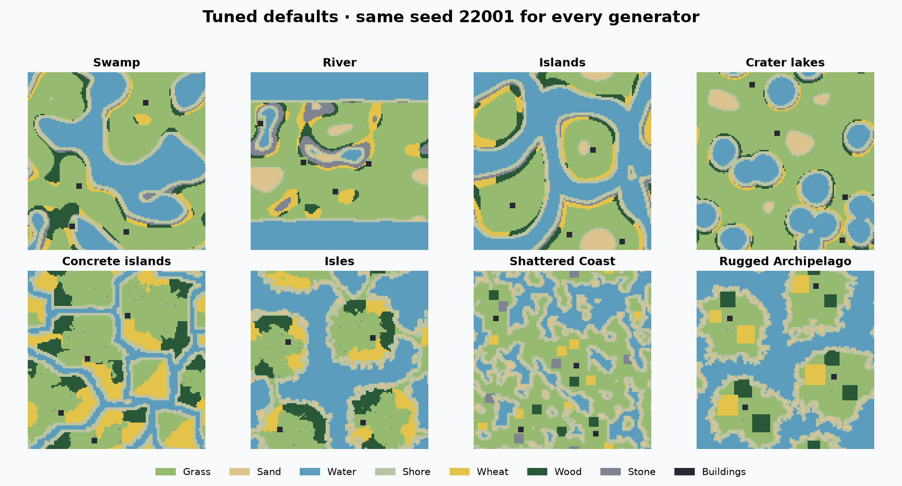
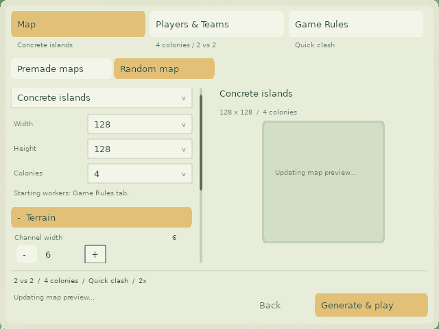
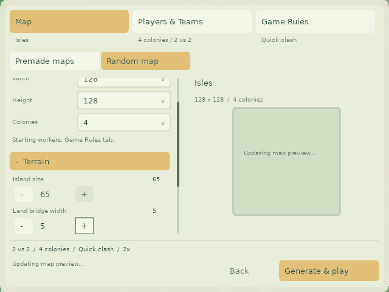
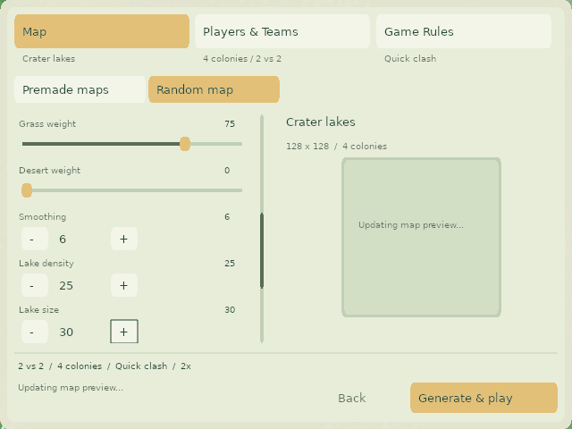
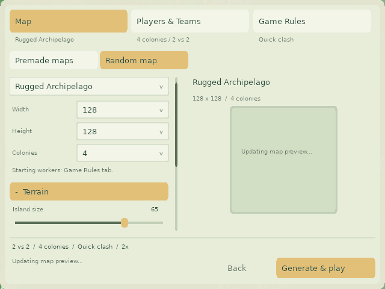
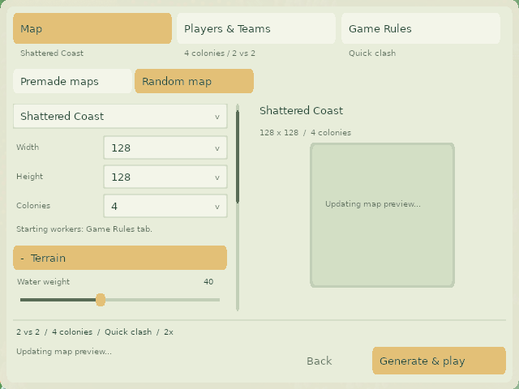

# Map generators

The generators now use a modular registry and per-attempt random state. See the [module and extension guide](ADDING_A_GENERATOR.md) and [refactor measurements and map previews](refactor/RESULTS.md). The tuning study below is the frozen PR #238 baseline.

Contested Commons appears first and is the default generator in the custom-game lobby and map editor.

Random maps now start with generator-specific recipes that leave more grassy building room. The custom-game lobby from PR #237 and the map editor use the same names, available controls, ranges, steps, defaults, and per-method setting memory. Old Random is **Shattered Coast**; Old Islands is **Rugged Archipelago**. The modular catalog also includes **Contested Commons**, **Lattice**, **Maze**, and **Fjord Continent**.

## Development tools

[Exact results and control reference](RESULTS.md) · [Raw validation results](study/validation.csv.gz) · [Source catalog snapshot](study/catalog.json)

## One source of truth

Each module under `src/map/generator/generators/` owns its control definitions, named options and generation sequence. The registry supplies those definitions to both UIs and the analysis tools. `GenerationRequest::setMethodDefaults()` applies the registered defaults; `GenerationHistory` remembers per-generator options while carrying shared settings between modes. The historical descriptor is isolated in `compatibility/`.

Both `CustomGameScreen` and `NewMapScreen` render these definitions. The command-line generation stress tool samples the same valid ranges and steps for all 12 procedural modes. The lobby keeps its Terrain / Resources / Layout sections and scrolling; the editor uses the existing native Number widgets. The lobby's starting-worker rules control reads the same shared definition. A shared terrain-weight check rejects an all-zero terrain recipe in both screens.

The study runner requests the compiled presets. The plotting tool requests `MapGeneratorStudy --catalog` and resolves names from the English translation table; the documentation and charts therefore do not maintain another copy of the current presets or names. Checked-in JSON/CSV is a historical measurement snapshot, not runtime configuration. Previous-setting cohorts remain explicit frozen configurations so later default changes cannot alter the baseline.

All 33 language tables have the renamed generators and new labels. Existing translation keys, enum values and descriptor byte layout remain stable. Translation structure, placeholders and English-fallback regression checks pass; the new translations have not received native-speaker review.

## What changed

- Tune all eight procedural generators; Uniform retains its terrain selector.
- Add Crater Lakes lake size (10–40 in steps of 5), Concrete Islands channel width (5–8) and extra islands (0–6), and Isles island size (45–65 in steps of 5) and land bridge width (3–6).
- Terrain weights now allow 0–100, so the measured grass default of 75 is selectable. River width spans the explored 20–65 range in steps of 5; lake density spans 10–50 in steps of 5. Rugged Archipelago island size spans 50–70 and includes its default of 65. Existing smoothing, beach, fruit and repeat controls retain their established bounds.
- Remove the wheat, wood, stone and algae ratio widgets, whose serialized fields are not read by resource placement. Fruit remains configurable in the four modern height-map modes. Existing resource-placement algorithms are preserved.
- Restore the original legacy resource functions removed as unused code on newer master, then call them after placing starting bases/workers. Fix Rugged Archipelago base validation to use the current team instead of indexing team -1.
- Parameterize existing channel, bridge, island and crater constants without replacing the generation algorithms.
- Add Contested Commons, Lattice, Maze and Fjord Continent as registered modules. Their layout controls come from the same metadata as both UIs and the study catalog.
- Fix Lattice and Maze shoreline generation, enlarge their playable home areas, and use clumped resources. Maze uses coarse 20/24/32-tile cells and stone seams inside its water walls. Fjord guarantees clumped wheat and wood on both sides of every fjord.

## Why these bounds and defaults

The initial search and shortlists used 23,936 attempts, followed by 768 range-corner and 1,024 size/team checks. Configuration manifests and aggregate results are in [study/search-summary.csv](study/search-summary.csv). A separate original 16,000-attempt holdout supported the initial choices. This rebased implementation was then checked with a fresh **24,000-attempt comparison**: 1,000 fixed seeds for each of eight generators in three cohorts (new defaults, PR #237 lobby settings, and previous editor settings).

The same seeds appear in multiple configurations; attempt counts are not counts of globally unique seeds. Selection balanced building space, starting resource access, generation reliability and recognizable terrain rather than maximizing grass alone.

- Concrete widths 3–4 removed most or all water; widths 5–8 keep separate territories. Extra-island counts through 8 were explored; the UI stops at 6 to limit crowding.
- Isles sizes 35–65 and bridge widths 3–7 were explored. The selected ranges retain visible islands and narrow connecting bridges. The default size is 60, with the original bridge setting of 4.
- Crater size 25 and density 25 retain many round lakes with nearby resources. Large sparse lakes can leave resources farther from starts despite having plenty of grass.
- Rugged Archipelago size 70 approached merging islands in inspected samples. The default 65 increases interiors while retaining water separation.
- Shattered Coast keeps its rough patchwork coastlines with smoothing 3. Its improved space and resource access carry a small reliability tradeoff, shown in RESULTS.md.

The conventional 0–100 terrain-weight domain is not a guarantee that every combination is usable. The measured recipes and new shape-control corners received the strongest coverage.

## Visual review

All eight final presets were inspected on fixed seeds 22001, 22002 and 22003, without replacing seeds. These tile-class views come from production maps; they show terrain, wheat, wood, stone and buildings. Algae, fruit and units are not separately colored. Wrapped edges can split a river or island across opposite sides of an image.



[Swamp](generator-1.png) · [River](generator-2.png) · [Islands](generator-3.png) · [Crater Lakes](generator-4.png) · [Concrete Islands](generator-5.png) · [Isles](generator-6.png) · [Shattered Coast](generator-7.png) · [Rugged Archipelago](generator-8.png)

The native lobby captures below exercise edited values, including five-unit increments and remembered per-mode settings. They show an update pending immediately after editing; automatic generation and snapshot launching are exercised separately by the same harness.

| Concrete Islands | Isles | Crater Lakes |
|---|---|---|
|  |  |  |

| Rugged Archipelago | Shattered Coast |
|---|---|
|  |  |

## Measurements and limitations

Grass uses `Map::isGrass`; immediately free building tiles use `Map::isFreeForBuilding`. Clear 4×4 positions are valid top-left anchors, which overlap and must not be interpreted as independent buildings. Percentages exclude failed maps; every attempted seed and failure is retained in the raw data.

The all-team start proxy requires each team to have at least 16 valid 4×4 anchors within 24 walking steps of its starting workers, reachable wheat within 24 steps, and wood within 32 steps. The flood follows the hard-space predicate with eight-neighbor movement and toroidal edges. This is a comparative diagnostic, not a complete pathfinding/economy simulation or a guarantee of fairness.

Both prior-setting cohorts include the same legacy correctness fixes to isolate tuning. Without those fixes, the legacy modes lack their intended resources, and Rugged Archipelago can assert during base placement. The original study's main chart measured constructor settings, not the editor's usual timer-applied zero sand/desert settings; this PR records both relevant baselines explicitly.

Placement failures still occur. Against the repaired PR #237 lobby baseline, River failures rise from 4 to 18 per 1,000 and Shattered Coast from 0 to 14, while their all-team start-proxy passes rise from 177 to 800 and 281 to 823. Against the previous editor baseline, River failures fall from 145 to 18. These are deliberate building-space/resource-access tradeoffs, not a claim of universally improved generation reliability. The earlier size/team checks expose small crowded maps: at 64×64/four teams, River generated 16/32 and Shattered Coast 17/32; at 128×128/eight teams, 21/32 and 22/32 respectively. These defaults target 128×128/four teams, not every dimension/roster combination. No full-match balance study was performed.

Old saved descriptors retain their byte layout, but regenerated terrain intentionally changes. The previously unused Concrete Islands extra-island value zero now requests zero fixed neutral islands; a negative sentinel preserves the old random count for the frozen baseline. Legacy unused diameter 50 still selects original channel/bridge/crater constants. Mixed-version multiplayer generation was not tested.

## Reproduction and checks

From the repository root:

```sh
scons release=1 -j12 map-generator-study map-generator-defaults-test custom-setup-test build/src/glob2
mkdir -p artifacts/map-generator-validation/lobby
build/src/MapGeneratorDefaultsTest glob2-map-defaults-test artifacts/map-generator-validation
build/src/CustomGameSetupHarness
build/src/CustomGameSetupHarness artifacts/map-generator-validation/lobby
python3 data/check_translations.py --strict
python3 test/test_translations.py
python3 tools/map_generator_study.py --configs docs/map-generators/study/validation-configs.json --count 1000 --start 20001 --label validation --workers 8
python3 tools/plot_map_generator_study.py artifacts/map-generator-validation/validation.csv
```

The plotting script requires NumPy and Matplotlib. Each sample runs in a fresh process; the dedicated executable overrides its clock to `1700000000 + seed` because the production generators reseed internally. It seeds Perlin noise and `srand`, and supplies the optional synchronized-RNG seed to `MapGenerator::generateMap` so PR #237’s `random_device` reseeding cannot override the study. Production UI calls omit that argument and retain random seeding. Before sampling, the runner checks three seed positions per configuration in independent repeated processes and aborts on any mismatch. Runner profiles are disposable and cleaned up automatically. UI harness profiles use explicit test names.

The shared-control regression visits every selectable editor value, checks defaults and step normalization, compares lobby/editor method memory, and verifies serialization round trips. The native lobby harness exercises new dropdown/stepper controls, automatic preview debounce, snapshot ownership, generation recovery, teams, rules, saves and replays. The shared-control test is added to Linux CI alongside the existing lobby tests. Physical macOS mouse delivery is not covered by SDL event injection.
