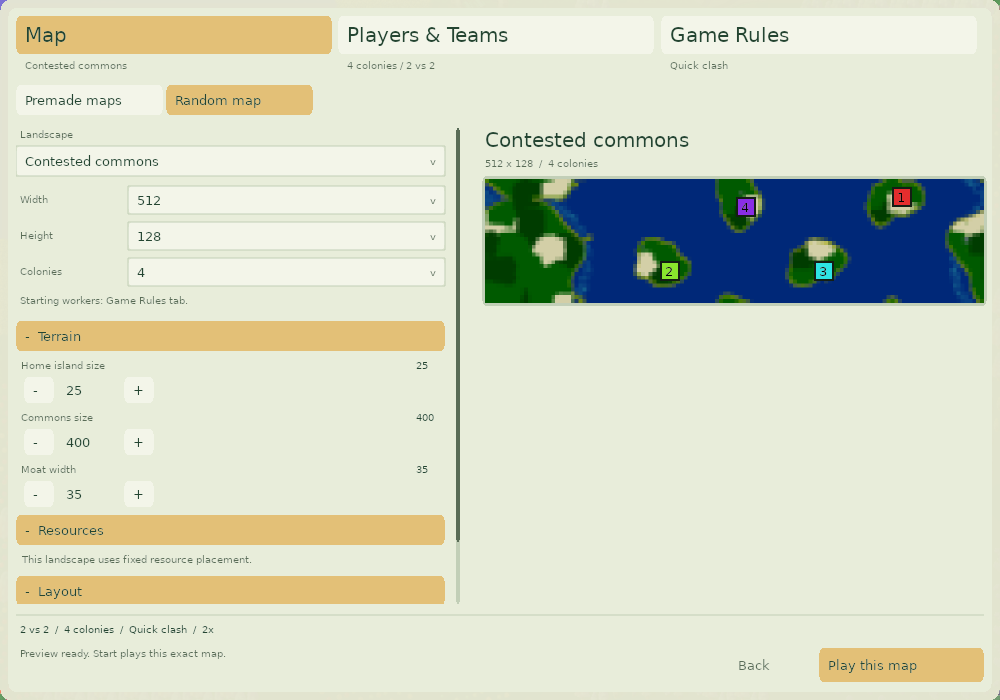
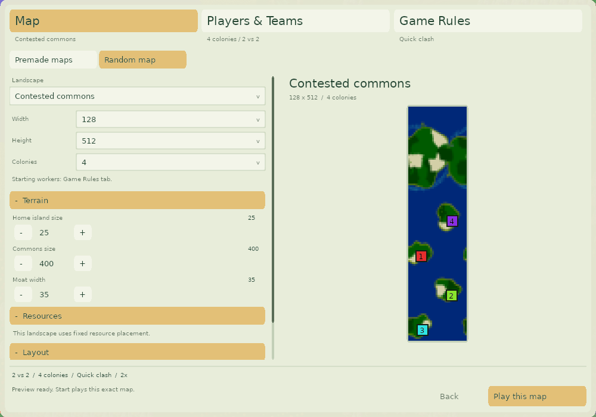

# Rectangular map review

The lobby screenshot showing colony numbers in black space exposed a preview
coordinate bug. Map thumbnails store rectangular terrain centered in a square
128×128 image. The lobby stretched that entire thumbnail but placed colony
markers as if the terrain filled the square.

## Fixed

- Crop thumbnail padding and fit the actual map into the available preview area.
  Wide maps use the available width; tall maps use the available height. The
  frame and colony markers use those same dimensions.
- Wrap marker coordinates for existing maps whose start metadata crosses a torus
  seam, rather than pinning those markers to an unrelated edge.
- Normalize generated start coordinates in the shared legacy placement paths.
  Shattered Coast seed 31001 at 512×128 previously reported colony 2 at `(474,-6)`
  even though the building wraps onto the map. Its start is now `(474,122)`.
  Shattered Coast's generator revision is incremented to 2.
- Validate that generated colony start metadata lies inside the map bounds.

The changes do not alter save/replay encodings or stretch the generated terrain.

## Validation

- All twelve playable generators successfully generate the 512×128 and 128×512
  regression cases (seed 31001, four colonies), with starts inside map bounds.
- Native lobby captures at 640×480 and 1000×700 cover 512×128, 128×512, 512×64,
  and 64×512 Contested Commons maps. Tests inspect rendered terrain and colored
  marker pixels, including equivalent start coordinates outside the base torus
  rectangle. They also check the frame's aspect ratio.
- Existing generator contracts, request validation, editor/lobby control tests,
  preview ownership, failure recovery and team-preservation checks pass.

| Wide map | Tall map |
| --- | --- |
|  |  |

## Remaining placement limitations

A deterministic sample exercised all sixteen combinations of 64, 128, 256 and
512 tiles per axis, with seeds 31001–31005 and four colonies: 960 attempts. There
were 51 reported placement failures both before and after these fixes. These are
failed generation attempts, not missing strips of terrain in successful maps.
This sample does not establish balance or a universal success rate.

Each generator has 60 rectangular and 20 square attempts:

| Generator | Rectangular failures | Square failures | Observed failure |
| --- | ---: | ---: | --- |
| River | 3 | 1 | Cannot place starting locations on some small maps |
| Separate Islands | 8 | 1 | Resource/starting-region subdivision cannot place every colony |
| Shattered Coast | 11 | 3 | Cannot space every colony on grass |
| Contested Commons | 1 | 6 | Small home regions; all five 512×512 attempts exhaust the point-search budget |
| Fjord Continent | 15 | 2 | No swarm footprint fits in a home region, mostly with a 64-tile short axis |
| Swamp, Islands, Crater Lakes, Isles, Rugged Archipelago, Lattice, Maze | 0 | 0 | No failures in this sample |

Fjord Continent sizes its continent from the shorter map axis, so making a
64×64 map longer does not automatically give each home region more room. Its
narrow-map failures need layout tuning; removing the preview padding does not
solve them. Likewise, the large Contested Commons budget failure is a separate
scaling issue, not a rectangular-coordinate error.

Reproduce representative cases from the repository root:

```sh
scons release=1 -j8 map-generator-study map-generator-defaults-test custom-setup-test
build/src/MapGeneratorDefaultsTest glob2-rectangular-test
mkdir -p artifacts/rectangular-maps
build/src/CustomGameSetupHarness artifacts/rectangular-maps
build/src/MapGeneratorStudy 9 31001 glob2-rectangular-study width=9 height=7 teams=4
build/src/MapGeneratorStudy 12 31003 glob2-rectangular-study width=6 height=9 teams=4
build/src/MapGeneratorStudy 9 31001 glob2-rectangular-study width=9 height=9 teams=4
```

`MapGeneratorStudy` reports generation status in its `STUDY` row and prints a
diagnostic for a failed attempt; its process exit status alone is not a
success check. The full sample iterates method IDs 1–12, width/height exponents
6–9, and seeds 31001–31005 using the same command.
