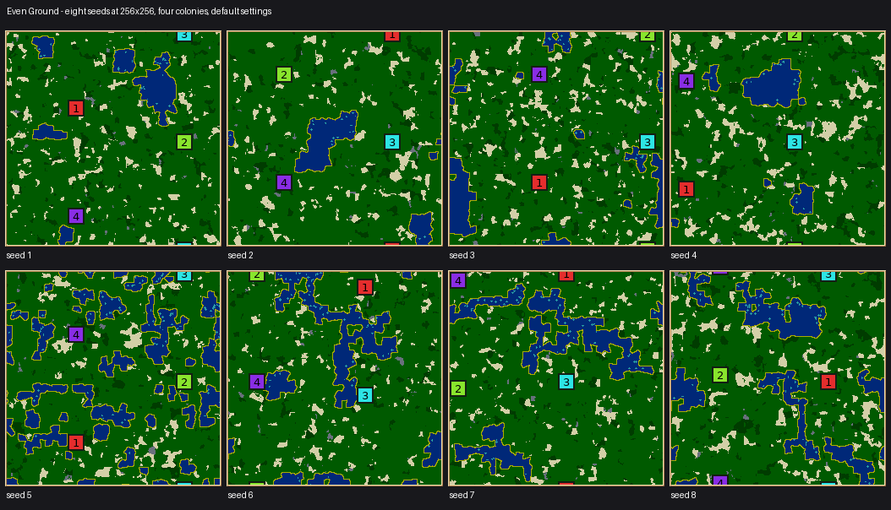
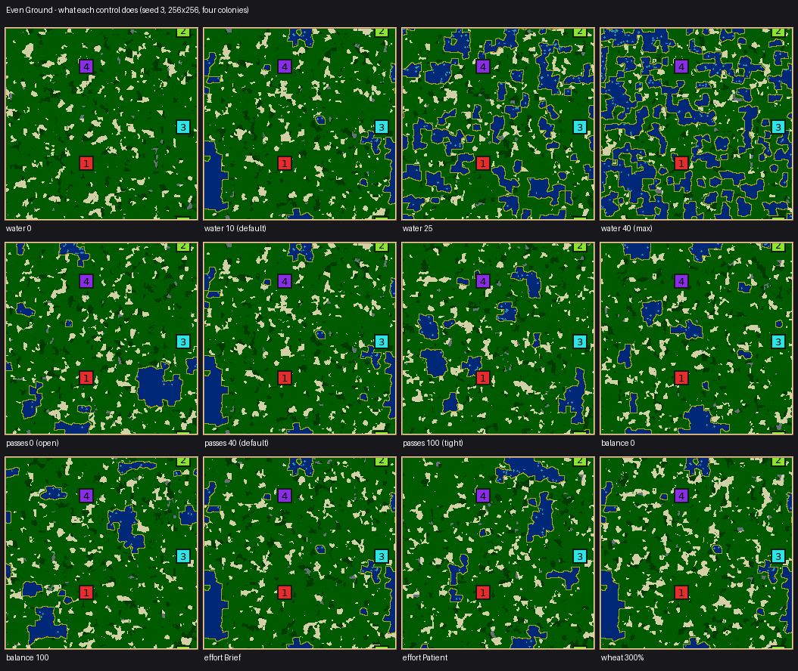

# Even Ground: terrain solved against targets instead of drawn

`even-ground`, legacy id 60. Source: [EvenGroundGenerator.cpp](../../src/map/generator/generators/EvenGroundGenerator.cpp).

Every other landscape in the catalog decides what it looks like and then works to make that shape
fair. This one has no drawn shape at all. It states what the finished map must be true of, and
searches for ground that satisfies it.

Worth looking at before reading the numbers: the ground is speckled rather than composed, because a
search over terrain mostly rediscovers noise. That is this generator's main finding about itself,
and it is the reason [the toolkit's own guidance](../../src/map/generator/shared/Solve.h) says to
point a search at a decision rather than at a landscape.

Search objectives and random-stream names determine the generated maps. Reproduce
measurements against the current source and hold out seeds before treating objective
scores as evidence of playability. Keep new results in ignored `artifacts/` or
pull-request attachments.

## The play contract

Experimental lake country: green plains with lakes and crop fields, with a search intended to
reduce differences in reachable resources and building room. This is a design target, not a
promise of balanced games. Because the balance is found by
measurement rather than by mirroring, the map is asymmetric — you cannot infer your opponent's
position from your own — and the ground between colonies tends to be the richest on the map, which
is where the fighting goes.

That last property is not drawn either. The catchment is walking-distance-decayed, so ground far
from everybody costs almost nothing in fairness to leave rich; the search discovers that piling
surplus into the middles is the cheapest way to satisfy its targets.

## The search

A map is far too big to search tile by tile, so the search runs on a lattice of cells 8 to 32 tiles
a side (roughly 16 to 32 cells along the long side, at least 6 along the short one). Each cell is
water, open ground, or a field of one crop. Two annealing passes:

| Pass | Move | Scored on | Cost per move |
|---|---|---|---|
| Shape | swap a water cell with a land cell | equal reachable land, width of the tightest way between neighbours, clear ground near every home, water forming a few lobed bodies, a severe penalty for cutting anyone off | every colony's walk re-measured |
| Stock | swap the contents of two land cells | every colony's decayed catchment of each crop equal, and the worst-served colony's catchment as large as possible | two terms per colony |

Both passes preserve their own budget and search only over arrangement, so a slider sets a quantity
the search may place but may not argue with. The exactness is on the lattice: the finished map
carries somewhat less water than requested, because painting lays a beach along every bank.

The solved lattice is painted through a jittered Voronoi with a noise warp, not as squares.

## What the controls do

Every value of every control, eight seeds each at 256×256 with four colonies, plus both extremes on
a small, a large and a rectangular map — 785 maps. Each control was given a claim, checked as a rank
correlation against the value:

| Control | What it should move | ρ | Range |
| --- | --- | --- | --- |
| `water-share` | water share | +1.00 | 0% → 37.2% |
| `passes` | passage width in cells | −1.00 | 6.0 → 3.6 |
| `balance` | catchment spread after the stock pass | −0.90 | 0.5 → 0.0 |
| `balance` | stock proposals made | +1.00 | 0 → 20,000 |
| `effort` | shape proposals made | +1.00 | 875 → 5,829 |
| `effort` | shape cost finished at | −1.00 | 1.5 → 0.4 |
| `wheat-amount` | wheat tiles | +0.99 | 43 → 7,462 |
| `wood-amount` | wood tiles | +1.00 | 40 → 5,681 |
| `stone-amount` | stone tiles | +1.00 | 0 → 982 |
| `algae-amount` | algae tiles | +1.00 | 0 → 511 |

`balance` and `effort` both buy search rather than shape, so they move the arrangement without
changing what the map is made of; `water-share` is the one that transforms it. The crop sliders
saturate near the top — wheat is flat from 250 per cent upward at 256², because the ground it is
allowed to plant on runs out — which is a ceiling on the map rather than a dead control.

## Cost and limits

- About 1.0–1.25 s at 256×256 with four colonies at Normal; 3.5 s at 512×512 with eight colonies at
  Patient. This is the slowest generator in the catalog, which is what a search costs. Telemetry
  collection adds about 1.4 per cent.
- Generation succeeds on 24/24 seeds at every shape tested except 512×128 with 8 and with 12
  colonies, which were 23/24; the failing seed is refused by the generator's own validator for a
  colony 25 steps from wheat against a limit of 24. The lobby retries, so this is not player-visible.
- A later sweep over seven shapes against 4–8 colonies, twelve seeds a cell, puts that rate at 9 late
  failures in 384 attempts (2.3 per cent). They are not spread evenly: every one falls on 512×512,
  512×128 or 128×512 — about 8 per cent of seeds on those cells and none at all at 256² or below —
  and every one is a marginal miss of the starting-crop guarantee (25 steps against 24, 33 against
  32) rather than a colony left without a crop. The 36 other refusals in that sweep are 64² with six
  or more colonies, refused up front with a reason.
- Requests refused up front: fewer than 6 cells on either lattice axis, or fewer than 12 cells per
  colony (a 64-tile map takes at most 5 colonies).
- **Not promised**: equal room to expand into, equal defensibility, or equal contact costs. Only
  catchments, reachable land, building room at home and route width are searched for.

## What has not been done

- **No human play**, so whether the contested middles produce the fights the design expects is still
  untested; and the AI result above is `nicowar` only, on 128×128 with four colonies.
- The tournament above is 6 maps a generator. It is enough to reject fairness for Even Ground (three
  maps individually significant) but not enough to certify Marchland as fair — only to say it is
  indistinguishable from fair at this sample size.
- Single-platform (macos-arm64) golden rows only; generator floating-point output is not promised
  identical across platforms, and this generator uses floating-point scoring throughout.

## Implementation source

[EvenGroundGenerator.cpp](../../src/map/generator/generators/EvenGroundGenerator.cpp) owns this landscape's construction, controls and validation.
See the [catalog](catalog.md) for its stable command and legacy IDs.

Related: [map generators](README.md).
