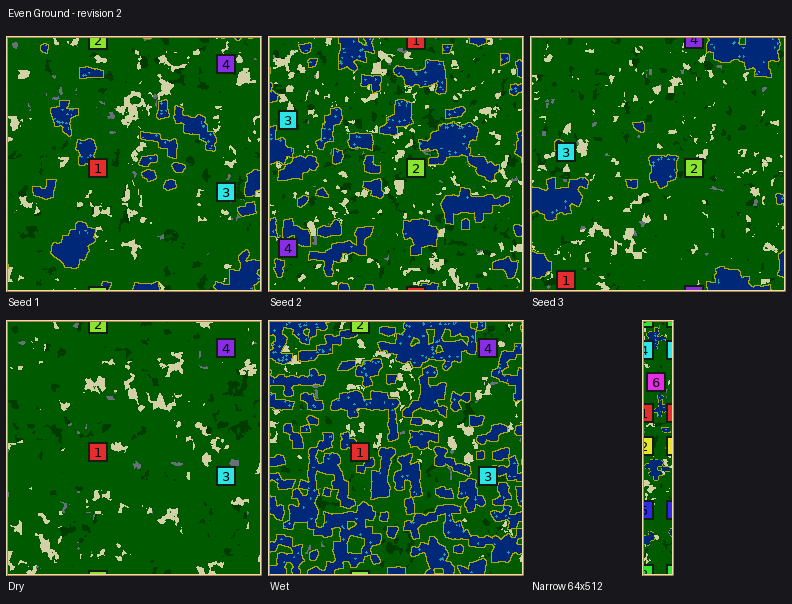
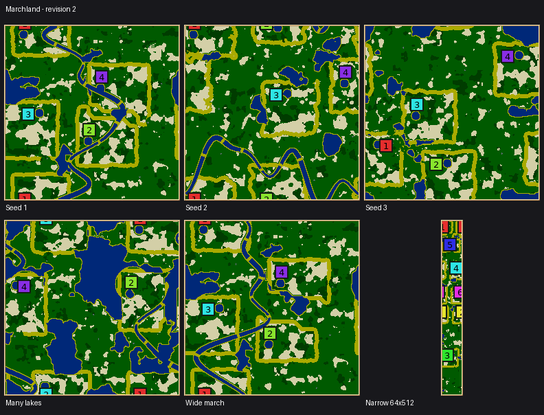

# Revision 2 review evidence

**Historical numeric IDs:** these artifacts use Even Ground 59 and Marchland 60.
The later merge of The Gauntlet (master ID 59) moves them to 60 and 61 respectively.
Retain the recorded IDs when using the frozen binaries; use the textual generator
names with the current catalog.

This review covers Even Ground (59) and Marchland (60), both revision 2. The IDs were
moved when integrating Orchard Commons (58) from master. The source revision and frozen
macOS executable hash are in [provenance.json](provenance.json).

Even Ground remains experimental: equalized catchments are not proof of equal chances
of winning. Marchland draws homelands, crop-containment collars and expandable commons;
its search balances access to contested prizes. Neither generator has had human playtesting.
The older measurements in the parent directory describe different random streams.

## Fixes verified

- Even Ground's incremental crop-clustering count omitted neighbors' contributions.
  Seed 23 at 256×256, four colonies, reported a search cost of 1.105806726096399 but
  rescanned to 0.6881695741273556 before the fix. The contract now requires agreement
  between the search cost and the full rescan, with the optional clustering term active.
- Marchland inverted `std::clamp` bounds on supported 64×512 maps. The contract now
  generates both 64×512 and 512×64, six colonies, seed 31001.
- `RiverFord.near` and `.far` collided with Windows macros. The fields have distinct
  names; [the macro compile check](windows-macro-check.log) and Windows CI pass.
- The tournament script's wildcard import silently replaced its updated colony schema.
  Explicit imports and a field-count check now preserve fitness and win probability.
  Historical manifests without fitness retain their outcomes without invented scores.
- Shared flood and widest-path optimizations have independent reachability regressions;
  river tests cover seam closure and ford selection, and annealing tests cover best-state recall.

## Automated checks

- [macOS golden maps](golden-macos.log): 464 rows, zero failures. Existing generator
  fingerprints are unchanged; only the two new generators' rows/revisions changed.
- [macOS contracts](contracts-macos.log): complete registry, editor, generator, shared
  toolkit and landscape suites pass.
- [CI](https://github.com/Globulation2/glob2/actions/runs/35443160957): all seven jobs pass,
  including Ubuntu 22.04/24.04 and Windows. [Machine-readable record](ci.json).
  Both Linux runs compare 424 existing golden rows and pass all 174 telemetry cases.
  The two new generators do not yet have Linux golden rows; their contracts and
  telemetry repeatability checks do run there.
- [Local telemetry](telemetry-macos.log): 171 cases, zero semantic failures. This was
  run before integrating Orchard Commons, with the same repaired generators under the
  branch's old numeric IDs. CI covers the integrated registry.
- [Translations](translations.log): structural audit and all five tests pass.
- [Tournament harness checks](tournament-tests.log): parsing, adjudication, statistics and
  historical-manifest checks pass (`python3 test/test_map_fairness_tournament.py`).

These establish repeatability on each tested platform, not equality of floating-point
map generation across platforms. No cross-platform per-tick simulation checksum comparison
was performed. Engine behavior and save/replay/network version gates are unchanged.

## Controls and previews

All 19 declared control claims pass. Every control value was checked at 256×256 with
four colonies and seeds 1–4; extremes were also checked on 128×128/3 colonies,
512×512/6 and 512×256/5 with seeds 1–3.

| Generator | Generated / attempted | Refusals | Claims |
| --- | ---: | --- | --- |
| Even Ground | 465 / 469 | Four extreme requests missed wheat/wood walking limits by 1–2 steps | [10 claims](even-ground-claims.txt) |
| Marchland | 491 / 493 | One lacked nearby water; one had no room for a swarm | [9 claims](marchland-claims.txt) |

Raw rows retain settings, seeds, diagnostics, timings and telemetry:
[Even Ground](even-ground-ablation.jsonl.gz), [Marchland](marchland-ablation.jsonl.gz).
Failures are retained, not counted as accepted maps. Timings were collected on a busy
machine and are not a performance comparison.

The panels use seeds 1, 2, 3; two controls on seed 1; and seed 1 on a 64×512 map with six
colonies. Other panels are 256×256 with four colonies. Rectangular previews retain their
aspect ratio. The PNGs show seed and control variation, not long-term crop growth.




## Random settings reliability

A further 1,000 requests per generator rolled all controls, 2–8 colonies and seven
square/rectangular shapes from 128×128 to 512×512 (256×256 has double sampling weight).
The settings RNG is seeded with 20260917; map seeds are 100000–100999. These are single
attempts, without the lobby's candidate selection or retries.

| Generator | Generated / requested | Refusal breakdown |
| --- | ---: | --- |
| Even Ground | 992 / 1,000 | 4 wheat reach, 2 wood reach, 2 building room |
| Marchland | 861 / 1,000 | 57 unsupported colony/area combinations; 28 swarm room, 44 contender-count imbalance, 6 nearby water, 3 homeland exit, 1 uncontested prize |

Marchland generated 861 of 943 requests that passed its initial colony/area floor.
Its later refusal rate is a usability limitation at extreme settings, not a guarantee
that every request succeeds. Neither sweep had missing or malformed result records.
[Summary](random-summary.json) and all raw rows, including failures:
[Even Ground](even-ground-random.jsonl.gz), [Marchland](marchland-random.jsonl.gz).

## Current rotation tournament

The [preset](preset.json) generated two 128×128/four-colony maps per generator, each
selected from five lobby candidates, and ran Nicowar in every slot across all four
rotations. All 24 games completed: 23 eliminations and one tick-cap adjudication on
Symmetric arena. The two automatically selected repeat games (both Symmetric arena
seed 2001, rotations 0 and 1) matched their original ticks, winner and every final team
record. This is a final-state repeat check on one platform, not a per-tick checksum test
of the new generators.

Read the economy before the wins. Mean peak units per colony-game were 164.2 on the
reference, 87.8 on Even Ground and 110.3 on Marchland; game lengths and combat differ,
so these are observations, not isolated measures of food supply. On Even Ground seed
2001, mean peaks by physical start were 180.2, 72.5, 89.2 and 35.5. Start 0 won all four
rotations. Marchland's observed wins were 2/0/1/1 and 0/0/2/2 across its two maps.
The sample flags Even Ground's imbalance but is far too small to establish Marchland's
fairness or either generator's general win distribution.

[Generated report](tournament-summary.md), [machine-readable summary](tournament-summary.json),
[per-colony economy](tournament-economy.csv), [games](tournament-games.csv),
[map scores](tournament-maps.csv), [colony scores](tournament-colonies.csv),
[resolved configuration](tournament-config.json), [repeat results](tournament-verification.json).
[Raw artifacts](tournament.tar.gz) contain all 24 rotated maps, generation manifests and
reports, all game records, economy excerpts and the two repeat records. Map seeds label
the candidate set; manifests record the chosen seed. Excerpts use the same filtering as
the calibration below. The generated statistical report is retained as output; with only
two maps per generator, its intervals are necessarily broad.

## Opening economy calibration

Nine additional games ran Cortex, Cabino and Maxima separately in all four slots, each
for 20,000 ticks on seed 2001's chosen map, rotation 0 and engine seed 1. Generator 15
(Symmetric arena) is the reference. All nine completed. Entries below are worker births
in start order; [the per-colony table](calibration.csv) also records harvesting, population,
buildings, hunger and worker deaths.

| AI | Symmetric arena | Even Ground | Marchland |
| --- | --- | --- | --- |
| Cortex | 32, 43, 33, 34 | 19, 24, 12, 4 | 33, 23, 24, 44 |
| Cabino | 28, 32, 29, 33 | 33, 38, 23, 14 | 37, 28, 17, 31 |
| Maxima | 43, 26, 52, 27 | 0, 26, 22, 3 | 39, 36, 22, 39 |

Even Ground's Maxima start 0 remained at four units with no worker births: it harvested
42 wheat and 7 wood and suffered no worker deaths. This is an opening-growth weakness,
not an execution failure. Cortex also grew unevenly there. These current maps therefore
remain experimental; equalized static catchments do not establish viable, balanced
openings for every AI. Marchland also shows uneven outcomes; one Cortex colony had
only one building left at the cap, and Maxima lost 19 workers to starvation across its
four Marchland starts. One map per AI cannot distinguish systematic map
weaknesses from AI choices or combat effects.

[Calibration artifacts](calibration.tar.gz) contain exact commands, native results and economy logs
for all nine games, plus final saves for the Even Ground and Marchland Maxima cases.
The economy excerpts retain `GLOB2_MEASURE`, `GLOB2_AI_FINAL`, team/game and `nox::`
lines. Duplicate history, periodic AI samples, performance lines and large checksum traces are omitted;
no checksum-continuity claim is made. Commands contain the original temporary root;
replace it with your extracted map and output directories to rerun.

## Large-map timing spot check

Two single-candidate 512×512/eight-colony requests per generator used seeds 41001–41002.
Wall times on the busy review machine were 4.16/3.95 seconds for Symmetric arena,
2.90/4.70 for Even Ground and 9.08/8.40 for Marchland. Even Ground seed 41001 **refused**
because colony 6's wheat was 25 steps away (limit 24), so its 2.90 seconds is not a
successful-map timing. The other five requests completed. This tiny, contended sample
is a reproducible spot check, not a performance regression benchmark.
[Commands and timings](performance.json); [native reports](performance.tar.gz).

## Reproduce

Run from the repository root with the source revision recorded above. Use a copied binary
for studies so rebuilding cannot change the executable during a run.

```sh
scons -j3 release=1 server=0 build/src/glob2 map-generator-defaults-test map-generator-golden-test
cp build/src/glob2 /tmp/glob2-review
build/src/MapGeneratorDefaultsTest /tmp/glob2-review-contracts
build/src/MapGeneratorGoldenTest /tmp/glob2-review-golden --require-rows
build/src/MapGeneratorGoldenTest /tmp/glob2-review-telemetry --telemetry
python3 test/test_map_fairness_tournament.py

python3 .agents/skills/glob2-map-design/scripts/control_study.py even-ground ablation \
  --binary /tmp/glob2-review --seeds 4 --jobs 2 --out /tmp/even-ground-review
python3 .agents/skills/glob2-map-design/scripts/control_study.py marchland ablation \
  --binary /tmp/glob2-review --seeds 4 --jobs 2 --out /tmp/marchland-review
python3 docs/map-generators/evidence/constraint-solved/control_expectations.py \
  /tmp/even-ground-review even-ground /tmp/glob2-review
python3 docs/map-generators/evidence/constraint-solved/control_expectations.py \
  /tmp/marchland-review marchland /tmp/glob2-review

python3 .agents/skills/glob2-map-design/scripts/control_study.py even-ground random \
  --binary /tmp/glob2-review --count 1000 --jobs 2 --out /tmp/even-ground-review
python3 .agents/skills/glob2-map-design/scripts/control_study.py marchland random \
  --binary /tmp/glob2-review --count 1000 --jobs 2 --out /tmp/marchland-review

python3 tools/map_fairness_tournament.py run \
  docs/map-generators/evidence/constraint-solved/review/preset.json \
  --bin /tmp/glob2-review --out /tmp/constraint-solved-tournament
```
