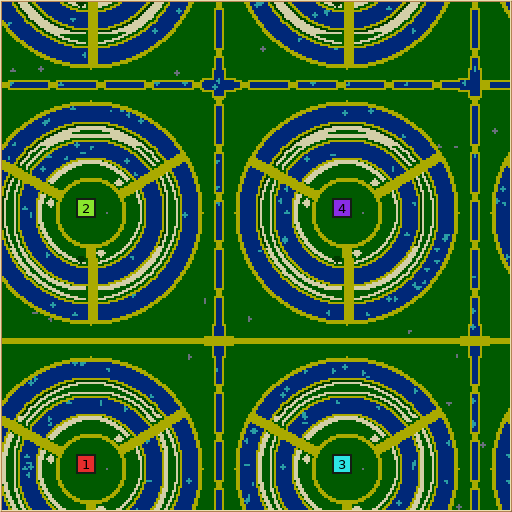

# Rice Terraces bulk generation — revision 5



[Download the accepted jobs, native reports, settings, logs and source identity](https://github.com/Globulation2/glob2/blob/evidence/rice-terraces/docs/map-generators/evidence/rice-terraces/bulk-generation.zip) (on the evidence branch, kept out of the main history).
The earlier [AI playtest](PLAYTEST.md) tested revision 4; this packet tests generation
after the crop-rescue repair.

## Result

Two immutable Linux builds ran through the shared `tools.tournaments`
`generator_stress` workflow on `therig.local`. Three local workers used the same
physical host. Jobs were counted only after the coordinator accepted their
hash-checked result records.

| Build | Accepted jobs | Generated | Explicit geometry rejection | Other failure |
| --- | ---: | ---: | ---: | ---: |
| Revision 4 discovery | 1,398 | 637 | 752 | 7 summit spills; 2 malformed harness requests |
| Revision 5 fresh and regressions | 706 | 356 | 350 | **0** |

The seven revision-4 failures all had the same validation error: a starting crop
repair entered a protected dry summit. Dense wheat left no accessible wood and
the generic rescue planted wood on the town's grass. Revision 5 clips every
emergency crop-clump corner to the crop rows. When the other crop has filled those
rows, a bounded shared fallback trades a radius-two patch of reachable surplus
crop for the missing starter crop. All seven exact failed requests generated on
revision 5, with the replant fallback recorded once per map. Six additional native
CLI probes covered 28 colonies; wood was 11–18 walking steps away, wheat 11–13.

The two discovery harness errors requested 1,024-tile sides although the shared
width/height exponent limit is 9 (512 tiles). The fresh large-map baselines were
corrected to 512. The 350 revision-5 geometry rejections happened before world
mutation and used the documented message about fitting a summit, complete band
and valley. Every request with a 64-tile side was rejected: the play contract
cannot fit on that size. The sample exercised every registered control value;
every value also occurred on a generated map except width or height exponent 6.
Thus the fitting envelope, rather than a hang or corrupt partial world, explains
the non-generated jobs.

## Range and checks

The discovery grid crossed side exponents 6–9 with 1–12 colonies at two seeds.
Its random controls sampled 480 legal settings at two seeds; a large-map cohort
added 24 settings at two seeds. The revision-5 held-out study used a new seed for
the 193-job shape grid, 480 new random controls plus a baseline, 24 large-map
controls plus a corrected baseline, and the seven original failed requests:
**706 accepted jobs**. Requests covered 0–4 vacant hills, radius 44–100 in
steps of four, band width 80–120%, 2–4 stairs, 0–3 starting tower levels, both
river settings, 1–8 workers, and all 0–300% resource values in 25% steps.

All 356 generated revision-5 worlds had reports, enabled telemetry, no dropped
or invalid telemetry values, at least one complete contour band, the fitted
radius within its budget, the requested starter wheat beside each stair, one inn
per colony and the expected tower count. The analyzer found **zero structural
invariant violations** and zero unexpected failures. Crop-budget saturation was
recorded on 112 generated maps under high requested amounts; the minimum
placed/requested ratio was 0.610, with median 1.0. This is bounded eligible
terrace capacity, not an unbounded placement loop. No timeout occurred.

For generated revision-5 maps, engine generation time had p95 **1.68 s** and
maximum **1.96 s**. The worker's full job duration, including process startup
and report handling, had p95 **4.51 s** and maximum **5.12 s**. The largest
generated maps were 512×512. The discovery build showed comparable times
(engine p95 1.50 s; full-job maximum 5.11 s).

Linux x86_64 and macOS arm64 release builds passed the defaults/toolkit contracts,
including the masked-clump and packed-farm rescue cases. Each compared 256 golden
rows with zero failures; the only new rows are Rice Terraces revision 5, and the
old generators' rows remain untouched. The native seed-7 map bytes matched
across platforms (SHA-256
`aa9d12d5b37ac27b745c20d31b05f9057195e4a331a3e8614248b510e6bab630`).
All 32 actual language files contain localized strings for the six new map labels
and controls; five translation regression tests passed.

## Reproduce and limits

The archive contains both exact experiment manifests, all 2,104 accepted result
JSON records and their map reports, CSV/JSON analyses, sampling configurations,
the Linux/macOS verification logs, selected native maps, the revision-5 runtime
source overlay against Git base `c8a24ba3e01a4005604247cb19ba168504055d60`,
and SHA-256 hashes for each entry. The revision-4 and revision-5 immutable bundle
IDs are recorded in their respective manifests; revision 5 used
`e542befa64185d2b1de8c6a367fe0a8f1d0f95a27e23ba5f743e213389444d8b`.
From a source checkout with the archive extracted, the analysis can be rerun with:

```sh
PYTHONPATH=. python3 scripts/analyze-revision4.py study-v2
PYTHONPATH=. python3 scripts/analyze-revision5.py heldout-study
```

This study measured generation and static opening checks. The [revision-4 AI
games](PLAYTEST.md) remain the gameplay evidence; revision 5 has not had a new
AI or human playtest. Windows generation and cross-platform per-tick simulation
checksums were not verified. No save, replay, network or core simulation format
changed.
